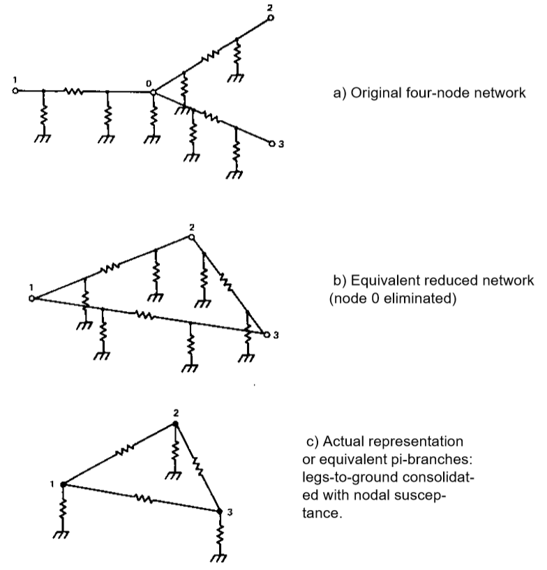
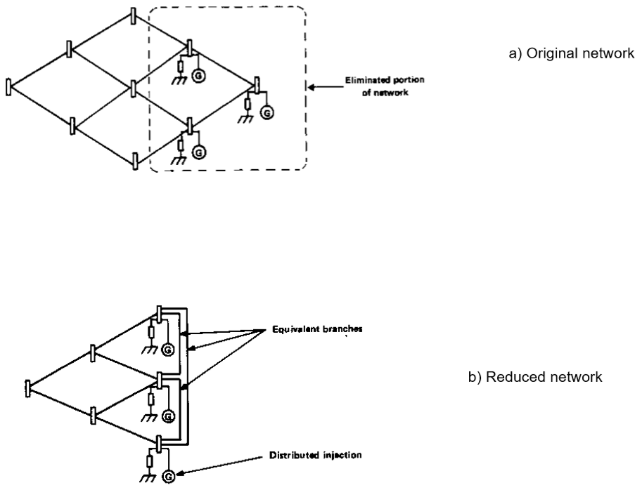
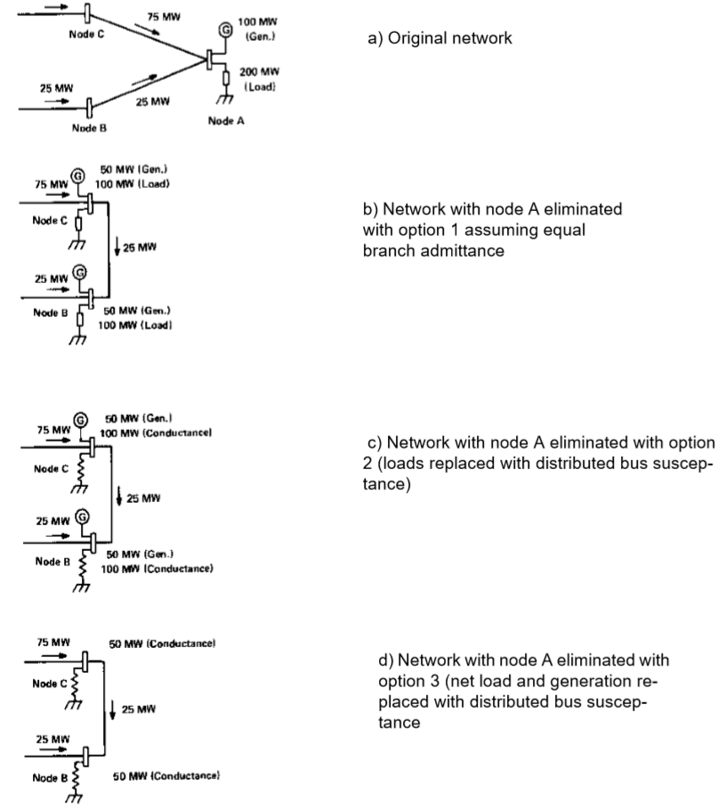

*****************
Advanced Features
*****************

Network Reduction
=================
This section gives a detailed description of the network reduction method and solution options.

Method of Reduction
-------------------
This program reduces a large sparse network into a smaller equivalent network by Gaussian decomposition. The original network is linearized about the operating point and is expressed by the current equation:

.. math::
  :label: eq_1

  \begin{bmatrix} I_1 \\ I_2 \end{bmatrix} = \begin{bmatrix} Y_{11} & Y_{12} \\ Y_{21} & Y_{22} \end{bmatrix} \begin{bmatrix} V_1 \\ V_2 \end{bmatrix}

where: :math:`I_1` is the complex current net injection matrix, :math:`Y` the complex nodal admittance matrix, and :math:`V` the complex nodal voltage matrix. The subscripts 1 and 2 pertain to the eliminated and retained portions of the network, respectively. For simplicity, the matrix is reordered as shown. We may separate the partitioned matrix equations in :eq:`eq_1`.

.. math::
  :label: eq_2

  \begin{bmatrix} I_1 \end{bmatrix} = \begin{bmatrix} Y_{11} \end{bmatrix} \begin{bmatrix} V_1 \end{bmatrix} + \begin{bmatrix} Y_{12} \end{bmatrix} \begin{bmatrix} V_2 \end{bmatrix} \\

.. math::
  :label: eq_3

  \begin{bmatrix} I_2 \end{bmatrix} = \begin{bmatrix} Y_{21} \end{bmatrix} \begin{bmatrix} V_1 \end{bmatrix} + \begin{bmatrix} Y_{22} \end{bmatrix} \begin{bmatrix} V_2 \end{bmatrix}

We may solve for :math:`\begin{bmatrix} V_2 \end{bmatrix}` from :eq:`eq_2`.

.. math::
  :label: eq_4

  \begin{bmatrix} V_2 \end{bmatrix} &= \begin{bmatrix} Y_{21} \end{bmatrix} \begin{bmatrix} V_1 \end{bmatrix} + \begin{bmatrix} Y_{22} \end{bmatrix} \begin{bmatrix} V_2 \end{bmatrix}

and then substitute the expression into :eq:`eq_3`.

.. math::
  :lable: eq_5

  \begin{bmatrix} I_2 \end{bmatrix} = \begin{bmatrix} V_{21} \end{bmatrix} \begin{bmatrix} \begin{bmatrix} \begin{bmatrix} Y_{11}^{-1} \end{bmatrix} \begin{bmatrix} I_1 \end{bmatrix} - \begin{bmatrix} Y_{11}^{-1} \end{bmatrix} \begin{bmatrix} Y_{12} \end{bmatrix} \begin{bmatrix} V_2 \end{bmatrix} \end{bmatrix} \end{bmatrix} + \begin{bmatrix} Y_{22} \end{bmatrix} \begin{bmatrix} V_2 \end{bmatrix}

  Equivalent Pi-Branches

In the figure below, a nine-node network is reduced. The distributed injections and equivalent branches introduced are emphasized.

Three options are available for disposal of the generation and load of eliminated nodes:

  1. Generation and load assumed constant current.
  2. Generation assumed constant current, load assumed constant admittance.
  3. Generation and load assumed constant admittance

These options are illustrated by the examples in the figure below. For simplicity, losses are ignored and a DC model is used.

  Eliminated Node Generation and Load Disposal

In all examples, the equivalent branch flow represents the sum of three components:

 