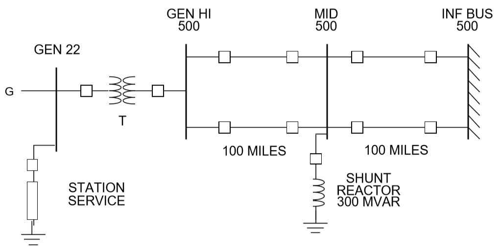
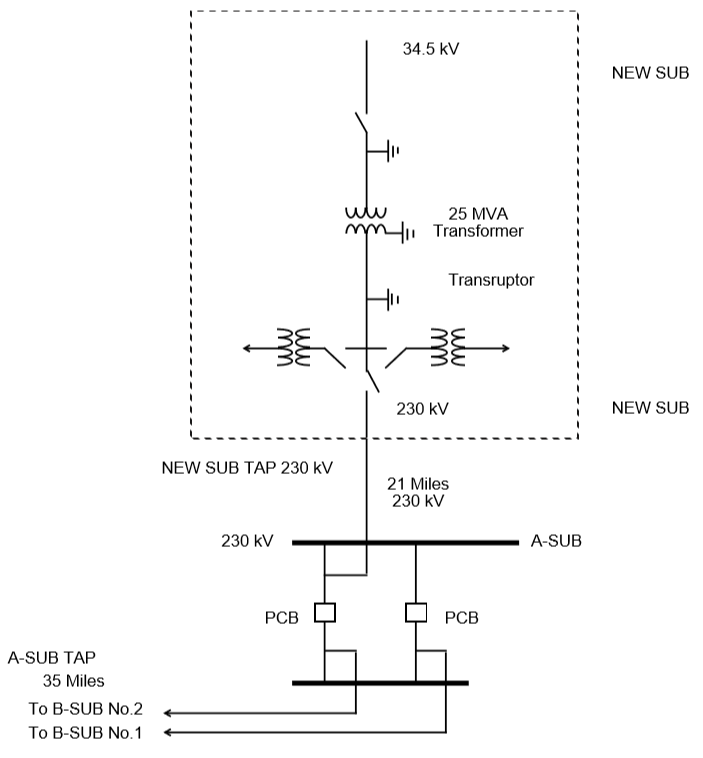

********************
Application Examples
********************

Introduction
============
Some typical power system design application examples are given in this section to demonstrate possible applications of the core power flow programs IPF provides. Each example indicates possible uses of the program relative to some stated network planning objectives.

Setting Up a Network Data File
==============================
Use the following values for this four-bus network:

   Four Bus Network

**Line Data**

  * Use 100 MVA, 500 kV base.
  * X = .525 ohm/mile, X/R = 18.
  * B/2   = .01024 pu/mile, where B is the total line charging and B/2 is equal to :math:`B_{pi}`, if long-line effect is ignored.
  * Current Rating is 3000 amps.

**Transformer Data**

  * X   =  20% (0.20 pu) on 525 kV, 1770 MVA base.
  * Transformer Taps  =  22 kV, 525 kV.

**Generator Data for Power Flow**

  * P(max)  =  1770MW, P(g) = 1680 MW.
  * Q(lim) =  +/- 521MVAR.
  * Type G bus controlling voltage of GEN HI to 1.08 pu.

**Station Service Load**

  * 190 +  j95 (constant power for stability).

**Approach**
The preparation of the network data will be presented in the following steps:

1. Prepare the bus data group.
   
    Define the following buses:

    .. code::
  
      GEN 22 
      GEN HI 500 
      INF BUS 500
      MID 500
 
    a. Data for GEN 22

    .. code::
  
      Record Type:     B 
      Sub Type:        G 
      Change Code:     blank 
      Owner:           blank (not specified) 
      Name:            GEN 
      kV:              22 
      Zone:            blank (not specified) 
      Load P MW:       190 
      Load Q MVAR:     95
      Shunt Load MW:   blank (or zero) 
      Shunt Load MVAR: blank (or zero) 
      P MAX:           1770 
      P GEN MW:        1680 
      Q MAX MVAR:      521 
      Q MIN MVAR:      -521 
      V MAX PU:        blank (not specified) 
      V MIN PU:        blank (not specified) 
      Remote Bus Name: GEN HI 
      Remote Bus kV:   500 
      % VARS Supplied: blank (defaults to 100)

    b. Data for GEN HI 500

    .. code::
  
      Record Type:     B 
      Sub Type:        C  (remotely controlled)
      Change Code:     blank 
      Owner:           blank 
      Name:            GEN HI 
      kV:              500 
      Zone:            blank 
      Load P MW:       blank  (or zero) 
      Load Q MVAR:     blank  (or zero) 
      Shunt Load MW:   blank 
      Shunt Load MVAR: blank 
      P MAX:           blank 
      P GEN MW:        blank  (or zero) 
      Q MAX MVAR:      blank 
      Q MIN MVAR:      blank 
      V Hold PU:       1.08 
      V MIN PU:        blank  (not used) 
      Remote Bus Name: blank (none)
      Remote Bus kV:   blank (none) 
      % VARS Supplied: blank (not applicable)
    
    c. Data for INF BUS 500

    .. code::
    
      Record Type:     B 
      Subtype:         S 
      Change Code:     blank 
      Owner:           blank 
      Name:            INF BUS 
      kV:              500 
      Zone:            blank 
      Load P MW:       blank 
      Load Q MVAR:     blank 
      Shunt Load MW:   blank 
      Shunt Load MVAR: blank 
      P MAX:           blank 
      P GEN MW:        blank 
      Q SCHED MVAR:    blank 
      Q MIN MVAR:      blank
      V Hold PU:       1.05 
      V MIN PU:        blank 
      Remote Bus Name: blank 
      Remote Bus kV:   blank 
      % VARS Supplied: blank
    
    d. Data for MID 500

    .. code::

      Record Type:      B 
      Sub Type:         blank 
      Change Code:      blank 
      Owner:            blank (not known) 
      Name:             MID 
      kV:               500 
      Zone:             blank 
      Load P MW:        blank (zero) 
      Load Q MVAR:      blank (zero) 
      Shunt Load MW:    blank (zero) 
      Shunt React MVAR: -300 
      P MAX:            blank 
      P GEN MW:         blank 
      Q MAX MVAR:       blank (fixed) 
      Q MIN MVAR:       blank (fixed = Q MAX) 
      MAX PU:         blank (defaults to global limit) 
      V MIN PU:         blank (defaults to global limit) 
      Remote Bus Name:  blank 
      Remote Bus kV:    blank 
      % VARS Supplied:  blank (not applicable)

.. note::

  A bus can only be of one subtype. The subtype of a bus is suggested by information given about the bus. Therefore, the user should try to be familiar with various bus subtypes and when and how they are indicated by descriptive information given

2. Prepare the branch data group.

.. code::

  Transformer:  GEN 22               GEN HI 500 
  Line:         GEN HI 500           MID 500 circuit 1 
  Line:         GEN HI 500           MID 500 circuit 2 
  Line:         INF BUS 500          MID 500 circuit 1 
  Line:         INF BUS 500          MID 500 circuit 2

.. note::

  1 and 2 designations are arbitrary identifications for parallel branches. Letters A-Z and digits 0-9 are acceptable.

  a. Data for Transformer GEN 22 GEN HI 500
  
  .. code::

    Record Type:      T 
    Sub Type:         blank 
    Change Code:      blank 
    Owner:            blank (not known) 
    Name 1:           GEN 
    kV 1:             22 
    Meter:            blank 
    Name 2:           GEN HI 
    kV 2:             500 
    ID:               blank 
    Section:          blank 
    Total MVA RATE:   1770 
    No of CKT:        blank 
    Z_pi 
    Rpu(100MVA):  blank (or zero)
    Xpu(100MVA):  .01246 
    Y_pi 
    Gpu(100MVA):  blank (or zero)
    Bpu(100MVA):  blank (or zero)
    Tap 1 kV:         22
    Tap 2 kV:         525
    Date In:          blank (in) 
    Date Out:         blank (not out)

  b. Data for Line GEN HI 500 MID 500 circuit 1

  .. code::

    Record Type:      L 
    Sub Type:         blank 
    Change Code:      blank 
    Owner:            blank (not known) 
    Name 1:           GEN HI 
    kV 1:             500 
    Name 2:           MID 
    kV 2:             500 
    ID:               1 
    Section:          blank 
    Total AMP RATING: 3000 
    No of CKT:        blank (means 1) 
    Z_pi
    Rpu:          .00117 
    Xpu:          .02100 
    Y_pi
    Gpu:          blank (zero) 
    Bpu:          1.024 
    Miles:            100 
    DESC DATA:        blank 
    Date In:          blank (in) 
    Date Out:         blank (not out)

  c. Data for Line GEN HI 500 MID 500 circuit 2

  .. code::

    Record Type:      L 
    Sub Type:         blank 
    Change Code:      blank 
    Owner:            blank (not known) 
    Name 1:           GEN HI 
    kV 1:             500 
    Meter:            blank 
    Name 2:           MID 
    kV 2:             500 
    ID:               2 
    Section:          blank 
    Total AMP RATING: 3000 
    No of CKT:        blank (means 1) 
    Z_pi 
    Rpu:          .00117 
    Xpu:          .02100 
    Y_pi 
    Gpu:          blank 
    Bpu:          1.024 
    Miles:            100 
    DESC DATA:        blank 
    Date In:          blank (in) 
    Date Out:         blank (not out)
 
  d. Data for Line INF BUS 500 MID 500 circuit 1

  .. code::

    Record Type:      L 
    Sub Type:         blank 
    Change Code:      blank 
    Owner:            blank (not known) 
    Name 1:           INF BUS 
    kV 1:             500 
    Meter:            blank 
    Name 2:           MID 
    kV 2:             500 
    ID:               1 
    Section:          blank 
    Total AMP RATING: 3000 
    No of CKT:        blank (means 1) 
    Z_pi 
    Rpu:          .00117 
    Xpu:          .02100 
    Y_pi 
    Gpu:          blank (zero) 
    Bpu:          1.024 
    Miles:            100 
    DESC DATA:        blank 
    Date In:          blank (in)
    Date Out:         blank (not out)

  e. Data for Line INF BUS 500 MID 500 circuit 2

  .. code::

    Record Type:      L 
    Sub Type:         blank 
    Change Code:      blank 
    Owner:            blank (not known) 
    Name 1:           INF BUS 
    kV 1:             500 
    Meter:            blank 
    Name 2:           MID 
    kV 2:             500 
    ID:               2 
    Section:          blank 
    Total AMP RATING: 3000 
    No of CKT:        blank (means 1) 
    Z_pi 
    Rpu:          .00117 
    Xpu:          .02100 
    Y_pi 
    Gpu:          blank (zero) 
    Bpu:          1.024 
    Miles:            100 
    DESC DATA:        blank 
    Date In:          blank (in) 
    Date Out:         blank (not out)

.. note::

  The most difficult task in setting up branch data is determining the per unit (pu) values of R, X, G and B.

.. note::

  In this example, some preliminary information has been furnished on a per-mile basis. We have multiplied the per-mile quantities by the line lengths in order to obtain the data entered in the record. The reader should generally use detailed line constant calculation procedures to obtain more accurate values for high-voltage long lines. At 500 kV, 100 miles should be considered a long line. Energy conservation analysis is sensitive to the accuracy of high-voltage long-line branch data and transformer branch data.

Derivation of Transformer Xpu on 500kV, 100 MVA:

.. math::

  (Xpu on 500kV 100 MVA) &= (Xpu on 525kV 1770 MVA) * \frac{525 * 525}{500 * 500} * \frac{100}{1770} \\
  &= 0.20 * \frac{525 * 525}{500 * 500} * \frac{100}{1770} \\
  &= 0.012458

Derivation of Line Xpu on 500 kV, 100 MVA:
 
All four lines are the same:

.. math::

  Base inpedance in ohms &= \frac{Base kV * Base kV}{Base MVA} \\
  &= \frac{(500)(500)}{100}
  &= 2500 ohms

Ignoring long-line effect, reactance for 100-mile line is 52.2 ohms:

.. math::

  &= \frac{52.5}{2500}pu \\
  &= 0.02100pu

New Facilities
==============
The purpose of this example is to provide new generating facilities to serve the growing loads near the town of Keller and Mount Tolman.

Proposed New Facility
---------------------
The proposed facility includes a new substation at NEW SUB, a 21-mile 230 kV line tapped from the A SUB - B SUB No. 2 line and another line to D SUB tapped from A SUB - NEW SUB line but which will be built and owned by another utility. The equipment at NEW SUB substation will include a 25 MVA transformer with protective equipment serving a 34.5 kV load. In the diagram on the following page, starred or dotted lines are the proposed facility while the dashed lines indicate existing facility. This proposed facility may be one among other possible alternatives. Each alternative, and modifications thereof, will be considered a case and submitted to the power flow program for analysis and report.

Possible Uses of IPF
--------------------
IPF will be used to study the power flows, voltage regulation and reliability of service utilizing the proposed facility.

   A-SUB - New SUB 230 kV Line

The processes ``(POWERFLOW)`` and ``(OUTAGE_SIM)`` will be used to check power flow as well as reliability. Refer to :ref:`power-flow-control`, for complete description of these processes.

Suppose the base network which the proposed new facility will amend has been described in an old base file named ``BASENET.BSE``. The following program control file can be built for this case:

.. code::

  (POWERFLOW, CASEID = EXAMPLE1, PROJECT=KELLER-SUB)
  /OLDBASE FILE = BASENET.BSE\ 
  /NEWBASE = EXAMPLE1.CAS\ 
  .... 
  ....  Optional Network Solution Qualifiers Listed Under 
  ....                  (POWERFLOW) 
  /CHANGES 
  B - record for NEW SUB 34.5 
  B - record for NEW SUB 230 
  B - record for NEW SUB Tap 230 
  B - record for D SUB 230 
  B - record for A SUB TAP 230 
  L - record to delete A SUB 230 B SUB 230  2 
  L - record for A SUB 230 A SUB Tap 230 
  L - record for A SUB Tap 230 B SUB 230 
  T - record for NEW SUB 230 NEW SUB 34.5 
  . The above record formats are described 
  . Under appropriate Heading starting with the key letter 
  (POWERFLOW, CASEID=EXAMPLE1, PROJECT=NEW-SUB) 
  /OLDBASE FILE=EXAMPLE1.CAS 
  /OUTAGE_SIM 
  .... 
  ....  Optional Qualifiers Listed Under /OUTAGE_SIM 
  .... 
  (STOP)

The output listings from this case will be inspected to make sure no overloads occur during normal operation as well as during the outages of key lines.

Special environmental concerns may suggest evaluation of alternatives to the river crossing indicated in the exhibit. Conductor sizing may also be influenced by energy conservation (loss-reduction) considerations. The effect of each alternative can be determined from the network solution output listing.

In this example, the major point to monitor is the impact of tapping lines since segments of a tapped line perform differently from the untapped line.

Reconductoring
==============
The purpose of this example is to cure poor voltage regulation at delivery point C occurring when lines AB, BC or DE are out of service, and to improve energy conservation.

Proposed New Facility
---------------------
Lines AB, BC and DE will be reconductored to reduce series impedances using higher capacity lines. The higher capacity lines will give rise to acceptable voltages and save energy otherwise lost in transmission.

Possible Uses of Powerflow
-------------------------
IPF can be used to study the power flows, voltage regulation and reliability of service utilizing the proposed facility. In reference to the Program Control Language:

  1. The base case is run to determine power flows, voltage levels and transmission losses.
  2. The change case is run to modify the data for lines AB, BC and DE reflecting the new conductors used. Power flows, voltages and losses will again be reviewed.
  3. The outage simulations case is run to verify the effect of certain lines being out of service on power flows, voltage levels, line loading and line losses. If the base network to be amended by the proposed new facility is described in an old-base file named BASENET.BSE, the program control file following the diagram of the reconductoring can be built for this project.::

  ( POWERFLOW, CASEID = EXAMPLE30, PROJECT = RECONDUCT ) 
  / OLD_BASE, FILE = BASENET.BSE 
  . . . 
  . . .  Optional network solution qualifiers. 
  . . . 
  ( NEXTCASE, CASEID = EXAMPLE31, PROJECT = RECONDUCT ) 
  / NEW_BASE, FILE = EXAMPLE31.CAS 
  . . .  Optional qualifiers to override options 
  . . .  already selected above.  This should be 
  . . .  an empty set. 
  / CHANGES 
  L - record to modify line AB 
  L - record to modify line BC 
  L - record to modify line DE 
  ( NEXTCASE, CASEID = EXAMPLE32, PROJECT = RECONDUCT ) 
  / OUTAGE_SIM 
  . . . 
  . . .  Optional simulation qualifiers. 
  . . . 
  ( STOP )

Series Compsensation
====================
The purpose of this example is to add series compensation to existing parallel lines so as to cause more power to be shifted to these lines from lines with less loss-reduction.

Proposed New Facility
---------------------
A 540 MVAR series capacitor at Station C is installed (270 MVAR per line), along with additional control and protective equipment. Station C is sited 72 miles from Station A and 102 miles from Station B.

Possible Uses of Powerflow
-------------------------
IPF will be used to study the power flows utilizing the proposed facility.

If the base network amended by the proposed new facility is described in an old-base file named ``BASENET.BSE``, then the following program control file can be built for this case::

  ( POWERFLOW, CASEID = EXAMPLE4, PROJECT = SERIES COMP ) 
  / OLD_BASE, FILE = BASENET.BSE 
  . . . 
  . . .  Optional solution qualifiers. 
  . . . 
  / CHANGES 
  L - record to delete line AB circuit 1 
  L - record to delete line AB circuit 2 
  L - record to add Ckt circuit 1 section 1 (line AC) 
  L - record to add Ckt circuit 1 section 2 (capacitor) 
  L - record to add Ckt circuit 1 section 3 (line CB) 
  L - record to add Ckt circuit 2 section 1 (line AC) 
  L - record to add Ckt circuit 2 section 2 (capacitor) 
  L - record to add Ckt circuit 2 section 3 (line CB) 
  ( STOP )
