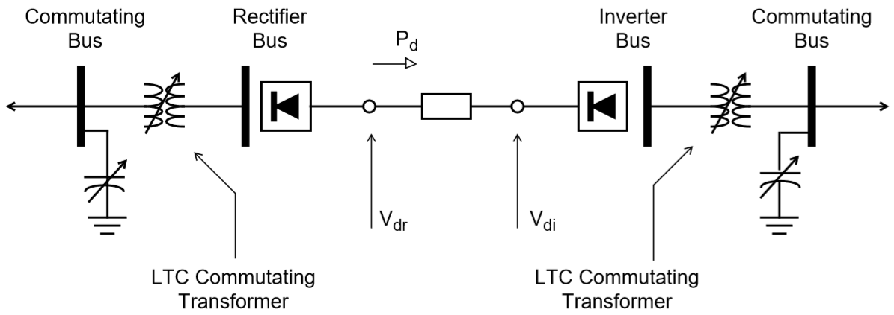
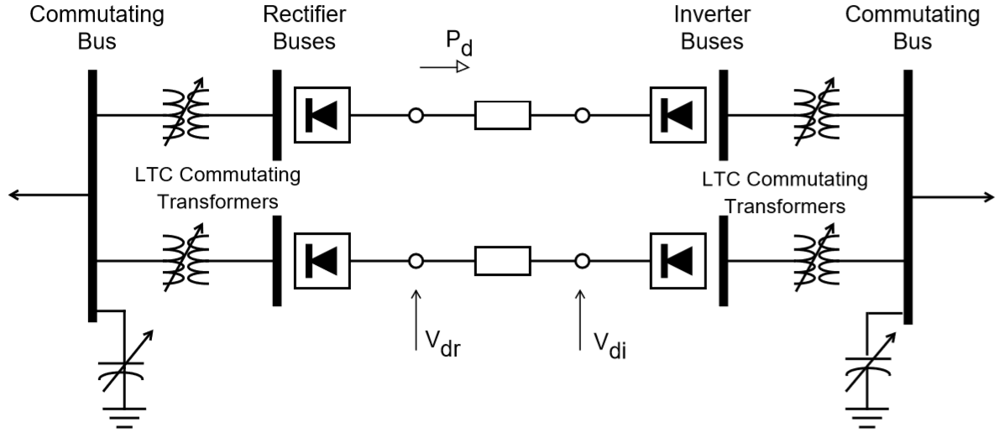
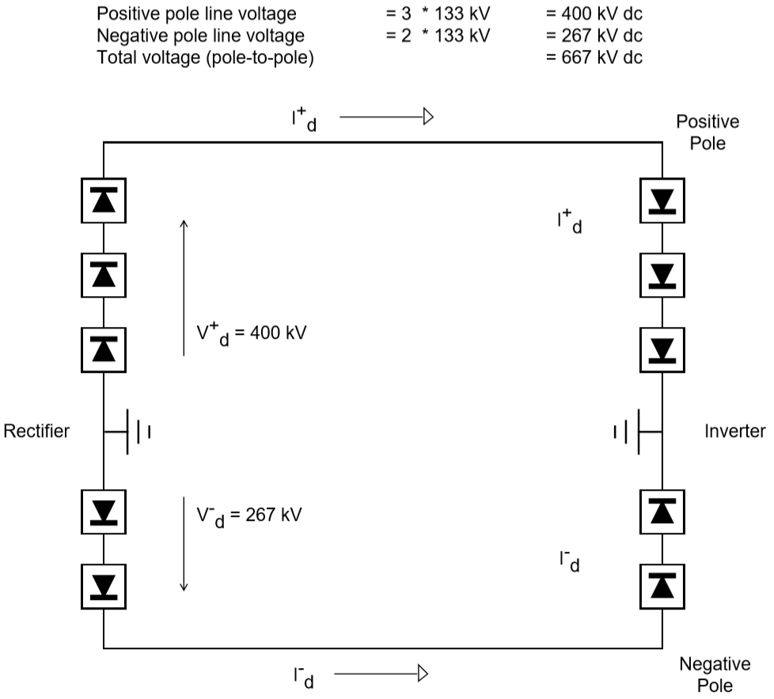

****************
DC Line Modeling
****************
The following describes the data representation of a DC line as used in IPF. A typical configuration of the network is shown.

  Two Pole, Two Terminal DC Line Configuration

Each DC line requires two DC buses, a single DC line and two commutating buses, each of which is connected to the DC bus with a commutating transformer.

Representation of the commutating transformer conforms to the ac network; one transformer is required for each bridge. They are parallel connected in the ac network, necessitating either separate transformer data records or an equivalent transformer which has the correct parallel impedance and MVA rating. As shown in the diagram, the commutating transformers must be LTC, specifically type R, subtype blank, controlling the DC bus, and oriented such that the tap range encompasses the commutating bus base kV. The magnitude of the DC bus voltage to be controlled is automatically determined from the DC line parameters.

Assuming nominal taps, the DC no-load voltage Vdo available from each converter bridge is approximated by the formula.

.. math::

  V_{do} = 1.35 * E_v * cos(\alpha)

where :math:`\alpha` is the firing angle at the rectifier and the extinction angle at the inverter. :math:`V_{do}` is the no-load direct voltage and :math:`E_v` is the effective voltage at the DC bus. The actual voltage is a chopped sinusoid.

The full load direct voltage will be less. Normal representation of the DC line usually models the positive and negative poles as separate but parallel DC lines. This scheme permits asymmetrical operation of the DC line. For example, one bridge may temporarily be out of operation. In this case, one pole may have three bridges while the other has only two.

With this scheme, the model may be as shown as follows.

  Single Pole, Two Terminal DC Line

In the former scheme the dc line quantities are pole-to-pole. In the latter scheme, the quantities are pole-to-neutral. However, the direct voltage must always be positive on the line data record.

When using the pole-to-neutral scheme, the direct voltage of each pole must correspond to the number of bridges in operation. It is recommended that the allocation of the total dc power to each pole should result in no net neutral current, that is, the current in each pole must be equal but opposite.

An example will clarify this. Assume that the normal direct voltages is 800 kV pole-to-pole with six bridges in operation, or 133 kV/bridge. It is desired to find the voltage and power in each pole required to transport 600 MW with one negative bridge out of operation. This situation is shown as follows

  Single Negative Bridge Out of Operation

For zero neutral current, :math:`I^+_d = I^-_d` (with positive values assigned in the direction shown)

.. math::
  
  I_d = \frac{p_{dc}}{V_{dcpole-to-pole}} &= \frac{600 MW * 1000 kV/MW}{667 kV} = 900 amps \\
  P^+_{dc} = V^+_{dv} * I^+_{dc} &= 400 kV * 900 amps \\
  &= 360,000 kW = 360 MW \\
  P^-_{dc} = V^-_{dv} * I^-_{dc} &= 267 kV * 900 amps \\
  &= 240,000 kW = 240 MW

Assuming the DC line was modeled for six-bridge operation, the only changes required to take a bridge out of service would be modification of the following quantities:

  * Positive and negative pole DC line power on the LD record.
  * Negative pole DC line voltage on the LD record.
  * Delete one of the parallel commutating transformers at each end of the negative pole DC line.
  * Change the number of bridges for both converter buses.
