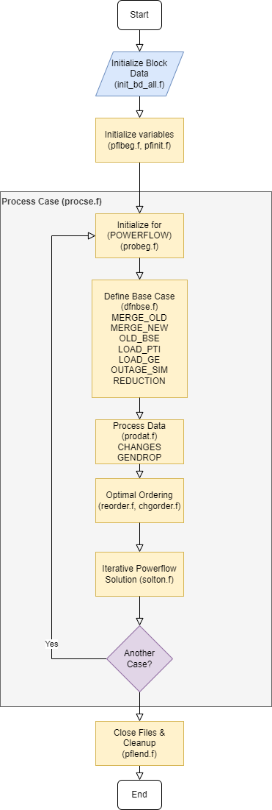
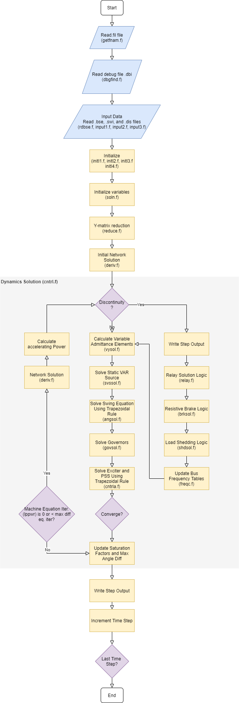

***************
Developer Notes
***************
This section contains notes for developers working with, enhancing, or debugging the IPF codebase. 

Debugging
=========
You can list names of functions or subroutines to debug in a ``DBGIN`` file in .fil passed to tsp. Debug output is printed to file defined by ``DBGOUT``. For example, the following routines can be listed: CNTRL, CNTRLA, FFREAD, INITL1, INITL4, INPUT1, INT3FA, LSREAD, MATMOD, NAMBAS, NOUT1, NOUT2, RVREAD, SOLN, SWINGM, TAPEWK, WRTHIS. These Fortran subroutines will have their debug enabled.

``bpf`` Flowchart
=================
Below is a high level flowchart of the batch power flow process.

  IPF ``bpf`` Flowchart

``tsp`` Flowchart
=================
Below is a high level flowchart of the transient stability program.

  IPF ``bpf`` Flowchart

Variables
=========
Reading IPF code can be challenging. Fortran 77 was the programming language of the 70s and 80s. Today there are small percentage of developers that know Fortran and even fewer that have experience writing significant amounts of it. Though it is important to note that the language is still used in several well known projects such as the `Linear Algebra PACKage (LAPACK) <http://performance.netlib.org/lapack/>`_ . 

Fortran developers must use very concise variable and function/subroutine names to make sure lines fit in the 80 character limit and original limitations on 8 character file names. Additionally, IPF code base makes heavy use of ``common`` blocks to pass data between functions (these are basically like blocks of data since Fortran has no concept of an object or even a struct as in C) as well as goto statements. This can make any given piece of code overwhelming to a newcomer. For example, you might encounter something like this and feel completely lost:

.. code::

  kbrknt = mptr / 2
  next1 = mptr + 1
  next2 = mptr + 1
  last1 = nsize
  last2 = nsize
  do k = next1, last1
     kolum1(k) = 0
     kordr1(k) = k+1
  enddo
  kordr1(last1) = 0
  do k = 1, ntot
     jorder(k) = kownt(2,k)
     loc2(k) = loc1(k)
  enddo
  do k = 1, nsize
     kordr2(k) = kordr1(k)
     kolum2(k) = kolum1(k)
  enddo

The table below contains a list of more descriptive names for variables. This can be used as a reference when getting started.

============ ==========================================================================================
Variable     Description
============ ==========================================================================================
``datot``    Delta area real power total. Total area real power mismatch for power flow
``dptot``    Delta real power total. Total real power mismatch for power flow iteration
``dqtot``    Delta reactive power total. Total reactive power mismatch for power flow iteration
``dttot``    Delta transformer MVAR. Total transformer apparent power mismatch for power flow iteration
``icount``   Count of solution truncation adjustments
``ikecl``    Jacobian matrix storage size
``ittot``    Power flow iteration counter
``kownt``    Unsolved buses count
``kowntb``   Unsolved auto transformers
``kowntc``   Unsolved areas
``lppwr``    Iteration for solving machine equations
``eyr``      Bus per unit voltage real component. "A" in "A + jB"
``eyi``      Bus per unit voltage imaginary component. "B" in "A + jB"
``isg``      Number of synchronous generators
``idsw``     Discontinuity state
============ ==========================================================================================

Command Subroutines
===================
This section has a information about which Fortran subroutines to take a look at if you're trying to debug a certain PFC or PCL command.

.. code::

  /INITIALIZE

       processed by  p_pfinit_ 

  /NETWORK_DATA, FILE = <filename>

       processed by p_gtnetdat_ 

  /OLD_BASE, FILE = <* | filename> [, CASE = <casename>] 
                                 [, REBUILD = < on | off> ]
       processed by cmd_parse.c
                    p_gtbase.f
                    ctlpow.f

  /CHANGES, FILE = <* | filename>

       processed by cmd_parse.c
                    p_change.f
                    ctlpow.f

  /SOLUTION
  > BASE_SOLUTION
  > DEBUG, BUS = ON,(page 3-51 to 3-56) 

       processed by cmd_parse.c
                    p_solton.f
                    ctlpow.f

  /GET_DATA, TYPE = INPUT 
  A     <areaname>  to be added 22 July by wlp
  I     <area1 area2> to be added 22 July by wlp
  B     <busname, etc> returns all data associatated with bus
  +     <busname, etc> returns all data if id fields have wild cards
                     (type - column 2, owner, columns 3-5, and code-year 
                      columns 20-21)
  X     <busname, etc>
  L     <bus1 bus2, etc> returns all paralles if id is wild card (*)
                       returns all sections if section is 0
  T     <bus1 bus2, etc>
  R     <bus1 bus2, etc>
  E     <bus1 bus2, etc>

       processed by cmd_parse.c
                    p_gtdata.f 
                    gtinput.f

  /GET_DATA, TYPE = BUS_VOLTAGES

       processed by cmd_parse.c
                    p_gtdata.f 
                    bus_voltages.f

  /GET_DATA, TYPE = BUS_LIST [ FROM BUS_DATA ]
                  WHERE AREAS = <area1>, <area2>, etc AND 
                         ZONES = <zone1>, <zone2>, etc AND
                         OWNERS = <own1>, <own2>, etc AND
                         BASEKV = base1 
                                  < base  ( example < 115.0 means all base
                                            kv's less than or equal to 115.0)
                                  > base  ( example > 115.0 means all base
                                            kv's greater than or equal to 115.0)
                                  base1 < base2  (all bases between base1 and
                                                  base 2)
                                  base2 > base1  (same as above)
                         TYPE = B , BE, BS, BC, BD ,BV ,BQ ,BG ,BO ,BT ,BX ,
                                BM ,L  ,LD ,LM , ,E  ,T  ,TP ,R 
                         BUS = "<busname>" (quotes are necesary)
                         AFTER_BUS = "<busname>" ( to do 22 July by wlp)
                         ALL
                         LOADING = (<min> <max>)

       processed by cmd_parse.c
                    p_gtdata.f 
                    bus_list.f
                    gtfltr.f

  /GET_DATA, TYPE = A_DATA

       processed by cmd_parse.c
                    p_gtdata.f 
                    a_data.f

  /GET_DATA, TYPE = I_DATA

       processed by cmd_parse.c
                    p_gtdata.f 
                    i_data.f

  /GET_DATA, TYPE = BSEKV_LIST

       processed by cmd_parse.c
                    p_gtdata.f 
                    bsekvlst.f

  /GET_DATA, TYPE = AREA_LIST

       processed by cmd_parse.c
                    p_gtdata.f 
                    area_list.f

  /GET_DATA, TYPE = OWNER_LIST

       processed by cmd_parse.c
                    p_gtdata.f 
                    owner_list.f

  /GET_DATA, TYPE = BUS_EXISTS, BUS = "bus_name" 

       processed by cmd_parse.c
                    p_gtdata.f 
                    ex_bus.f
       return status: status = 0 : bus does not exist
                               1 : bus exists

  /GET_DATA, TYPE = FILE_EXISTS, FILE = <file_name>

       processed by cmd_parse.c
                    p_gtdata.f 
                    ex_file.f
       return status: status = 0 : file does not exist
                               1 : file exists
  /GET_DATA, TYPE = CONNECTION
  B     <busname, etc> returns all connection data associatated with bus

       processed by cmd_parse.c
                    p_gtdata.f 
                    ex_file.f
       return status: status = 0 : file does not exist
                               1 : file exists

  /GET_DATA, TYPE = ZONE_LIST

       processed by cmd_parse.c
                    p_gtdata.f 
                    zone_list.f

  /GET_DATA, TYPE = OUTAGES

       processed by cmd_parse.c
                    p_gtdata.f 
                    gtoutage.f

  /GET_DATA, TYPE = LINE_IMPEDANCE_CALCULATION
           UNITS = < ENGLISH | METRIC >, 
           DISTANCE = < miles | km >
           BASEKV = <basekv>, 
           BASEMVA = <basemva>, 
           FREQUENCY = <freq>

       processed by cmd_parse.c
                    p_gtdata.f 
                    p_lic.f
                    linimp.f

/GET_DATA, TYPE = output

       processed by cmd_parse.c
                    p_gtdata.f 
                    gtoutput.f

  /GET_DATA, TYPE = INITIALIZE_DEF

       processed by cmd_parse.c 
                   p_gtdata.f
                   p_initdef.f

  /GET_DATA, TYPE = LOAD_DEFINE
  > DEFINE ...

       processed by cmd_parse.c 
                   p_gtdata.f
                   p_loaddef.f

  /GET_DATA, TYPE = SUB_DEFINE, SOURCE = BASE
                                       ALTERNATE_BASE

       processed by cmd_parse.c 
                   p_gtdata.f
                   p_subdef.f

  /GET_DATA, TYPE = LOAD_AREA

       processed by cmd_parse.c
                    p_gtdata.f 
                    p_ldardata.f
       return status: status = 0 : success
                               1 : errors

  /GET_DATA, TYPE = AREA_DATA
  A  <areaname>

       processed by cmd_parse.c
                    p_gtdata.f 
                    gtardata
       return status: status = 0 : success
                               1 : errors

  /REPORTS, SELECT BUS_BR_INPUT [ FROM BUS_DATA ]
                 [ OUTPUT = <filename> ]
                 WHERE (repeat filter from BUS_LIST) 

       processed by cmd_parse.c 
                   p_report.f
                   busbrinrpt.f
                   gtfltr.f 

  /REPORTS, SELECT BUS_BR_OUTPUT [ FROM BUS_DATA ]
                 [ OUTPUT = <filename> ]
                 WHERE (repeat filter from BUS_LIST) 

       processed by cmd_parse.c 
                   p_report.f
                   busbrotrpt.f
                   gtfltr.f 

  /REPORTS, SELECT OVERLOADED_LINES [ FROM BUS_DATA ]
                 [ OUTPUT = <filename> ]
                 WHERE (repeat filter from BUS_LIST) 

       processed by cmd_parse.c 
                   p_report.f
                   ovldlnsrpt.f
                   gtfltr.f 

  /REPORTS, SELECT OVERLOADED_TXS [ FROM BUS_DATA ]
                 [ OUTPUT = <filename> ]
                 WHERE (repeat filter from BUS_LIST) 

       processed by cmd_parse.c 
                   p_report.f
                   ovldtxsrpt.f
                   gtfltr.f 

  /REPORTS, SELECT BUS_UVOV [ FROM BUS_DATA ]
                 [ OUTPUT = <filename> ]
                 WHERE (repeat filter from BUS_LIST) 

       processed by cmd_parse.c 
                   p_report.f
                   busuvovrpt.f
                   gtfltr.f 
  
  /REPORTS, SELECT 
          (GUI-customized reports, but not completed!)
       processed by cmd_parse.c 
                   p_report.f
                   outputrpt.f
                   gtfltr.f 

  /NEW_BASE, FILE = <filename>, CASE = <casename>
       processed by cmd_parse.c
                    p_newbse.f
                    ctlpow.f

  /QUIT

        processed by p_pfexit_ 

  /EXIT

        processed by p_pfexit_ 

  /CFLOW_GUI

        processed by p_cflow_gui 

  /INITDEF

        processed by p_initdef_ 

  /LOADDEF

        processed by p_loaddef_ 

  /SUBDEF

       processed by p_subdef_

.. _wscc-specifications:

WSCC Specifications
===================
These functional specifications are here for more historical reasons than present day 
usefulness but they are from Wester Systems Coordinating Council Load Flow and Stability
Computer Programs department. They were used during intial development of IPS.

General, Load Flow, & Stability
-------------------------------

  A. WSCC will consider any deviations and alternates of these specifications, provided the details of such deviations and alternates are explained by the supplier.

  B. Load Flow and Stability programs shall be compatible. Load flow shall accept card input or tape input from previous cases. Stability program shall accept load flow output and system data directly from load flow history tape of any case. Load flow and stability shall also run "back-to-back" if desired, that is, stability program run as a continuation of load flow without operator intervention to intiate stability run.

  C. Program shall be written ina standard Fortran language for ease of modification except for relocatable Fortran subroutines.

  D. Programs shall be completely documented including full explanation of theory and equations upon which calculations are based as well as the Fortran listings. Complete users manual and program documentation shall be supplied with delivery of programs. A glossary of terms shall be included in the documentation.

  E. Programs shall be written for computer acceptable to the Coucil.

  F. Reduced computer storage capacity shall result in reduced prgoram limits rather than elimination of program features.

  G. Program features shall not be at the expense of excessive input manipulation or machine time.

  H. Diagnostics shall be provided in program operation to reveal cause of program stoppage or failure to converge. Included in diagnostic shall be maximum real and quadrature components of power and voltage change and names of buses on which they occur. Bus mismatch shall be available as diagnostic at user's option. Diagnostics shall be available at each iteration at user's option.

Load Flow Program
-----------------

  A. System Limits
  
    1. 2000 buses
    2. 3000 branches, 1000 of which may be transformers with fixed or LTC taps.
    3. 50 phase shifters
    4. 60 interchange control areas.
    5. Voltage at 400 buses controlled remotely by generation or transformer LTC.
    6. 90 loss accumulation areas other than interchange areas.
    7. 10 two-terminal and 5 three-terminal DC lines.

  B. Buses

    1. Machines, loads, shunt capacitors, and shunt reactors shall all be representable separately at each bus.
    2. Loads shall be representable as scheduled mw and mvar.
    3. Shunt admittances shall be representable in per-unit as follows:

      (a) Fixed admittance
      (b) Switched capacitor in steps with on and off voltages
      (c) Switched reactor in steps with on and off voltages

    4. Machines shall be represetable as follows:

      (a) Scheduled voltage magnitude and angle (swing).
      (b) Scheduled mw and voltage magnitude, with or without mvar limits. In event mvar limit is reached, voltage schedule is no longer held.
      (c) Scheduled mw and mvar, with or without voltage limits. In event voltage limit is reached, mvar schedule is no longer held.
      (d) Scheduled mw and variable mvar to hold voltage on remote bus. Provision shall be made at 50 voltage controlled buses for the controlling action to be shared in scheduled proportion among the reactive outputs of up to 5 remote machines.

    3. Buses shall be identified by name rather than number. Bus name shall include bus voltage base.

Additional Resources
====================
Below are some great resources if you're looking to learn more about power flow, transient stability, and other subjects related to this project.

  * Kundur, Prabha. *Power System Stability and Control*. McGraw-Hill, Inc. 1994
  * http://home.engineering.iastate.edu/~jdm/ee553/Tinney1.pdf