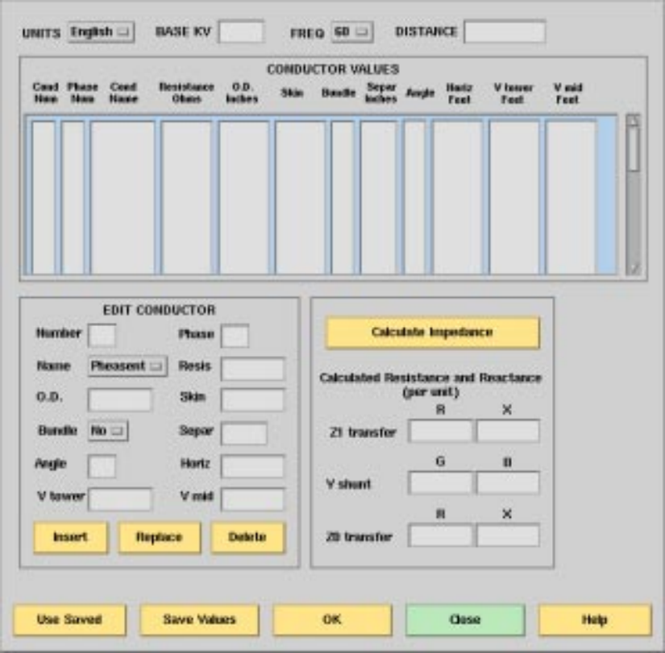
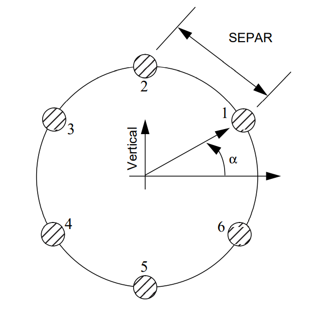
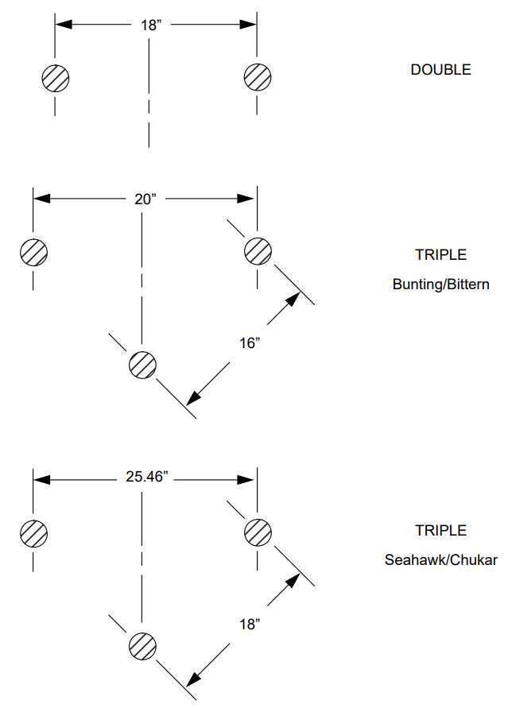

.. _calculating-line-impedance:

**************************
Calculating Line Impedance
**************************
The line impedance subroutine was been extracted from BPA's Electromagnetic Transients 
Program (EMTP) and modified for computing a balanced pi-equivalent line section. You can
find a clone of `BPA's EMTP <https://github.com/ahmadabdullah/BPA_EMTP>`_  The line impedance 
calculation feature is invoked from the branch data dialog. See the screenshot, diagram, and 
table below. It calculates the pi-equivalent quantities from the conductor type, conductor bundling, and
tower geometry. The following applies to all calculations:

   * There is continuous transposition of phases.
   * Resistivity is calculated at 25 degrees Celsius.
   * Earth resistivity is constant at 100 ohm-meters.

The Line Impedance dialog box consists of three panels for data.

   * Conductor Values. This is the scrollable list of conductor data, which is usually imported
     from a line constants data file.
   * Edit Conductor. This is the only means to edit data.
   * Calculate Impedance. This output panel displays the pi-equivalent data.

  Line Impedance Calculation Dialog Box

.. table:: Line Impedance Values For BPA Transmission System

  ======================= ============================== =========== ======== ======================= =====================
  Typical kV Installation Conductor Name                 O.D. (in)   SKIN     :math:`R_{d-c}`` (ohms) Bundle
  ======================= ============================== =========== ======== ======================= =====================
  115                     Pheasant                        1.382       0.333    0.0722                  no
  115                     Bittern                         1.345       0.345    0.0738                  no
  115                     Mallard                         1.140       0.286    0.1183                  no
  115                     Drake                           1.108       0.316    0.1180                  no
  115                     Dove                            0.927       0.333    0.1687                  no
  115                     Ibis                            0.783       0.316    0.2363                  no
  230                     Chukar                          1.602       0.364    0.0516                  no
  500 (d-c)               Thrasher                        1.802       0.387    0.397                   2-Thrasher
  500                     Chukar                          1.602       0.364    0.0516                  3-Chukar or 2-Chukar
  500                     Seahawk (trapezoidal stranding) 1.603       0.4138   0.0497                  3-Seahawk
  500                     Bunting                         1.302       0.375    0.0787                  3-Bunting
  ======================= ============================== =========== ======== ======================= =====================

Description of Conductor Data Fields
====================================
Each physical conductor is characterized by a number of items that you need to specify. The
following list describes these items:

**UNITS** Allows you to specify either metric or English units.

**BASEKV** The base value for the voltage in kV.

**BASE MVA** The base value for the power in MVA. (Default is 100.0.)

**NAME** Common conductor bird names are hard-coded. In Edit mode, selecting a name
from the button menu automatically transfers ``O.D.``(outside diameter), ``SKIN``, and
``RESIS`` data to the pertinent field. If any of these fields are modified, the
conductor name becomes "other."

**IPHASE** The phase number (an integer) to which this conductor belongs. Specify as zero
for a ground wire (ground is phase number zero by definition). If more than one
conductor is specified with the same phase number, this means that those
conductors are to be bundled (electrically connected in parallel). Use numbers
1, 2, etc., without any missing (unused) entries, when you number the phases.
In general, 1, 2, 3 pertain to circuit1, phases a, b, c, respectively; 4, 5, 6 pertain
to circuit2, phases A, B, C, respectively.

**SKIN** A field that is specified with the ratio T/D, where:
T is the thickness of the tubular conductor.
D is the outside diameter of the tubular conductor.
For a solid conductor, use 0.5.

**RESIS** The dc resistance of the conductor in ohms/kilometer if metric or ohms/mile if
English.

**DIAM** Outside diameter of the a tubular conductor in centimeters if metric or inches if
English.

**HORIZ** Horizontal separation of the center of the conductor from some reference line in
meters if metric or feet if English. The location of the horizontal reference line is arbitrary.
Distances to the right of the center line are positive, while those to the left are negative.

**VTOWER** Vertical height of the conductor above the ground at the tower in meters if
metric or feet if English.

**VMID** Vertical height of the conductor above the ground at mid-span (midway
between two towers) in meters if metric or feet if English.

.. note:: 
  
  The average height of the line is calculated by the following equation if both the 
  **VTOWER** and **VMID** fields are specified non-zero.

  .. math::

    VMID + [(VTOWER - VMID)/3] = 2/3 x VMID + 1/3 x VTOWER

If either data field is left blank, the blank field defaults to the other field. In
effect, the user specifies the average height.

**SEPAR ALPHA** Leave this blank unless the automatic bundling option is desired.

**FREQ** The frequency, :math:`f`, of the line impedance calculation in units of Hertz.

**DIST** The length of the transmission line under consideration in kilometers if metric
or miles if English.

**NBUND** Leave this blank unless the following automatic bundling option is desired.

AUTOMATIC BUNDLING OPTION

Rather than specifying each conductor of a bundle individually, there is an
automatic bundling option that allows a single conductor data to suffice for
specifying the entire bundle. This can be used for a "regular" bundle, where by
definition all component conductors are identical, and such conductors are also
assumed to be uniformly spaced around the circumference of a circle.

Automatic bundling uses the data fields **SEPAR**, **ALPHA**, and **NBUND**, which are
otherwise left blank. The "conductor" data then becomes "bundle" data according to the
following specifications:

  **SEPAR** The separation between adjacent conductors in the bundle in
  centimeters if metric or inches if English.
  
  **ALPHA** The angular position of the first conductor (or any conductor) of
  the bundle in units of degrees. Positive angles are measured
  counter-clockwise as shown in Figure C-1.
  
  **NBUND** The number of conductors that make up the bundle. Or, if you
  specify by name, separ, and alpha, nbund will be supplied by
  the program. (For names, see table above under Bundle at the 500
  kV lines.)

  A Six Bundle Conductor

  BPA Conductor Bundles

Output Values
=============
Considerable data is required to compute the pi-equivalent for a single segment. The line
impedance dialog is most effective when importing files containing line impedance data.

A typical file contains ASCII data in free-field format. The file types are ``.lcd`` for "line conductor
data." The following is an example.

.. code::

  /GET_DATA, TYPE = LINE_IMPEDANCE_CALCULATION
   UNITS = < ENGLISH | METRIC >, DISTANCE = < miles | km >
   BASEKV = <basekv>, BASEMVA = <basemva>, FREQUENCY = <freq>
   CONDUCTOR = 1 .3636 .05215 1.602 -20.75 50. 50. 0.0 0.0 0
   CONDUCTOR = 1 .3636 .05215 1.602 -19.25 50. 50. 0.0 0.0 0
   CONDUCTOR = 2 .3636 .05215 1.602 -0.75 77.5 77.5 0.0 0.0 0
   CONDUCTOR = 2 .3636 .05215 1.602 0.75 77.5 77.5 0.0 0.0 0
   CONDUCTOR = 3 .3636 .05215 1.602 19.25 50. 50. 0.0 0.0 0
   CONDUCTOR = 3 .3636 .05215 1.602 20.75 50. 50. 0.0 0.0 0
   CONDUCTOR = 0 .5 2.61 0.386 -12.9 98.5 98.5 0.0 0.0 0
   CONDUCTOR = 0 .5 2.61 0.386 12.9 98.5 98.5 0.0 0.0 0

The usual scenario involves the following steps.

  1. Import a relevant ``.lcd`` file using the Use Saved button.
  2. Edit the file to reflect the geometric and physical attributes of the line under consideration.
  3. Calculate the pi-equivalent data. Steps 2 and 3 may be iterated as long as necessary to eliminate errors.
  4. Export the modified ``.lcd`` file using the Save Values button.
  5. If the results are acceptable, automatically transfer the positive sequence values back to the
     line dialog by pressing the OK button. (The zero sequence values are for inspection only.)
  6. If the results are not acceptable, press the Close button. No values are transmitted back to
     the line dialog by a Close action.

Calculating the Impedance
=========================
After you have supplied all the necessary values for the line impedance calculations, you can click
on the Calculate Impedance button in the Line Impedance Calculation dialog box. The program
fills in six numbers in per unit values having the following meanings:

  R/Z1 transfer Real part of the positive sequence transfer impedance per unit.
  
  X/Z1 transfer Imaginary part of the positive sequence transfer impedance per unit.
  
  R/Z1 shunt Half value of the real part of the positive sequence shunt admittance per unit.

  X/Z1 shunt Half value of the imaginary part of the positive sequence shunt admittance
  per unit.
  
  R/Z0 transfer Real part of the zero sequence transfer impedance per unit.
  
  X/Z0 transfer Imaginary part of the zero sequence transfer impedance per unit.
