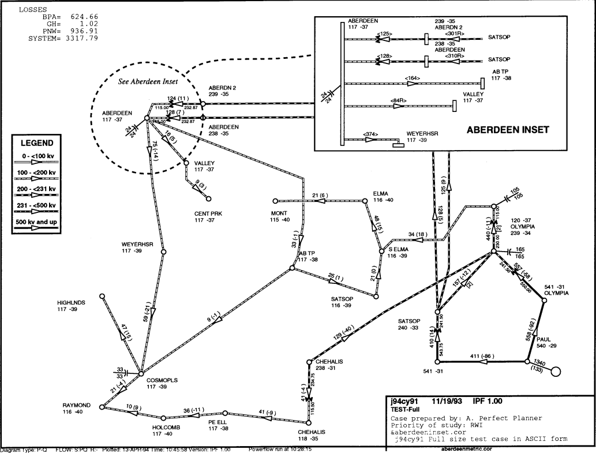

.. _ipf-network-diagrams:

****************
Network Diagrams
****************

Overview
========
IPF has two different network diagram presentations. One is the display you see in the ``gui`` graphics, and the other is the hard copy map. The display is for convenience in accessing system data graphically - it does not represent what the plotted map will look like, nor does it need to be 'pretty'. The hard copy diagram is designed for reports, documentation, and analysis. It can be generated as a report from the graphic display or produced in a batch environment.

Both presentations use the same coordinate file format. The most important coordinate data, like bus icon and name locations, and line bending points, can be edited graphically from the ``gui`` by moving things around and saving the altered coordinate file. However, you will have to plot out the map in order to see how your changes have affected the hard copy appearance.

The basic diagram shows power system components modeled in a power flow study. The diagram is less detailed than a Powerflow listing, but may have more (or different) information than the graphic display. It shows essential bus and branch solution data. The diagram also shows identification data. For example, it shows date, case identification, program version, and the options used to generate the diagram. The diagram can be enhanced by adding to the coordinate file such items as:

  * A legend.
  * A border.
  * A control block for case identification, signatures, etc.
  * A case title heading.
  * Selected tie line flows and loss summary.
  * An inset showing detail in a selected area.
  * Any PostScript language objects.

These items will show up on the map plotted from the ``gui``, even though many of them cannot be added or edited with ``gui``. For details on all the hard copy diagram options and capabilities, and the usage of the ``ipfplot`` and ``ipfbat`` programs, see :ref:`ipfplot` and :ref:`ipfbat`.

Input Requirements, Output, and Operation
=========================================
When you load a coordinate file, for example ``name.cor``, into the GUI, the program copies the
contents of the file into ``name.tmp``. Any changes you make during your interactive session are
reflected in the latter file. They will disappear when you exit IPF unless you Save the coordinate
file before exiting.

When you select the Print Plot item on the File menu, IPF uses the intersection of the ``name.tmp``
file and the currently loaded system data to define which data will appear on the diagram. It then
combines this with the file ``pfmaster.post``, which describes how data will appear on the diagram.
The result is a ``name.ps`` file, which is sent to a PostScript-capable printer using the Printer
Destination string you have selected.

Coordinate File
===============
The Coordinate file consists of primary coordinate data records and supportive coordinate data
records. All coordinates are first quadrant positive Cartesian coordinate values in centimeters. The
lower left corner of the diagram is coordinate (0,0). The primary coordinate data records those
which specify the bus and branch (bend) locations. These records are:

  * Bus Record ``B``
  * Line Record ``L``
  * Transformer Record ``T``
  * Area Record ``A``
  * Intertie Record ``I``

The Coordinate file may also include supportive record types to produce a diagram suitable for
long term documentation. These records are:

  * File Identification Record ``[ID COORD``
  * Options Record ``O``
  * Define Record ``>DEFINE_TYPE``
  * Comment Record ``C``
  * Draw Record ``D``
  * PostScript Record ``P``
  * Trailer Record ``9`` or ``(*EOR)``

For complete details on all of the coordinate file records, see ??.

File Indentification Record - ``[ID COORD``
-------------------------------------------
The file identification record signifies the beginning of a set of coordinate records. Options are set
to their default condition when this record is encountered.

Options Record - ``O``
----------------------
Options affect the general appearance of a diagram and determine which Powerflow data will be
displayed for each bus and branch on a diagram.

The option values can be set on the Diagram Options menu.

.. table:: General Appearance Options

  +----------------------------------+------------------------------------------------------------+
  | Option                           | Description                                                |
  +==================================+============================================================+
  | SIze=XX.XX,YY.YY                 | DEFAULT = 21.59 by 27.94 cm (8.5 by 11 inches).            |
  +----------------------------------+------------------------------------------------------------+
  | ORientation=Landscape            | DEFAULT=Portrait.                                          |
  | ORientation=Portrait             |                                                            |
  +----------------------------------+------------------------------------------------------------+
  | OFfset=XX.XX,YY.YY               | Lower left of diagram relative to lower left of page.      |
  |                                  | DEFAULT = 0.0, 0.0.                                        |
  +----------------------------------+------------------------------------------------------------+
  | TRansparency=Transparent         | DEFAULT for insets is Opaque.                              |
  | TRansparency=Opaque              | Main diagram is always opaque.                             |
  +----------------------------------+------------------------------------------------------------+
  | SCale_factor=X.XX,Y.YY           | DEFAULT = 1.0, 1.0.                                        |
  +----------------------------------+------------------------------------------------------------+
  | BOrder=XX.XX,YY.YY               | Locates upper right corner of border.                      |
  |                                  | DEFAULT = no border.                                       |
  +----------------------------------+------------------------------------------------------------+
  | BX=XX.UL,YY.UL,XX.LR,YY          | Locates an identification box. XX.UL and YY.UL             |
  | .LR                              | locate the upper left corner of the box. If XX.LR and      |
  |                                  | YY.LR are zero (0), the box is positioned in the           |
  |                                  | lower right corner of the diagram. Default coordinates     |
  |                                  | are established for CR (coordinate file),                  |
  |                                  | CAse_name, and COmments. These locations can               |
  |                                  | be overridden.                                             |
  |                                  | A standard border is drawn as near the edge of the         |
  |                                  | paper as most PostScript printers will allow.              |
  |                                  | DEFAULT = no identification box.                           |
  +----------------------------------+------------------------------------------------------------+
  | CAse_name=XX.XX,YY.YY            | Locates case name from Powerflow program.                  |
  |                                  | DEFAULT = no case name.                                    |
  +----------------------------------+------------------------------------------------------------+
  | COmments=XX.XX,YY.YY             | Locates comments from user entry and Powerflow             |
  |                                  | program.                                                   |
  |                                  | DEFAULT = no Powerflow comments.                           |
  +----------------------------------+------------------------------------------------------------+
  | CR=XX.XX,YY.YY                   | Locates coordinate file name                               |
  |                                  | DEFAULT = relative to BX.                                  |
  +----------------------------------+------------------------------------------------------------+
  | LG=XX.XX,YY.YY                   | Locates upper left corner of legend box.                   |
  |                                  | DEFAULT = no legend.                                       |
  +----------------------------------+------------------------------------------------------------+

The options described in the table above determine which Powerflow values will be displayed on a
diagram.

.. table:: Powerflow Values Options

  +---------------------------------------------+-----------------------------+
  | Option                                      | Description                 |
  +=============================================+=============================+
  | DIagram_type=Pq_flow                        | See flow detail; DEFAULT    |
  | DIagram_type=Mva/I                          | Maximum values              |
  | DIagram_type=Loss                           | P and/or Q set via P_S, Q_S |
  | DIagram_type=Interchange                    |                             |
  | DIagram_type=Coordinates                    | No flow data                |
  | Diagram_type=Loading %                      | % current or % MVA rating   |
  +---------------------------------------------+-----------------------------+
  | VAlues=Normal                               | DEFAULT                     |
  | VAlues=Difference                           | case1 - case2               |
  +---------------------------------------------+-----------------------------+
  | FLow_detail=P_Sending_end                   | DEFAULT                     |
  | FLow_detail=Q_Sending_end                   | DEFAULT                     |
  | FLow_detail=P_Receiving                     |                             |
  | FLow_detail=Q_Receiving                     |                             |
  +---------------------------------------------+-----------------------------+
  | BUs_detail=Bus_name,Abbreviation            | DEFAULT                     |
  | BUs_detail=Bus_name,Powerflow_name (and kV) |                             |
  | BUs_detail=Voltage,kV                       | DEFAULT                     |
  | BUs_detail=Voltage,Per Unit                 |                             |
  | BUs_detail=Angle                            | DEFAULT                     |
  | BUs_detail=Generation                       | DEFAULT                     |
  | BUs_detail=Shunt                            | DEFAULT                     |
  | BUs_detail=Load                             |                             |
  | BUs_detail=Total_flow of undrawn branches   |                             |
  | BUs_detail=Outages                          | Not yet implemented.        |
  +---------------------------------------------+-----------------------------+
  | BRanch_detail=Trans_taps                    |                             |
  | BRanch_detail=Compensation                  |                             |
  | BRanch_detail=Parallels,Combined            | DEFAULT                     |
  | BRanch_detail=Parallels,Separate            |                             |
  | BRanch_detail=Outages                       | Not yet implemented.        |
  +---------------------------------------------+-----------------------------+

Bus Coordinate Data
-------------------
The bus coordinate data describes where and how the Powerflow bus values will be displayed on
the diagram. See the table and card below for the format of the bus coordinate data record.

.. table:: Bus Coordinate Data Format

  +---------+--------+--------------------------------------------------------------+
  | Column  | Format | Description                                                  |
  +=========+========+==============================================================+
  | 1       | A 1    | B — Identifies the Bus coordinate record. This record type   |
  |         |        | is created when you place a bus graphically.                 |
  +---------+--------+--------------------------------------------------------------+
  | 2       | I 1    | Display flag:                                                |
  |         |        | 0,Blank - Display the bus symbol.                            |
  |         |        | 1 - Do not display the bus symbol, but print the name.       |
  |         |        | This is accessed by the Hide Bus and Show Bus buttons in     |
  |         |        | the Bus Coord Edit menu.                                     |
  +---------+--------+--------------------------------------------------------------+
  | 3-10    | A 8    | Bus name to match Powerflow data. Used for identification.   |
  +---------+--------+--------------------------------------------------------------+
  | 11-14   | F 4.0  | Bus kv to match Powerflow data. Used for identification.     |
  +---------+--------+--------------------------------------------------------------+
  | 15-22   | A 8    | Name abbreviation to print on diagram. This can be edited    |
  |         |        | from the Bus Coord Edit menu.                                |
  +---------+--------+--------------------------------------------------------------+
  | 23      | I 1    | Print bus voltage relative to bus name:                      |
  |         |        | 1 - over name                                                |
  |         |        | 2 - right of name                                            |
  |         |        | 3 - below name - this is the GUI-generated default           |
  |         |        | 4 - left of name                                             |
  |         |        | 5 - do not print the voltage                                 |
  |         |        | 6 - print the voltage, but no name                           |
  +---------+--------+--------------------------------------------------------------+
  | 24-35   | 2F 6.2 | X, Y of center of bus symbol. This changes whenever you      |
  |         |        | move a bus in the GUI display.                               |
  +---------+--------+--------------------------------------------------------------+
  | 36-47   | 2F 6.2 | X, Y of the lower left corner of the bus name (if other than |
  |         |        | default). This changes whenever you move a bus name.         |
  +---------+--------+--------------------------------------------------------------+
  | 48-50   | F 3.0  | Angle (in degrees) of generator symbol                       |
  |         |        | (0 degrees assigns X > 0, Y = 0 position                     |
  |         |        | Angle > 0 moves counter clockwise).                          |
  |         |        | An angle of 0 is a flag to not display the generator.        |
  |         |        | GUI-generated default is 150 degrees.                        |
  +---------+--------+--------------------------------------------------------------+
  | 51-53   | F 3.0  | Angle of reactance symbol.                                   |
  |         |        | An angle of 0 is a flag to not display the reactor.          |
  |         |        | GUI-generated default is 120 degrees.                        |
  +---------+--------+--------------------------------------------------------------+
  | 54-55   | A 2    | Bus symbol shape identifier:                                 |
  |         |        | Blank - round symbol - this is the default from GUI.         |
  |         |        | HB - horizontal bar, length = radius x 2                     |
  |         |        | VB - Vertical bar                                            |
  |         |        | User may add other symbols corresponding to symbols          |
  |         |        | added in master PostScript file.                             |
  +---------+--------+--------------------------------------------------------------+
  | 56-59   | F 4.2  | Bus symbol radius in centimeters.                            |
  +---------+--------+--------------------------------------------------------------+

  Bus Coordinate Data Record

Branch Coordinate Data
----------------------
The branch coordinate data describes the bending points in a branch and identifies which segment
will show the flow and transformer symbol or compensation symbol. See the table and card record below
for the format of the branch coordinate data record.

Column 27 requires additional explanation. Several alternative routes may be established for
printing parallel circuits separately. The most preferred path is 1, next 2, etc. When the option to
display parallel circuits separately is on and there are as many or more routings as circuits, the
circuits are shown separately.

.. table:: Branch Coordinate Data Format

  +---------+--------+--------------------------------------------------------------+
  | Column  | Format | Description                                                  |
  +=========+========+==============================================================+
  |1        | A 1    | L or T identifies a Line or Transformer. This record type is |
  |         |        | generated when you place a bending point in a line or        |
  |         |        | transformer.                                                 |
  +---------+--------+--------------------------------------------------------------+
  | 2       |        | Not used.                                                    |
  +---------+--------+--------------------------------------------------------------+
  | 3-10    | A 8    | Bus1 name.                                                   |
  +---------+--------+--------------------------------------------------------------+
  | 11-14   | F 4.0  | Bus1 kV.                                                     |
  +---------+--------+--------------------------------------------------------------+
  | 15-22   | A 8    | Bus2 name.                                                   |
  +---------+--------+--------------------------------------------------------------+
  | 23-26   | F 4.0  | Bus2 kV.                                                     |
  +---------+--------+--------------------------------------------------------------+
  | 27      | I 1    | Circuit number for routing parallel circuits separately.     |
  |         |        | Not available from GUI.                                      |
  +---------+--------+--------------------------------------------------------------+
  | 28      |        | Not used.                                                    |
  +---------+--------+--------------------------------------------------------------+
  | 29-30   | I 2    | Segment for annotation with flow.                            |
  |         |        | A negative number means do not show arrow and flow.          |
  |         |        | Not available from GUI.                                      |
  +---------+--------+--------------------------------------------------------------+
  | 31-42   | 2F 6.2 | X, Y coordinates for 1st bending point.                      |
  +---------+--------+--------------------------------------------------------------+
  | 43-54   | 2F 6.2 | X, Y coordinates for 2nd bending point.                      |
  +---------+--------+--------------------------------------------------------------+
  | 55-66   | 2F 6.2 | X, Y coordinates for 3rd bending point.                      |
  +---------+--------+--------------------------------------------------------------+
  | 67-78   | 2F 6.2 | X, Y coordinates for 4th bending point.                      |
  +---------+--------+--------------------------------------------------------------+
  | 79-90   | 2F 6.2 | X, Y coordinates for 5th bending point                       |
  +---------+--------+--------------------------------------------------------------+

  Branch Coordinate Data Record

Diagram Components
==================
The diagram consists of two types of components:

  * Supportive components such as borders, diagram identification, legend, and comments.
  * Primary diagram components such as buses, branches, areas, and interchange flows.

Supportive Diagram Components
-----------------------------
The example diagrams illustrate the two different types of default options, one with an
identification box in the lower left corner (BPA standard) and the other with case id and headers at
the top of the page (WSCC standard).

A border is drawn as close to the edge of the paper as printers allow. The information below the
border identifies the type of diagram, the date and time the diagram was created, the Powerflow
program version that created the diagram, the time that the Powerflow case was created, and the
name of the coordinate file.

In example 1, the case name, the date the case was created, and the Powerflow program version
that created the case are shown on the first line within the box. The 20-character description of the
case is on the second line. Comments entered by the user at the time the diagram was created
follow. Note that the last user-entered comment on the bus/branch diagram begins with an
ampersand (&). This comment instructs the program to read additional coordinate data from the
file ``aberdeeninset.cor.`` Blocks of text such as ``LOSSES`` on the bus/branch diagram and ``INTERTIE
SCHEDULED ACTUAL`` on the area interchange diagram are the product of ``>DEFINE`` and ``C`` records in
the coordinate file. The ``LG`` (LeGend) option selects and locates the legend shown on the bus/branch
diagram.

In example 2, an IPS-like three line title appears above the map. The first line is composed of the
case name, description, date, and program version. The other two lines were entered as headers in
the PF ID/Description menu (corresponds to command /HEADER in BPF).

Primary Diagram Components
--------------------------
The bus symbol group and values consists of the following:

  * Bus symbol — Circle, bar, etc.
  * Identification — Powerflow name and kV or abbreviation.
  * Voltage and angle — Printed above, below, or to the left or right of identification.
  * Bus load — Printed above, below, or to the left or right of voltage and angle.
  * Total flow on branches to buses not shown on diagram — printed above, below, or to the
    left or right of load.
  * Generator symbol — Circle connected to bus with a short line segment.
    Power generation in MW is printed above the line and reactive generation is printed below
    the line.
  * Shunt Reactive — Capacitor or inductor symbol connected to a bus with a short line segment.
    Maximum reactance available at the bus is printed above the line, and actual reactance used
    is printed below the line.

The branch symbol group and values consist of the following:

  * Line segment symbol - Voltage-coded line segment representing a line or transformer
  connection between buses.
  * Arrow symbol - Indicates direction of real power flow through the branch.
  * Overload indicator - Flags circuits that are approaching an overload condition.
    Branches that are approaching a nominal, thermal, bottleneck, or emergency loading are
    flagged with an N, T, B, or E under the arrow. The actual current or Mva flow in the line
    or transformer is before the numeric flag and the rating follows the flag.
  * Branch flow - Real and reactive power (MW and Mvar) Branch flow is shown above the arrow. 
    Real and reactive sending and receiving end flows are differentiated as follows. MW values 
    are simply shown as numbers. Mvar values are shown within parentheses. Receiving end values
    are shown within square brackets. Negative values indicate a flow opposite the arrow direction.
  * Branch flow — MVA and current.
    An alternative to showing MW and Mvar is to show MVA for transformers and current for
    lines. The value shown is the maximum for any section of the circuit. If the maximum is at
    a point other than the sending end, an R is appended to the flow. If a circuit is composed of
    both line sections and transformer sections, the maximum current for the line section and
    maximum MVA for the transformer section will be shown. The receiving or sending/receiving 
    end flag is eliminated.

    Example:
    .. image:: ../img/Example_500_amp_650_mva_Branch_Flow.png
    
    This example indicates 500 amps in a line section and 650 MVA in a transformer.
    
    Example:
    .. image:: ../img/Example_1000_amp_Branch_Flow.png

  * Branch flow - Real and reactive power loss.
    Real and reactive losses in MW and Mvar are shown above the arrow.

    Example:
    .. image:: ../img/Example_Real_Reactive_Branch_Loss.png
    This example indicates a loss of 1.23 MW and 0.05 Mvar in the branch.

  * Parallel circuits - Show number of parallel circuits represented by branch (default).
    The number of parallel circuits carrying the flow on the diagram is shown in brackets below
    the line.
  * Parallel circuits - Show flow on each circuit represented (option).
    The flow on each of the parallel circuits can be shown separately.
  * Transformer symbol (shown at tip of arrow).
  * Transformer taps (shown below transformer).
  * Series compensation symbol (shown at tip of arrow).
  * Series compensation value - Percent of line compensation shown below capacitor symbol.

  Bus Branch Diagram with Inset

  
