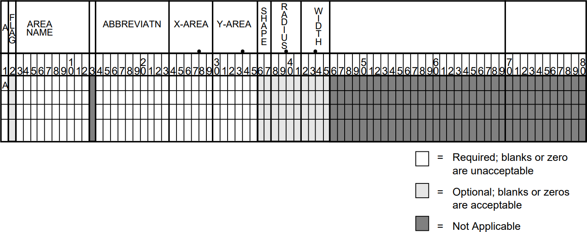

.. _ipf-network-diagrams:

****************
Network Diagrams
****************

Overview
========
IPF has two different network diagram presentations. One is the display you see in the GUI
graphics, and the other is the hard copy map. The display is for convenience in accessing 
system data graphically - it does not represent what the plotted map will look like, nor 
does it need to be 'pretty'. The hard copy diagram is designed for reports, documentation, 
and analysis. It can be generated as a report from the graphic display or produced in a 
batch environment. This section addresses the hard copy diagram which is designed for 
reports, documentation, and analysis.

Both presentations use the same coordinate file format. The most important coordinate data, 
like bus icon and name locations, and line bending points, can be edited graphically from 
the GUI by moving things around and saving the altered coordinate file. However, you will 
have to plot out the map in order to see how your changes have affected the hard copy 
appearance.

The basic diagram shows power system components modeled in a power flow study. The diagram 
is less detailed than a Powerflow listing, but may have more (or different) information 
than the graphic display. It shows essential bus and branch solution data. The diagram also 
shows identification data. For example, it shows date, case identification, program version, 
and the options used to generate the diagram. The diagram can be enhanced by adding to the 
coordinate file such items as:

  * A legend.
  * A border.
  * A control block for case identification, signatures, etc.
  * A case title heading.
  * Selected tie line flows and loss summary.
  * An inset showing detail in a selected area.
  * Any PostScript language objects.

These items will show up on the map plotted from the GUI, even though many of them cannot be 
added or edited from the GUI. For details on all the hard copy diagram options and capabilities, 
and the usage of the ``ipfplot`` and ``ipfbat`` programs, see :ref:`ipfplot` and :ref:`ipfbat`.

Input Requirements, Output, and Operation
=========================================
The Plot function is a set of FORTRAN subroutines within ``ipfmain``, which build a dynamic
PostScript objects file of references to a static PostScript objects file (``pfmaster.post``). The same
routines are called by the Print Plot command issued from the GUI, a command file entered via
``ipfbat`` or the GUI, and by the batch program ``ipfplot``. The dynamic file, which is built by
"anding" a coordinate file with powerflow data, defines *which data* will appear on a diagram. The
static ASCII PostScript file describes *how data* will appear on a diagram.

When you load a coordinate file, for example ``name.cor``, into the GUI, the program copies the
contents of the file into ``name.tmp``. Any changes you make during your interactive session are
reflected in the latter file. They will disappear when you exit IPF unless you Save the coordinate
file before exiting.

When you select the Print Plot item on the File menu, IPF uses the intersection of the ``name.tmp``
file and the currently loaded system data to define which data will appear on the diagram. It then
combines this with the file ``pfmaster.post``, which describes how data will appear on the diagram.
The result is a ``name.ps`` file, which is sent to a PostScript-capable printer using the Printer
Destination string you have selected.

Input Requirements
------------------
The input requirements are:

  
  * A coordinate file, built via the GUI and/or an ASCII text editor.
  * A solved system network, either from a base case file or currently loaded in IPF.
  * The static PostScript file (``pfmaster.post``) defining how data will be shown on the 
  diagram.

Output
------
A dynamic PostScript file, which is built by the Plot program, is appended to the static PostScript
file and sent to a PostScript interpreter (printer or computer display) to produce a diagram.

Plot Program Operation
----------------------
GUI: Select Print Plot from the File pull-down menu. You can also change the options for the
particular plot, by selecting Diagram Options and/or Page Options. These override the options
which may be specified in the coordinate file.

``ipfbat``: See :ref:`ipfbat`.

``ipfplot``: Enter ``ipfplot coordinate_file base_file_1 [base_file_2]``. This is a strictly
batch process which does not require the GUI. A coordinate file name and one solved base file must
be provided. The second base file is required only for difference maps.

However it is invoked, the Plot program determines which information should appear on the
diagram by examining the coordinate file. It then searches the Powerflow data for bus, branch,
area, and intertie data that are identified in the coordinate file. When a match is found, the
Powerflow and coordinate data are combined and formatted into a dynamic PostScript file to
activate procedures on the static PostScript file. In addition to bus, branch, transformer, area, and
intertie records, all other coordinate file records — options, draw, >define, comment, and
PostScript — are processed by the Plot program and formatted to invoke procedures on the static
PostScript file.


Coordinate File
===============
The coordinate file used by the diagram program is the same file that is generated and used by the
GUI display. Since the coordinate file is an ASCII file, it can be generated by any ASCII text
editor. The records in that file are described in this section.

The Coordinate file consists of primary coordinate data records and supportive coordinate data
records. All coordinates are first quadrant positive Cartesian coordinate values in centimeters. The
lower left corner of the diagram is coordinate (0,0). The primary coordinate data records those
which specify the bus and branch (bend) locations. These records are:

  * Bus Record ``B``
  * Line Record ``L``
  * Transformer Record ``T``
  * Area Record ``A``
  * Intertie Record ``I``

The Coordinate file may also include supportive record types to produce a diagram suitable for
long term documentation. These records are:

  * File Identification Record ``[ID COORD``
  * Options Record ``O``
  * Define Record ``>DEFINE_TYPE``
  * Comment Record ``C``
  * Draw Record ``D``
  * PostScript Record ``P``
  * Trailer Record ``9`` or ``(*EOR)``

For complete details on all of the coordinate file records, see ??.

File Indentification Record - ``[ID COORD``
-------------------------------------------
The file identification record signifies the beginning of a set of coordinate records. See the table
below. Options are set to their default condition when this record is encountered. One such record is
required at the beginning of the coordinate file, but it may optionally contain several ``[ID COORD``
records and their associated coordinate record sets. Multiple ``[ID COORD`` records may be used to
insert a control block, legend, or an inset of a detailed section of the diagram.

.. table:: File Identification Record Format

  ====== ====== ===================================================
  Column Format Description
  ====== ====== ===================================================
   1-9   A9     ``[ID COORD``
   9-90         Not used by Plot program, available for user notes.
  ====== ====== ===================================================

.. _options-record:

Options Record - ``O``
----------------------
Options affect the general appearance of a diagram and determine which Powerflow data will be
displayed for each bus and branch on a diagram.

The default option values can be overridden by options specified in the coordinate file. If a
coordinate file is currently loaded in the GUI, and the options are changed via the Page Options or
Diagram Options menus, these will override (replace) those originally specified in the file. If the
file is saved, the new options will be saved in it.

The ``=`` and ``,`` and blank field delimiters may be used interchangeably. Option names may be
upper or lower case. Upper case characters shown in the tables indicate the minimum mandatory
characters for identifying the option.

.. table:: Option Record Format

  ====== ====== ===================================================
  Column Format Description
  ====== ====== ===================================================
  1-2    A 2    ``OP`` - identifies an option record.
  3-90   A 88   Free field description of option, see tables below for details.
  ====== ====== ===================================================

Here is an example of how to specify options in the coordinate file:::

  OPtions OR=L
  Options SCale_factor=0.9,0.9
  OP BUs_detail=Bus_name,Powerflow_name

**Page Options**
These are general appearance options. Several of them are interdependent. They are applied in the
following order:

  * Orientation
  * Scale
  * Offset
  * Border with transparency flag
  * Box for identification
  * Case location
  * Comment location
  * Coordinate file name location
  * Size
  * Legend location

The option values can be set on the Diagram Options menu.

.. table:: General Appearance (Page) Options

  +----------------------------------+------------------------------------------------------------+
  | Option                           | Description                                                |
  +==================================+============================================================+
  | SIze=XX.XX,YY.YY                 | DEFAULT = 21.59 by 27.94 cm (8.5 by 11 inches).            |
  +----------------------------------+------------------------------------------------------------+
  | ORientation=Landscape            | DEFAULT=Portrait.                                          |
  | ORientation=Portrait             |                                                            |
  +----------------------------------+------------------------------------------------------------+
  | OFfset=XX.XX,YY.YY               | Lower left of diagram relative to lower left of page.      |
  |                                  | DEFAULT = 0.0, 0.0.                                        |
  +----------------------------------+------------------------------------------------------------+
  | TRansparency=Transparent         | DEFAULT for insets is Opaque.                              |
  | TRansparency=Opaque              | Main diagram is always opaque.                             |
  +----------------------------------+------------------------------------------------------------+
  | SCale_factor=X.XX,Y.YY           | DEFAULT = 1.0, 1.0.                                        |
  +----------------------------------+------------------------------------------------------------+
  | BOrder=XX.XX,YY.YY               | Locates upper right corner of border.                      |
  |                                  | DEFAULT = no border.                                       |
  +----------------------------------+------------------------------------------------------------+
  | BX=XX.UL,YY.UL,XX.LR,YY          | Locates an identification box. XX.UL and YY.UL             |
  | .LR                              | locate the upper left corner of the box. If XX.LR and      |
  |                                  | YY.LR are zero (0), the box is positioned in the           |
  |                                  | lower right corner of the diagram. Default coordinates     |
  |                                  | are established for CR (coordinate file),                  |
  |                                  | CAse_name, and COmments. These locations can               |
  |                                  | be overridden.                                             |
  |                                  | A standard border is drawn as near the edge of the         |
  |                                  | paper as most PostScript printers will allow.              |
  |                                  | DEFAULT = no identification box.                           |
  +----------------------------------+------------------------------------------------------------+
  | CAse_name=XX.XX,YY.YY            | Locates case name from Powerflow program.                  |
  |                                  | DEFAULT = no case name.                                    |
  +----------------------------------+------------------------------------------------------------+
  | COmments=XX.XX,YY.YY             | Locates comments from user entry and Powerflow             |
  |                                  | program.                                                   |
  |                                  | DEFAULT = no Powerflow comments.                           |
  +----------------------------------+------------------------------------------------------------+
  | CR=XX.XX,YY.YY                   | Locates coordinate file name                               |
  |                                  | DEFAULT = relative to BX.                                  |
  +----------------------------------+------------------------------------------------------------+
  | LG=XX.XX,YY.YY                   | Locates upper left corner of legend box.                   |
  |                                  | DEFAULT = no legend.                                       |
  +----------------------------------+------------------------------------------------------------+


  Page Options Dialog Box

**Diagram Options**

The options described in the table below determine which powerflow values will be displayed on a
diagram.

Those selections that are ON by DEFAULT may be turned off in one of two ways. Some, such as the
bus name selection, may be toggled to the abbreviations on the bus coordinate records, full bus
name, or full bus name and base kv. Others, such as generation, may be turned off by preceding
the value of interest with ``NO_``. For example, to not show generation:::

  Option BUs_detail=NO_Generation
  or
  O BU=NO_G

You can also specify on the bus coordinate record whether or not the generation and shunt
reactance at this bus should be displayed. See bus coordinate records in Table ?? and Figure ??
for details. The no display indicator on the coordinate records can be overridden with a draw more
or alwaws draw option for generators or shunt reactors. For example,::
  
  Op BUs_detail=AL_Generators
  Op BUs_detail=MO_Generators
  Option BUs_detail=AL_Shunt


  GUI Diagram Options

Some of the diagram options are independent; others are mutually exclusive. Look at the GUI
menu above to quickly determine which is which. Those with *diamond* buttons are exclusive; those
with *square* buttons can be turned on or off in any combination. This applies no matter whether the
options are specified from the menu or in the coordinate file.

.. table:: Powerflow Values Options

  +---------------------------------------------+-----------------------------+
  | Option                                      | Description                 |
  +=============================================+=============================+
  | DIagram_type=Pq_flow                        | See flow detail; DEFAULT    |
  | DIagram_type=Mva/I                          | Maximum values              |
  | DIagram_type=Loss                           | P and/or Q set via P_S, Q_S |
  | DIagram_type=Interchange                    |                             |
  | DIagram_type=Coordinates                    | No flow data                |
  | Diagram_type=Loading %                      | % current or % MVA rating   |
  +---------------------------------------------+-----------------------------+
  | VAlues=Normal                               | DEFAULT                     |
  | VAlues=Difference                           | case1 - case2               |
  +---------------------------------------------+-----------------------------+
  | FLow_detail=P_Sending_end                   | DEFAULT                     |
  | FLow_detail=Q_Sending_end                   | DEFAULT                     |
  | FLow_detail=P_Receiving                     |                             |
  | FLow_detail=Q_Receiving                     |                             |
  +---------------------------------------------+-----------------------------+
  | BUs_detail=Bus_name,Abbreviation            | DEFAULT                     |
  | BUs_detail=Bus_name,Powerflow_name (and kV) |                             |
  | BUs_detail=Voltage,kV                       | DEFAULT                     |
  | BUs_detail=Voltage,Per Unit                 |                             |
  | BUs_detail=Angle                            | DEFAULT                     |
  | BUs_detail=Generation                       | DEFAULT                     |
  | BUs_detail=Shunt                            | DEFAULT                     |
  | BUs_detail=Load                             |                             |
  | BUs_detail=Total_flow of undrawn branches   |                             |
  | BUs_detail=Outages                          | Not yet implemented.        |
  +---------------------------------------------+-----------------------------+
  | BRanch_detail=Trans_taps                    |                             |
  | BRanch_detail=Compensation                  |                             |
  | BRanch_detail=Parallels,Combined            | DEFAULT                     |
  | BRanch_detail=Parallels,Separate            |                             |
  | BRanch_detail=Outages                       | Not yet implemented.        |
  +---------------------------------------------+-----------------------------+

**File Management**
This option is used to 'include' a separate file of coordinate data into the current file that you are
plotting. CFLOW reports can be incorporated into the diagram by this mechanism. Multiple files
may be included, if desired. This option is not presently available from the GUI. That is, if in the
GUI you load a coordinate file which includes "Option File" records, these will be ignored.
However, there is a means of including a single auxiliary coordinate file in a GUI plot. Under the
File pull down menu, select Plot Options, then User Comments. Include a comment which is the
name of the file, preceded by an ampersand (``&``). See section :ref:`` for more information.

The ABERDEEN INSET in Figure 5.8 was created with an ``&`` record.

The included file should *not* be a complete, independent coordinate file. For example, if it has a
``[ID COORD`` record, none of the file will be included. If it contains any options which have already
been defined, these will produce warning messages and will have no effect. Options which are not
defined in the main file can be defined in the included file; they will be applied to the entire
diagram.

The included file must be terminated with a (``*EOR``) record, or its last line will be lost.

.. table:: File Management Option

  =============== ========================================
  Option          Description
  =============== ========================================
  File=filename   Coordinate data from the specified file will be inserted into the current file. (This feature has not yet been implemented in the GUI.)
  =============== ========================================

PostScript Records
-------------------
PostScript, >Define, Comment, and Draw records are processed in the order specified by the user.
For example, a PostScript record can be used to change the font for comment records. A comment
record may or may not define coordinates. If coordinates are not defined, the comment is printed
below the previous comment record. A series of Draw records or a series of PostScript records is
often required to accomplish a specific task.

PostScript commands, columns 3 - 82 of the PostScript records, are sent directly to the PostScript
file. They have the complete versatility of the PostScript language (PSL). A typical use is to change
fonts within a series of comment records or to add simple graphics to a diagram. These records
could also be generated, inserted, or edited by a CFLOW program (see also Comment Records,
below).

.. table:: PostScript Record Format

  ====== ====== ===================================
  Column Format Description
  ====== ====== ===================================
  1      A 1    P - identifies a PostScript record.
  3-82   A 80   Any valid PostScript command including commands defined in pfmaster.post
  ====== ====== ===================================

>Define Records
---------------
The define records associate solution values to variables that can be manipulated and printed
within comment records. Section :ref:`user-analysis` provides an in-depth discussion of this
feature. See the table below for the format of >DEFINE records.

.. table:: Define Record Format

  ====== ====== =======================================================
  Column Format Description
  ====== ====== =======================================================
  1-7    A 7    >DEFINE — identifies a define record.
  1-90   A 90   See :ref:`user-analysis`, /USER- ANALYSIS section, Symbol Definitions.
  ====== ====== =======================================================

Comment Records
---------------
Comment records may display simple text or may be used in conjunction with >DEFINE records to
display Powerflow values.

They may also be used in conjunction with CFLOW, to create mini-reports on the printed map.
Your CFLOW program can edit a coordinate file directly, or create/edit an auxiliary file containing
comment records, which is included in the main file(s) with an ``OPtion = FIle`` record (see also
PostScript records, above).

.. table:: Comment Record Format

  ====== ====== =======================================================
  Column Format Description
  ====== ====== =======================================================
  1      A 1    C - identifies a comment record.
  3-14   2F 6.2 X, Y coordinates of comment. DEFAULT - after previous comment.
  15-90  A 76   Comments.
  ====== ====== =======================================================

Draw Records
------------
Draw records are used to draw straight lines such as borders and boxes on a diagram.

.. table:: Draw Record Format

  ====== ====== =======================================================
  Column Format Description
  ====== ====== =======================================================
  1      A 1    D - identifies a draw record.
  3-14   2F 6.2 X, Y coordinates.
  15     I 1    1 = draw or 2 = move to specified coordinates.
  16-27  2F 6.2 X, Y coordinates.
  28     I 1    1 = draw or 2 = move to specified coordinates.
  29-40  2F 6.2 X, Y coordinates.
  41     I 1    1 = draw or 2 = move to specified coordinates.
  42-53  2F 6.2 X, Y coordinates.
  54     I 1    1 = draw or 2 = move to specified coordinates.
  55-66  2F 6.2 X, Y coordinates.
  67     I 1    1 = draw or 2 = move to specified coordinates.
  68-79  2F 6.2 X, Y coordinates.
  80     I 1    1 = draw or 2 = move to specified coordinates.
  ====== ====== =======================================================

Bus Coordinate Data
-------------------
The bus coordinate data describes where and how the Powerflow bus values will be displayed on
the diagram. See the table and card below for the format of the bus coordinate data record.

.. table:: Bus Coordinate Data Format

  +---------+--------+--------------------------------------------------------------+
  | Column  | Format | Description                                                  |
  +=========+========+==============================================================+
  | 1       | A 1    | B — Identifies the Bus coordinate record. This record type   |
  |         |        | is created when you place a bus graphically.                 |
  +---------+--------+--------------------------------------------------------------+
  | 2       | I 1    | Display flag:                                                |
  |         |        | 0,Blank - Display the bus symbol.                            |
  |         |        | 1 - Do not display the bus symbol, but print the name.       |
  |         |        | This is accessed by the Hide Bus and Show Bus buttons in     |
  |         |        | the Bus Coord Edit menu.                                     |
  +---------+--------+--------------------------------------------------------------+
  | 3-10    | A 8    | Bus name to match Powerflow data. Used for identification.   |
  +---------+--------+--------------------------------------------------------------+
  | 11-14   | F 4.0  | Bus kv to match Powerflow data. Used for identification.     |
  +---------+--------+--------------------------------------------------------------+
  | 15-22   | A 8    | Name abbreviation to print on diagram. This can be edited    |
  |         |        | from the Bus Coord Edit menu.                                |
  +---------+--------+--------------------------------------------------------------+
  | 23      | I 1    | Print bus voltage relative to bus name:                      |
  |         |        | 1 - over name                                                |
  |         |        | 2 - right of name                                            |
  |         |        | 3 - below name - this is the GUI-generated default           |
  |         |        | 4 - left of name                                             |
  |         |        | 5 - do not print the voltage                                 |
  |         |        | 6 - print the voltage, but no name                           |
  +---------+--------+--------------------------------------------------------------+
  | 24-35   | 2F 6.2 | X, Y of center of bus symbol. This changes whenever you      |
  |         |        | move a bus in the GUI display.                               |
  +---------+--------+--------------------------------------------------------------+
  | 36-47   | 2F 6.2 | X, Y of the lower left corner of the bus name (if other than |
  |         |        | default). This changes whenever you move a bus name.         |
  +---------+--------+--------------------------------------------------------------+
  | 48-50   | F 3.0  | Angle (in degrees) of generator symbol                       |
  |         |        | (0 degrees assigns X > 0, Y = 0 position                     |
  |         |        | Angle > 0 moves counter clockwise).                          |
  |         |        | An angle of 0 is a flag to not display the generator.        |
  |         |        | GUI-generated default is 150 degrees.                        |
  +---------+--------+--------------------------------------------------------------+
  | 51-53   | F 3.0  | Angle of reactance symbol.                                   |
  |         |        | An angle of 0 is a flag to not display the reactor.          |
  |         |        | GUI-generated default is 120 degrees.                        |
  +---------+--------+--------------------------------------------------------------+
  | 54-55   | A 2    | Bus symbol shape identifier:                                 |
  |         |        | Blank - round symbol - this is the default from GUI.         |
  |         |        | HB - horizontal bar, length = radius x 2                     |
  |         |        | VB - Vertical bar                                            |
  |         |        | User may add other symbols corresponding to symbols          |
  |         |        | added in master PostScript file.                             |
  +---------+--------+--------------------------------------------------------------+
  | 56-59   | F 4.2  | Bus symbol radius in centimeters.                            |
  +---------+--------+--------------------------------------------------------------+

.. figure:: ../img/Bus_Coordinate_Data_Record.png

  Bus Coordinate Data Record

Branch Coordinate Data
----------------------
The branch coordinate data describes the bending points in a branch and identifies which segment
will show the flow and transformer symbol or compensation symbol. See the table and card record below
for the format of the branch coordinate data record.

Column 27 requires additional explanation. Several alternative routes may be established for
printing parallel circuits separately. The most preferred path is 1, next 2, etc. When the option to
display parallel circuits separately is on and there are as many or more routings as circuits, the
circuits are shown separately.

.. table:: Branch Coordinate Data Format

  +---------+--------+--------------------------------------------------------------+
  | Column  | Format | Description                                                  |
  +=========+========+==============================================================+
  |1        | A 1    | L or T identifies a Line or Transformer. This record type is |
  |         |        | generated when you place a bending point in a line or        |
  |         |        | transformer.                                                 |
  +---------+--------+--------------------------------------------------------------+
  | 2       |        | Not used.                                                    |
  +---------+--------+--------------------------------------------------------------+
  | 3-10    | A 8    | Bus1 name.                                                   |
  +---------+--------+--------------------------------------------------------------+
  | 11-14   | F 4.0  | Bus1 kV.                                                     |
  +---------+--------+--------------------------------------------------------------+
  | 15-22   | A 8    | Bus2 name.                                                   |
  +---------+--------+--------------------------------------------------------------+
  | 23-26   | F 4.0  | Bus2 kV.                                                     |
  +---------+--------+--------------------------------------------------------------+
  | 27      | I 1    | Circuit number for routing parallel circuits separately.     |
  |         |        | Not available from GUI.                                      |
  +---------+--------+--------------------------------------------------------------+
  | 28      |        | Not used.                                                    |
  +---------+--------+--------------------------------------------------------------+
  | 29-30   | I 2    | Segment for annotation with flow.                            |
  |         |        | A negative number means do not show arrow and flow.          |
  |         |        | Not available from GUI.                                      |
  +---------+--------+--------------------------------------------------------------+
  | 31-42   | 2F 6.2 | X, Y coordinates for 1st bending point.                      |
  +---------+--------+--------------------------------------------------------------+
  | 43-54   | 2F 6.2 | X, Y coordinates for 2nd bending point.                      |
  +---------+--------+--------------------------------------------------------------+
  | 55-66   | 2F 6.2 | X, Y coordinates for 3rd bending point.                      |
  +---------+--------+--------------------------------------------------------------+
  | 67-78   | 2F 6.2 | X, Y coordinates for 4th bending point.                      |
  +---------+--------+--------------------------------------------------------------+
  | 79-90   | 2F 6.2 | X, Y coordinates for 5th bending point                       |
  +---------+--------+--------------------------------------------------------------+

.. figure:: ../img/Branch_Coordinate_Data_Record.png

  Branch Coordinate Data Record

Area Coordinate Data
--------------------
The area record is used to define the location of an area interchange bubble. See the table and
figure below for the format of the area coordinate data record.

.. table:: Area Coordinate Data Format

  +---------+--------+--------------------------------------------------------------+
  | Column  | Format | Description                                                  |
  +=========+========+==============================================================+
  | 1       | A 1    |  A identifies an area.                                       |
  +---------+--------+--------------------------------------------------------------+
  | 2 I 1 Display flag:
0, blank — Display the area symbol.
1 — Do not display the area symbol, but print the name.
3-12 A 10 Area name — Name of area as shown in IPF.
13 Not used.
14-23 A 10 Abbreviation — A name appearing on the diagram. If blank, no name is
printed.
24-35 2F 6.2 X,Y of center of area symbol.
36-37 A 2 Area symbol shape identifier. (The default — blank — is a cartouche.
The user may add other symbols corresponding to symbols added in
the master PostScript file.)
38-41 F 4.2 Radius — Radius of circular segments of cartouche.
42-45 F 4.2 Width — Width of linear segment of cartouche.
46-90 Not used.
  +---------+--------+--------------------------------------------------------------+



  Area Coordinate Data Record

Intertie Coordinate Data
------------------------
The intertie record is used to locate the bending points of an intertie connecting two areas. This
record becomes necessary when crowding of interties occurs. See table and figure below for
the format of the intertie coordinate data record.

.. table:: Intertie Coordinate Data Format

  +---------+--------+--------------------------------------------------------------+
  | Column  | Format | Description                                                  |
  +=========+========+==============================================================+
  | 1 A 1 I identifies an intertie record.
2 Not used.
3-12 A 10 Area 1 — Name of first area.
13 Not used.
14-23 A10 Area 2 — Name of second area.
24-28 Not used.
29-30 I 2 Segment for annotation with flow.
A negative number means do not show arrow and flow.
31-42 2F 6.2 X, Y coordinates for 1st bending point.
43-54 2F 6.2 X, Y coordinates for 2nd bending point.
55-66 2F 6.2 X, Y coordinates for 3rd bending point.
67-78 2F 6.2 X, Y coordinates for 4th bending point.
79-90 2F 6.2 X, Y coordinates for 5th bending point.

  +---------+--------+--------------------------------------------------------------+


  Intertie Coordinate Data Record

Annotation Record
-----------------
The annotation record can be used to document a data file. The record is ignored by the diagram
program. You can also temporarily remove a coordinate record from service by inserting a "!"" or
"#"" before it.

.. table:: Annotation Record Format

  +---------+--------+--------------------------------------------------------------+
  | Column  | Format | Description                                                  |
  +=========+========+==============================================================+
  | 1 A 1 Exclamation point (!) or pound sign (#) identify
an annotation record.
2-90 A Any ASCII printing characters.
  +---------+--------+--------------------------------------------------------------+

Trailer Record
--------------
The trailer record signifies the end of the usable data. Any records beyond the trailer record are
ignored by the program. See table for the format of the trailer record.

.. table:: Trailer Record Format
  +---------+--------+--------------------------------------------------------------+
  | Column  | Format | Description                                                  |
  +=========+========+==============================================================+
  | 1       | A 1    | 9 -or- (``*EOR``) identify a trailer record.                 |
  +---------+--------+--------------------------------------------------------------+

PostScript Procedures
=====================
This section is for the advanced user who wants to customize the appearance of the diagram by
modifying PostScript procedures.

The PostScript procedures are stored in ASCII form on the ``pfmaster.post`` file. The procedures
that are most likely to be changed by the user are described below.

Coordinate Data Within the Postscript Procedures File
-----------------------------------------------------
The PostScript procedures file is used as a data repository for selected coordinate data. A ``%`` (percent
sign) as the first character of a record instructs the PostScript interpreter to process the record as a
comment. The FORTRAN program reads columns 2-79 of these comment records as coordinate
data records. These records must be within the first 100 records of the ``pfmaster.post`` file and
contain the following delimiters:::

  %[xx Beginning of a block 'xx' of coordinate format data
  %(end) End of block
  %[End End of all coordinate data in pfmaster.post repository

Diagram Identification Data
---------------------------
Diagram identification data is retrieved when the user requests the label box (BX) option.
Typically, the identification includes:

  * Powerflow case name.
  * Date of Powerflow run.
  * Version of Powerflow program used to create case.
  * Description of Powerflow case.
  * Time of Powerflow run.

The identification data in the ``pfmaster.post`` file is of the form shown below. Refer to the
``pfmaster.post`` file for the identification data in your installation.::

  %%Begin data read by psplot
  %[BX WSCC will change the first 7 characters to: %[BPABX
  %>DEFINE_TYPE OLDBASE LET cAse=CASE
  %>DEFINE_TYPE OLDBASE LET dAte=DATE
  %>DEFINE_TYPE OLDBASE LET pFvr=PFVER
  %>DEFINE_TYPE OLDBASE LET dEsc=DESC
  %P /Helvetica-Bold findfont 10 scalefont setfont
  .
  .
  .
  %Option SSpecific Comments=20
  %(end)
  %[End BPA data block read by psplot --DO NOT REMOVE THIS RECORD
  %[WSCCBX WSCC will change the first 4 characters of this record to: %[BX
  %! ****** emulated stuff *************
  %>DEFINE_TYPE OLDBASE LET tIme=TIME
  %P /Helvetica findfont 07 scalefont setfont
  .
  .
  .
  %Option SSpecific Comments=03
  %(end)
  %[End WSCC data block read by psplot --DO NOT REMOVE THIS RECORD

Legend
------
The legend is in PostScript form and is used when the legend option (LG) is selected. The legend
identifies line patterns with kV ranges. The user may examine the procedure acLine for a
description of the operands passed to that operator.

The legend data in the pfmaster.post file is of the form shown below.::

  /legndId
  {
   gsave
   x-legnd y-legnd translate
   0 -4.50 cmtr translate
   newpath
   0 0 moveto 0 4.50 cmtr lineto 2.2 cmtr 4.50 cmtr lineto 2.2 cmtr 0 cmtr linet
  o
   closepath stroke
   /Helvetica-Bold findfont 10 scalefont setfont
   0.4 cmtr 4.00 cmtr moveto
   (LEGEND) show
   /Helvetica-Bold findfont 08 scalefont setfont
   [ 0.10 cmtr 3.25 cmtr 2.10 cmtr 3.25 cmtr ]
   () () () 1 0 ( 0 - <100 kv) () () 0 099 acLine
   [ 0.10 cmtr 2.50 cmtr 2.10 cmtr 2.50 cmtr ]
   () () () 1 0 (100 - <200 kv) () () 0 199 acLine
   [ 0.10 cmtr 1.75 cmtr 2.10 cmtr 1.75 cmtr ]
   () () () 1 0 (200 - <231 kv) () () 0 230 acLine
   [ 0.10 cmtr 1.00 cmtr 2.10 cmtr 1.00 cmtr ]
   () () () 1 0 (231 - <500 kv) () () 0 499 acLine
   [ 0.10 cmtr 0.25 cmtr 2.10 cmtr 0.25 cmtr ]
   () () () 1 0 (500 kv and up) () () 0 500 acLine
   grestore
  } def

Line Pattern Data
-----------------
Line pattern data is stored in the array ``LinePattern``. The length must be defined in
``LinePatternArray``. The put operator stores data in the array element indicated by the indexes 0,
1, 2, 3, etc.

The first two values in the array are the voltage range for the line pattern. Next is an array with a
nested array. The nested array is line pattern, and the other value in the offset as required by the
operator ```setdash``. The last value in ``LinePattern`` is the line width.

To be within a voltage range, a voltage must be greater than or equal to the minimum voltage
specified and less than the maximum voltage specified.

The line patterns for outages and interchange lines are similar but without the voltage range
specification.

The line pattern data in the ``pfmaster.post`` file is:::

  %***** LINE PATTERN DATA****************
  /LinePatternArray 5 def
  /LinePattern LinePatternArray array def
  /LinePatternCount LinePatternArray 1 sub def
   LinePattern 0 [200 231 [ [3 6] 0 ] 1.00 ] put
   LinePattern 1 [500 2000 [ [1 1000] 0 ] 1.00 ] put
   LinePattern 2 [100 200 [ [5 1] 0 ] 1.00 ] put
   LinePattern 3 [231 500 [ [1 5] 0 ] 1.00 ] put
   LinePattern 4 [0 99999 [ [1000 1] 0 ] 1.00 ] put
  
  %***** Line Pattern for Outage Line ******************
  
  /LinePatternOut [ [ [1 4] 0 ] 1.00 ] def
  /curve-offset 8 def
  
  %***** Line Pattern for Interchange Line ******************
  
  /LinePatternInt [ [ [1 10000] 0 ] 1.00 ] def

Bus Overvoltage/Undervoltage Range Values
-----------------------------------------
Acceptable bus voltage range data is stored in the array ``VoltLim``. The length must be defined in
``VoltLimArray``. The ``put`` operator stores data in the array element indicated by the indexes 0, 1, 2,
3, etc.

The first two values in each element of the array are a voltage range. The second two values are
the minimum and maximum acceptable per unit voltages for buses in that voltage range.

To be within a voltage range, a voltage must be greater than or equal to the minimum voltage
specified and less than the maximum voltage specified.

  %***** BUS OVER-VOLTAGE/UNDER-VOLTAGE DATA *************
  
  /VoltLimArray 5 def
  /VoltLim VoltLimArray array def
  /VoltLimCount VoltLimArray 1 sub def
  VoltLim 0 [230 500 0.95 1.052] put
  VoltLim 1 [500 2000 1.00 1.100] put
  VoltLim 2 [115 230 0.95 1.052] put
  VoltLim 3 [ 0 115 0.95 1.052] put
  VoltLim 4 [ 0 9999 1.00 1.000] put

Bus Symbols
-----------
The user may add new bus shapes or change the existing ones. The default bus shape is a circle. A
vertical bar (VB) and horizontal bar (HB) are also available. See ?? and ?? below. Bus
symbols added in the ``pfmaster.post`` file can then be associated with bus records through the bus
shape and scale factor fields on the bus coordinate record.

A typical bus symbol definition in the ``pfmaster.post`` file is the vertical bar bus symbol:::

  shapeIndex (VB) eq % begin drawing vertical bar
   {
   [] 0 setdash
   obj-line-width setlinewidth
   newpath % clear current point so it doesn’t show
   -.075 cmtr -1 cmtr bsScale mul moveto
   -.075 cmtr 1 cmtr bsScale mul lineto
   .075 cmtr 1 cmtr bsScale mul lineto
   .075 cmtr -1 cmtr bsScale mul lineto
   closepath
   gsave
   buscolor aload pop setrgbcolor % set backgroung color
   fill
   grestore
   fgcolor aload pop setrgbcolor % set foreground color
   exit
  } if % done drawing vertical bar

Area Symbols and Bubble Plots
-----------------------------
The user may add new area shapes or change the existing one. The default area shape is a 
cartouche (round-cornered box). See ?? and ??. Area symbols added in the ``pfmaster.post``
file can then be associated with area records through the area shape and scale factor
fields on the area coordinate record.

The default area symbol definition in the ``pfmaster.post`` file is the cartouche or bubble:::

  %------- The enclosed code may be customized at the user's pleasure -----

  bubFlg 0 ne                            % do not draw cartouche
  { exit } if
  
  shapeIndex ( ) eq                      % begin drawing cartouche
  {
  bbSz1 0 eq {/bbSz1 0.80 cmtr def} if   % setup default size for bubble
  bbSz2 0 eq {/bbSz2 1.50 cmtr def} if   % setup default size for bubble
   [] 0 setdash
   bub-wall-width setlinewidth
  newpath                                % clear current point so it doesn't show
   /bbSz3 bbSz2 2 div def
   bbSz3 neg 0 bbSz1 90 270 arc
   bbSz3 bbSz1 neg lineto
   bbSz3 0 bbSz1 270 90 arc
   closepath
   gsave
   bgcolor aload pop setrgbcolor         % set background color
   fill
   grestore
   fgcolor aload pop setrgbcolor         % set foreground color
   
   /xTxt xTxt bbSz3 sub                  % calculate new x text coordinates
     bbSz1 3 div sub def
   /yTxt yTxt 0.5 cmtr add def           % calculate new y text coordinates
   
   exit
   } if                                  % done drawing cartouche

  %-------- The enclosed code may be customized at the user's pleasure -----

Diagram Components
==================
Example diagrams are shown in ?? and ??.

The hard copy diagram allows buses, branches, area, and interchange symbols to be intermixed on
a diagram. Typically, however, bus/branch and area interchange diagram are drawn separately.

The diagram consists of two types of components:

  * Supportive components such as borders, diagram identification, legend, and comments.
  * Primary diagram components such as buses, branches, areas, and interchange flows.

Supportive Diagram Components
-----------------------------
The example diagrams illustrate the two different types of default options, one with an
identification box in the lower left corner (BPA standard) and the other with case id and headers at
the top of the page (WSCC standard).

A border is drawn as close to the edge of the paper as printers allow. 

The information below the  border identifies the type of diagram, the date and time the diagram was 
created, the Powerflow program version that created the diagram, the time that the Powerflow case 
was created, and the name of the coordinate file.

In example 1, the case name, the date the case was created, and the Powerflow program version
that created the case are shown on the first line within the box. A 20-character description of the
case is on the second line. Comments entered by the user at the time the diagram was created
follow. Note that the last user-entered comment on the bus/branch diagram begins with an
ampersand (&). This comment instructs the program to read additional coordinate data from the
file ``aberdeeninset.cor.``

Blocks of text such as ``LOSSES`` on the bus/branch diagram and ``INTERTIE SCHEDULED ACTUAL`` on 
the area interchange diagram are the product of ``>DEFINE`` and ``C`` records in the coordinate file.

The ``LG`` (LeGend) option selects and locates the legend shown on the bus/branch
diagram.

In example 2, an IPS-like three line title appears above the map. The first line is composed of the
case name, description, date, and program version. The other two lines were entered as headers in
the PF ID/Description menu (corresponds to command ``/HEADER`` in :ref:`power-flow-control`).

Primary Diagram Components: Bus/Branch Diagrams
-----------------------------------------------
The majority of the options previously discussed in the :ref:`options-record` section refer to bus/branch
diagrams. These options, along with the coordinate file, customize the diagram to the user's
specifications. In general, the diagram consists of bus and branch symbol groups and Powerflow
solution values. Area and intertie information may appear on the same diagram, but there will be
no connection between the two graphs, as is shown below.


  Diagram Example

The bus symbol group and values consists of the following:

  * Bus symbol — Circle, bar, etc. In the figure above, the bus symbol is fully-shaded 
    (black) — see CHEHALIS 115 — for undervoltage buses and half-shaded (gray) — see 
    OLYMPIA 500 — for overvoltage buses.
  * Identification — Powerflow name and kV or abbreviation.
    The figure below shows buses with the abbreviated form of identification. The CHEHALIS 230
    bus is abbreviated CHEHALIS.
  * Voltage and angle — Printed above, below, or to the left or right of identification.
    In the figure above, the CHEHALIS 230 bus voltage is 238 kV and angle -27 degrees.
  * Bus load - Printed above, below, or to the left or right of voltage and angle.
    In the figure above, the load at CHEHALIS 230 is 13 MW and 4 Mvar.
  * Total flow on branches to buses not shown on diagram — printed above, below, or to the
    left or right of load.
    In the figure above, the net flow at the CHEHALIS 230 bus on branches that are not shown on
    the diagram is 39 MW into the bus and 17 Mvar out of the bus.
  * Generator symbol — Circle connected to bus with a short line segment.
    Power generation in MW is printed above the line and reactive generation is printed below
    the line.
    The figure above shows the generation at PAUL 500 is 1340 MW and -47 Mvar. A close
    inspection of the data would show the actual generation is on a low voltage bus at the same
    location as PAUL 500.
  * Shunt Reactive — Capacitor or inductor symbol connected to a bus with a short line segment.
    Maximum reactance available at the bus is printed above the line, and actual reactance used
    is printed below the line.
    The figure above shows that 116 Mvar of capacitive reactance is available and 109 Mvar is used
    at OLYMPIA 230.

The branch symbol group and values consist of the following:

  * Line segment symbol - Voltage-coded line segment representing a line or transformer
    connection between buses. Note the relationship to the legend.
  * Arrow symbol - Indicates direction of real power flow through the branch. 
    In the figure above, a solid-shaded arrow (black) indicates the branch is loaded at 100% or more
    of a rated capacity.
  * Overload indicator - Flags circuits that are approaching an overload condition.
    Branches that are approaching a nominal, thermal, bottleneck, or emergency loading are
    flagged with an N, T, B, or E under the arrow. The actual current or Mva flow in the line
    or transformer is before the numeric flag and the rating follows the flag.
    The figure above shows the PAUL 500 to OLYMPIA 500 line carrying 287 amps and is over 90%
    of the line's thermal rating of 270 amps. The solid arrow indicates the line is over 100% of
    the rating. (This is contrived data, of course.)
  * Branch flow - Real and reactive power (MW and Mvar) Branch flow is shown above the arrow. 
    Real and reactive sending and receiving end flows are differentiated as follows. MW values 
    are simply shown as numbers. Mvar values are shown within parentheses. Receiving end values
    are shown within square brackets. Negative values indicate a flow opposite the arrow direction.
    In the figure above, branch flow is shown above the arrow. Real and reactive sending and
    receiving end flows are differentiated as follows. MW values are simply shown as numbers.
    Mvar values are shown within parentheses. Receiving end values are shown within square
    brackets. Negative values indicate a flow opposite the arrow direction.
    The power flowing from PAUL 500 to OLYMPIA 500 is 252 MW and -92 Mvar as
    measured at the sending end.
  * Branch flow — MVA and current.
    An alternative to showing MW and Mvar is to show MVA for transformers and current for
    lines. The value shown is the maximum for any section of the circuit. If the maximum is at
    a point other than the sending end, an R is appended to the flow. If a circuit is composed of
    both line sections and transformer sections, the maximum current for the line section and
    maximum MVA for the transformer section will be shown. The receiving or sending/receiving 
    end flag is eliminated.

    Example:
    .. image:: ../img/Example_500_amp_650_mva_Branch_Flow.png
    
    This example indicates 500 amps in a line section and 650 MVA in a transformer.
    
    Example:
    .. image:: ../img/Example_1000_amp_Branch_Flow.png

  * Branch flow - Real and reactive power loss.
    Real and reactive losses in MW and Mvar are shown above the arrow.

    Example:
    .. image:: ../img/Example_Real_Reactive_Branch_Loss.png
    This example indicates a loss of 1.23 MW and 0.05 Mvar in the branch.

  * Parallel circuits - Show number of parallel circuits represented by branch (default).
    The number of parallel circuits carrying the flow on the diagram is shown in brackets below
    the line.
    The figure above shows two parallel circuits between PAUL and SATSOP carrying a total of 260
    MW and -92 Mvar.
  * Parallel circuits - Show flow on each circuit represented (option).
    The flow on each of the parallel circuits can be shown separately.
    The figure above shows two parallel circuits between CHEHALIS 230 and CHEHALIS 115.
    Each circuit is carrying 14 MW and -2 Mvar.
  * Transformer symbol (shown at tip of arrow).
  * Transformer taps (shown below transformer).
    The fiture above shows the CHEHALIS 115/230 transformers with taps of 115.50 and 234.75.
  * Series compensation symbol (shown at tip of arrow).
  * Series compensation value - Percent of line compensation shown below capacitor symbol.
    The figure shows the CHEHALIS 230 to OLYMPIA 230 line with 45% compensation.

Primary Diagram Components: Interchange Diagram
-----------------------------------------------
The area interchange diagrams are quite simple, showing the area data within the area symbol
(bubble), and flow data above the lines connecting areas.

The area symbol and data consists of the following:

  * Area symbol — Cartouche (bubble).
  * LOAD — Summation of all loads within the specified area.
  * LOSS — Summation of all losses within the specified area.
  * GEN — Summation of all generation within the specified area.
  * SI (Scheduled Interchange) — Export of power from the specified area.

The interchange symbol and data consists of the following:

  * Interchange symbol — Line with arrows and values for Scheduled Interchange, Actual 
    Interchange, and Circulating Flow.
    
    The values are shown above the arrows.
    
    The example above shows that 3280 MW was scheduled from ``NORTHWEST`` to ``PG AND E``. The actual
    interchange was 2735 MW. The circulating flow, defined as actual interchange minus
    scheduled interchange, is 545 MW from ``PG AND E`` to ``NORTHWEST``.

Primary Diagram Components: Difference Diagram
----------------------------------------------
The format of difference diagrams is very similar to the format of the standard diagram. The
standard diagram uses only one case, an active case. The difference diagram uses two cases, an
active case and an alternate case.

Displayed values are calculated as active case values minus alternate case values. Arrows indicate
the direction of power flow in the active case.

If there are a different number of circuits in the active and reference cases, the number of circuits
is in each case shown below the circuit.

Example

.. image:: ../img/Example_Circuit_Difference_Count.png

This example shows the active case has 3 circuits and the alternate case has 2 circuits in parallel.

.. figure:: ../img/Bus_Branch_Diagram_with_Inset.png

  Bus Branch Diagram with Inset


  Area Interchange Diagram