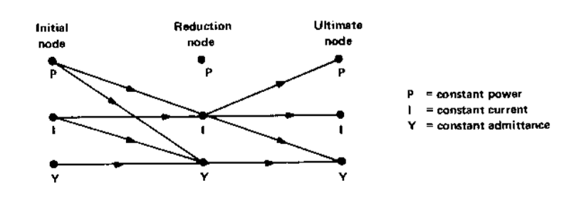
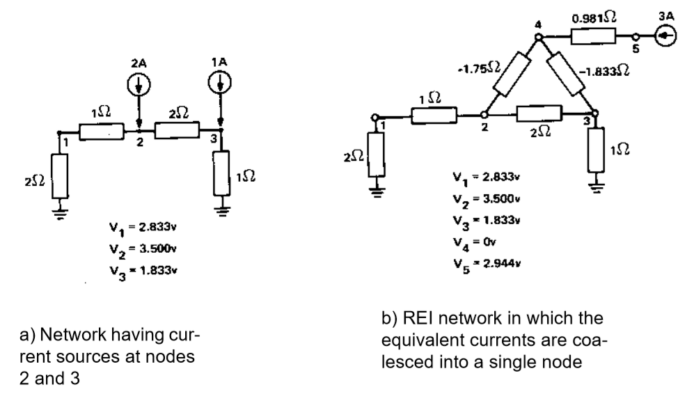
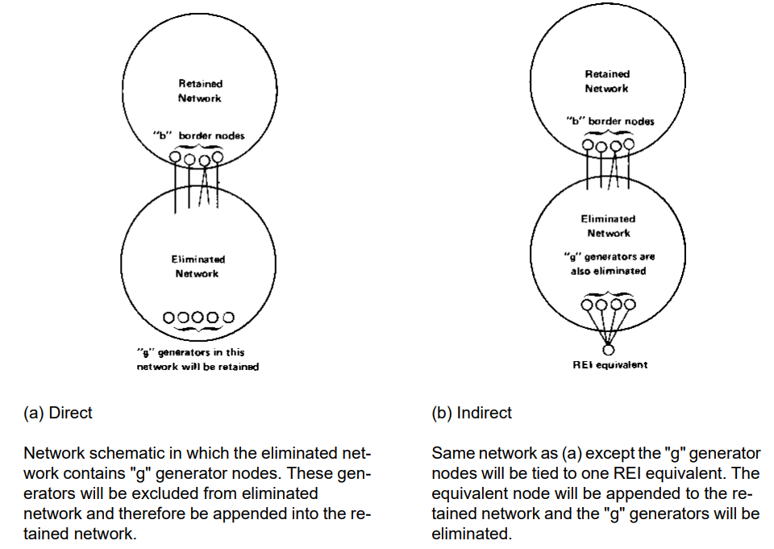
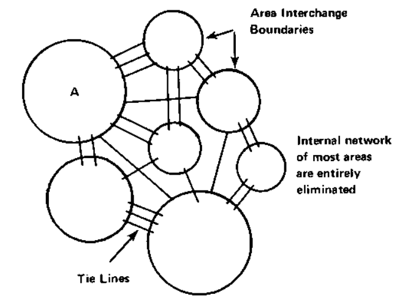
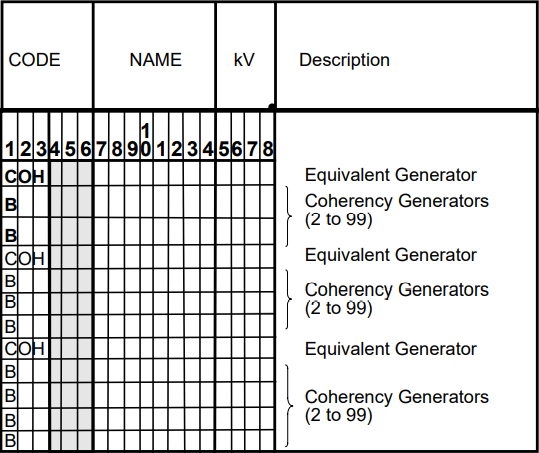

.. _network-reduction:

*****************
Network Reduction
*****************
This section gives a detailed description of the network reduction method and solution options.

Method of Reduction
===================
This program reduces a large sparse network into a smaller equivalent network by Gaussian decomposition. The original network is linearized about the operating point and is expressed by the current equation:

.. math::
  :label: eq_1

  \begin{bmatrix} I_1 \\ I_2 \end{bmatrix} = \begin{bmatrix} Y_{11} & Y_{12} \\ Y_{21} & Y_{22} \end{bmatrix} \begin{bmatrix} V_1 \\ V_2 \end{bmatrix}

where: :math:`I_1` is the complex current net injection matrix, :math:`Y` the complex nodal admittance matrix, and :math:`V` the complex nodal voltage matrix. The subscripts 1 and 2 pertain to the eliminated and retained portions of the network, respectively. For simplicity, the matrix is reordered as shown. We may separate the partitioned matrix equations in :eq:`eq_1`.

.. math::
  :label: eq_2

  \begin{bmatrix} I_1 \end{bmatrix} = \begin{bmatrix} Y_{11} \end{bmatrix} \begin{bmatrix} V_1 \end{bmatrix} + \begin{bmatrix} Y_{12} \end{bmatrix} \begin{bmatrix} V_2 \end{bmatrix} \\

.. math::
  :label: eq_3

  \begin{bmatrix} I_2 \end{bmatrix} = \begin{bmatrix} Y_{21} \end{bmatrix} \begin{bmatrix} V_1 \end{bmatrix} + \begin{bmatrix} Y_{22} \end{bmatrix} \begin{bmatrix} V_2 \end{bmatrix}

We may solve for :math:`\begin{bmatrix} V_1 \end{bmatrix}` from :eq:`eq_2`.

.. math::

  \begin{bmatrix} V_1 \end{bmatrix} = \begin{bmatrix} Y_{11} \end{bmatrix}^{-1} \begin{bmatrix} V_1 \end{bmatrix} + \begin{bmatrix} Y_{22} \end{bmatrix} \begin{bmatrix} V_2 \end{bmatrix}

and then substitute the expression into :eq:`eq_3`.

.. math::

  \begin{bmatrix} I_2 \end{bmatrix} = \begin{bmatrix} V_{21} \end{bmatrix} \begin{bmatrix} \begin{bmatrix} \begin{bmatrix} Y_{11} \end{bmatrix}^{-1} \begin{bmatrix} I_1 \end{bmatrix} - \begin{bmatrix} Y_{11} \end{bmatrix}^{-1} \begin{bmatrix} Y_{12} \end{bmatrix} \begin{bmatrix} V_2 \end{bmatrix} \end{bmatrix} \end{bmatrix} + \begin{bmatrix} Y_{22} \end{bmatrix} \begin{bmatrix} V_2 \end{bmatrix}

Rearranging terms, we have

.. math::

  \begin{bmatrix} I_2 \end{bmatrix} - \begin{bmatrix} Y_{21} \end{bmatrix}^{-1} \begin{bmatrix} I_{1} \end{bmatrix} = \begin{bmatrix} \begin{bmatrix} Y_{22} \end{bmatrix} - \begin{bmatrix} Y_{21} \end{bmatrix} \begin{bmatrix} Y_{11} \end{bmatrix}^{-1} \begin{bmatrix} Y_{12} \end{bmatrix} \end{bmatrix} \begin{bmatrix} V_2 \end{bmatrix}

or

.. math::
  :label: eq_4

  \begin{bmatrix} I_2 \end{bmatrix}eq = \begin{bmatrix} Y_{22} \end{bmatrix}eq \begin{bmatrix} V_2 \end{bmatrix}

where:

.. math::
  :label: eq_5

  \begin{bmatrix} I_2 \end{bmatrix}eq = \begin{bmatrix} I_2 \end{bmatrix} - \begin{bmatrix} Y_{21} \end{bmatrix} \begin{bmatrix} Y_{11} \end{bmatrix}^{-1} \begin{bmatrix} I_1 \end{bmatrix}

.. math::
  :label: eq_6

  \begin{bmatrix} Y_{22} \end{bmatrix}eq = \begin{bmatrix} Y_{22} \end{bmatrix} - \begin{bmatrix} Y_{21} \end{bmatrix} \begin{bmatrix} Y_{11} \end{bmatrix}^{-1} \begin{bmatrix} Y_{12} \end{bmatrix}

The matrix operations in :eq:`eq_5` and :eq:`eq_6` have the following interpretation:

Equivalent injection = original injection + distributed injection 

Equivalent admittance = Original admittance + distributed admittance + equivalent branches

Equations :eq:`eq_5` and :eq:`eq_6` have interesting topological interpretations. Some notation is necessary so the following definitions apply:

  Envelope node 
  
    A retained node with at least one adjacent node in the eliminated system.
  
  Internal node 
    
    A retained node with all adjacent nodes in the retained network.
  
  Equivalent branch 
    
    A fictitious branch between two envelope nodes which effectively represents the reduced network as seen from those nodes.

Inherent in the reduction is the connectedness of the network and the preserved identity of the current equations. An eliminated node is connected (not necessarily directly) to several envelope nodes. Any injected current on that node becomes branch current in the eliminated system. After deducting losses, it finally reaches the envelope nodes and is reconverted into an equivalent injection. The distribution of eliminated injections is determined by the admittance of the eliminated system. By superposition, the injections from all eliminated nodes are distributed to the envelope nodes. This reflects the second term on the right side of equation :eq:`eq_5`. This does not imply, however, that the equivalent injections are identical to the branch currents and could also be obtained by arbitrary cutting of the network. The reasons will be explained in examples to follow.

The equivalent branches introduced between the envelope nodes after reduction reflect the admittance seen from the envelope nodes and into the eliminated network and finally to other envelope nodes. It is similar to the delta branches introduced in a wye-delta conversion. The value of the equivalent branches is found in the second term in the right side of equation :eq:`eq_6`.

The branch data is originally submitted in the form of equivalent pi's which are used to construct the nodal admittance matrix Y. In general, the reverse process is not unique. The figure below illustrates the form of the equivalent pi-branches obtained.

.. figure:: ../img/Equivalent_Pi-Branches.png

  Equivalent Pi-Branches

In the figure below, a nine-node network is reduced. The distributed injections and equivalent branches introduced are emphasized.

.. figure:: ../img/Network_Reduction.png

  Network Reduction

Three options are available for disposal of the generation and load of eliminated nodes:

  1. Generation and load assumed constant current.
  2. Generation assumed constant current, load assumed constant admittance.
  3. Generation and load assumed constant admittance

These options are illustrated by the examples in the figure below. For simplicity, losses are ignored and a DC model is used.

.. figure:: ../img/Eliminated_Node_Generation_and_Load_Disposal.png

  Eliminated Node Generation and Load Disposal

In all examples, the equivalent branch flow represents the sum of three components:

  1. The power looping into the eliminated system and back out to the retained system.
  2. The flow of generation within the retained system through an envelope node to the distributed loads of the equivalent system.
  3. The flow of distributed generation on the envelope nodes to loads within the retained system.

The difference between network reduction and network cutting is seen in component 1 above. This component is found by assuming all generations and loads within the eliminated system are identically zero. Thus, in equation :eq:`eq_5`, :math:`I_1 = 0` and

.. math::
  :label: eq_7

  \begin{bmatrix} I_2 \end{bmatrix}eq = \begin{bmatrix} I_2 \end{bmatrix}

The branch flow in this case is strictly due to the differences of voltages between envelope nodes, i. e., looping. This is the important distinction between reduction and cutting.

Description of Reduction
========================
The nodal admittance matrix is retrieved from the base file and selective elimination is performed first upon all eliminated nodes and then partially upon the retained nodes.

A complete pass merges the data from the reduced current matrix and the reduced admittance matrix with the system data from the base file. Eliminated data is purged and equivalent branches and distributed injections are added to the data. Concurrent with this pass, a simple injection check is performed on the envelope nodes. The net injection of the nodes is compared with the original values. Any mismatches are errors and will be flagged.

Special consideration is given to the distributed shunt admittances. The envelope nodes which receive these admittances may be subtype ``Q``. In such a case, this portion of the shunt admittance is not adjustable for voltage control. To accomplish this, a special continuation bus subtype, ``+A``, was created, to which all distributed injections and shunt admittances are added. In the power flow output listings, this portion of the admittance is flagged "EQUIVALENT" to confer distinction over other adjustable susceptances.

Upon completion of the reduction, all equivalent branches and injections are added to the system data and all data in the eliminated system is permanently deleted. A new base case is created, updated, and must be solved. Thus, a ``/SOLUTION`` and ``/NEW_BASE`` command must follow any network reduction. If desired, subsequent changes could be applied.

An example setup for doing a network reduction with ``bpf`` is shown in :ref:`reduction-case-exmaple`.

The program is written such that the method of determining the base case is irrelevant to the options that may be performed. Once a base case is defined and solved, any of the options for a base case may be exercised. Thus, further network reduction could be performed upon the already reduced system. Proper position of the appropriate control cards give the user complete flexibility.

Program Control Options
=======================
There are seven options that the user may exercise; they are all specified by qualifiers within the ``/REDUCTION`` command set.

  1. Admittance cutoff (``MIN_EQUIV_Y``).
  2. Disposition of injections (elimination mode: ``ELIM_MODE``, final mode: ``ULT_MODE``).
  3. Retain generators by "REI" scheme (``REI_CLUSTERS``, ``ELIM_MODE``).
  4. Retain area interchange nodes (``KEEP_AI_SYSTEM``).
  5. Retain all generators (``RETAIN_GEN``).
  6. Optimal network determination (``OPTIMAL_REDU``)
  7. Minimum generator cutoff for "REI" equivalent (``ELIM_MODE``).

These options are discussed in the following paragraphs.

Admittance Cutoff
-----------------
Assume that the retained network has n nodes in which m (m < n) nodes define the envelope. Assume furthermore that there is a path from any envelope node into the eliminated network and back to any other envelope node. Then, inherent in the reduction, there will result an equivalent branch between any pair of envelope nodes. The total equivalent branches added will be

.. math::

  \frac{m(m-1)}{2}

This total can become large. Many equivalent branches added between the most relatively remote pair of envelope nodes will have a branch impedance excessively large and presumed negligible. The admittance cutoff is a parameter that the user may choose in eliminating these branches from the generated reduced system data. It is defined as

  Admittance Cuttoff = :math:`\abs{\frac{1}{R + jX equivalent}}`

For example, the value 0.001 will exclude all equivalent branches with an equivalent impedance of 1000 p.u. ohms or more.

Disposition of Injections
-------------------------
The disposition of injections of eliminated nodes has, in all, 12 different combinations of options. Each combination is unique with its inherent advantages and disadvantages.

The injections are divided into three parts: (1) generation, (2) load, and (3) shunt admittance. Each of these injections has two modes of disposition during reduction and three additional modes ultimately. The transition of a single injection is shown in below.

  Injection Disposition of Eliminated Nodes

Reduction Mode
--------------
The two possible modes of disposition during reduction are constant current and constant admittance. A summary of each option with its inherent characteristics follows:

Generation:

  * *Constant current* has improved convergence characteristics; retains identity as generation.
  * *Constant admittance* appears as fictitious negative impedance; has major effect on passive equivalent network.

Load:

  * *Constant current* retains identity of load
  * *Constant admittance* has slightly better convergence characteristics; has major effect on passive equivalent network.

Shunt admittance:

  * *Constant current* avoids negative impedances in the equivalent network.
  * *Constant admittance* preserves the identity of the passive network.

Ultimate Mode
-------------
After equation :eq:`eq_6` has been solved for :math:`I_2 eq` and :math:`Y_{22} eq`, the question arises: How should the separate components of :math:`I_2 eq` be disposed to their ultimate state?

From Figure 5-4 we have three options to dispose :math:`I`; namely :math:`P`, :math:`I`, or :math:`Y`. A summary of each is described below.

Generation and load:

  * *Constant power* is typical and preserves the identity of generation or load.
  * *Constant current* is preferred and has superior convergence characteristics.
  * *Constant admittance* is the least preferred and has poor accuracy.

Shunt admittance:

  * *Constant power* is atypical and is available for compatibility only.
  * *Constant current* is the same as constant power.
  * *Constant admittance* is preferred and is most realistic to a passive network.

Summary
-------
The recommended disposition is therefore summarized in the table below.

.. table:: Disposition of Components

  ================ ============== ===============
  Quantity         Reduction Mode Ultimate Mode
  ================ ============== ===============
  Generation       I              I
  Load             I              I
  Shunt Admittance Y              Y
  ================ ============== ===============

REI Equivalent
==============
One disadvantage inherent in reduction involves the properties of eliminated generators. The power injections are converted into current injections using the steady-state solution voltages. Every eliminated generator therefore becomes identical to a bus with fixed real and reactive injection, but without fixed voltages typical of ``BQ`` nodes with reactive inequality constraints. Consequently, the eliminated system loses its voltage regulation capacity. System changes near the border nodes of reduced equivalent systems often converge to voltage profiles quite different from the full system. The obvious remedy is to reinstate these generators or, alternately, to preserve their regulating characteristics.

The normal option of retaining generators has been unsatisfactory. A network having 1600 nodes that is reduced to a system of 600 nodes may also include about 200 retained generators and an extremely disproportionate number of equivalent branches. The reduced equivalent system is typically about 75 percent of the size of the full network and nearly defeats any merits gained in reduction.

The "REI" equivalent is an innovative alternate to preserving eliminated generators directly. The initials mean Radial Equivalent Independent. It is a simple scheme in which several eliminated generators are connected to a common ground node having zero voltage but isolated from the ground of the rest of the system. This ground node is then tied directly to an equivalent generator. The branch admittance from the ground node to all the generators and to the equivalent node are determined such that no real or reactive power is gained or lost. A simple resistive network as shown in the fibure below demonstrates the procedure.

  Example of Network and Its REI Equivalent

The example above has moved the current injections at nodes 2 and 3 in (a) back to an equivalent 
node 5, which has 3A injection. The current flowing from 4 to 2 is 2A; from 4 to 3 is 1A. The
power loss in the branches is

.. math::

  P = I_{42}^2 R_{42} + I_{43}^2 R_{43} + I_{54}^2 R_{54}
  
  = 2^2(-1.75) + 1^2(-1.833) + 3^2(0.981) = 0 watts

This zero power loss is deliberate. It is termed the zero power balance. Introduction of the REI system has not changed the total system losses.

Although this example demonstrates the procedure involved, it does not illustrate the merits in preserving sparsity. Only in large networks does this become apparent. Consider the network in the figure below.

  Direct and Indirect Generator Preservation in Eliminated Network

The letter "b" in the figure above is the number of border nodes in the network. The letter "g" is the number
of generators in the eliminated network. If they are saved directly and the rest of the network is
eliminated, the number of equivalent branches is at worst.

.. math::

  N_{br} = \frac{g(g - 1)}{2} + gb + \frac{b(b - 1)}{2}

However, if an REI equivalent is obtained instead, :math:`g = 1`` and

.. math::

  N'_{br} = b + \frac{b(b - 1)}{2}

Typical numerical values are :math:`g = 10`, "math:`b = 15`. Then :math:`N_{br} = 225`` and :math:`N'_{br} = 120`.
This is nearly a 50 percent reduction in the number of equivalent branches.

REI Clusters
============
In the figure of the previous example, all of the border nodes will be normally fully interconnected. The total number of
branches is easily computed by b(b-1)/2 where b is the number of border nodes. If b is large, say
50, then 50*49/2 = 1225 equivalent branches will result during this elimination. (The same number
would occur without the REI equivalents.) However, if the area interchange system is retained, the
eliminated system becomes clustered with a dramatic reduction in the number of equivalent
branches.

  Small System Network (Areas and Tie Lines Shown)

A typical equivalent of the figure above might normally retain area A in full detail, and would include
all the tie line nodes and area slack buses of the remaining system. The rest of the system is 
replaced with an equivalent. This area interchange system permits the eliminated system to be 
assigned clusters (a minimum of one cluster per area). Each cluster is assigned an "REI" equivalent
generator to replace all the eliminated generators.

Defining clusters does not decrease the number of eliminated generators nor decrease the number
of border nodes. However, it isolates the interconnections from one REI equivalent to another. For
example, suppose that the previous example was split into two clusters defined with the following
bus counts:

.. math::

  = 5 g_2 = 5 g_1 + g_2 = 1
  
  = 7 b_2 = 8 b_1 + b_2 = 1

  N_{br}' = (b_1 + \frac{b_1(b_1 - 1)}{2})  + b_2 + (\frac{b_2(b_2 - 1)}{2}) = 64

Comparing this with the previous example of 10 generators and 15 border nodes, this is nearly a
50 percent reduction in the number of equivalent branches from the REI equivalent without clusters.

Coherency Clusters
==================
In some applications, the generators equivalenced by the area interchange clustering may not be
the desired grouping. Specifically, if the reduced network is to be used with a transient stability
program, the coherent groups may be determined by other factors such as size or voltage level. In
this application, the coherent groups can be specified individually by additional data as shown in
the figure below. The data may either supplement or complement the normal REI clustering.

The set of data cards illustrated in the figure above follow immediately the control card ``SAVE_BUSES``
or after the last bus following the control cards ``INCLUDE_BUSES`` or ``EXCLUDE_BUSES``.
The name of the equivalent generator (coherent equivalent) must be unique; i. e., it cannot be any
bus already in the system. The names of the coalesced generators may be any bus already defined
in the network. It may be eliminated or retained (in which case elimination will become mandatory).
 It may also be already assigned to another REI equivalent cluster. Any errors encountered will
be described with diagnostics and the program will exit.

Using REI Equivalents
=====================
The ``ELIM_MODE`` command requests REI equivalencing of eliminated generators. An additional
parameter specifies the minimum PGEN for a bus to be normally coalesced. Larger values of
PGEN will exclude the smaller generators from being coalesced. Care should be exercised when
requesting coalesced generators, since table overflow will occur if more than 99 generators are 
coalesced into a single equivalent.

The equivalent generators are made type BQ with a scheduled voltage computed for zero power
balance. Names such as “EQUIV 1” are program generated and pertain to the clusters in which they
reside. However, if "COH" data is submitted, the generator names are as specified in the data. The
zone of an equivalent generator is randomly selected to be any zone of one of the coalesced 
generator.

Optimal Network Determination
=============================
When not using the REI equivalent, the number of equivalent branches may become excessively
large and compromise any advantages obtained by network reduction, unless the retained network
is judiciously chosen. If the optimal feature is selected using the ``OPTIMAL_REDU`` command, the
retained network specified by the input data will be interpreted as the "minimum" retained system.
Nodes selected for actual elimination will contribute to a definite reduction in system size. Thus,
the optimal feature will expand the retained system if necessary to minimize the network size.

``REDUCTION`` Command
=====================
This control card requests a network reduction to be performed on the base case or change case that
has been defined. It generates an unsolved, reduced equivalent base case. Other commands must
eventually follow to obtain the new solution and any desired outputs. However, system data could
follow the ``/REDUCTION`` to update the reduced case.

The reduced system is composed of internal and enveloping retained nodes. The internal nodes 
undergo no change during the reduction. The enveloping nodes are those which have branches into
the reduced system. However, these branches are replaced with equivalent branches connected to
other enveloping nodes which simulate the reduced system. In addition, any nodal injection is 
distributed to the enveloping nodes in the form of continuation bus data.

All distributed injections and equivalent branches are flagged with the ownership code ``***``. This
emphasizes their fictitious nature; however, they are valid system data and should be treated as
such.
