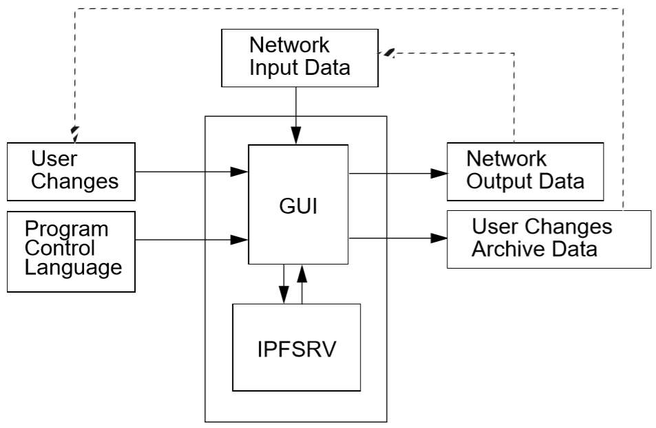
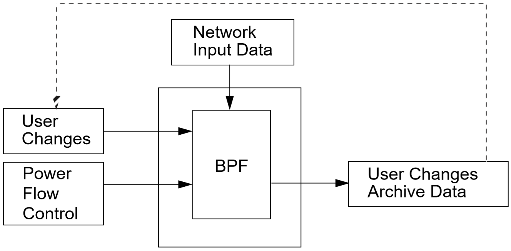

********
Overivew
********
Users may choose to interact with IPF through the command line tools (``bpf``, ``ipfbat``, ``ipfcut``, etc.), the ``libcflow`` C API, or through the `Motif X Window`_ GUI. Many of the functions and features of the command line tools are available through specially designed GUI features. The GUI simplifies creating network data, running the base case solutions, and graphically visualizing the network diagrams but is rather dated and in need of a refresh. For this reason, many users will likely prefer the command line tools.

Executables
===========
IPF can be thought of as a family of programs. ``bpf`` is the batch form of the powerflow program. When the editing and displaying of buses and branches is being handled by ``gui``, the work of calculating solution voltages for a given power system network is done by ``ipfsrv``, which is just the ``bpf`` batch program in a different guise. Auxiliary programs allow you to do plots in batch mode, do a save of network data in batch mode, perform a "cut" of a solved base case, etc. Each of the executables are briefly described below. 

  ``bpf``
   
    The updated version of the old BPA batch Power Flow program. It executes using the commands from an "old style" Power Flow Control (PFC) script file. Example of use: ``bpf test.pfc.`` The PFC commands (.pfc) used with ``bpf`` are scripts for a complete power flow run. The :ref:`power-flow-control` section describes the commands available.

  ``ipfcut``
  
    The stand-alone program that cuts out a subsystem from a solved base case file. Flows at the cut branches are converted into equivalent generation or load on specially formatted +A continuation bus records. An ensuing power flow run should solve with internal branch flows and bus voltages which are identical to those quantities in the original base case. Documentation is in :ref:`ipfcut`. Several methods are available to define the cut system: bus names, zones, base kVs, and individual branches.A pi-back feature replaces selected buses with a passive-node sequence (lines consisting of sections) with the original loads pi-backed in proportion to the line admittances.

  ``ipfplot``
   
    Batch plotting program to produce printed maps. The program accepts a coordinate file and a base case file on the command line, as well as an optional second base case file. When the second base case file is specified, a difference plot is produced. You can also use ``ipfplot`` to produce bubble diagrams. The same coordinate files are used for both ``gui`` and ``ipfplot``, but not all capabilities are available in GUI. Documentation is in :ref:`ipf-network-diagrams`.

  ``tsp``
  
    The transient stability program that models power system network distrubances and affects on power system dynamnics include key data points like generator rotor angle. This tool can be used to evaluate short term (seconds/minutes) affects of these disturbances.

  ``ipfnet``
  
    The batch version of the "save netdata file" function built into the ``gui``/``ipfsrv``. This program generates a WSCC-formatted network data file in any of the following dialects: BPA, WSCC, or PTI. "Dialects" means that the file is still WSCC, but the data is generated with special processing or restrictions and is destined for use with other programs. In the case of the PTI dialect, that data is preprocessed by the PTI-proprietary conversion program WSCFOR. Documentation is in :ref:`ipfnet`.

  ``gui``
  
    Launches the push button and menu-driven Graphical User Interface program built with `Motif X Window`_ that works in conjunction with the power flow server, ``ipfsrv``.

  ``ipfsrv``
  
    The power flow server to the GUI. It executes power flow commands through Power Flow Control Language (PCL) scripts dispatched from the GUI.

  ``ipfbat``
   
    The batch version of ``ipfsrv``. It accepts a "new style" Power Flow Control Language (PCL) script file. Plotting can be done with a control file; however, for most plots ``ipfplot`` is easier to use. Example of use: ``ipfbat test.pcl``. The "new style" PCL commands used with ``ipfsrv`` and ``ipfbat`` (pseudo standard of .pcl) are described in :ref:`powerflow-command-language`.

  ``ipf_reports``

    Creates customized output reports and summaries. Enter ``ipf_reports`` from the command line and follow the prompts.
  
  ``ips2ipf``
  
    The program that converts a network data file from IPS to IPF. Duplicate buses are renamed; LTC steps are converted to taps, shunt susceptance on slack and ``BQ`` buses are transferred to +A records; sectionalized lines containing a section 0 are renumbered 1, 2, . . . ; ``BX``, ``X``, and remote controlled bus data are converted to IPF format, etc. Documentation is in :ref:`ips-ipf-differences`.

IPF Interaction Model
=====================
The conceptual model of IPF is quite simple. You load power system network data into IPF; the IPF solution "engine" performs the calculations for the solution, and then outputs this solution data.

IPF offers two different approaches to accomplish power system solutions. Their style of interaction and processing are quite different.

 * The Graphical User Interface (``gui``) approach. This is command oriented – you click a button or enter a command, and it is executed immediately.
 * The batch power flow (``bpf``) approach. This is an Input-Process-Output approach. You write a command file containing all of the "orders" that you want filled, and the program performs the actions it determines are necessary to produce the ordered results.

Two Domain Specific Languages (DSLs) called  Powerflow Command Language (PCL) and Power Flow Control (PFC) allow users to define the "orders". PCL is directly available through a Command Dialog in the GUI. PFC is used with the ``bpf`` program. See :ref:`power-flow-control` for details on the syntax for PFC and :ref:`powerflow-command-language`.

 .. note::

  The PFC syntax was developed first and later BPA added the PCL syntax. They referred to PCL as the "new style", and the PFC as the "old style". These two sets of commands are not completely compatible even though the "new style" command set and syntax is closely modeled on the "old style."

The ``gui`` Approach
--------------------
When you use the ``gui`` approach, you use a graphical interface with dialog boxes, menus, windows, etc. This makes data input, output, and manipulation easy. In addition to allowing basic case solution tasks to be accomplished, certain specialized tasks such as line impedance calculations are available. However, for more involved tasks, you need to use the ``bpf`` approach. For information about how to work with the GUI dialog boxes, menus, windows, etc., see :ref:`x-window-graphical-interface`. This guide also has a tutorial to show you how to solve straightforward power system cases.

   PCL Information Flow Model

The core powerflow program can be ran on separate machine from the graphical user interface. These two halves of the IPF program are joined by interprocess communication (IPC) routines that shuttle data and instruction messages back and forth between the GUI and powerflow program. The powerflow program serves primarily as a solution and database engine that sends and receives data when requested by the user through the GUI. Note that all of this commuication is basic socket communication so it likely doesn't work if GUI runs on one platform (Windows) and powerflow programs run on another (Linux).

The ``ipfbat`` Approach
-----------------------
``ipfbat`` allows you fine control over the database and solution "engine" (``ipfsrv``). You first create a PCL file with the appropriate commands, in the right order, to accomplish the solution task at hand. At runtime these commands are interpreted by ``ipfbat``. The PCL file commands are processed sequentially. Additional PCL command files may be specified by name, so that a "chain" of PCL files may be processed in one run.

The ``bpf`` Approach
--------------------
When you use ``bpf``, you must first create a PFC file with the appropriate commands to accomplish the solution task at hand. At runtime these commands are accepted by BPF and executed according to a logical processing order determined by the program. Hence you need not be concerned with the ordering of commands in your PFC file. Input commands will be processed first, and a solution done automatically before any output is produced. Finally, a new base file will be created, if you have requested one. See :ref:`pfc-examples` for examples of PFC files.

   BPF Information Flow Model

Network Data
============
Network Data defines the structure and properties of the power system network. This data is defined in files that contain bus and branch records. Most of the input files are ASCII text files. But one important file, the base case file, is in binary format. You can, of course, edit ASCII text files with any text editor. This is often done, but your data integrity is safer if you do all the editing you can in the GUI. The base case binary file cannot be edited with an ordinary text editor, but can in effect be edited via the GUI when you have a base case file loaded.

The following is a list of the various network data input files with descriptions. Additional information about the important PFC, ``NETWORK_DATA``, and ``NEW_BASE`` files is found under individual headings below.

``.pfc``

  This input file contains job control information for the ``bpf`` program. This file may contain a ``NETWORK_DATA`` file explicitly, but more often includes a name reference to an appropriate ``NETWORK_DATA`` file, ``OLD_BASE`` file, or other job control data to be described.
  You can edit this file using any ASCII text editor to add, modify, and delete commands and data records.

``NETWORK_DATA`` 

  This ASCII text input file contains a series of records of bus and branch data. It must not contain modification records.
  
  This file can be maintained by using an ASCII text editor. Or you can edit the records you want in the GUI through the various dialog boxes and then save a new ``NETWORK_DATA`` file. In the file, data records may be in random order, but actual processing is done in the following order:
  
   1. ``A`` and ``I`` records (area interchange)
   2. ``B``, ``+``, and ``X`` records (bus)
   3. ``L``, ``R``, ``E``, and ``T`` records (branch).

``BRANCH_DATA``
  
  This ASCII text input file contains the branch database of all branches coded with in-service date and out-of-service date. This file is searched for branches in service on the date requested. BPF selects the appropriate branches.

``NEW_BASE``

  This program-generated, binary output file contains complete base network data and steady-state operating values for the case being processed. This file is identical in format to the ``OLD_BASE`` file. ``NEW_BASE`` simply designates the file when it is produced as the output from a recently concluded case study.

``OLD_BASE`` 

  This program-generated, binary input file contains complete base network data and steady-state operating values. This file is identical in format to the ``NEW_BASE`` file. ``OLD_BASE`` simply designates the file when it functions as an already existing input file.

``CHANGE`` 

  This ASCII text input file contains changes (new and modification records) to the data input from any combination of ``NETWORK_DATA``, ``BRANCH_DATA``, and ``OLD_BASE`` files making up the case to be studied. These change records change the input data for the base case.

``Printout File`` 

  This is an ASCII text output file that contains bus, branch, and solution data from a completed case study and is intended for ordinary, paper hardcopy output.

``Microfiche file`` 

  This is a special format output file that contains bus, branch, and solution data from a completed case study and is intended for microfiche format.

.. table:: IPF Input/Output Files

   ========================== ====== ============================ =============== ======= =================================
   File                       Format Input/Output (I/O)           Created by      Editing Information Contained
   ========================== ====== ============================ =============== ======= =================================
   PFC                        ASCII  ``bpf`` (I)                  User            Yes     Bus, Branch, Commands, File Names
   PCL                        ASCII  ``gui``, ``ipbat`` (I)       User            Yes     Commands, File Names
   NETWORK_DATA               ASCII  ``bpf`` (I) GUI,IPFBAT (I/O) User gui ipfnet Yes     Bus, Branch
   BRANCH_DATA                ASCII  Input Only                   User            Yes     Branch
   OLD_BASE                   Binary Input Only                   IPF             No      Bus, Branch, Solution Values
   CHANGES                    ASCII  Input or Output              User ``gui``    Yes     Bus, Branch, Modifications
   NEW_BASE                   Binary Output Only                  IPF             No      Bus, Branch, Solution Values
   Printout file (<name>.PFO)  ASCII  Output Only                  ``bpf``         No      Input Data and Solution Reports, User Analysis
   Microfiche file (<name>.PFF) ASCII  Output Only                  ``bpf``         No      Input Data and Solution Reports, User Analysis
   Debug file (<name>.PFD)     ASCII  Output Only                  ``bpf``         No      Solution arrays and iteration processing
   Printout file (<logon>.PFO) ASCII  Output Only                  ``gui``         No      Messages, Iteration Summary
   Debug file (<logon>.PFD)    ASCII  Output Only                  ``gui``         No      Solution arrays and iteration processing
   ========================== ====== ============================ =============== ======= =================================

The NETWORK_DATA File
=====================
This ASCII text data file consists of area, bus, and branch records in the format used by the Western Systems Coordinating Council (WSCC) back in the 1990s. However, note that IPF supports many record types which are not recognized by IPS, and in some cases the interpretation and application of the data values entered is different. See :ref:`ips-ipf-differences` for a list of IPS-IPF differences. This file must not contain modification records, only new data.

 1. Area interchange records.
   
   Each area record identifies a composition of zones whose member (associated) buses define specific aggregate quantities that may be controlled to specified export values.

   ``A`` (Area interchange records)

   ``I`` (Area intertie records)

 2. Bus data record group containing at least two records.
   
   Each bus data record identifies one bus in the network. Buses are uniquely identified by their bus name and base kV.
   
   ``B`` (Bus records) 

   ``+`` (Continuation bus records)

   ``X`` (Continuation bus records)

   ``Q`` (PQ Curve data records)

 3. Branch data record group containing at least one record.

  ``L`` (AC or DC Transmission line records)

  ``E`` (Equivalent Branch records) 

  ``T`` (Transformer records) 

  ``R`` (Regulators (Automatic or LTC transformer) records)

Branch data entered in any of the ASCII files is *single-entry* or one-way only. This means, for example, that a branch connecting buses A and B has a user-submitted entry (A,B) or (B,A) but not both. The program transposes the record internally as required during execution. Normally which way the branch is entered does not matter, but it does affect the default end metered on a tie line, and the physical position of line sections. See :ref:`record-formats`, for a discussion of this feature.

Branches are uniquely identified by three fields:

 * Their terminal bus names and base kVs.
 * Their circuit or parallel ID code.
 * Their section code.

The BASE (.bse) File
====================
This file, designated ``OLD_BASE`` if you are loading it, or ``NEW_BASE`` if you are saving it, is binary in format and contains the following data:
 
 * The case identification, project ID, and two header records.
 * The date the case was generated.
 * The program version used to generate the file (so future program versions can read the file if file structures change).
 * Up to 100 comment records.

.. _Motif X Window: https://motif.ics.com/motif/downloads