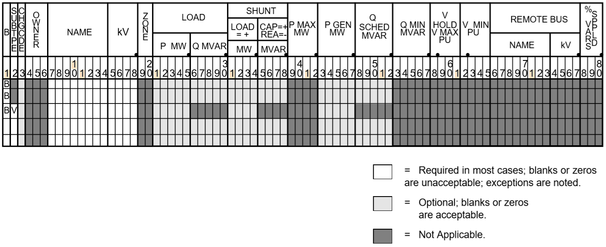
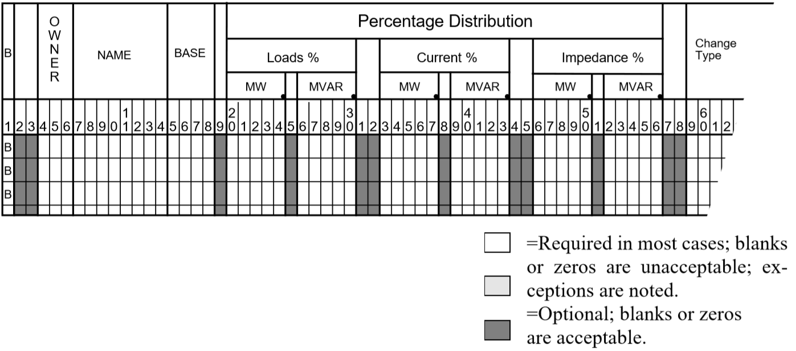
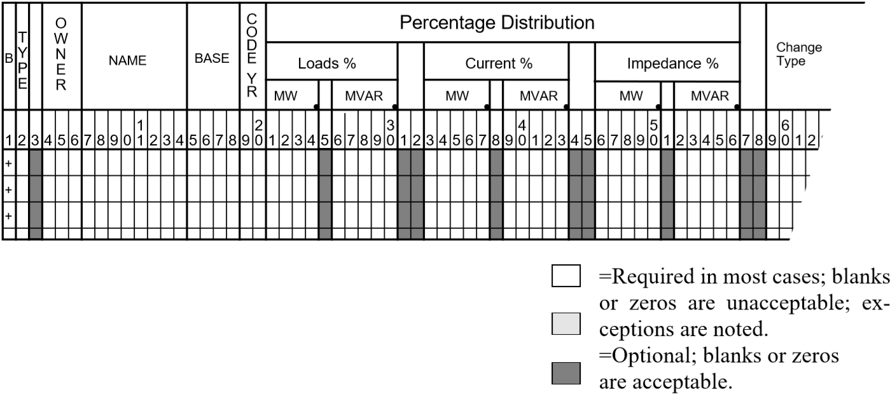
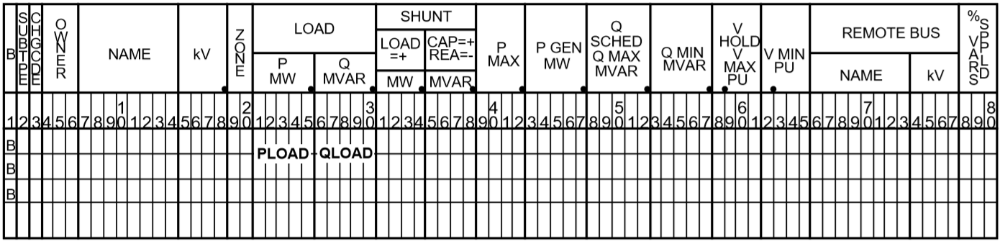
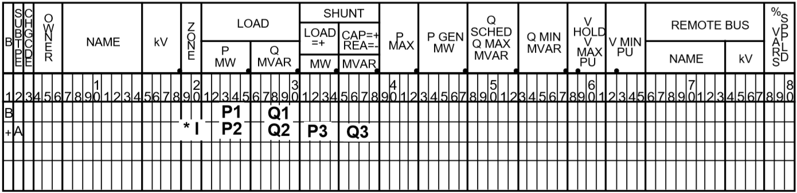
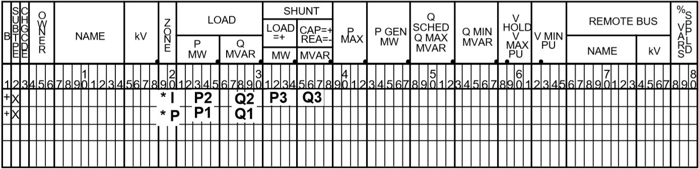
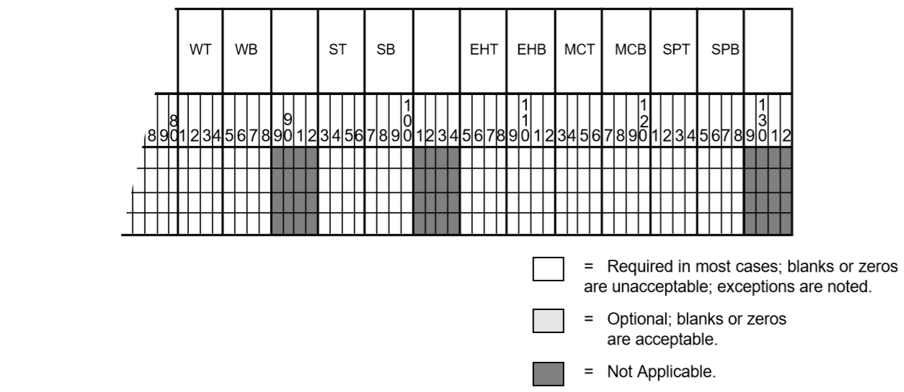
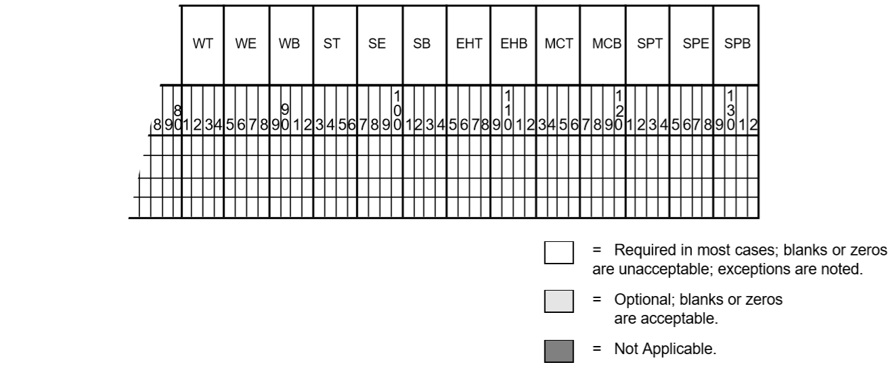
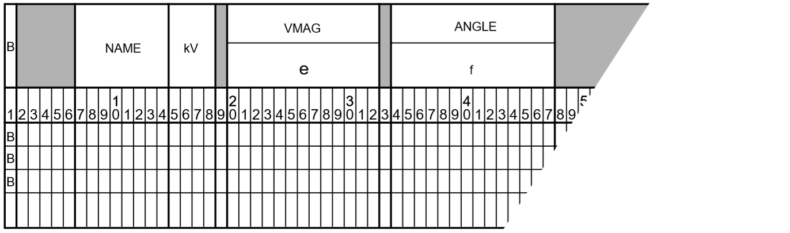
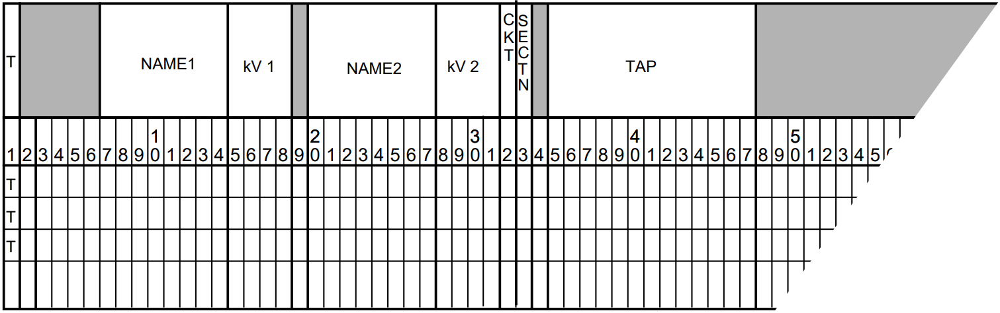

.. _power-flow-control:

************************
Power Flow Control (PFC)
************************

Overview
========
This section describes the batch Power Flow Control (PFC) language and its syntax, commands and subcommands. Command entries follow the PFC description in alphabetical order. The table below helps you turn quickly to a specific command entry. The table also gives you a quick description of all of the commands.

Each command entry explains the meaning of the command and gives its syntax. Some commands have subcommands, which are also described. Many entries have additional discussion, and some have examples, particularly where a command's usage may not be immediately obvious.

The ``bpf`` Control Language
============================
The ``bpf`` Power Flow Control language (PFC) consists of a sequence of program control statements, each of which in turn consists of commands, subcommands, keywords, and values. All statements have a reserved symbol in column 1 to identify a command or subcommand.

Every statement is scanned, and each command or subcommand found is compared with a dictionary in the program to find the relevant instructions. With the exception of the identifier in column 1 of each statement, PFC is free-form. All statements must be in the PFC file.

PFC has three levels of control, which are identified by one of three identifiers in column one.

1. The left parenthesis ``(`` identifies the top (or process) level of control. Only four commands are valid here — ``(POWERFLOW``, ``(NEXTCASE``, and ``(STOP`` or ``(END``.
2. The slash `/` identifies the second (or command) level of control. Many commands are valid here, and they are listed and described in this chapter. Commands generally enable or disable output options, define parameters needed for the process, etc. Subprocesses are major operations involving considerable processing and additional data. Only optional IPF processes are requested with these commands.
3. The right angle bracket ``>`` identifies the third (or subcommand) level of control. A few commands have subcommands associated with them. These subcommands are described in the associated command entries. These subcommands act as qualifiers for the second-level commands. 

In addition to the foregoing syntactic units, a command enabling a microfiche option is available. Its control symbol is the left square bracket (``[``)

 .. figure:: ../img/Hierarchical_Levels_of_PFC_Statements.png

  Hierarchical Levels of PFC Statements

Almost every PFC statement fits one of the following formats, and the few that do not are very similar.

.. note::

   Spaces can be used for readability. Commas are used to separate syntactic units such as a list of values or keyword/value assignments.
   
Most statements fit on one line, but some extend over multiple lines. These exceptions are noted. When used, put a hyphen (``-``) where you want to break and continue the command parameters starting in or after column 2 of the next line, column 1 must be blank.

Each general format is followed by an example.
 
 * A simple command with no keywords or values:

   .. code::

     / command
     / REDUCTION

 * A command assigned a simple keyword. (This is a “telescoped” syntax available for some commands.)

   .. code::
 
     / command = keyword 
     / AI_CONTROL = CON

 * A command followed by a comma with a keyword. (This is a “telescoped” syntax available for some commands.)

   .. code::

     / command , keyword 
     / F_INPUTLIST,NONE

 * A command followed by a comma with a value assigned to a keyword.

   .. code::

     / command , keyword = value 
     / P_ANALYSIS_RPT, LEVEL = 4

 * A command followed by a comma with multiple values assigned to a keyword. Note optional continuation with hyphen (``-``).

   .. code::

     / command , keyword = value , value , value ,... 
     / P_INPUT_LIST, ZONES=NA,NB,NC,ND,NE,NF, -
              NG,NH,NI,NJ,NK

 * A command followed by a comma with multiple value/keyword assignments.

   .. code::

     / command , keyword = value , keyword = value ,... 
     / MERGE_OLD_BASE, SUB_SYSTEM_ID = AREA-1, OLD_BASE = TESTDC.BAS
 
 * A command followed by a data record(s).

   .. code::

     / command data record 
     / NETWORK_DATA 
     B     GEN1 HI    230  2  -0.0  -0.0  0.0 0.0      -0.0 -0.0 -0.0 
     B     GEN2 HI    230  1  -0.0  -0.0  0.0 0.0      -0.0 -0.0 -0.0 
     B     GEN3 HI    230  2  -0.0  -0.0  0.0 0.0      -0.0 -0.0 -0.0
  
 * A subcommand followed by a comma with multiple comma-separated values.

   .. code::

     >subcommand, value, value, value ,... 
     >SAVE_ZONES,NA,NB,NC,ND,NE,NF,NG,NH,NI,NJ,NR

 * A subcommand followed by a data record on the next line.

   .. code::

     >subcommand
     data record 
     >SAVE_AREAS
     A AREA 2

Special Characters
==================
Two special characters are available to document the control stream or to improve readability.

 * A period (``.``) in column 1 of a record identifies a command comment and the record will be ignored by the processing. It is used to document a PFC file or to improve readability. This comment is only visible in a listing of the PFC file or in the editor used to create it. 
 * The underscore symbol ``_`` has no syntactic significance and may be used freely to punctuate a word for visual readability.
 
.. note::

  The hyphen or minus sign "-" and the underscore "_" symbol are different characters! Thus, ``P_O_W_E_R_F_L_O_W`` is the same as ``POWER_FLOW`` which is the equivalent of ``POWERFLOW``. ``OLD_BASE`` is the same as ``OLDBASE`` but not the same as ``OLD-BASE``, etc.

Default Convention
==================
All default values for a command are listed on the first line in the command descriptions. Various keywords are listed below the default values. Default values have been selected to satisfy a majority of users; therefore, their use is to invoke exceptions to standard conventions. Once a default value has been enabled, it remains in force for the duration of the process. There is one exception to this:

  ``/ P_INPUT_LIST``

After the first case has been processed, ``P_INPUT_LIST`` is set to ``NONE``. This conforms to the default philosophy of selecting all options that fulfill a majority of requirements.

Microfiche Control Statement
============================

.. code::

  ``[ FICHE,COPIES = n ]``
  ``( FICHE,COPIES = n )``

This command requests "n" copies of microfiche listings to be made. If it is omitted, the fiche file is not saved. If ""n" is zero or omitted, no copies are made. When it is used, this control must be first in the job stream.

Level 1 PFC Commands
====================

``( POWERFLOW )``

  This command initiates the processing of the network which is defined with subsequent commands and subcommands.

``( NEXTCASE )``

  This is the same as ``( POWERFLOW )`` except that the base network to be processed is the current network. Changes are expected; otherwise, the same network is processed again with the same data and controls in memory from the previous case. ``( NEXT_CASE )`` cannot be the first command in a program control file.

``( END )`` or ``( STOP )``

  This stops the execution of the IPF program. 
  
Each network is processed with a ``( POWERFLOW )`` or ``( NEXTCASE )`` command. The first must always be ``( POWERFLOW )``. Several cases may be concatenated (stacked) in the following format:

.. code::

    ``( POWERFLOW )`` statement for case 1
    ``( POWERFLOW )`` statement or ``( NEXTCASE )`` statement for case 2
    .
    .
    .
    ``( POWERFLOW )`` statement or ``( NEXTCASE )`` statement for case n
    ``( STOP )``

The following control statement and the optional keywords that go with it identify the ``OLD_BASE`` file, optionally perform miscellaneous temporary changes to ``OLDBASE``, set solution parameters, and solve the resultant network. 

.. code::

  (POWERFLOW CASEID = <casename>, PROJECT = <projname>)

``casename`` is a user-assigned 10-character identification for the case. ``projname`` is a user-assigned, 20-character identification for the project or study to which this case applies. (No blanks are allowed; use hyphens instead.) 

The following statement is used if the Powerflow solution is to be run starting with data and controls from the previous base case in residence.

.. code::

  ( NEXTCASE, CASEID = <casename>, PROJECT = <projname> )

Note that ``/ OLD_BASE`` is not used with a ``( NEXTCASE )`` statement since a base data file is already in residence.

Level 2 and 3 PFC Commands
==========================
Each Level 2 statement starts with a slash (``/``) in the first position.

After the slash are keywords and/or values separated by a comma (``,``). Specific values are assigned to the keywords in the following format:

  ``keyword = value``

When a keyword is requesting a list, for example, a zone list, the list may be continued on the next record by leaving column 1 of that record blank or by putting a comma in column 1 and continuing the list.

Level 3 statements consist of subcommands that specify keyword values for second-level commands only. Each subcommand for level 3 statements starts with the right angle bracket (``>``) in column 1. After the right angle bracket are keywords and/or values separated by commas (``,``). Most often, specific values are assigned by following a keyword with an equal sign (``=``) and then the desired value.

PFC Commands
============
The rest of this chapter discusses all the PFC commands, in alphabetical order. Each command entry includes the details of syntax and usage. The more involved commands show examples of use. Refer to the table below to locate a PFC command quickly.

In the format statement for each command, the keywords and parameter values are all vertically aligned in the same column. The top row is the default value. Alternate value assignments such as ``ON`` or ``OFF`` are identified by the appropriate symbols and have the syntax ``keyword=value``.

Required text is shown in ``UPPER-CASE`` while parameter values specified by the user are printed in ``lower-case`` and usually enclosed by angle brackets, thus, ``<list>``. Angle brackets are omitted when they may cause confusion with the Level 3 control symbol.

The optional underscore symbol (``_``) may be used to break up words for visual readability. The computer will read the words as though they were not broken.

.. table:: PFC Commands

  ======================= ===============================
  Command Name            Description
  ======================= ===============================
  AGC                     Emulates automatic generation control.
  AI_LIST                 Specifies detail in area interchange listing.
  ANALYSIS_SELECT         Selects analysis reports for printing or microfiche.
  BRANCH_DATA             Specifies a master branch and bus data file for base case.
  BUS_SENSITIVITIES       Calculates system response to capacitor switching operations.
  CHANGE_BUS_TYPE         Disables voltage control in system.
  CHANGE_PARAMETERS       Perturbs parameters for start of new solution.
  CHANGES                 Specifies system data change records.
  COMMENT                 Specifies comment records.
  COMMON_MODE_ANALYSIS    Analyzes the results from a series of common mode cases in the format of the OUTAGE_SIMULATION
  F_ANALYSIS_RPT          Specifies report of zones or owners for microfiche.
  F_INPUT_LIST            Lists input data on microfiche.
  F_OUTPUT_LIST           Lists output data on microfiche.
  GEN_DROP                Balances generation drop by picking up generation.
  HEADER                  Specifies header information for reports.
  INCLUDE_CONTROL         Specifies a file for control commands.
  LINE_EFF                Defines minimum percent line loading for report.
  LINE_SENSITIVITIES      Determines line sensitivity by controlling LTC and AI_CONTROL.
  %LOAD_DISTRIBUTION      Converts constant power, etc., into user-specified MVA, etc.
  LOSS_SENSITIVITIES      Gives information about system losses.
  MERGE_OLD_BASE and      MERGE_NEW_BASE Extracts information from two subsystems to create a new system.
  MVA_BASE                Changes base MVA to an assigned MVA.
  NETWORK_DATA            Specifies bus and branch data.
  NEW_BASE                Defines the file name for a new case.
  OI_LIST                 Lists ownership interchange.
  OLD_BASE                Specifies a previously existing solved case as the new case to start with.
  OUTAGE_SIMULATION       Simulates line outages, load dropping, generator outages and rescheduling.
  OVERLOAD_RPT            Specifies overload parameter limits for report.
  P_ANALYSIS_RPT          Creates an analysis report.
  P_INPUT_LIST            Lists input data on paper.
  P_OUTPUT_LIST           Lists output on paper.
  REBUILD                 Rebuilds all data tables from current OLDBASE file.
  REDUCTION               Reduces a network.
  RPT_SORT                Sorts output data of solved network.
  SAVE_FILE               Creates various output files, including the SIF (Stability Interface File).
  SOLUTION                Enables solution options and post-solution processes.
  SORT_ANALYSIS           Controls sort order for analysis listings.
  TRACE                   Monitors data to aid data verification.
  TRANSFER_SENSITIVITIES  Causes analysis of transfer sensitivities.
  TX_EFF                  Compares total and core transformer losses.
  USER_ANALYSIS           Generates custom analysis listings
  ======================= ===============================

AGC
===
This command emulates automatic generation control (AGC) in the solution algorithm. Under AGC, real power excursions on several generators from base values are allocated in proportion to their total excursion. This in effect distributes the slack bus real power excursions to a set of selected units. The slack bus excursion, which drives AGC, may be either a system slack bus or an area slack bus.

The individual AGC units are identified with type ``B`` (bus) records which follow the ``/ AGC`` command. columns (1:18) correspond with the original format. Beyond column 18, data is free field.

.. code::

  B  <bus_name,base kV>  Pmin=<##>, Pmax=<##>, Pgen=<##>, %=<##>

where

  ``Pmin`` Minimum generation in MW. Default value is 0.0.

  ``Pmax`` Maximum generation in MW. Default is Pmax, which is specified on the bus record.
 
  ``Pgen`` Base generation is MW, which is used to compute the excursions. Default is scheduled or actual MW from the base case.

  ``%``  Percentage. The default allocates% in proportion to Pmax

A maximum of 24 AGC units may be specified. One of the units must be a system or area slack bus. Usually, AGC schemes converge faster than non-AGC. The exception occurs when ``Pmin`` or ``Pmax`` limits are hit and some readjustment occurs.

General Description
-------------------
An example illustrates the concept. In Case 1, there are two generators, GEN1 and GEN2, with initial and final values shown in the table below.

.. table:: Values Without AGC
  
  ============ ========= ======= ===========
  Bus          Initial P Final P Excursion
  ============ ========= ======= ===========
  GEN1 (slack) 1000      1442    442
  GEN2         1000      1000    0
  TOTAL        2000      2442    442
  ============ ========= ======= ===========

In Case 2, we apply AGC with 50% on each machine. Presuming that losses are unchanged (for simplicity), the initial and final values are shown in the table below.

.. table:: Values With AGC
  
  ============ ========= === ======= ===========
  Bus          Initial P %   Final P Excursion
  ============ ========= === ======= ===========
  GEN1 (slack) 1000      50  1221    221
  GEN2         1000      50  1221    221
  TOTAL        2000      100 2442    442
  ============ ========= === ======= ===========

**Notes and Restrictions**
A maximum of 24 generators are permitted. One of the generators must be a system slack bus or an area interchange bus. Recall that the dynamics which drive AGC comes from slack bus P excursions.

If any unit hits a limit, the remaining active units redistribute their percentages and continue AGC control.

The results are summarized in the listing ``AGC Control``. This listing is controlled with ``/ ANALYSIS_SELECT`` command.::

  / ANALYSIS_SELECT
  > SUM%VAR

If area interchange control is ON, all AGC units should reside in the same area. Violations of this rule are flagged with warning diagnostics.
AGC control will obscure the change in slack bus power shown in the tie line Summary of Area Interchange. The true slack bus effects within the area would be the aggregate effects of all AGC units. The area interchange summary obscures this effect.

When ``/ AGC``’s and ``/ GEN_DROP`` coexist, ``/ AGC`` operates with a higher priority. In actuality, the two should not coexist.

The validity of AGC can be verified in the analysis summary ``AGC Control``. In normal conditions, the scheduled and actual percentage participation should be equal.
If these quantities are not equal, it is usually because ``Pmax`` or ``Pmin`` limits have been hit. In this instance, a comment appears.

  ``Actual % / Sched % = ****.*``

All of the active units should have an individual ratio

AI_LIST
=======
This command controls the level of detail in the area interchange listing.::

  / AI_LIST = FULL

``FULL`` is the default. The options are:

  ``FULL`` Area interchange matrix, Area slack bus summary, and tie line flows.
  
  ``MATRIX`` Area interchange matrix.
  
  ``TIELINE`` Tie line flow summary

ANALYSIS_SELECT
===============
This selects individual analysis reports for printing or microfiche. It supersedes ``/ F_ANALYSIS`` and ``/ P_ANALYSIS``. Unlike these commands which select groups of reports according to their “level” the ``/ ANALYSIS_SELECT`` command selects reports individually.

A solitary ``/ ANALYSIS_SELECT`` command defaults all analysis listings to no print/no fiche status.

Printing and/or microfiche are enabled with the commands: ``> FICHE`` and ``> PAPER``. These commands independently restrict the contents of ``FICHE`` or ``PAPER`` reports to subsets of Zones, Ownerships or Areas.

The desired analysis reports are individually selected using ``>`` commands containing abbreviated report names, e.g., ``> UNSCH``.

Each ``> (report)`` command accepts an optional ``F`` or ``P`` qualifier. This will restrict the selected report to Fiche or Print respectively. If neither appear, both ``F`` and ``P`` are presumed to be selected. For example, ``> UNSCH, P`` will print the unscheduled reactive report.

A special option exists on the ``> LINEFF`` report. Its entirety is::

 > LINEFF, SORT = BUS_NAME, OUTPUT=filename, FIELD_WIDTH =  132,F,P
                                                             80,F,P 
 >                VOLTAGE,
                  OWNER,
                  ZONE

All quantities are optional.

  ``SORT`` Controls sorting by bus kV_name, owner_name, or zone name.

  ``OUTPUT`` Copies a duplicate report to the named file.

  ``FIELD_WIDTH`` Controls the report width or the named file.

The following is a full list of the ``/ ANALYSIS_SELECT`` command set.::

  / ANALYSIS_SELECT 
  > FICHE,ZONES=<zone1,...>,AREAS=<area1,...>,OWNERS=<owner1,...> 
  > PAPER,ZONES=<zone1,...>,AREAS=<area1,...>,OWNERS=<owner1,...> 
  > USERAN - User-defined analysis listing. (Used with / USER_ANALYSIS.) 
  > UNSCH - Buses With Unscheduled Reactive. 
  > LOSSOWN - Total System Generations and Loads by Owner. 
  > SYSTEMZONE - System Generations,Loads,Losses and Shunts by Zones. 
  > UVOV - Undervoltage-Overvoltage Buses. 
  > LINELOAD - Transmission Lines Loaded Above xxx.x% of Ratings or with more than 30 degrees of electrical angle.
  > TRANLOAD - Transformers Loaded Above xxx.x% of Ratings.
  > TRANEX - Transformers Excited Above xxx.x% over Tap.
  > XSYSTEMLOSS - Transmission System Losses.
  > BPALOADS - BPA Industrial Loads.
  > DCSYSTEM - DC System.
  > SHUNTSUM - Shunt Reactive Summary.
  > SUMLTC - Summary of LTC Transformers. - Summary of LTC Reactive Utilization
  > SUMPHASE - Summary of Phase-shifters.
  > SUM%VAR - Summary of %Var-controlled buses. - Summary of AGC Control - Summary of Line Drop Compensation
  > SUMBX - Summary of Type BX buses. > SUMRAN - Summary of Adjustable Var compensation.
  > SERIESCOMP - Transmission Lines Containing Series Compensation.
  > BUS - Bus Quantities. > SPIN - Spinning Reserves.
  > LINEEFF - Transmission Line Efficiency Analysis. (Lines Loaded  Above xxx.x % of Nominal Ratings).
  > TRANEFF - Transformer Efficiency Analysis. - Total Losses Above xx.xx % of Nominal Ratings.
  > TRANLOSS - Transformer Efficiency Analysis - Core Losses Above xx.xx % of Nominal Ratings.

BRANCH_DATA
===========

::

  / BRANCH_DATA, FILE = <filespec>, DATE = <myy>,                
                 BUSDATA_FILE = * 
                               <filespec>

This command specifies that the base case will be established from a master branch data file and associated bus data file. Branch data selected from this file will have an energization date (date in) and a de-energization date (date out) corresponding with the ``DATE`` specified on the above command.

If ``BUSDATA_FILE`` is not specified or has parameter value ``*``, the program expects bus data to follow in the input stream.

See ``MERGE_OLD_BASE`` and ``MERGE_NEW_BASE`` for more information about branch data file merging. Using the ``MERGE_OLD_BASE`` and ``MERGE_NEW_BASE`` commands is preferred.

BUS_SENSITIVITIES
=================

  ``/ BUS_SENSITIVITIES``

The primary motive of sensitivity is to calculate the instantaneous system response to sudden capacitor switching operations. This is difficult to model in the Powerflow because all LTCs must be turned off. This may cause solution divergence because LTCs are an integral part of any DC system. This problem is circumvented using sensitivities.

By recalculating the Jacobian matrix, various constraints can be changed. The flexibility of these constraints is evident in the format of the sensitivity command.::

  / BUS_SENSITIVITIES,LTC=ON,AI_CONTROL=CON,Q_SHUNT=ADJ,Q_GEN=ADJ
                          OFF,          OFF         FIXED     FIXED
                                        MON

The top line defines the default values.

The first two options correspond with the standard solution options. The second two options define the conditions in which type ``BQ`` and ``BG`` buses can operate holding constant voltage.

For example, enabling the option ``Q_SHUNT = FIXED``, type ``BQ`` buses have all shunt fixed. If there is no rotating machinery (:math:`Q_{max}` and :math:`Q_{min}` are zero), then the bus holds constant :math:`Q` (:math:`PQ`). Since type ``BG`` buses always have ``Q_shunt`` fixed, this option has no affect on generator buses.

Similarly, by enabling the option ``Q_GEN = FIXED``, type ``BQ`` and ``BG`` buses have all generation fixed and operate in state :math:`PQ`. Type ``BG`` buses will operate in state :math:`PQ`. If ``BQ`` buses have no shunt, they also will operate in state :math:`PQ`.

In order of time response, the generators respond within several seconds. Thus, ``Q_GEN`` will normally be adjustable. LTC’s, DC LTC’s, and switched capacitors are controlled by time-delayed voltage relays to minimize spurious operation.

  LTC’s 0.5 - 3.0 minutes

  DC LTC’s 5 seconds

  CAP/REACTORS:5 - 30 seconds

The slowest component is area interchange control. Its response time is 0.5 to 10 minutes.

By appropriate selection of options, the Jacobian matrix can represent nearly any time frame of response.

Selected Buses
--------------
Following the ``BUS_SENSITIVITIES`` record, individual buses are selected for perturbation. These buses are identified by the ``B`` formatted records that follow them. A maximum of 50 buses may be specified.

The perturbed quantity is identified by nonzero entities in one of the fields: ``P_load``, ``Q_load``, ``G_shunt``, ``B_shunt``, ``P_generation`` or ``Q_generation``.

The fields on the ``B``-blank record determine which sensitivity :math:`\frac{dP}{d\theta}`, :math:`\frac{dP}{dV}`, or :math:`\frac{dQ}{dV}` is computed.

  B-blank Record Sensitivity Fields

.. table:: Field Values for Sensitivities

  ========================== ============ =================== =====================
  Sensitivity                Column 2     PLOAD, PSHUNT, PGEN QLOAD, QSHUNT, QSCHED
  ========================== ============ =================== =====================
  :math:`\frac{dP}{d\theta}` Not required Required            Not required
  :math:`\frac{dP}{dV}`      Literal: “V” Required            Not required
  :math:`\frac{dQ}{dV}`      Not required Not required        Required 
  :math:`\frac{dQ}{dV}` *    (blank)      (blank)             (blank)
  ========================== ============ =================== =====================

\* This is the default.

Repeat Sensitivities
--------------------
A powerful feature of the sensitivity process is the ability to refactor the Jacobian matrix under different control schemes. For example, one ``/ BUS_SENSITIVITIES`` record could enable only the ``Q_GEN`` option (exciters on, everything else off) for an instantaneous response. Following the necessary ``B`` formatted records a second ``/ BUS_SENSITIVITIES`` record could enable all options for a long term response. Assuming the same bus list is repeated, then a comparison between the two corresponding sensitivities would yield the short-term and long-term effects of the bus’s injection perturbation.

Example
-------
The following is an actual case. Bus ``OLYMPIA 230`` was specified for a -172 MVAR shunt application. If ``Q_Load`` or ``Q_Generator`` was specified, the actual ``Q_Perturbation`` would be -172 MVAR. For ``Q_Shunt``, the ``Q_Perturbation`` is calculated.::

  Delta (Q)= Q_Shunt * V**2
  = -172 * (1.067)**2
  = -195.82 MVAR
  New_Voltage (kV) = Old_Voltage (kV) + Sensitivity * Delta_Q 
  = 245.45 kV + 0.0334 * (-195.82) 
  = 245.45 kV - 6.54 kV 
  = 238.91 kV

The correct computed value on the listing is 238.90 kV. The different figures in the example are due to round off.

The correlation with actual Powerflow cases is very close. The calculated voltage excursion -6.54 kV is within two percent of the actual excursion. The accuracy is significant because the actual and estimated voltages will differ 0.001 per unit at most!

Sample Deck Setup
-----------------

::
  
  (POWERFLOW,...) 
  .
  .
  .
  / CHANGES
  .
  .
  .
  / BUS_SENSITIVITIES,LTC=ON,AI_CON=OFF,Q_SHUNT=ADJ,Q_GEN=ADJ
  B    MONROE   500       316

Output

::

 BUS_SENSITIVITIES COMPUTED WITH THE FOLLOWING CONTROLS:

                 LTC CONTROL              ( )   OFF
                 --- -------              (X)   ON (FULL CONTROL     )
                                          ( )   ON (NO VOLTAGE CONTROL)

                 AI CONTROL               (X)   OFF
                 -- -------               ( )   CONTROL (DEFAULT)
                                          ( )   MONITOR

                 Q_SHUNT CONTROL          (X)   ADJUSTABLE
                 ------- -------          ( )   FIXED

                 Q_GENERATION CONTROL     (X)   ADJUSTABLE
                 ------------ -------     ( )   FIXED

  0 MONROE    500.0 A  316.0 MVAR CHANGE IN SHUNT AT THIS BUS WILL CAUSE THE FOLLOWING VOLTAGE CHANGES

  0       BUS       BASE    BUS       BASE    ----- DVOLT/DQ  -----   ------ BASE VOLTAGE -------    ------ NEW VOLTAGE ------
                                              (P.U./P.U.)   (KV/MVAR) (P.U. KV)             (KV)     (P.U.KV)            (KV)
          MV-SVC    19.6                      -0.0106     -0.0023        1.118             21.92      1.081             21.10        
          MONROE   500.0                       0.0061      0.0321        1.052            525.84      1.073            537.05        
          WRK 25    25.2                       0.0040      0.0010        1.041             26.22      1.054             26.59        
          MONROE   230.0                       0.0039      0.0092        1.037            238.54      1.051            241.77        
          GDK 4      4.0                       0.0039      0.0002        1.049              4.20      1.063              4.25        
          MONROE T 230.0                       0.0038      0.0090        1.035            237.98      1.048            241.12        
          RIM 12    12.6                       0.0037      0.0005        1.041             13.11      1.054             13.29        
          RYL 12    12.6                       0.0037      0.0005        0.996             12.55      1.009             12.71        
          WRK 60B2  60.0                       0.0037      0.0023        1.020             61.17      1.033             61.97        
          WRK 60B1  60.0                       0.0037      0.0023        1.020             61.22      1.033             62.01

CHANGE_BUS_TYPE
===============

  ``/ CHANGE_BUS_TYPE``

This command disables voltage control in selected areas of the system and performs bus type changes from a voltage control type to a more passive type. The changes it makes are permanent and apply to the case in residence. If this command appears before any system changes, the bus type changes will apply before the system changes, exempting any new or changed buses. If this command appears after any system changes, any new or changed buses will be subject to bus type changes invoked with this command.

An example is shown below.

::

  / CHANGE_BUS_TYPE, BQ=B,  BG=BQ, BT=B , BX=B , -
                     LTC = OFF, -
                     AREAS=<area_1,...>, -
                     ZONES=<zone_1,...>, -
                     LIST=ON

Bus type changes
----------------
Four types of buses may be changed: ``BQ``, ``BG``, ``BT`` and ``BX``. All possible bus type transitions are depicted above using the format ``<old_type> = <new_type>``.

The full repertoire is listed in the table below. (Note that some restrictions apply.)

.. table:: Bus Type Changes

  ========== ==================================
  Change     Restriction
  ========== ==================================
  BQ --> B   If PGEN = 0.0 and QGEN =0.0
  BQ --> BF  If PGEN <= 0.0.
  BQ --> BF* Unconditional.
  BG --> BQ  If PGEN > 0.0.
  BG --> B   If PGEN <= 0.0.
  BG --> BF  If PGEN = 0.0.
  BG --> BF* Unconditional.
  BT --> B   (This deletes any adjacent LTCs which are controlling BT nodes.)
  BX --> B
  BX --> BF
  BX --> BF*
  ========== ==================================

LTC Transformer Control
-----------------------
A bus type change BT=B will delete LTCs only if the controlled bus is type ``BT``. A more general option:

  ``LTC = OFF``

disables all LTCs within the specified area except for any dc commutating transformers.

LIST
----
The ``LIST`` parameter accepts two values -- ``ON`` and ``OFF``. The default is ``ON``. This applies to the ``CHANGE_BUS_TYPE`` summary where the initial and final state of each bus affected is depicted. Setting ``LIST=OFF`` is recommended for repetitious batch runs.

Excluded Buses
--------------
Means are available to exempt individual buses from type changes defined in the ``/ CHANGE_BUS_TYPE`` command. These buses are excluded with the following command::

  >EXCLUDE_BUS 
  B          name     base 
  B          name     base
  . . . 
  . . .

Line Drop Compensation
----------------------
This feature temporarily replaces the ordinary ``BG`` -> ``BC`` voltage control of a remote bus with a ``BG`` control of a compensated voltage, which is specified as a percentage within the step up transformer. This control scheme is valid only for this case, and may be introduced only within context of a ``CHANGE_BUS_TYPE`` command. In subsequent cases, these generators revert to their normal control mode

The target compensated voltage is defined with a computed voltage limit. That limit is derived from two base case terminal voltages -- the ``BG`` bus and the remote ``BC`` bus (the remote bus may be another type). The formula used is

.. math:: 

  V_{max} = V_{min} = PCT * V^{base}_{BG} + (1 - PCT) * V^{base}_{BC}

Example::

  / CHANGE_BUS_TYPE, BQ = B, BX = B, BG = BQ 
  ... 
  > LINE_DROP_COMPENSATION 
  BG COULEE 13.8, 70% 
  BG CHIEF JO13.8, 80%

**Restrictions on Line Drop Compensation**
The following restrictions apply to line drop compensation:

  * All buses selected for Line Drop Compensation must be type ``BG``. All buses selected are exempt from any bus type change ``BG`` -> ``BQ`` or ``BG`` -> ``B``.
  * The controlled remote bus must be immediately adjacent to the generator.
  * The specified percentage should be between 0 and 100%. A warning is issued if the specified percentage is outside this range.
  * A maximum of 20 generators may be selected for line drop compensation.
  * The line drop compensation is case specific. It defines the base solution, but is not saved on the base history data file.

Reactive Compensation
---------------------
This feature is similar to Line Drop Compensation; it temporarily replaces the ordinary ``BG`` -> ``BC`` voltage control of a remote bus with a ``BG`` control of a compensated voltage, which is specified as the voltage drop from the bus terminal voltage computed with the generator reactive power in series with a user-specified impedance. This control scheme is valid only for this case, and may be introduced only within context of a ``CHANGE_BUS_TYPE`` command. In subsequent cases, these generators revert to their normal control mode

The target compensated voltage is defined with a computed voltage limit. That limit is derived from two base case terminal voltages -- the ``BG`` bus and the remote ``BC`` bus (the remote bus may be another type). The formula used is

.. math::

  V_{max} = V_{min} = V^{base}_{BG} - \frac{Q_{BG}}{V_{BG}} * X_{BC} \\
  X_{c} = \frac{PCT}{100} * \frac{100}{MVA_{base}}

where :math:`PCT` is the user-specified percentage and :math:`MVA_{base}` is the user-specified machine MVA.

Example::

  / CHANGE_BUS_TYPE, BQ = B, BX = B, BG = BQ 
  ... 
  > REACTIVE_COMPENSATION 
  BG COULEE  13.8, 5%, 100
  BG CHIEF JO13.8, 5%, 100

**Restrictions on Reactive Compensation**
The following restrictions apply to reactive compensation are identical to those which apply to line drop compensation:
 
  * All buses selected for Reactive Compensation must be type ``BG``. All buses selected are exempt from any bus type change ``BG`` -> ``BQ`` or ``BG`` => ``B``.
  * The controlled remote bus must be immediately adjacent to the generator.
  * The specified percentage is typically in the range 5-6%. It may be negative if the voltage is internal to the machine.
  * A maximum of 20 generators may be selected for reactive compensation.
  * The reactive compensation is case specific. It defines the base solution, but is not saved on the base history data file.

**Output Reports**
A special summary of all line drop compensation buses is listed in the analysis group under the title Summary of Line Drop Compensation. It is available either as a level 4 option on the ``/P_ANALYSIS`` or ``/F_ANALYSIS`` command or as the SUM%VAR option on the ``/ANALYSIS_SELECT`` command.

::

  /ANALYSIS_SELECT
  SUM%VAR

Example
-------
An example is shown below.::

  ( POWERFLOW, ...) 
  ...
  ...
  ...
  / CHANGES, ...
  ...
  ...
  ... 
  / CHANGE_BUS_TYPE, BG=BQ, BT=B ,BX=B, -
                      LTC = OFF, -
                      AREAS = NORTHWEST, LIST=OFF 
  / CHANGE _BUS_TYPES,BQ=B,BX=B,BG=BQ,LTC=OFF,AREAS=NORTHWEST,BC-HYDRO
  >EXCLUDE_BUSES
  B    CENTRALA20.0
  B    BONN PH213.8
  B    BONNVIL213.8
  B    DALLES 313.8
  B    DALLES2113.8
  B    DALLES2213.8
  / SOLUTION
  ( END )

In this example, the disabling of remote voltage control is restricted to area ``NORTHWEST``. Within this area, all ``BG`` generators are permanently changed to type ``BQ``; all LTCs are disabled; and all ``BX`` buses are frozen to their discrete value.

CHANGE_PARAMETERS
=================

::

  / CHANGE_PARAMETERS, BUS=<name, base>,V=<set_value>,Q=?
                                        VX=<set_value>,QY=?
                                        Q=<set_value>,V=? 
                                        QY=<set_value>,QV=?
                                        P=<set_value>,V=?
                                        P=<set_value>,V=?
  > BX = LOCKED
  B OSTRNDER 500
  B MALIN 500

or

::

  / CHANGE_PARAMETERS,  BUS=<name, base),V=?, -
            %LOAD_CHANGE,%PY=<##>, %QX=<##,  -
                 %PX=<##>, %QY=<##, -
            ZONES=NA, NB, ..., -
            OWNERS=BPA, PSP, ...,  -
            AREAS=NORTHWEST

or

::

  / CHANGE_PARAMETERS,  BUS=<name, base),V=?, -
             %GEN_CHANGE,%PY=<##>, %QX=<##,  -
                %PX=<##>, %QY=<##, -
                ZONES=NA, NB, ..., -
                OWNERS=BPA, PSP, ..., -
                AREAS=NORTHWEST

.. note::

  This is one of the three commands which are order-dependent on the ``/SOLUTION`` command (the other two commands are ``LINE_SENSITIVITIES`` and ``LOSS_SENSITIVITIES``). Each of these must follow the ``/SOLUTION`` command.

The ``/CHANGE_PARAMETERS`` command perturbs a specified network parameter immediately after a successful solution, and initiates a new solution. The process continues until the last ``/CHANGE_PARAMETERS`` command has been read. All changed network parameters are permanent in the base case in residence. The output, analysis, and saved base case reflecting the final values of the parameters from the last change.

The ``/CHANGE_ANALYSIS`` feature is extremely useful to quickly and accurately generate a set of points for plotting Q-V and P-V curves. When used in conjunction with ``/USER_ANALYSIS``, the values of additional network quantities can be extracted during each ``/CHANGE_PARAMETERS``, enriching the scope of examination into the network.

The distribution VX, VY, etc., designates both the quantity and the axis on the X-Y data file. Default values (V, Q, etc.) are shown in Table 4-6.

BX = LOCKED
-----------
Type ``BX`` buses selected with this feature emulate the characteristics of mechanically switched shunt capacitors (MSC) controlled by a voltage relay. This voltage relay operates within a voltage deadband (:math:`V_{min}`, :math:`V_{max}`):

  1. If :math:`V_{min} < V < V_{max}`, then freeze present :math:`X_{shunt}` value.
  2. If :math:`V < V_{min}`, switch in additional capacitor steps or switch out connected reactor steps to raise the voltage, one step at a time.
  3. If :math:`V > V_{min}`, switch out connected capacitor steps or switch in additional reactor steps to lower the voltage, one step at a time.

For exposition, the feature is called BX Locking. In the absence of this feature, the normal operation is to switch :math:`X_{shunt}` one step per iteration to bias the bus voltage to :math:`V_{max}`.

Restrictions on BX Locking
--------------------------
The following restrictions apply to BX locking:

  * Only bus type ``BX`` buses may be selected for BX locking.
  * The feature is limited to a maximum of 10 BX locked buses.
  * This feature can be inserted after any ``/ CHANGE_PARAMETERS`` command. It defines *when* BX switching on selected ``BX`` buses becomes locked. Once defined, BX locking remains in effect for the duration of the study.
  * The voltage limits may be temporarily modified for BX locking. The new voltage limits are entered in columns (58:65) in the ordinary manner. These limits are temporary. After the solution, the original limits will be used for analysis reports.
  * The BX locking feature is not saved on any generated base case.

Bus Perturbation
----------------
Two forms of ``/ CHANGE_PARAMETERS`` are shown. The first form is bus perturbation. Three types of quantities may be perturbed:

  ``V = <set_value>`` Perturbs the Bus voltage magnitude (p.u.).

  ``P = <set_value>`` Perturbs the :math:`P_{gen}` (MW).

  ``Q = <set_value>`` Perturbs the :math:`Q_{gen}` (MVAR).

Restrictions
------------
V-perturbations are applied on V-constrained buses: ``BQ`` not at Q-limits, ``BE`` and ``BS`` types. If the bus type is unacceptable, it is automatically changed to a type ``BE`` and a warning diagnostic is issued.

Q-perturbations are applied on Q-constrained buses: ``B``, ``BC``, ``BT`` and ``BQ`` in state ``Q_min`` or ``Q_max``. If the bus type is unacceptable, it is automatically changed to a type ``B`` and a warning diagnostic is issued.

P-perturbation can only be applied on P-constrained buses: all types except ``BS``, ``BD``, ``BM``, and area slack buses.

Load Perturbation
-----------------
The second form of ``/ CHANGE_PARAMETERS`` is ``LOAD`` perturbation.   Either the ``P_load`` or the ``Q_load``, or both, may be perturbed a set percentage.

If no ``ZONES``, ``OWNERS``, or ``AREAS`` are specified, the percentage change applies to the entire system.

Note that the %P or %Q quantities in the output file correspond to the load that is changed. It may not be the total system load.

The inclusion of ``OWNERS`` with either ``ZONES`` or ``AREAS`` select candidates that are mutually inclusive.

Note that continuation records are accepted here.

For best results, the ``%LOAD_CHANGE`` option should be used in conjunction with ``GEN_DROP``. Otherwise, all increase in load is picked up by the area and system slack buses.

Generation Perturbation
-----------------------
The third form of ``/ CHANGE_PARAMETERS`` is GENERATION perturbation. Either the ``P_gen`` or the ``Q_gen``, or both, may be perturbed a set percentage.

If no ``ZONES``, ``OWNERS``, or ``AREAS`` are specified, the percentage change applies to the entire system.

Note that the %P or %Q quantities in the output file correspond to the generation that is changed. It may not be the total system generation.

The inclusion of ``OWNERS`` with either ``ZONES`` or ``AREAS`` select candidates that are mutually inclusive.

Note that continuation records are accepted here.

For best results, the ``%GEN_CHANGE`` option should be used in conjunction with ``GEN_DROP``. Otherwise, all increase in generation is compensated by the area and system slack buses.

Bus Monitored Quantities
------------------------
Two types of bus quantities can be monitored:

  ``V = ?`` Monitors the voltage magnitude.

  ``Q = ?`` Monitors the reactive allocation including short and unscheduled VARS.

Restrictions apply. ``V = ?`` pertains to a ``BE`` bus. ``Q=?`` pertains to a ``B`` bus. Warning diagnostics flag these conditions.

PLOT File
---------
Each ``/ CHANGE_PARAMETERS`` command generates an x,y plot point in a file with subtype ``.QVPT``.

The composition of these points is dependent upon the composition of the ``CHANGE_PARAMETERS`` command. The table below summarizes the output.

.. table:: CHANGE_PARAMETERS Values in .QVPT File

  ========= =============== ======= ========
  Set Point Monitored Point X Value Y Value
  ========= =============== ======= ========
  V=<##>    Q=?             Q       V 
  Q=<##>    V=?             Q       V 
  P=<##>    Q=?             Q       P
  P=<##>    V=?             P       V
  %P=<##>   V=?             P_Load  V
  %P=<##>   Q=?             P_Load  Q
  %Q=<##>   V=?             Q_L0ad  V
  %Q=<##>   Q=?             Q_Load  Q
  ========= =============== ======= ========

Each line in the ``QVPT`` file is interpreted in the ``.PFO`` (power flow output) file.

Example

  ``PLOT POINT 3 X (Q) = ####   Y (V) = ####``

This statement says point :math:`X_3` pertains to :math:`Q` and :math:`Y_3` pertains to :math:`V`.

User Analysis
-------------
To circumvent the limitations of monitoring a single bus’s V or Q, additional quantities may be monitored using a user-defined analysis file defined with the ``/ USER_ANALYSIS`` command.

The user analysis file is processed for each encountered ``/ CHANGE_PARAMETERS`` command. Its output is appended into an output file with subtype ``.USR_REPORT``

Example 1
---------

::

  / CHANGES,FILE= *
  .
  / CHANGE_BUS_TYPES,BQ=B,BQ=BQ,BX=B,LTC=OFF,AREA=NORTHWEST
  .
  / SOLUTION
  . 
  / CHANGE_PARAMETERS, BUS = RAVER    500., VY = 1.065, QX = ?
  / CHANGE_PARAMETERS, BUS = RAVER    500., VY = 1.060, QX = ?
  / CHANGE_PARAMETERS, BUS = RAVER    500., VY = 1.055, QX = ?
  .
  .
  .
  / CHANGE_PARAMETERS, BUS = RAVER    500., VY = 1.000, QX = ?
  (END)

In this example, buses in area ``NORTHWEST`` with types ``BQ``, ``BG``, and ``BX`` were changed to bring about a freeze in voltage control. The ``/ SOLUTION`` command is a dummy command, introduced to illustrate the position of the pure ``/ CHANGE_PARAMETERS`` commands. If the bus name following the ``BUS =`` keyword has imbedded blanks, insert a pound sign (``#``), for example, ``BELL#BPA``.

At the conclusion of an ordinary successful solution, the ``/ CHANGE_PARAMETERS`` records are processed, one by one. The first encounter will internally change the bus type of ``RAVER 500`` to ``BE``, if it is another type, and set its voltage to :math:`V = 1.065 p.u.` The perturbation will force a new Newton-Raphson solution. The :math:`Q` of ``RAVER`` is monitored. Its perturbed solved values will be printed out.

Subsequent ``/ CHANGE_PARAMETERS`` commands will perform additional perturbations.

Example 2
---------

::

  / USER_ANALYSIS,FILE=DRB2:[EOFBMJL]USANLINE.DAT
  / CHANGE_BUS_TYPES, BQ=B,BX=B,BG=BQ,LTC=OFF,AREA=NORTHWEST,BC-HYDRO
  / CHANGE,FILE= *
  . 
  .   THIS CASE MODELS THE P-V CURVE FOR THE POST TRANSIENT 
  .   CONDITIONS FOLLOWING 
  .   LOSS OF THE COULEE - RAVER #1 500 kV LINE. 
  .   INSTALL LINE DROP COMPENSATORS ON COULEE 
  .   500 UNITS AND JOHN DAY 
  .   AND ALL DALLES UNITS (EXCEPT 115 kV) AND 
  .   BONNEVILLE (EXCEPT 115 kV) 
  .   AND CENTRALIA AND CHIEF JOE 
  .   300 MVAR SVC AT KEELER AND MAPLE VALLEY 
  . 
  BGM   CENTRALA20.0 
  BGM   BONN PH213.8 
  . 
  / GEN_DROP, INIT=75,AREA=NORTHWEST,BC-HYDRO 
  B       LIBBY    13.8,   PMIN= 289.2,  PMAX=289.2 
  . 
  / SOLUTION 
  >AI_CONTROL=MON 
  . 
  .MONITOR RAVER 500 VOLTAGE AND INCREASE ZONE NA LOAD 
  . 
  / CHANGE_PARAMETERS, BUS = RAVER    500., V = ?
                             %LOAD_CHANGE  %P = 0.5, %Q = 0.5, ZONES = NA 
  / CHANGE_PARAMETERS, BUS= RAVER     500.,  V= ?
                             %LOAD_CHANGE  %P = 0.5, %Q = 0.5, ZONES = NA
  / CHANGE_PARAMETERS, BUS= RAVER      500., V= ?
                             %LOAD_CHANGE  %P = 0.5, %Q = 0.5, ZONES = NA 
  .
  .
  (END)

Miscellaneous Notes
-------------------
If the system is severely perturbed, ``/ CHANGE_PARAMETERS`` will cause divergence. If this happens, it is assumed that subsequent perturbations will be severe, so divergence will cause them to be ignored. A diagnostic will be issued.

.. _CHANGES:

CHANGES
=======

  ``/ CHANGES, FILE = file_name``
  
This command introduces system data change records. Column 3 on all bus, branch, area interchange and area intertie records contain a change code:

  blank Add.

  ``M`` Modify (non-blank fields are changes).

  ``D`` Delete.

  ``R`` Restore (previously deleted, available only on (``NEXTCASE``) runs).

The following is a list of some specialized change commands.

  ``DA`` Delete all buses within named areas.

  ``DZ`` Delete all buses within named zones.

  ``PO``, ``PZ``, ``PN``, ``PA`` Perform percentage changes according to type.

``FILE`` is optional. If included, records in that file will be processed before any additional change records, which may be in the input stream.

COMMENT
=======

  ``/ COMMENT``

This command introduces comment records into the output report. The comments will appear at the beginning of some output listings. The ``/COMMENT`` command is optional; all ``C`` comments in the ``bpf`` control file will be processed.

Comment text must have a ``C`` in column 1. Up to 20 comment records are permitted. Comment text is put in columns 2-80. Comments are saved in any ``NEW_BASE`` file for use when getting a plot.

When ``bpf`` loads a base file, any previous comments are deleted, then all comments in the ``bpf`` control file are added. The result is that only the comments in the ``bpf`` control file are saved.

COMMON_MODE_ANALYSIS
====================

::

  /COMMON_MODE_ANALYSIS, BASE_FILE = <base_file_name>,
                         COMMON_MODE = <common_mode_file>, 
                         OUTAGE_FILE = <outage_file>, 
                         OUT_FILE = <output_file>

This command combines features of a common mode file used in the CFLOW program ``pvcurve`` with the output reports used in the Outage Simulation program, in effect emulating a “slow outage” program. It was written specifically to accept the ``pvcurve`` input file without modification.

The outages, defined as MODE within the script in the ``COMMON_MODE`` file, typically consists of a sequence of commands ``/CHANGE_BUS_TYPES``, ``/CHANGES``, ``/SOLUTION``, and ``/GEN_DROP``. The mode itself is defined by name on a leading ``>MODE`` record; its composition is defined with the change records following a ``/CHANGES`` command.

At the end of each ``>MODE`` set contaiined within the file named in the ``COMMMON_MODE`` command, the solution results (or divergence state) are analyzed: line overloads and bus under/over voltages are written to the user-specified output file in the same format for the ``OUTAGE_SIMULATION`` program.

The capability to restrict the analyzed output to subsystems defined with base kV’s and zones as is now done in the ``OUTAGE_SIMULATION`` program also exists in this feature. That is the purpose of the ``OUTAGE_FILE``. The ``OUTAGE_FILE`` is a bone fide ``OUTAGE_SIMULATION`` file which processes only two of its commands: ``>OVERLOAD`` and ``>OUTAGE``. All others are ignored. (The ``>OUTAGE`` command is used only if the ``>OVERLOAD`` commnad is missing and becomes a clone of an implied ``>OVERLOAD`` command.)

Description of Operation
------------------------
Three phases are involved.

  1. Initialization phase. The ``/COMMON_MODE_ANALYSIS`` record is parsed and the relevant input and output files are opened.
  2. The mail loop to process ``>MODE`` records. The base case in residence is reloaded and the associated processes within the ``>MODE`` set are processed exactly in the manner performed in the batch powerflow program. At the conclusion of a solution the output results (line overloads, bus under/over voltages, and any solution divergence) are tabulated in interrnal arrays.
  3. At the conclusion of the last ``>MODE`` command, the tabulated results are cross-compiled and outputted exzactly in the form as is none in the ``OUTAGE_SIMULATION`` program.

F_ANALYSIS_RPT
==============

::

  / F_ANALYSIS_RPT , LEVEL =4 , *
                            1   ZONES = <list>
                            2   OWNERS = <list>
                            3

This command requests that an analysis report for selected zones or owners be added to the microfiche output file. Note that a separate command ``[FICHE]`` must be present in order to save anything on microfiche, regardless of printer and analysis options selected.

When ``<list>`` is blank, asterisk, or null, ``ALL`` is assumed unless limited by a preceding statement.

The level number determines the analysis summaries to be displayed.

For ``LEVEL=1``, the following summaries are included:

  * User-defined analysis (optional).
  * Buses with unscheduled reactive.

For ``LEVEL=2``, the following are displayed with summaries for ``LEVEL=1``:

  * Total system generations and loads by owner.
  * System generations, loads, losses and shunts by zones.
  * Undervoltage-overvoltage buses.
  * Transmission lines loaded above XX.X% of ratings.
  * Transformers loaded above XX.X% of ratings.
  * Transformer excited above 5% over tap.
  * Transmission system losses.
  * BPA industrial loads.
  * dc system.
  * Shunt reactive summary.
  * Summary of LTC transformers.
  * Summary of phase-shifters.
  * Summary of %Var-controlled buses.
  * Summary of type BX buses.
  * Summary of adjustable Var compensation.
  * Transmission lines containing series compensation.

For ``LEVEL=3``, the following is displayed in addition to the ``LEVEL=2`` output:

  * Bus quantities.

For ``LEVEL=4``, the following are displayed in addition to the ``LEVEL=3`` display:

  * Spinning reserves.
  * Transmission line efficiency analysis. Lines loaded above XX.X% of nominal ratings.
  * Transformer efficiency analysis. Total losses above X.XX% of nominal ratings.
  * Transformer efficiency analysis. Core losses above X.XX% of nominal ratings.

Example
-------

::

  / F_ANALYSIS_RPT, LEVEL=4, OWNERS= BPA,PGE,PPL,WPS
  / P_ANALYSIS_RPT, LEVEL=1, ZONES = NA, NB, NC
  / F_ANALYSIS_RPT, LEVEL=4, *
  / P_ANALYSIS_RPT, LEVEL=1, ZONES = *

F_INPUT_LIST
============

::

  / F_INPUT_LIST, FULL,  ERRORS = NO_LIST
                  NONE            LIST
                  ZONES = <list>
                  ZONES = ALL, FULL or NONE

This command lists input data on ``FICHE``. Output can be restricted to individual zones specified in ``<list>`` and separated with commas. Note that ``FULL`` or ``NONE`` may be specified in two forms.

The ``ERRORS`` option is set to suppress the input fiche if any fatal (F) errors are encountered. This is the default. It can be overridden by setting ``ERRORS = LIST``.

F_OUTPUT_LIST
=============

::

  / F_OUTPUT_LIST, FULL, FAILED_SOL = FULL_LIST
                   NONE               PARTIAL_LIST
                   ZONES = <list>     NO_LIST
                   ZONES = ALL, FULL or NONE

This command lists output on ``FICHE``. Output can be restricted to individual zones specified in ``<list>`` which are separated with commas. Note that ``FULL`` or ``NONE`` may be specified in two forms.

The ``FAILED_SOL`` option is set to override the output listing if a failed solution occurs. It defaults to a full listing. A ``PARTIAL_LIST`` observes zone lists.

GEN_DROP
========

  ``/ GEN_DROP, ..., INITIAL_DROP=#### ...``

This feature picks up generation from selected generators to balance generation drop. Generation is dropped in one of two ways:

  * By system changes with the amount specified under ``INITIAL_DROP``.
  * By ``PMIN`` and ``PMAX`` limits on selected generators. (These buses are specified with specially formatted ``B`` records which follow.)

Generator dropping emulates the short-term characteristics of a system’s response where the generation deficit is automatically picked by other machines. The magnitude is presumed to be proportional to PMAX after the effects of the machine’s transients have damped out.

Candidate generators that pickup are those in the area of interest with a spinning reserve (a surplus of :math:`P_{max}` over :math:`P_{gen}`). The pickup of an eligible machine “i” is allocated proportionally by the ratio

.. math::

  GEN\_PICKUP(i) = P_{max}(i) * (TOTAL_DROPPED / TOTAL_PMAX)

where :math:`TOTAL_DROPPED` is the sum of dropped MW, and :math:`TOTAL_PMAX` is the sum of all candidate machines with spinning reserve.

Some machines may be driven to their :math:`P_{max}` limits during reallocation. In this case, the allocation becomes nonlinear and several iterations may be required.
A detailed list of each command follows.::

  / GEN_DROP, AI_CONTROL=CON, INITIAL_DROP= ####, TOL=####, 
                       MON                     
                       OFF
            AREAS=<area_1,...> Optional. Do not use with ZONE.
            ZONES=<zone_1,...> Optional. Do not use with AREA.

Note that continuation records are acceptable here.

The individual fields of the ``GEN_DROP`` command follow.

Area Interchange Control
------------------------
If generation dropping and allocation occurs over several areas, intertie flows may be substantially affected, and it is recommended to change the area interchange from control to monitor unless the new interchange schedule is known.::

  AI_CONTROL = CON : Control area interchange.
               OFF : Turn off area interchange.
               MON : Monitor area interchange.

.. note::

  One other command also affects area interchange control, the ``>AI_CONTROL`` option on the ``/SOLUTION`` record. If this follows the ``/GEN_DROP`` command above, it may overwrite the selected option.

Initial Dropped Generation
--------------------------
This is necessary if the dropped generators are deleted or modified in a change case.

  ``INITIAL_DROP = ####``

The field ``####`` denotes the numerical values in MW.

Initial dropped generation may be specified in an alternate method, called the “computed dropped generation.”

Tolerance
---------
Generation reallocation continues until the mismatch between generation dropped and generation pickup is less than the tolerance. The default value is 10 MW.

  ``TOL = ####``

The field ``####`` denotes the numerical values in MW.

Areas or Zones
--------------
The generation to be picked up may be either system-wide (the default) or restricted to a set of areas or zones.

  ``AREAS = <area_1,...>``

or

  ``ZONES = <zone_1,...>``

The individual areas are separated with a comma (``,``). If the area name contains a blank, temporarily replace the blank field with a pound sign (``#``). Continuation records may be employed for aesthetics.

For example,::

  AREAS =NORTHWEST, -
     BC-HYDRO, -
     IDAHO, -
     MONTANA, -
     TRANSALTA, -
     WKOOTENA

Exclude Buses
-------------
Means are available to contract the system or subsystem defined in the ``/GEN_DROP`` command. Individual buses may be excluded from participating in generator pick-up. These buses are selected with the following command::

  >EXCLUDE_BUS 
  B name base 
  B name base

Selected Generators To Be Dropped
---------------------------------
The amount of generation is defined as the sum of ``INITIAL_DROP`` plus the computed generation to be dropped. The computed generation drop is the amount of violation of P-limits on all specified buses:

  ``PMIN  < PGEN  < PMAX``

Obviously, only area and slack buses and AGC candidates permit the P-generation to change. Limits can be placed on these buses by specifying a + or - tolerance, or a ``PMIN`` and ``PMAX`` (in MWs). ``PMIN`` keeps slack buses within a narrow range. The special ``B`` records introduce these limits explicitly. This is illustrated with the following example::

  B     MORRO 4 18.0, TOL = 20 
  B     MORRO 4 18.0, PMIN = 147, PMAX = 167

If the key words ``PTOL``, ``PMIN``, or ``PMAX`` are omitted, ``PMAX`` is taken from the ``PMAX`` field on the original or changed bus data record. Recall that on the bus record there is no corresponding field for ``PMIN``. Consequently, ``PMIN`` = 0.0. At least one ``B`` record must be present.

Example
-------

::

  ( POWERFLOW, ...) 
  ... 
  ... 
  / CHANGES, ... 
  ... 
  ... (changes which drop 2450 MW of generation in the Northwest) 
  ... 
  / GEN_DROP, AI_CONTROL=MON, TOL=1.0, INIT=2450
  BX    MORRO 4   18, PMIN = 147, PMAX = 167
  / SOLUTION
  ( END )

.. note:: MORRO 4 is held between 147 and 167 MWs. Dropping 2450 MWs and picking it up elsewhere will change the generation flows and, quite likely, will alter the system losses. The system slack bus accommodates these changes in losses.

HEADER
======

  ``/ HEADER``

This command introduces one or two header records into the pagination. Its text will be repeated on the top of each page in the output report. Each header record begins with an ``H`` in column 1. It is used to supply the lines of text that will be printed at the top of every page of an output listing, below the standard header1, which contains the caseid, project, program version, and date. These header records are saved in the base case file, and any previous headers are deleted. This is similar to the ``/COMMENT`` command.

.. figure:: ../img/Header_Comment_Input_Format.png
  
  Header Comment Input Format

INCLUDE_CONTROL
===============

    ``/ INCLUDE_CONTROL, file = <filespec>``

This command permits the input stream containing commands to be temporarily diverted to the named file. Following an end-of-file, control reverts to the normal input stream.
Some restrictions apply. This “included” command file cannot contain any of the following commands:

  ``/ INCLUDE_CON`` statement

  ``/ MERGE_BASE`` statement

  ``/ OUTAGE_SIM`` statement 

  ``/ REDUCTION`` statement 

  ``/ CHANGES`` statement

LINE_EFF
========

  ``/ LINE_EFF, LOADING = <nn>, OWNERS = <list>``

Use this command to list lines that are loaded above the prescribed ``LOADING``. The output can be filtered by owners. ``BPA`` is the default if no owners are specified.

LINE_SENSITIVITIES
==================

  ``/ LINE_SENSITIVITIES``

.. note::

  Three commands are dependent on the ``SOLUTION`` command. The commands are ``CHANGE_PARAMETERS``, ``LINE_SENSITIVITIES``, and ``LOSS_SENSITIVITIES``. These three work correctly only if they immediately follow the ``SOLUTION`` command.

Line sensitivities relate line immittances (impedance or admittance) to voltage, real power flow, and system losses. Six types are available.

  :math:`d\frac{P_{ij}}{dX_t}` Change in lineflow :math:`P_{ij}` with respect to change in transfer reactance :math:`X_t` .

  :math:`d\frac{P_{ij}}{dB_s}` Change in lineflow :math:`P_{ij}` with respect to change in shunt susceptance :math:`B_s` .

  :math:`d\frac{Loss}{dX_t}` Change in system losses with respect to a change in transfer reactance :math:`X_t` .

  :math:`d\frac{Loss}{dB_s}` Change in system losses with respect to a change in shunt susceptance :math:`B_s` .

  :math:`d\frac{V_i}{dX_t}` Change in bus voltage (:math:`V_i`) with respect to a change in transfer reactance :math:`X_t`.

  :math:`d\frac{V_i}{dB_s}` Change in bus voltage (:math:`V_i`) with respect to a change in shunt susceptance :math:`B_s` .

The change in transfer reactance :math:`X_t` or shunt susceptance :math:`B_s` pertains to an existing line. The command statement which invokes line sensitivities is::

  / LINE_SENSITIVITIES, LTC =ON, AI_CONTROL = CON 
                             OFF              MON
                                              OFF

The top line depicts default quantities. The options ``LTC`` and ``AI_CONTROL`` pertain to LTC transformers and area interchange control.

The second part of the sensitivities is the perturbed quantities :math:`dX_t` or :math:`dB_s`. They are defined with specially formatted ``>`` records and are similar to ``L`` records.

.. table:: Line Sensitivities

  ======= ======= ==========================
  Columns Format  Description
  ======= ======= ==========================
  (1:3)   A3      ``>PB``: :math:`\frac{dP_{ij}}{dB_s}`` or :math:`\frac{dP_{ij}}{dX_t}`
                  ``>LB``: :math:`\frac{dLoss}{dB_s}` or :math:`\frac{dLoss}{dX_t}`
                  ``>VB``: :math:`\frac{dV_i}{dB_s}` or :math:`\frac{dV_i}{dX_t}`
  (7:18)  A8,F4.0 Bus1 name and base kV
  (20:31) A8,F4.0 Bus2 name and base kV
  (32)    A1      Circuit ID
  (33)    I1      Section number
  (45:50) F6.5    Perturbed :math:`X_t` 
  (57:62) F6.5    Perturbed :math:`B_s`
  ======= ======= ==========================

A maximum of 50 perturbed quantity ``>`` records may be present.

The ambiguity :math:`d(.)/dB_s` or :math:`d(.)/dX_t` is resolved by non-zero entities for :math:`X_t` or :math:`B_s` . If both are zero, the default is :math:`X_t` . Non-zero entities define the magnitude of the perturbed quantity :math:`Delta X_t` or :math:`Delta B_s`. Perturbed flows, losses, or voltages will be computed using these values.

The perturbed branch flows :math:`P_{ij}` are identified with the individual ``L`` records that follow. If parallel lines are present, :math:`P_{ij}` pertains to the total of all parallel flows.

The perturbed voltages are the 20 largest excursions effected by the change in immittance. The perturbed losses are a simple quantity. An example setup follows::

  ( POWERFLOW, ...) 
  ... 
  ...
  ...
  / SOLUTION
  ...
  ...
  ...
  / LINE_SENSITIVITIES, AI_CONTROL=ON, LTC=ON
  >PB   RAVER    500 TACOMA   500 
  L     RAVER    500 TACOMA   500 
  L     GRIZZLY  500 JOHN DAY 500 
  L     GRIZZLY  500 MALIN    500 
  L     HANFORD  500 JOHN DAY 500 
  L     HANFORD  500 LOW MON  500 
  L     HANFORD  500 OSTRNDER 500 
  L     HANFORD  500 VANTAGE  500 
  >LB   RAVER    500 TACOMA   500 
  >VB   RAVER    500 TACOMA   500 
  >PB   GRIZZLY  500 JOHN DAY 500 
  L     RAVER    500 TACOMA   500 
  L     GRIZZLY  500 JOHN DAY 500 
  L     GRIZZLY  500 MALIN    500 
  L     HANFORD  500 JOHN DAY 500 
  L     HANFORD  500 LOW MON  500 
  L     HANFORD  500 OSTRNDER 500 
  L     HANFORD  500 VANTAGE  500 
  ( STOP )

Notes
-----
The first perturbation ``>PB`` with blank :math:`X_t` and :math:`B_s` fields requests :math:`\frac{dP_{ij}}{dX_t}` (the default). The individual :math:`P_{ij}`s are identified with the following ``L`` records.

The second perturbation ``>LB`` with blank :math:`X_t` and :math:`B_s` fields requests :math:`\frac{dLoss}{dX_t}` (the default). No ``L`` records follow because the monitored quantities are system losses.

The third perturbation ``>VB`` with blank :math:`X_t` and :math:`B_s` fields requests :math:`\frac{dV_i}{dX_t}` (the default). No ``L`` records follow because the monitored quantities are perturbed voltages. The 20 largest excursions are listed.

Sample Deck Set-up
------------------

::

  (POWERFLOW,...) 
  . . .
  / CHANGES
  . . .
  / SOLUTION
  . . . 
  / BUS_SENSITIVITIES,LTC=ON,AI_CON=ON,Q_GEN=ON,Q_SHUNT=ON
  B    SATSUP  230     -172 
  B    OLYMPIA 230     -172 
  / BUS_SENSITIVITIES,LTC=OFF,AI_CON=OFF,Q_GEN=ON,Q_SHUNT=FIXED
  B    SATSUP  230     -172
  B    OLYMPIA 230     -172
  (END)

%LOAD_DISTRIBUTION
==================

  ``/ %LOAD_DISTRIBUTION, DISTRIBUTED_VOLTAGE = NOMINAL_BASE``

This set of commands automatically converts constant power, constant current, or constant impedance loads to a user-specified distribution of constant MVA, constant current, and constant impedance.

The option ``DISTRIBUTED_VOLTAGE`` (or ``DIST`` for abbreviated form) selects either ``NOMINAL`` (all voltages are 1.0 p.u.) or ``BASE``, which is the individual bus’s voltage.

Constant Current and Impedance Loads
------------------------------------
Constant current loads and constant impedance loads are defined by continuation bus (``+``) records using reserved ``TYPE`` s and ``CODE_YR`` s. Constant impedance loads differ from :math:`G_{shunt}` and :math:`B_{shunt}` quantities in the sense that these quantities are converted into loads and appear in special analysis summaries. The table below describes these special codes and their interpretations.

.. table:: Special Continuation Bus Types

  ==== ===== ======= =============== =============== =================== ==================
  Type Owner CODE_YR P_LOAD          Q_LOAD          G_SHUNT             B_SHUNT
  ==== ===== ======= =============== =============== =================== ==================
  +A                                                                     :math:`B_{fixed}` a
  +A         00                                                          :math:`B_{fixed}`
  +A         01      :math:`P(I)` b  :math:`Q(I)` c  :math:`P(G)` d      :math:`Q(B)` e 
  +A         01      :math:`P(I)`    :math:`Q(I)`    :math:`G_{equiv}` f :math:`B_{equiv}` g
  +A         02                                      :math:`P(G)`        :math:`Q(B)`
             \*I     :math:`P(I)`    :math:`Q(I)`    :math:`P(G)`        :math:`Q(B)`
             \*P                                     :math:`P(G)`        :math:`Q(B)`
  ==== ===== ======= =============== =============== =================== ==================

a. :math:`B_{fixed}` = Shunt is pi_back shunt impedance from ``/ CUTTING``. 
b. :math:`P(I)` = Power is a function of current (constant current). 
c. :math:`Q(I)` = Reactive is a function of current (constant current). 
d. :math:`P(G)` =  Power is a function of shunt :math:`G` (constant impedance). 
e. :math:`Q(B)` = Reactive is a function of shunt :math:`B` (constant impedance). 
f. :math:`G_{equiv}` =  Shunt is equivalent shunt impedance from ``/ REDUCTION``. 
g. :math:`B_{equiv}` =  Shunt is equivalent shunt impedance from ``/ REDUCTION``.

Description of Constant Current Load Model
------------------------------------------
For expositional purposes, we will call constant current :math:`A_{load}` and :math:`B_{load}`. This nomenclature is consistent with the expression for complex current:

  :math:`I  = A + jB`

The power at a constant current load is computed with the expression

  :math:`P_{load} + jQ_{load} = complx( V ) * conjg( I )`

where :math:`complx(V)` is the complex voltage and :math:`conjg(I)` is the conjugate of the complex current. The use of the conjugate expression is needlessly complicated for this simple application and has been relaxed. The quantity ``Bload`` is stored as its conjugate, that is, no sign reversal is needed to interpret the correct sign of the load in MVAR.

Let :math:`V` denote the per unit base or nominal voltage magnitude - depending upon the option ``DISTRIBUTED_VOLTAGE``. The distributed constant current loads in MW and MVAR are computed as follows:

.. math::

  P_{load} &= A_{load} * V \\
  Q_{load} &= B_{load} * V

Readers may note that this is not true constant current. True constant current loads involve the system phase angle. The modelling here is more lenient: it is constant power factor.

Description of Distribution Factors
-----------------------------------
Six percentage distribution factors can be specified by the user. The following example illustrates the relation.

.. math::

  P_{load} &= 50% P + 25% I + 25% Z \\
  Q_{load} &= 50% Q + 25% I + 25% Z

From this command, the following quantities will be defined:

.. math::

  PP (%Constant P_{load}) &= 50%  \\
  PI (%Constant I_{load}) &= 25%  \\
  PZ (%Constant Z_{load}) &= 25%  \\
  QP (%Constant Q_{load}) &= 50%  \\
  QI (%Constant I_{load}) &= 25%  \\
  QZ (%Constant Z_{load}) &= 25%

There are restrictions; the percentage distributions must be complete.

.. math::

  PP + PI + PZ &= 100.0 \\
  QP + QI + QZ &= 100.0

This means that if some load is to be unchanged, a value of 100% must be entered for :math:`P_{load}` or :math:`Q_{load}`.

The following relations hold at the base voltages:

.. math::

  Constant MVA        Constant MVA            Constant I         Constant Z

  P_{load_{old}}     &=  P_{load_{new}}     + A_{load} * V   + G_{shunt} * V^2
  
  Q_{load_{old}}     &=  Q_{load_{new}}     + B_{load} * V   - B_{shunt} * V^2

where

  :math:`P_{load_{new}}` (MW) =  :math:`P_{load_{old}}` (MW) :math:`* PP / 100`

  :math:`Q_{load_{new}}` (MVAR) =  :math:`Q_{load_{old}}` (MVAR)  :math:`*  QP / 100`

  :math:`A_{load}` (MW) =  :math:`P_{load_{old}}` (MW) :math:`*  PI / (100 * V)`

  :math:`B_{load}` (MVAR) =  :math:`Q_{load_{old}}` (MVAR)  :math:`*  QI / (100 * V)`

  :math:`G_{shunt}` (MW) =  :math:`P_{load_{old}}` (MW) :math:`*  PZ / (100 * V^2)`

  :math:`B_{shunt}` (MVAR) = :math:`--Q_{load_{old}}` (MVAR) :math:`*  QZ / (100 * V^2)`

The negative sign for :math:`B_{shunt}` is correct. The actual expression is

.. math::

  P + jQ = conjg (Y) * V^2

A positive value of :math:`G_{shunt}` is the same sign as load; a positive value of Bshunt is the same sign as generation.

Those buses whose loads can be distributed can be selected either individually or systematically. Individually selected buses require the ``> CHANGE_BUSES`` command. Systematically selected buses require the ``> CHANGE_SYSTEM`` command.

Systematically Selected Buses
-----------------------------

::

  > CHANGE_SYSTEM, PLOAD  = ##% P + ##% I + ##% Z,
                   QLOAD  = ##% Q + ##% I + ##% Z,
                   AREAS  = area_1. ...,                 
                   ZONES  = zones_1, ...,                 
                   OWNERS = owner_1,
  > EXCLUDE_BUSES 
  B      name    base 
  B      name    base 
  B      name    base

This example redistributes constant power loads according to the specified percentages.

The redistributed constant current and constant impedance loads are transferred to a new ``+A01`` continuation bus record. The redistributed constant power loads replace the original constant power load.

A special feature has been added to redistribute constant current and constant impedance loads that already have been distributed. As such, these loads are restricted to ``+A01`` and ``+A02`` continuation bus records. The table below describes these options.

.. table:: Constant Power, Current, and Impedance Keywords
  
  ======================= ===================== =========================
  Type of Load to Convert Keyword for Real Part Keyword for Reactive Part
  ======================= ===================== =========================
  Constant Power          PLOAD =               QLOAD =
  Constant Current        ALOAD =               BLOAD =
  Constant Impedance      RLOAD =               XLOAD =
  ======================= ===================== =========================

For example, to change constant current loads, the following commands are used:

::

  > CHANGE_SYSTEM, ALOAD = ##%  P + ##% I + ##% Z,
                   BLOAD = ##%  Q + ##% I + ##% Z, 

The network affected by the specified load change percentages can be restricted to buses within a given subsystem. This subsystem can be defined by those buses having common attributes in two sets::

  { AREAS, OWNERS }

or::

  { ZONES, OWNERS }

``ZONES`` and ``AREAS`` are mutually exclusive; only one of the above can be specified.

If no owners are specified, all ownerships are implied. The selected subsystem can be further defined by excluding specific bases with the ``>EXCLUDE`` option.

More than one set of ``CHANGE_SYSTEM`` commands is permitted. This would permit buses in different areas or zones to have different percentage distribution factors. In case of overlap, precedence is given to the first definition.

Individually Selected Buses
---------------------------

::

  > CHANGE_BUSES, CHANGE_TYPE = PLOAD 
                                ALOAD
                                RLOAD
  B    ownname    base    ####  ####   ####  ####   ####  ####  PLOAD
  B    ownname    base    ####  ####   ####  ####   ####  ####  ALOAD 
  +x   ownname    base yr ####  ####   ####  ####   ####  #### 
  +x   ownname    base yr ####  ####   ####  ####   ####  ####

This command permits unique distribution factors to be specified for individual buses. The buses and their distribution factors are identified on fixed field records. The format of the B % load change record is shown in the figure below. ``CHANGE_TYPE`` is optional. ``ALOAD`` and ``RLOAD`` have the same interpretation given in Table 4-8. Thus, they would apply to ``+`` records, but not to ``B`` records.

If the ownership field is blank or includes the bus ownership, the percentages apply only to data on the bus ``B`` record. Continuation bus data will not be affected.

On the other hand, if the ownership is the magic code ``###``, the percentages apply to data on the bus ``B`` record and also to data on all associated continuation bus records.

  CHANGE_BUS % Load Input Format for B Records

If separate % changes are to apply to bus and continuation bus records, separate ``+ %`` change records must be used—one for the bus ``B`` record and others for the specific ``+`` bus records.

The identification fields for ``+ %`` bus records are identical to those for the ``+`` records as in the table below.

.. table:: Identification Fields for +% Records

  ====== ===========
  Column Quantity
  ====== ===========
  1      +
  2      Type
  3- 6   Ownership
  7-18   Bus Name and Base kV
  19-20  Code Year
  ====== ===========

The format of the ``+ %`` load change records is shown below.

  CHANGE_BUS % Load Input Format for + Records

Wildcards are permitted in these fields: ``TYPE``, ``OWNER``, and ``CODE_YR``. The wild card character(s) for those fields are ``#,`` ``###,`` and ``##`` respectively.

The percentages apply to the distribution of ``QLOAD`` and ``PLOAD`` to ``ALOAD`` and ``BLOAD``, or to ``RLOAD`` and ``XLOAD``. They must total 100% each.

If an overlap occurs with the ``CHANGE_SYSTEM`` command, precedence is given to the individually specified buses.

A maximum of 2,000 buses may be specified. Once identified, that bus will be unaffected by any subsequent commands.

Example 1
^^^^^^^^^
PLOAD, QLOAD distributions applied to a bus record. See figure below.::

  PLOAD = % PL + % PI + % PZ 
  QLOAD = % QL + % QI + % QZ

  Original B Record

1. Remove ``PLOAD`` and ``QLOAD`` quantities from bus record above.
2. Calculate the following quantities
  
  ::

    P1 = PLOAD * %PL 
    Q1 = QLOAD * %QL 
    P2 = PLOAD * %PI  / VOLTAGE 
    Q2 = QLOAD * %QI / VOLTAGE 
    P3 = PLOAD * %PZ / VOLTAGE ** 2 
    Q3 = QLOAD * %QZ / VOLTAGE ** 2

3. Replace the load and shunt fields on the ``B`` record and on a new ``+A*I`` record.

Modified ``B`` record and new ``+A*I`` record. See below.

  Modified B Record

Example 2
^^^^^^^^^
``ALOAD``, ``BLOAD`` distributions applied on a ``+X*P`` bus record.::

  ALOAD = %PL + %PI + %PZ 
  BLOAD = %QL + %QI + %QZ

Note that ``ALOAD`` and ``BLOAD`` quantities are generated by prior ``%LOAD_DISTRIBUTION``. Thus, this record corresponds to a  ``+`` record having the same ``TYPE`` and ``CODE_YEAR``. See below.

.. figure:: ../img/Original_Continuation_Record.png

  Original Continuation Record

1. Remove ``ALOAD`` and ``BLOAD`` quantities from the ``+X*I`` record above. Note that these quantities are constant current. Convert them into constant power::
  
  PLOAD = ALOAD * %PL VOLTAGE 
  QLOAD = BLOAD * %PL VOLTAGE

2. Calculate the following quantities::

  P1 = PLOAD * %PL 
  Q1 = QLOAD * %QL 
  P2 = PLOAD * %PI  / VOLTAGE 
  Q2 = QLOAD * %QI / VOLTAGE 
  P3 = PLOAD * %PZ / VOLTAGE ** 2 
  Q3 = QLOAD * %QZ / VOLTAGE ** 2

3. Replace the load and shunt fields on the original ``+`` record and the load fields on the original type ``+X`` record.

Modified ``+X*I`` record and new ``+A*P`` record. See below.

  Modified Continuation Record

Limitations, Restrictions, and Assumptions
------------------------------------------
The load distribution is presumed to apply to a solved base case. At the base solution, the total load in MWs and MVARs is unchanged after distribution. If the system is not otherwise changed, the solution should converge to the base solution.

Each nonzero load on a bus or continuation bus record generates an associated constant current and constant impedance load on an equivalent +A*I continuation bus record.
The continuation bus array is currently dimensioned for 3360 records.

The number of generated ``+*I`` and ``+*P`` records in a typical base case averages 400 (assuming one for each continuation bus) plus one for each number of nonzero load on the bus records.

BPA’s Transient Stability Program in its present form cannot accommodate the Powerflow model of constant current loads.

LOAD_GE
=======

  ``/LOAD_GE, FILE=<file_name>``

This command imports an ASCII coded GE-formatted network data file

LOAD_GE qualifiers
-----------------

  ``REFFILE=<reference_file_name>``

This qualifier introduces a reference base case from which to derive missing ownership and mileage information.  The GE data set is potentially richer in content than IPF’s base data file, but maybe incomplete if some optional data fields such as mileage or ownerships are omitted.

  ``VERSION=<nnn>``

This qualifier defines the version number of the input data. At present, only version 21 is recognized.

  ``RATINGS=(TX=AABC, LN=AAC)``

This option correlates the various GE branch ratings with the IPF branch ratings. Four GE transformer ratings (RATEA, RATEB, RATEC, RATED) can be assigned independently to the IPF transformer ratings in the following order -- Nominal, Thermal, Emergenty, and Bottleneck,  Simarily, three GE line ratings (RATEA, RATEB, RATEC) can be assigned independently to the IPF line ratings in the following order -- Nominal, Thermal, and Bottleneck.

The default branch IPF ratings, shown in the example above, are assigned per the table below.

.. table:: Default Branch Rating Assignments

  =========== ========== ==========
  Branch      IPF Rating GE Rating
  =========== ========== ==========
  Transformer Nominal    RateA
              Thermal    RateA
              Emergency  RateB
              Bottleneck RateC
  Line        Nominal    RateA
              Thermal    RateA
              Bottleneck RateC
  =========== ========== ==========

  ``LTC=RANGE``

This option defines the remotely controlled bus’ voltage assignments in the form of bus type and scheduled voltage. The table below describes all options

.. table:: Remotely controlled bus assigned voltages

  ======= ==================== ===========================================
  Type    Conditional bus type Action taken
  ======= ==================== ===========================================
  HIGH                         vmax = vmax_ge vmin = vmax_ge Bb -> BT
  AVERAGE                      vmax = 0.5 * (vmax_ge + vmin_ge) vmin = 0.5 * (vmax_ge + vmin_ge) Bb -> BT
  LOW     ``BQ``               vmax = 0.5 * (vmax_ge + vmin_ge) vmin = 0.5 * (vmax_ge + vmin_ge)T
  LOW     All other types      vmax = vmax_ge vmin = vmin_ge
  RANGE   Bb                   vmax = vmax_ge vmin = vmin_ge
  RANGE   All other types      vmax = 0.5 * (vmax_ge + vmin_ge) vmin = 0.5 * (vmax_ge + vmin_ge)
  ======= ==================== ===========================================

LOAD_PTI
========

  ``/LOAD_GE, FILE=<file_name>``

This command imports an ASCII coded PTI-formatted network data file

LOAD_PTI qualifiers
------------------

  ``REFFILE=<reference_file_name>``

This qualifier introduces a reference base case from which to derive missing ownership and mileage information.

  ``VERSION=<nnn>``

This qualifier defines the version number of the input data. At present, only version 3 and 4 are recognized.

  ``RATINGS=(TX=AABC, LN=AAC)``

This option correlates the various PTI branch ratings with the IPF branch ratings. Four PTI transformer ratings (RATEA, RATEB, RATEC, RATED) can be assigned independently to the IPF transformer ratings in the following order -- Nominal, Thermal, Emergenty, and Bottleneck,  Simarily, three PTI line ratings (RATEA, RATEB, RATEC) can be assigned independently to the IPF line ratings in the following order -- Nominal, Thermal, and Bottleneck.

The default branch IPF ratings, shown in the example above, are assigned per the table below.

.. table:: Default Branch Rating Assignments

  =========== ========== ==========
  Branch      IPF Rating PTI Rating
  =========== ========== ==========
  Transformer Nominal    RateA
              Thermal    RateA
              Emergency  RateB
              Bottleneck RateC
  Line        Nominal    RateA
              Thermal    RateA
              Bottleneck RateC
  =========== ========== ==========
  
  ``LTC=RANGE``

This option defines the remotely controlled bus' voltage assignments in the form of bus type and scheduled voltage. The table below describes all options.

.. table:: Remotely controlled bus assigned voltages

  ======= ==================== ===========================================
  Type    Conditional bus type Action taken
  ======= ==================== ===========================================
  HIGH                         vmax = vmax_pti vmin = vmax_pti Bb -> BT
  AVERAGE                      vmax = 0.5 * (vmax_pti + vmin_pti) vmin = 0.5 * (vmax_pti + vmin_pti) Bb -> BT
  LOW                          vmax = vmin_pti vmin = vmin_pti Bb -> BT
  RANGE   Bb                   vmax = 0.5 * (vmax_pti + vmin_pti) vmin = 0.5 * (vmax_pti + vmin_pti)
  RANGE   All other types      vmax = 0.5 * (vmax_pti + vmin_pti) vmin = 0.5 * (vmax_pti + vmin_pti)
  ======= ==================== ===========================================

LOSS_SENSITIVITIES
==================

  ``/ LOSS_SENSITIVITIES``

.. note::

  Three commands are dependent on the ``SOLUTION`` command. The commands are ``CHANGE_PARAMETERS``, ``LINE_SENSITIVITIES``, and ``LOSS_SENSITIVITIES``. These three work correctly only if they immediately follow the ``SOLUTION`` command.

This feature provides valuable information concerning system losses with respect to scheduled active and reactive generation or loads, and to scheduled voltages. The command statement that invokes loss sensitivities is::

  / LOSS_SENSITIVITIES,LTC=ON,   AI_CONTROL=CON, Q_SHUNT=ADJ, 
                           OFF,             OFF          FIXED
  
                   QGEN=ADJ,
                        FIXED

                   AREAS=<area1,area2,...>,
                   ZONES=<zone1,...>

The top line depicts default quantities. The options ``LTC``, ``AI_CONTROL``, and ``Q_SHUNT`` pertain to LTC transformers, area interchange control, and :math:`B_{shunt}` on type ``BQ`` buses.

Three loss sensitivities are computed: :math:`\frac{dLoss}{dP_i}`, :math:`\frac{dLoss}{dQ_i}`, and :math:`\frac{dLoss}{dV_i}`.

These sensitivity computations are linearized about the solved case. For small changes, the sensitivities are extremely accurate. For larger changes, non-linearities redefine the problem. A rule of thumb is that the sensitivities are sufficiently accurate for a 0.5 per unit (p.u.) change in :math:`P_i` or :math:`Q_i`, and a 0.01 p.u. change in :math:`V_i`.

Each sensitivity relates changes in the system losses to a hypothetical change of 1.0 p.u. in scheduled active generation :math:`P_i`, reactive generation :math:`Q_i`, or voltage :math:`V_i`.

Ordinarily, a decrease in system losses is anticipated when :math:`P_i`, :math:`Q_i`, or :math:`V_i` increases, that is, a negative loss sensitivity.

:math:`\frac{dLoss}{dP_i}`
--------------------------
An exception often occurs for :math:`\frac{dLoss}{dP_i}`. Occasionally, :math:`\frac{dLoss}{dP_i} > 0`, that is, increasing the generation :math:`P_i` increases the losses!

Recall the constraint for ``Area_i``:

  ``Area export = Area generation - Area load - Area losses``

(Any active bus shunt :math:`G` is presumed to be accounted for in area losses.)

Within each area, the generation on the slack bus is adjustable and on all other generators is fixed. Thus, a change of 1.0 p.u. on generator “i” causes two changes in the area slack bus:

  * An immediate transfer of -1.0 p.u. to balance the change in generation.
  * An additional change to reflect the change in system losses, which are affected by the 1.0 p.u. generation transfer.

Note that the system slack bus or area interchange slack bus must pick up any deficit generation needed to supply loads and system losses. Thus, the sensitivity reflects the change in losses if 1.0 p.u. MW of generation is moved from bus “i” to the system or area slack bus. If the system or area slack bus is closer to the load center, the losses will decrease with the reallocation. Consequently, :math:`\frac{dLoss}{DP_i} < 0`. Otherwise, the losses will increase.

:math:`\frac{dLoss}{dQ_i}`
--------------------------
A change in reactive generation is quite different from a change in active generation. Changes in reactive generation strongly affect the voltage profile of the system adjacent to bus “i”. Thus, a change in losses is due primarily to the change in voltage profile.

:math:`\frac{dLoss}{dV_i}`
--------------------------
A change in scheduled voltage for types ``BE``, ``BS``, ``BQ``, or ``BG`` buses directly affects the voltage profile of the system adjacent to bus “i”. Thus, the change in voltages directly affects system losses. In general, higher voltages are accompanied with lower branch currents and hence, lower line losses. Exceptions may occur in cables where large amounts of inductive shunt are necessary to compensate for the capacitance in cable.

MERGE_OLD_BASE and MERGE_NEW_BASE
=================================

  ``/ MERGE_OLD_BASE and / MERGE_NEW_BASE``

These subprocesses extract a subsystem from an old base file and merge it with another subsystem to generate a new system. The subsystems are defined by various qualifiers following the ``MERGE`` command.::

  / MERGE_OLD_BASE,SUBSYSTEM_ID= <subsystem_label>,  
    OLDBASE_FILE = <file_spec>

and::

  / MERGE_NEW_BASE,SUBSYSTEM_ID = <subsystem_label>,
          BRANCH_DATA_FILE = <file_spec>, DATE = <myy>,
          R = <n>, BUS_DATA_FILE = <file_spec>

where:

  * ``file_spec`` is the file specification for the pertinent file. If ``file_spec`` has the value ``*`` for either the ``BUS_DATA_FILE`` or ``BRANCH_DATA_FILE``, the data is presumed to be the Powerflow command file.
  * ``subsystem_label`` is the identifying label for the merged subsystem.
  * ``DATE`` is the branch extraction date. Branches selected will have their energization date on or before ``DATE`` and a de-energization date after ``DATE``.
  * The month field (as a digit) also defines winter or summer extended ratings::
     
    ``m = 1`` selects winter peak ratings.
    ``m = 8`` selects summer peak ratings.

    See Table 4-11 for the complete listing.
  
  * For other values, it is necessary to use an additional parameter ``R`` defined in the next section.
  * ``R`` specifies extended ratings from the branch data file. See Table 4-15 and Table 4-16. Also, see Figure 4-11 and Figure 4-12. Two modes of operation are available:
  ** Merge a subsystem from one ``OLD_BASE`` file with another subsystem from a different old base file.
  ** Merge a subsystem from an ``OLD_BASE`` file with another subsystem which is newly created from bus and branch records.

The two merge control cards distinguish the source of the subsystem data. ``/ MERGE_OLD_BASE`` identifies an ``OLD_BASE`` file, and ``/ MERGE_NEW_BASE`` identifies the bus and branch records files from which a new subsystem will be constructed.

The ``R`` code indicates which extended ratings from the branch data file should be used. For example, the ``R=2`` code in the following card indicates that extra heavy ratings should be used.

  ``/MERGE_NEW_BASE,SUBSYSID-BR_BUS,BRAN=BDCY89.DAT,DATE=196,R=2,BUSD=J96EH.BUS``

Powerflow uses appropriate ratings from the branch data for the peak winter (``R=1``), peak summer (``R=8``), extra heavy (``R=2``), moderate cold (``R=3``), and spring (``R=4``) choices.

If the thermal or bottleneck rating on a branch is blank or zero in the columns for extra heavy or moderate cold ratings, the peak winter rating is used (if available). Similarly, if the thermal, bottleneck, or emergency rating on a branch is blank or zero in the columns for spring ratings, the peak summer rating is used (if available).

The chosen ratings are moved to columns 81 through 92 on the branch record in Powerflow.

  Extended Ratings Fields for L and E Records

.. table:: L and E Record Extended Fields Column Descriptions

  ======= ======================= =============================
  Column  Rating ("R" Selection)  Field Description
  ======= ======================= =============================
  81-84   1                       Winter Thermal (WT)
  85-88   1                       Winter Bottleneck (WB)
  89-92                           (not used)
  93-96   8                       Summer Thermal (ST)
  97-100  8                       Summer Bottleneck (SB)
  101-104                         (not used)
  105-108 2                       Extra Heavy Thermal (EHT)
  109-112 2                       Extra Heavy Bottleneck (EHB)
  113-116 3                       Moderate Cold Thermal (MCT)
  117-120 3                       Moderate Cold Bottleneck (MCB)
  121-124 4                       Spring Thermal (SPT)
  125-128 4                       Spring Bottleneck (SPB)
  ======= ======================= =============================

  Extended Ratings Fields for T and TP Records

.. table:: T and TP Record Extended Fields Column Descriptions

  ======= ======================= =============================
  Column  Rating ("R" Selection)  Field Description
  ======= ======================= =============================
  81-84   1                       Winter Thermal (WT)
  85-88   1, 2, 3                 Winter Emergency (WE)
  89-92   1                       Winter Bottleneck (WB)
  93-96   8                       Summer Thermal (ST)
  97-100  8                       Summer Emergency (SE)
  101-104 8                       Summer Bottleneck (SB)
  105-108 2                       Extra Heavy Thermal (EHT)
  109-112 2                       Extra Heavy Bottleneck (EHB)
  113-116 3                       Moderate Cold Thermal (MCT)
  117-120 3                       Moderate Cold Bottleneck (MCB)
  121-124 4                       Spring Thermal (SPT)
  125-128 4                       Spring Emergency (SPE)
  129-132 4                       Spring Bottleneck (SPB)
  ======= ======================= =============================

MERGE qualifiers
 ----------------

  ``>EXCLUDE_BRANCHES``

Use this command to exclude from the subsystem branches following this statement. Each branch is identified with a separate ``L``, ``E``, or ``T`` formatted record.

  ``>INCLUDE_BUS``

Use this command to identify additional buses which are to be included in the selected subsystem. Each bus is identified with a separate ``B`` formatted record.

  ``>INTERFACE_BRANCHES``

Use this command to list individual interface branches. Each such interface branch is identified with a separate ``L``, ``E``, or ``T`` formatted record.::

  >INTERFACE_PREF=COMP
                  REJECT
                  ACCEPT

This command assigns preference weights on competing interface branches listed following the statement. Two subsystems to be merged are usually topologically complementary and have common branches. These branches are called interface branches. During merging, two sets of competing interface branches vie for selection in the final system. In the absence of any information supplied, the default decision is to select the interface branch with the most detail.

The command above allows the user to assign preferences for the interface branches for each system. Each such interface branch is identified on a standard ``L``, ``T``, or ``E`` formatted record. ``ACCEPT`` and ``REJECT`` must complement each other, or both sets of interface branches will be accepted or rejected.

``COMP`` forces comparison of common interface branches from the two subsystems. Acceptance from one subsystem and rejection from the other is determined on the basis of matching bus and branch ownerships. The assumption is that the bus owner always has better branch data. For BPA users, WSCC data is accepted when branch ownerships cannot be determined from data.::

  >MERGE_RPT = SORTED
               UNSORTED

This command requests the specific level of merge report. This feature is not yet implemented.

  ``>RENAME_BUS``

This command provides a convenient way to resolve potential conflicts of identically named but topologically distinct buses. This command introduces ``B``-formatted records with the old name in columns 7-18 and the new name in columns 20-31.

  ``>SAVE_AREAS``

Use this command to save areas of the subsystem listed following this statement. Each area is identified with a separate ``A``-formatted area record.

  ``>SAVE_BASES <list>``

This command saves buses whose base kV’s match the list. Elements of the list are separated by commas (``,``) and terminated by a period (``.``).

  ``>SAVE_BUSES``

This command saves listed buses of the subsystem. Saved buses are named on separate B-formatted bus records following.

  ``>SAVE_ZONES <list>``

This command saves listed zones of the subsystem. Elements of the list are separated with commas. Example: ``> SAVE_ZONES NA, NB``

  ``>USE_AIC``

This command specifies that ``A`` records should be generated from the old base file defined by the ``OLD_BASE`` statement.

MVA_BASE
========

::

  / MVA_BASE =    100 
                <number>

This command changes the base MVA from the default value of 100 MVA to an assigned value.

NETWORK_DATA
============

::

  / NETWORK_DATA ,FILE= *,            RXCHECK = ON
                        <filespec>,             OFF

This introduces network bus and branch data into the program. No old base case is in residence. ``RXCHECK = ON`` enables :math:`R/X` ratios checking.
If the ``FILE`` parameter value is asterisk (``*``), then bus and branch data is assumed to immediately follow this command.

NEW_BASE
========

  ``/ NEW_BASE , FILE = <filespec>``

This command defines the name of the new base file to save the network solved by the case run. It may be the same as the old base file, if you want to overwrite it.

OI_LIST
=======
This command is used to list ownership interchange.::

   / OI_LIST = NONE
               TIELINE
               MATRIX
               FULL

Owners are listed using the expanded owner identifications hard-coded in the program. See 
below for the complete list of codes and expanded names.

============== =========================================
Ownership Code Ownership Name
============== =========================================
AAC            ANACONDA ALUMINUM COMPANY
AEC            ATOMIC ENERGY COMMISSION 
AEP            ARIZONA ELECTRIC POWER COOPERATION 
ALA            ALABAMA POWER COMPANY 
ALC            ALUMINUM COMPANY OF AMERICA 
APS            ARIZONA PUBLIC SERVICE COMPANY 
ARL            ARKANSAS POWER AND LIGHT COMPANY 
ARR            ARROWHEAD ELECTRIC COOPERATIVE, INC.
AVC            AMARGOSA VALLEY COOPERATIVE INC.
BBE            BIG BEND ELECT. COOP 
BCH            BRITISH COLUMBIA HYDRO AND POWER AUTHORITY 
BEC            BASIN ELECTRIC POWER COOP.
BEP            BASIN ELECTRIC COOPERATIVE
BHP            BLACK HILLS POWER AND LIGHT COMPANY 
BPA            BONNEVILLE POWER ADMINISTRATION
BPD            BENTON CO. PUD 
BRE            BENTON REA 
CAL            CALIFORNIA DEPARTMENT OF WATER RESOURCES
CCC            COOS CURRY ELECTRIC COOP 
CCP            COWLITZ COUNTY PUBLIC UTILITY DISTRICT NO.1
CCS            CITY OF COLORADO SPRINGS 
CE1            DEP. OF ARMY CORPS OF ENGINEER (REGION 1 AREA)
CE2            DEP. OF ARMY CORPS OF ENGINEER (REGION 2 AREA)
CE3            DEP. OF ARMY CORPS OF ENGINEER (REGION 3 AREA)
CE4            DEP. OF ARMY CORPS OF ENGINEER (REGION 4 AREA)
CE5            DEP. OF ARMY CORPS OF ENGINEER (REGION 5 AREA)
CE6            DEP. OF ARMY CORPS OF ENGINEER (REGION 6 AREA)
CE7            DEP. OF ARMY CORPS OF ENGINEER (REGION 7 AREA)
CEC            COMMONWEALTH EDISON COMPANY (ILLINOIS) 
CED            COMMONWEALTH EDISON COMPANY OF INDIANA, INC. 
CEN            CENTRAL POWER ELECTRIC COOP., INC. (N. DAKOTA)
CIP            CENTRAL IOWA POWER COOPERATIVE 
CIS            CENTRAL ILLINOIS PUBLIC SERVICE COMPANY 
CLA            CLALLAM PUD 
CLK            CLARK COUNTY PUBLIC UTILITY DISTRICT NO. 1 
CLP            CENTRAL LINCOLN PUD 
CLT            CLATSKANIE PUD 
CMS            CHICAGO, MILWAUKEE, ST.PAUL AND PACIFIC R.R. CO. 
CNP            CENTRAL NEBRASKA PUBLIC POWER AND IRRIGATION DIST.
COB            CORN BELT POWER COOPERATIVE, INC. 
COE            DEP. OF ARMY CORPS OF ENGINEERS 
COR            CITY OF RICHLAND 
CPA            COOPERATIVE POWER ADMINISTRATION 
CPD            CHELAN COUNTY PUBLIC UTILITY DISTRICT NO. 1 
CPI            CONSUMERS POWER INC. 
CPL            CALGARY POWER LIMITED 
CPN            C P NATIONAL 
CPP            CONSUMERS PUBLIC POWER DISTRICT (NEBRASKA) 
CPS            COMMUNITY PUBLIC SERVICE CO. 
CPU            CALIFORNIA PACIFIC UTILITIES COMPANY 
CRP            COLUMBIA RIVER PUD 
CU             COLORADO-UTE ELECTRIC ASSOCIATION 
DPC            DAIRYLAND POWER COOPERATIVE (WISC., MINN.) 
DPD            DOUGLAS COUNTY PUBLIC UTILITIES DISTRICT 
EEQ            EASTERN EQUIVALENT 
EIL            EASTERN IOWA LIGHT AND POWER COOPERATIVE 
ELE            EL PASO ELECTRIC COMPANY 
ELP            EL PASO ELECTRIC COMPANY 
EMP            EMERALD PUD 
EPE            EL PASO ELECTRIC 
ERP            EAST RIVER ELECTRIC POWER COOP.,INC.(S. DAKOTA) 
EWE            EUGENE WATER AND ELECTRIC BOARD (OREGON) 
FRC            FALL RIVER ELEC. COOP 
FRK            FRANKLIN CO. PUD 
GH             GRAYS HARBOR COUNTY PUBLIC UTILTIY DISTRICT 
GPD            GRANT COUNTY PUD NO.2 (WASHINGTON) 
GSU            GULF STATE UTILITIES COMPANY (TEXAS, LOUISIANA) 
HAR            HARNEY ELECTRIC COOP 
HEA            HIGHLINE ELECTRIC ASSOCIATION 
HPL            HOUSTON POWER AND LIGHT COMPANY 
IDP            IDAHO POWER COMPANY 
IEL            IOWA ELECTRIC LIGHT AND POWER 
IGE            IOWA ILLINOIS GAS AND ELECTRIC COMPANY 
IID            IMPERIAL IRRIGATION DISTRICT (CALIFORNIA) 
IIG            IOWA-ILLINOIS GAS & ELECTRIC CO. 
ILL            ILLINOIS POWER COMPANY 
ILM            ILLINOIS AND EASTERN MISSOURI 
IME            INDIANA AND MICHIGAN ELECTRIC COMPANY 
INL            INLAND POWER AND LIGHT 
INP            INLAND POWER AND LIGHT COMPANY 
IPC            IDAHO POWER COMPANY 
IPL            IOWA POWER AND LIGHT COMPANY 
IPS            IOWA PUBLIC SERVICE COMPANY 
IPU            IOWA SOUTHERN UTILITIES CO. 
ISP            INTERSTATE POWER COMPANY 
ISU            IOWA SOUTHERN UTILITIES COMPANY 
KCP            KANSAS CITY POWER AND LIGHT COMPANY 
KGE            KANSAS GAS AND ELECTRIC COMPANY 
KPL            KANSAS POWER AND LIGHT COMPANY 
LA             CITY OF LOS ANGELES DEPARTMENT OF WATER AND POWER
LCR            LOWER COLORADO REGION WESTERN AREA POWER ADMIN. 
LEC            LANE CO. ELEC.COOP. 
LES            LINCOLN ELECTRIC SYSTEM 
LEW            LEWIS CO. PUD. 
LPL            LOUISIANA POWER AND LIGHT COMPANY 
LSD            LAKE SUPERIOR DISTRICT POWER COMPANY 
LVP            LOWER VALLEY POWER AND LIGHT 
MAI            MAIN-MID-AMERICA INTERPOOL NETWORK 
MCM            MCMINNVILE, CITY OF 
MDU            MONTANA-DAKOTA UTILITIES COMPANY 
MFR            MILTON-FREEWATER 
MH             MANITOVA HYDRO ELECTRIC BOARD 
MIN            MINNKOTA POWER COOPERATIVE, INC. 
MLC            MISSOURI POWER AND LIGHT COMPANY 
MLE            MOON LAKE ELECTRIC ASSOCIATION, INC. 
MN1            MASON COUNTY PUD #1 
MN3            MASON COUNTY PUD #3 
MPC            MONTANA POWER COMPANY 
MPL            MINNESOTA POWER AND LIGHT COMPANY 
MPO            MISSISSIPPI POWER AND LIGHT COMPANY 
MPR            MID PACIFIC REGION - USBR 
MPS            MISSOURI PUBLIC SERVICE COMPANY 
MPW            MUSCATINE POWER AND WATER 
MWD            METROPOLITAN WATER DISTRICT OF SOUTHERN CALIFORNIA 
NEP            N.W. ELECTRIC POWER COOP., INC. (MISSOURI,ARK.) 
NGT            NEBRASKA ELECTRIC GENERATING AND TRANSMISSION COOP 
NIP            NORTHWEST IOWA POWER COOPERATIVE 
NLI            NORTHERN LIGHTS,INC. 
NPC            NEVADA POWER COMPANY 
NPP            NEBRASKA PUBLIC POWER SYSTEM 
NPR            NORTH PACIFIC REGION - USBR 
NSC            NORTHERN STATES POWER COMPANY, (WISCONSIN) 
NSP            NORTHERN STATES POWER COMPANY, (MINN.,N.D.,S.D.) 
NWA            NORTHERN WASCO PUD 
NWP            NORTHWESTERN PUBLIC SERVICE COMPANY (S. DAKOTA) 
OGE            OKLAHOMA GAS AND ELECTRIC COMPANY 
OKP            OKANOGAN CO. PUD 
OPD            OMAHA PUBLIC POWER DISTRICT 
OPP            OMAHA PUBLIC POWER DISTRICT 
OTC            OREGON TRAIL COOP 
OTP            OTTER TAIL POWER COMPANY 
OWI            OROVILLE-WYANDOTTE IRRIGATION DISTRICT, (CALIF.) 
PAN            PORT ANGELES 
PDO            PEND OREILLE PUD 
PEG            PLAINS ELECTRIC G AND T COOP(NEW MEXICO) 
PEN            PENINSULA LT. CO. 
PG             PORTLAND GENERAL ELECTRIC COMPANY 
PGE            PACIFIC GAS AND ELECTRIC COMPANY 
PGT            PLAINS ELECTRIC G AND T COOP., (NEW MEXICO) 
PNM            PUBLIC SERVICE COMPANY OF NEW MEXICO 
PPL            PACIFIC POWER AND LIGHT COMPANY
PPW            PACIFIC POWER AND LIGHT - WYOMING 
PRP            PLATTE RIVER POWER AUTHORITY 
PSC            PUBLIC SERVICE COMPANY OF COLORADO 
PSI            PUBLIC SERVICE COMPANY OF INDIANA 
PSO            PUBLIC SERVICE COMPANY OF OKLAHOMA 
PSP            PUGET SOUND POWER AND LIGHT COMPANY 
R1             WESTERN AREA POWER ADMIN. REGION 1 
R2             WESTERN AREA POWER ADMIN. SACRAMENTO AREA 
R3             WESTERN AREA POWER ADMIN. REGION 3 
R4             WESTERN AREA POWER ADMIN. SALT LAKE CITY AREA 
R5             WESTERN AREA POWER ADMIN. REGION 5 
R6             WESTERN AREA POWER ADMIN. BILLINGS AREA 
R7             WESTERN AREA POWER ADMIN. DENVER AREA 
RCP            RURAL COOPERATIVE POWER ASSOCIATION, (MINNESOTA) 
RFT            RAFT RIVER RURAL ELECTRIC COOP 
SC             SOUTHERN CALIFORNIA EDISON COMPANY 
SCE            SOUTHERN CALIFORNIA EDISON COMPANY 
SCL            SEATTLE CITY LIGHT COMPANY 
SCP            SOUTHEAST COLORADO POWER ASSOCIATION 
SDG            SAN DIEGO GAS AND ELECTRIC COMPANY 
SJL            SAINT JOSEPH LIGHT AND POWER COMPANY 
SMD            SACRAMENTO MUNICIPAL UTILITIES DISTRICT 
SPA            SOUTHWESTERN POWER ADMIN. 
SPC            SASKATCHAWAN POWER COMPANY 
SPD            SNOHOMISH COUNTY PUBLIC UTILITIES DISTRICT 
SPP            SIERRA PACIFIC POWER COMPANY 
SPS            SOUTHWESTERN PUBLIC SERVICE COMPANY 
SRP            SALT RIVER POWER DISTRICT 
SUB            SPRINGFIELD UTILITY BOARD 
SWP            SOUTHWESTERN POWER ADMINISTRATION 
SWR            SOUTHWEST REGION - USBR 
TCE            TRI-COUNTY ELECTRIC ASSOCIATION, INC. (WYOMING) 
TCL            TACOMA CITY LIGHT COMPANY 
TEP            TUSCON ELECTRIC POWER COMPANY 
TES            TEXAS ELECTRIC SERVICE COMPANY 
TGE            TUCSON GAS AND ELECTRIC COMPANY 
TIL            TILLAMOOK PUD 
TPL            TEXAS POWER AND LIGHT COMPANY 
TRI            TRI-STATE GENERATION AND TRANSMISSION ASSOC. 
TSG            TRI-STATE GENERATION AND TRANSMISSION ASSOC. 
TVA            TENNESEE VALLEY AUTHORITY 
UEC            UNION ELECTRIC COMPANY (IOWA,MISSOURI,ILLLINOIS) 
UPA            UNITED POWER ASSOCIATION, INC. (NORTH DAAKOTA) 
UPL            UTAH POWER AND LIGHT COMPANY 
USN            U.S.NAVY WAP WESTERN AREA POWER ADMINISTRATION-BILLINGS AREA 
WEP            WISCONSIN ELECTRIC POWER COMPANY 
WIS            WISCONSIN PUBLIC SERVICE CORP. 
WKP            WEST KOOTENAY POWER AND LIGHT COMPANY, LTD. 
WMP            WISCONSIN MICHIGAN POWER COMPANY 
WPD            WHATCOM COUNTY PUD
WPS            WASHINGTON PUBLIC POWER SUPPLY SYSTEM 
WRP            WISCONSIN RIVER POWER COMPANY 
WRE            WELLS RURAL ELECTRIC CO. 
WST            WESTERN POWER AND GAS COMPANY (COLORADO) 
WWP            WASHINGTON WATER POWER COMPANY 
YWE            YUMA WRAY ELEC.ASSN.,INC.
============== =========================================

OLD_BASE
========

::

  / OLD_BASE, FILE = <filespec>, REBUILD = OFF 
                                           ON

This command specifies that a previously solved Powerflow case is to be loaded from the specified file and used as the base system for the current request.

  ``<filespec>`` The file specification of the solved network to be re-solved.

The ``REBUILD`` switch causes the program to rebuild all of the tables and starts the solution with a “flat start.”

OUTAGE_SIMULATION
=================

  ``/ OUTAGE_SIMULATION``

This command simulates the effect of line outages, load dropping, generator outages, and generator rescheduling. It invokes a process which modifies the base case data in residence. For this reason, this process should not be used with any other process.::

  / OUTAGE_SIM 
  > OLDBASE = filespec 
   .......
   .......
   .......   Optional Outage Simulation Required Qualifiers
   .......
   .......

where:

  ``filespec`` File specification for the base file to be loaded to begin the process.

OUTAGE_SIMULATION Qualifiers
---------------------------

::

  >ANALYSIS = OFF, MINLOADING = 100
              ON                <num>

This command specifies the threshold loading of a line to be included as contingency-caused overloads. This threshold may be raised on individual branches to screen out base case overloads.::

  >COMMON_MODE, FILE = *
  >COMMON_MODE_ONLY, FILE =*

These two commands introduce a script which defines one or more "common-mode" outages.  The second form restricts the outage simulation study to include only common mode outages.  In this case, it is still necessary to introduce an associated ``>OUTAGE`` record, but it is used only to define the zones and bases of interest.

The simulation and analysis of any common-mode outages complements in a seamless fashion that for the ordinary single-contingency branch outages. The script associated with the common mode study can be either in a separate file (in which case a file name would be specified) or in the input stream (in which case a file name ``*`` is specified).

Each common-mode outage consists of two parts: A common-mode identification record (``>MODE``) and the set of  WSCC-formatted bus an/or branch changes which are associated with that common mode outage. It is useful and recommended to annotate this script with comment text. An example will illustrate all the points mentioned.::

  > MODE B/D DRISCOLT 230
  B D   DRISCOLT 230 
  . Above common mode outage takes out the following lines: 
  .       DRISCOLT 230 ALLSTON  230 
  .       DRISCOLT 230 CLATSOP  230 
  .       DRISCOLT 230 DRISCOLL 230 
  .

Here, the name of the introduced common-mode outage is "B/D DRISCOLT 230".  The name is arbitrary; it should be sufficiently distinct to contrast it with entities associated with ordinary single contingency branch outages. The name is 40-characters long, is defined in columns (7:47) on the ``> MODE`` records, and is truncated to 31 columns in certain Outage Analysis listings where it must compete with the single contingency branch outages. A maximum of 50 ``>MODE`` records are permitted.

Each ``>MODE`` record is accompanied with an set of arbitrary change records which specifically define all of the changes in the system that are effected by the common mode. If no change records are submitted, the ``>MODE`` record is meaningless, since it would not perturb the system in any manner.

The common mode changes permitted are restricted to the following:

  * Bus deletion (``D``) and modification (``M``).
  * Continuation bus deletion (``D``) and modification (``M``).
  * Branch deletion (``D``).

The change methodology is identical with that used elsewhere. A bus deletion, for example, automatically deletes all components associated with it. Implementation, however, expedites the change, but in a manner designed to maximize the computational efficiency. The same bus deletion, to repeat the example, is effected by temporarily changing the impedance of all emanating branches to 10000.0 p.u. X, and preserving a small residual admittance for the bus.

With judicious selection of change records, it is possible to simulate complex scenarios such as the loss of switching CAPs followed with the loss of a transformer.
If the common mode changes isolate even a single bus in the system, the outage is skipped and the isolation is noted within the outage analysis reports.

Although every attempt was made to simulate common mode outages as efficiently as possible, the highly efficient line compensation schemes that were utilized in the single contingency branch outages could not be used here. Each common mode outage requires refactorization of the associated network matrices.

::

  >DEBUG = OFF
           ON

This turns on debug dumps.

.. note::

  Caution! These dumps can be enormous.

  ``>DEFAULT_RATING``

This command indicates that the following text is line default data. Branches in the specified areas of interest are examined for zero rating (which is an omission of data). If the base kVs of the terminals match the kV in the following default ratings, new ratings are assigned to their branches. They then become candidates for branch overload checking following an outage.

See the table below for the format of default ratings.

.. table:: Format of Default Branch Ratings

  =============== =================================================
  Column Position Content
  =============== =================================================
  1-3             (blank)
  4-7             Base kV
  10-13           Base kV if transformer; blank or zero if line
  16-19           Default rating (amps if line; MVA if transformer)
  =============== =================================================

  ``>ELIM_LINE_R``

This command specifies that all line resistance in the eliminated system is replaced with equivalent current injection. The equivalent network, as modified by this option, is easier to solve.::

  >EXPAND_NET = 2
                <nn>

This command specifies that the border of the selected equivalent network should emanate outwards an additional number of buses. The expansion selected should be less than 100.::

  >GEN_OUTAGE = NONE
                <nn>

This command specifies the maximum number of generator outages for rescheduling.

  ``>INCLUDE_CON = <filespec>``

Use this command to divert the input stream to an auxiliary file that contains ``/ OUTAGE_SIMULATION`` text. This auxiliary file cannot contain a recursive ``/ INCLUDE_CON`` statement.::

  >LOW_VOLT_SCREEN = 80
                     <num>
This command specifies a contraction for overload values to compensate for effects of voltage changes. It lowers the threshold which tests for overloaded lines.::

  >MIN_EQUIV_Y = .02
                 <num>

This command specifies minimum admittance of equivalent branches.::

  >NO_SOLUTION, ANGLE = 3.0, DELTA_V = .5
                        <num>          <num>

This command specifies conditions for no solution (or no convergence). ANGLE is the largest excursion angle (from one iteration to another) in radians relative to the slack bus.

  ``>OLD_BASE = <filespec>``

``<filespec>`` is file specification of the solved network to be re-solved.

Because ``/ OUTAGE_SIMULATION`` is a stand-alone process, it must begin by loading an old base file which is introduced using this command.::

  >OUTAGE, ZONES = *      BASES= *
                   <list>        <list>

This command specifies the ``ZONES`` and voltage levels where outages should be taken. Elements of the list should be separated by commas.::

  >OUTPUT_SORT , OVER_OUT
                 OUT_OVER, OWNER
                 BOTH

This command specifies the sort order for output listing in terms of overloads and associated outages. The ``OWNER`` option requests ownership-bus sort order.::

  >OVERLOAD, ZONES = *      BASES= *
                     <list>        <list>

To specify zones and voltage levels where overload should be monitored, use this command. Entities in list should be separated by commas.::

  >PHASE_SHIFT = FIXED_POWER
                 FIXED_ANGLE

This command specifies phase-shifter representation constant branch power or constant phase shift angle.::

  >REACTIVE_SOL = ON
                  OFF

This command invokes the reactive solution feature. Normally, only the P-constraints are held.::

  >REALLOCATE = NONE
                LOAD
                LOADGEN

This command specifies that load may be shed, generation changed, or both, in order to relieve overload.::

  >REDUCTION = NONE,REI=OFF
               SIMPLE   ON
               OPTIMAL

This command requests the reduction feature and specifies the type of reduction.::

  >REDUCTION_DEBUG = NONE
                     MINOR
                     MAJOR

This is used to request the debug feature.::

  >RELAX_BR_RATE = ON,PERCENT=5.0
                   OFF        <NUM>

This command requests that the branch ratings be relaxed by a certain percentage.::

  >SET_RATINGS, NOMINAL, FILE = <filespec>
                SUMMER
                WINTER

This command specifies the special ratings of branches that are used for overload determinations. The number of branches whose ratings are specified in ``FILE`` is given by a records parameter. Specification records follow this qualifier if the file parameter is omitted. Rating records are described in the table below.

.. table:: Fields for Rating Records

  =============== ==========================
  Column Position Content
  =============== ==========================
  7-15            bus name
  16-19           base voltage
  21-27           bus name
  28-31           base voltage
  32              parallel identification
  34-37           nominal amps rating
  39-42           summer amps rating
  44-47           winter amps rating
  =============== ==========================

::

  >SOL_ITER, FIXED = 3
                    <nn>

This command sets the solution iteration limit per outage. Divergence is assumed when this limit is exceeded.

::

  >TOLERANCE = .005
               <num>

This specifies the convergence tolerance in per unit power. Convergence is assumed when mismatch is less than this value. Larger values (0.05) yield fast, approximate solutions; smaller values yield slower, more exact solutions.

Debugging techniques
--------------------
The following method has proved to be a useful tool for debugging the Outage Simulation Program (OSP) interactively. In invoking this option, three events occur.

  1. After the equivalent reduced system is established but before the individual branch outages are taken, the user interactively selects from the full set of branch outages one or more outages. The unselected outages will be ignored.
  2. Debugging switches are turned on.
  3. Salient process and status information about each outage is displayed on the screen.

This is most useful to confine the study to a single questionable outage which them will to be compared with the results of an IPF change case depicting the same outage. To invoke this, enter the two following  DCL commands in a terminal window.::

  $ DEBUG_OUTAGE_SIMULATION_STUDY :== ON 
  $ RUN IPF_EXE:FSTOUT.EXE_V321

The second command executes the OSP interactively. After responding to the prompted Power Flow Control file and waiting a few minutes, OSP’s special debugging in invoked.

 Enter outage range (n:m), 0=Save, -1=Cancel)

You must select the outage by trial and error using a binary search. Enter a candidate outage branch index (say 127). The dialog continues (using an actual case for an example).
127 outage BELNGM P 115.0 CARILINA 115.0 1 : Select? (Y or N)
Selecting "Y" will add this to the outage set’ "N" will ignore it. If the displayed outrage is alphabetically lower than the desired outage, respond with "N" and enter a higher outage number at the next prompt.  If it is higher do the opposite. The dialog loops for additional selections or searches.
 Enter outage range (n:m), 0=Save, -1=Cancel)
 
Eventually, when the desired ouages(s) is (are) selected, the process is exited with either option ("0", saving the selection and continuing or "-1", ignoring the selection and continuing).

OVERLOAD_RPT
============

::

  / OVERLOAD_RPT, TX =        90.  , LINE = 90.
                             <num>         <num>

This command sets the percentage of line and transformer ratings above which line and transformer loadings are listed in the analysis report.

P_ANALYSIS_RPT
==============

::

  / P_ANALYSIS_RPT , LEVEL =     2 , *
                                 1   ZONES=<list>
                                 3   OWNERS=<list>
                                 4

Use this command to specify the printed analysis report.

When ``<list>`` is blank, asterisk or null, ``ALL`` is assumed unless limited by a preceding statement.

The level number determines the analysis summaries to be displayed.

For ``LEVEL=1``, the following summaries are included:

  * User-defined analysis (optional).
  * Buses with unscheduled reactive.

For ``LEVEL=2``, the following are displayed with summaries for ``LEVEL=1``:

  * Total system generations and loads by owner.
  * System generations, loads, losses and shunts by zones.
  * Undervoltage-overvoltage buses.
  * Transmission lines loaded above XX.X% of ratings.
  * Transformers loaded above XX.X% of ratings.
  * Transformer excited above 5% over tap.
  * Transmission system losses.
  * BPA industrial loads.
  * dc system.
  * Shunt reactive summary.
  * Summary of LTC transformers.
  * Summary of phase-shifters.
  * Summary of %Var-controlled buses.
  * Summary of type BX buses.
  * Summary of adjustable Var compensation.
  * Transmission lines containing series compensation.

For ``LEVEL=3``, the following is displayed in addition to the ``LEVEL=2`` output:

  * Bus quantities.

For ``LEVEL=4``, the following are displayed in addition to the ``LEVEL=3`` display:

  * Spinning reserves.
  * Transmission line efficiency analysis. Lines loaded above XX.X% of nominal ratings.
  * Transformer efficiency analysis. Total losses above X.XX% of nominal ratings.
  * Transformer efficiency analysis. Core losses above X.XX% of nominal ratings.

Example
-------

::

  / F_ANALYSIS_RPT, LEVEL=4, OWNERS= BPA,PGE,PPL,WPS 
  / P_ANALYSIS_RPT, LEVEL=1, ZONES = NA, NB, NC 
  / F_ANALYSIS_RPT, LEVEL=4, * 
  / P_ANALYSIS_RPT, LEVEL=1, ZONES = *

P_INPUT_LIST
============
::

  / P_INPUT_LIST , NONE
                   FULL,  ERRORS = NO_LIST
                                   LIST
                   ZONES = <list>
                   ZONES = ALL, FULL, or NONE

This command lists input data on ``PAPER``. Output can be restricted to individual zones specified in ``<list>``, which are separated with commas. Note that ``FULL`` or ``NONE`` may be specified in two forms.

The ``ERRORS`` options can be set to ``NO_LIST`` to suppress the input listing if any Fatal (F) errors are encountered.

Example: ::

  PWRFLO case: 9BUS proj: TEST-CASE * * * INPUT LISTING * * * 9 BUSSES 8 EQUIVALENT BR PAGE 3 14-JUN-94
  
   BASIC NINE-BUS CASE 
   FOR EXAMPLE REPORTS

  BS GEN1 16.5 2 .0PL .0QL .0PS .0QS 240.0PM 306.2PG 150.0QH -100.0QL 1.040VH .0VL 
   T 1 GEN1 HI 230.0 0 0 MVA 0 C .00000 R .05760 X .00000 G .00000 B 16.50 230.00 0 T 0 E 0 B 0IN 
  B GEN1 HI 230.0 2 .0PL .0QL .0PS .0QS .0PM .0PG .0QH .0QL .000VH .000VL 
   T 2 GEN1 16.5 0 0 MVA 0 C .00000 R .05760 X .00000 G .00000 B 230.00 16.50 0 T 0 E 0 B 0IN 
   L 2 STA A 230.0 0 0 AMP 0 C .01000 R .08500 X .00000 G .08800 B .0 MI 0 T 0 B 0IN 
   L 1 STA B 230.0 0 0 AMP 0 C .01700 R .09200 X .00000 G .07900 B .0 MI 0 T 0 B 0IN 
  BQ GEN2 18.0 1 .0PL .0QL .0PS .0QS 180.0PM 163.0PG 120.0QH -80.0QL 1.025VH .000VL 
   T 1 GEN2 HI 230.0 0 0 MVA 0 C .00000 R .06250 X .00000 G .00000 B 18.00 230.00 0 T 0 E 0 B 0IN 
  B GEN2 HI 230.0 1 230.0PL .0QL .0PS .0QS .0PM .0PG .0QH .0QL .000VH .000VL 
   T 2 GEN2 18.0 0 0 MVA 0 C .00000 R .06250 X .00000 G .00000 B 230.00 18.00 0 T 0 E 0 B 0IN 
   L 1 STA A 230.0 0 0 AMP 0 C .03200 R .16100 X .00000 G .15300 B .0 MI 0 T 0 B 0IN 
  BQ GEN3 13.8 2 .0PL .0QL .0PS .0QS 130.0PM 85.0PG 80.0QH -60.0QL 1.025VH .000VL 
   T 1 GEN3 HI 230.0 0 0 MVA 0 C .00000 R .05860 X .00000 G .00000 B 13.80 230.00 0 T 0 E 0 B 0IN 
  B GEN3 HI 230.0 2 .0PL .0QL .0PS .0QS .0PM .0PG .0QH .0QL .000VH .000VL 
   T 2 GEN3 13.8 0 0 MVA 0 C .00000 R .05860 X .00000 G .00000 B 230.00 13.80 0 T 0 E 0 B 0IN 
   L 1 STA B 230.0 0 0 AMP 0 C .03900 R .17000 X .00000 G .17900 B .0 MI 0 T 0 B 0IN 
   L 1 STA C 230.0 0 0 AMP 0 C .01190 R .10080 X .00000 G .10450 B .0 MI 0 T 0 B 0IN 
  B STA A 230.0 1 125.0PL 50.0QL .0PS .0QS .0PM .0PG .0QH .0QL .000VH .000VL 
   L 1 GEN1 HI 230.0 0 0 AMP 0 C .01000 R .08500 X .00000 G .08800 B .0 MI 0 T 0 B 0IN 
   L 2 GEN2 HI 230.0 0 0 AMP 0 C .03200 R .16100 X .00000 G .15300 B .0 MI 0 T 0 B 0IN 
  B STA B 230.0 2 90.0PL 30.0QL .0PS .0QS .0PM .0PG .0QH .0QL .000VH .000VL 
   L 2 GEN1 HI 230.0 0 0 AMP 0 C .01700 R .09200 X .00000 G .07900 B .0 MI 0 T 0 B 0IN 
   L 2 GEN3 HI 230.0 0 0 AMP 0 C .03900 R .17000 X .00000 G .17900 B .0 MI 0 T 0 B 0IN 
  B STA C 230.0 2 100.0PL 35.0QL .0PS .0QS .0PM .0PG .0QH .0QL .000VH .000VL 
   L 2 GEN3 HI 230.0 0 0 AMP 0 C .01190 R .10080 X .00000 G .10450 B .0 MI 0 T 0 B 0IN
  
  PWRFLO case: 9BUS proj: TEST-CASE * * * INPUT LISTING * * * 9 BUSSES 8 EQUIVALENT BR PAGE 3 14-JUN-94

P_OUTPUT_LIST
=============

::
  
  / P_OUTPUT_LIST, NONE,  FAILED_SOL = FULL_LIST
                   FULL                PARTIAL_LIST
                   ZONES = <list>      NO_LIST
                   ZONES = ALL, FULL, or NONE

This command lists output on ``PAPER``. Output can be restricted to individual zones specified in ``<list>``, which are separated with commas. Note that ``FULL`` or ``NONE`` may be specified in two forms.

The ``FAILED_SOL`` option is set to override the output listing if a failed solution occurs. It defaults to a full listing. A ``PARTIAL_LIST`` observes zone lists.

Example: ::

  PWRFLO case: 9BUS proj: TEST-CASE * * * * DETAILED OUTPUT LISTING * * * * PAGE 8 14-JUN-94
  
  BASIC NINE-BUS CASE 
  FOR EXAMPLE REPORTS

  A COMPLETE OUTPUT LISTING OF ALL BUSSES WILL BE GIVEN

  GEN1    16.5   17.2KV/ .0 ZONE  2 306.2PGE  72.5QCOND  .0PLOAD    .0QLOAD      1.040PU KV      BUS TYPE S       GEN1 HI   230.0                     2 306.2PIN   72.5QIN      0.0PLOSS    52.7QLOSS          16.5/230.0                                               306.2PNET  72.5QNET                                         0.0 SLACK ADJ

REBUILD
=======
::

  / REBUILD = OFF
              ON

This command requests that all internal data tables be rebuilt using the current specified ``OLDBASE`` file. This has the same effect in a case as the ``REBUILD`` parameter on the ``/ OLD_BASE`` statement.

REDUCTION
=========

  ``/ REDUCTION``

This command reduces the network in residence to a desired size and solves the reduced network. It can be saved or processed further as an ordinary base case. For more detail on the methods used, see :ref:`network-reduction`.::

  / REDUCTION
  .......
  .......
  ....... Optional Reduction Qualifiers
  .......
  .......

Reduction Qualifiers
--------------------

  ``>COHERENT_CLUSTERS, <name> <base kV>``

This identifies row-coherent generators (or load) of an REI subsystem. The name must be unique, containing 1-7 characters without blanks and be left-justified. The REI components, which will have their generation and/or load transferred to the coherent generator, are identified with ordinary WSCC-formatted bus (Type B) records which follow.

The named constituent buses which comprise each coherent cluster may be either retained or eliminated buses. In either case, the constituent buses will be eliminated.

Special codes on each bus permit individual dispositions of generator and load quantities. Generation and/or load may be converted to constant current, constant admittance, or converted to an REI coherent unit. The codes are show in the table below.

.. table:: Reduction Qualifier Codes

  ============== =======================
  Column         Value
  ============== =======================
  3 (Generation) 0 - Constant Current
  3 (Generation) 1 - Constant Admittance
  3 (Generation) Blank or 2 - REI
  4 (Load)       0 - Constant Current
  4 (Load)       1 - Constant Admittance
  4 (Load)       Blank or 2 - REI
  ============== =======================

::
  
  >DEBUG = NONE
           MINOR
           MAJOR
           ORDERING

Use this to request the debug feature.

.. table:: Reduction Debug Codes

  ======== ===============================================================================
  Debug    Effect
  ======== ===============================================================================
  Minor    Minimal debug.
  Major    Includes dump of intermittent reduction steps.
  Ordering Includes full dump of reordering arrays during each nodal elimination step.
  ======== ===============================================================================

::

  >ELIM_MODE, GEN = CURRENT, LOAD = CURRENT, SHUNT_Y = ADMITT
                    ADMITT          ADMITT             CURRENT
                    REI,PMIN=<n>    REI                REI

This command determines how the nodal generation, load, and shunt admittance on eliminated nodes is to be processed. It does not affect the original quantities of the interior or envelop (border) nodes. The disposal options are to convert selected quantities to nodal current, to nodal shunt admittance, or to append them to an REI node.

  ``>ENVELOPE_BUSES = BE``

This command, when elected, changes the subtypes of all envelope node to type ``BE``. Its primary merit is to secure the voltages of the terminal buses at their base case values an improve the solvability of the reduced equivalent system. The default option is to leave the envelope buses in their original subtype.

  ``>EXCLUDE_BUSES``

This command excludes from the retained network the buses listed on the bus-formatted records following this statement. Its purpose is to allow more flexibility in the definition than allowed with a simple ``SAVE_BASES`` or ``SAVE_ZONES``. Obviously, the retained system must already be defined by a prior ``SAVE_BASES`` or ``SAVE_ZONES`` command.

  ``>INCLUDE_BUSES``

This command includes in the retained network additional buses listed on the bus-formatted records following this statement. Its purpose is to allow more flexibility in the definition than allowed with a simple ``SAVE_BASES`` or ``SAVE_ZONES``. Obviously, the retained system must already be defined by a prior ``SAVE_BASES`` or ``SAVE_ZONES`` command.

  ``>INCLUDE_CON = <filespec>``

Use this command to include a set of user-specified default command qualifiers, which is stored in a file. Such a default command file should not contain this / INCLUDE_CON statement.::

  >KEEP_AI_SYS = ON
                 OFF

This command requests that the equivalent network will retain all of the attributes of area interchange control. This includes all area slack nodes and all tie line terminal nodes.::

  >MIN_EQUIV_Y = .02
                 <num>

This command specifies the minimum admittance of equivalent branches that are retained. Its purpose is to reduce the large number of equivalent branches which are generated, some of which have such large impedances that their contribution to the flows are marginal. A smaller value of 1.0 is recommended. Equivalent branches which have lower admittances (or what is the same, higher impedances) will be replaced with equivalent shunt admittances at both terminals.::

  >OPTIMAL_REDU = ON
                  OFF

This command switches the optimal network determination feature, which precedes the actual network reduction. When the optimal network selection is ON, it may enlarge the user-specified retained system with optimally selected nodes such that the overall size of the reduced system will be minimized. In essence, it expands the boundary into the eliminated system in a manner which will topologically result in an equivalent network having more buses but fewer branches overall. Thus, the user defines a fuzzy retained system containing the minimum desired configuration, and the optimal network selection will enlarge the network if feasible.::

  >RETAIN_GEN = OFF, PMIN = 100.0
                ON          <num>

This command selected all generators with generation > PMIN to be in the retained network.::

  >REI_CLUSTERS, VOLT_DIFF =.25, ANGLE_DIFF = 20.
                            <num>            <num>

This command works in conjunction with the REI option on the ELIM_MODE command. An attempt is made to automatically consolidate REI clusters which may have only a single node. However, their consolidation may result in an equivalent REI node whose voltages are too bizarre. It is electrically correct, but may cause solution problems since voltages are initialized about 1.0. By restricting the voltage differences of REI consolidation candidates to those whose voltage differences are less than the user-prescribed value, the resultant consolidated REI cluster will have a more feasible voltage.::

  >SAVE_BASES = <list>

This command defined the retained network as consisting of those buses which have the base kvs in list. Elements of list are separated with commas (,).::

  >SAVE_BUSES

This command defines the retained network as consisting of all buses identified on the following bus-formatted records. It is a brute force method to define the retained network. It cannot be used in conjunction with ``SAVE_ZONES`` or ``SAVE_BASES``. See ``INCLUDE_BUSES``.::

  >SAVE_ZONES = <list>, BASES = <list>

This command defines the retained network as consisting of those buses which have zones in the first list, with the optional, additional provision that their base kvs must be in the second list. Elements of the list are separated with commas (,).::

  >STARTING_VOLTAGES = FLAT
                       HOT

This command defines the starting voltages which will be used in the ensuing rebuilding and solution of the reduced equivalent base. The default is FLAT, meaning that the solution will use flat starting voltages. There are two separate applications for this option.
The first application is to verify the integrity of the equivalent bus and branch data structures from the complex reduction processing. When used in conjunction a another solution option::

  / SOLUTION > BASE_SOLUTION

the ensuing convergence checks performed in output report independently verify the validity of the reduced bus and branch data.
The second application is to assist in a solution of a reduced equivalent system if such assistance becomes necessary.::

  >ULT_MODE, GEN = CURRENT, LOAD = CURRENT, SHUNT_Y = ADMITT
                   ADMITT          ADMITT             CURRENT
                   POWER           POWER              POWER

This command defines the ultimate form which the currents distributed from the eliminated nodes to the border nodes will attain. It affects only the border nodes. Note that before the elimination, the generation, load, and shunt of each eliminated node is disposed as defined by the command ``ELIM_MODE``. Those quantities, which were distributed as three separate current vectors during the network reduction, are now to be transformed into their ultimate form. The distributed currents (generation, load, and shunt) will be encoded into special types of ``+A`` continuation buses with ownership ``***``.

.. table:: Ultimate Form of Distributed Currents

  ======= ====================== ========= ===============================================
  Option  Meaning                Code year Comment
  ======= ====================== ========= ===============================================
  CURRENT Constant current model 01        The load fields are interpreted as constant current, constant power factor
  ADMITT  Constant admittance    01        The shunt fields are interpreted in the ordinary manner.
  POWER   Constant MVA           02        The generation fields are interpreted in the ordinary manner.
  ======= ====================== ========= ===============================================

It should be noted that the special continuation records ``+A`` with ownership ``***`` will always be generated to hold the equivalent shunt admittance which results from the admittance to ground in the eliminated system.

RPT_SORT
========
::

  / RPT_SORT = BUS
               ZONE
               AREA
               OWNER

This command sorts output information of a solved network by bus, zone, area, or ownership. The area sort is by ``AO`` records, not by ``A`` records. See section :ref:`area-output-sort`.

SAVE_FILE
=========
::

  / SAVE_FILE, TYPE = WSCC_ASCII,  FILE = <filespec>
                      WSCC_BINARY
  
  / SAVE_FILE, TYPE = NEW_BASE, FILE = <filespec>
  
  / SAVE_FILE, TYPE = NETWORK_DATA, FILE = <filespec>,
               DIALECTS = BPA,
                          WSCC,
                          WSCC1,
                          PTI,
               SIZE = 120,
                       80,
               RATINGS = EXTENDED
                         MINIMUM
                         NOMINAL
  
  / SAVE_FILE, TYPE = CHANGES, FILE = <filespec>

These commands request that the identified file type be written to the named file.
Type = WSCC_ASCII or type = WSCC_BINARY writes an interface file which can be read by the WSCC Stability Program (version 9 or greater) in lieu of an IPS history file. The filename must be specified. The file can be written in either formatted ASCII or unformatted binary format. The binary format is more compact, but the ASCII file can be freely transferred between platforms with unlike hardware and/or operating systems. The file contains only that powerflow information which is required by the Stability Program; it is not a complete base case.
Type = NEW_BASE is identical in function to the command /NEW_BASE, file = <filename>
Type = NETWORK_DATA writes the complete network data file in various WSCC-formatted dialects.

  * The BPA dialect writes the network data in the form most identical to its originally submitted form.
  * The WSCC dialect ignores Interarea "I" records, consolidates all "+" bus records (with the exception of +A INT records) with the associated B-record; writes types L,E,T,TP,LM, and RZ branch records in the order of their original submittal; writes type R records in the order adjustable tap side to fixed tap side, or hi-low; writes type LD records in the order rectifier-inverter; writes all branch data with a minimum of X  = 0.0005 p.u.; sets Vmin on bus types BV, BX, BD, and BM to 0.0, sets non-zero Qmin on bus types B , BC, BV, and BT to zero; changes type BE buses with non-zero Q-limits to type BQ; and changes zero Qmin and Qmax on type BE buses to type B.
  * The WSCC1 dialect includes all of the WSCC dialect mentioned above, and includes consolidating all branches consisting of sections into a single equivalent branch.
  * The PTI dialect ignores Interarea "I" records, consolidates all "+"  bus records with the associated B-record; sets Vmin on bus types BV, BX, BD, and BM to 0.0, sets non-zero Qmin on bus types B , BC, BV, and BT to zero; changes type BE buses with non-zero Q-limits to type BQ; and changes zero Qmin and Qmax on type BE buses to type B.writes types L, E, T, TP, and RZ (ignores type LM) branch records in the order of their original submittal; writes type R records in the order adjustable tap side to fixed tap side, or hi-low; writes type LD records in the order rectifier-inverter.

In addition, type = NETWORK_DATA writes the MINIMUM or NOMINAL branch current rating in the NOMINAL field if that option is selected; the EXTENDED ratings are written to columns 81:92 only if the BPA dialect, the EXTENDED rating, and the 120-character record size are all selected (all are defaults).
Type = CHANGES writes the complete set of network changes to the named file.

SOLUTION
========

  ``/ SOLUTION``

This command enables solution options and special post-solution processes.::

  >AI_CONTROL = CON
                MON
                OFF

This command sets the switches for area interchange to CONtrol, MONitor, or OFF.

The alternate voltages and LTC taps are encoded on type ``B`` and ``T`` records. See Figure 4-13 and Figure 4-14.

SOLUTION Qualifiers
------------------

  ``>BASE_SOLUTION``

This command completely bypasses the solution routine and uses the base voltages in residence. It is useful for debugging purposes, such as validating Network Reduction, or for examining the actual old solution quantities directly from a base case.::

  >DEBUG,TX=OFF,BUS=OFF,AI=OFF,DCMODEL=OFF
            ON      ON     ON          ON

This command turns on the following various program debug switches. See the table below.

.. table:: Debug Switches

  ======== ================
  Switch   Meaning
  ======== ================
  TX:      LTC
  BUS:     Bus Switching
  AI:      Area Interchange
  DCMODEL: DC Modeling
  ======== ================

::

  >LIMITS, QRES= 0.10 ,PHA= 45.001,DEL_ANG= 1.000, DEL_VOLT= .150
                 <num>      <num>           <num>            <num>

To set limits, the statement ``>LIMITS`` may be used as many times as is needed.

``QRES`` p.u. MVAR by which a ``BQ``, ``BG``, or ``BX`` bus must be perturbed to revert from a state of Q-max control to a state of V control.

``PHA`` Minimum angle in degrees for which fixed-tap phase shifters are modeled as ideal (no loss) devices in the decoupled starting routine.

``DEL_ANG`` Maximum angle adjustment in radians permitted in one Newton-Raphson iteration.

``DEL_VOLT`` Maximum voltage adjustment in per unit permitted in one Newton-Raphson iteration.

::

  > LOAD_SOLUTION, VOLTAGES =RECTANGULAR, FILE = file_name
                             POLAR 
                   DEBUG = OFF, SOLUTION = BASE 
                           ON              HOTSTART
  
``>LOAD_SOLUTION`` loads an alternate set of voltages and LTC taps for either the base solution (``SOLUTION = BASE``) or for a hot start (``SOLUTION = HOTSTART``). The purpose of this command is to validate other Powerflow programs (PTI, SVSPP) using similar base case data or to assist difficult solutions by providing an alternate starting point.
The contents of data in ``file_name`` are shown below.

  Alternate Voltages and LTC Taps for B Records

  Alternate Voltages and LTC Taps for T Records

The formats of the voltages and taps are "free-field," meaning that the information must begin at least in the column noted and that additional entities are separated with a blank space.

On the ``T`` record, tap is in per unit (``TAP1/BASE1``)/(``TAP2/BASE2``) or in radians for an LTC phase shifter.

Restrictions
^^^^^^^^^^^^
The following restrictions apply:

  * All sets of ``B`` records must include all buses.
  * The voltages must be within global limits.
  * Only LTC transformers can have tap changes.
  * The taps must be within LTC tap limits.

::

  >LTC = ON
         ON_NV
         ON_NPS
         OFF
         ON_DCONLY

This is used with the following to set the control of LTC transformers.

  ``ON`` Full LTC control.
  
  ``ON_NV`` Partial LTC control (P and Q only).
  
  ``ON_NPS`` Full LTC voltage control, no LTC phase shifter control.

  ``OFF`` No LTC control.
  
  ``ON_DCONLY`` No LTC control (except for DC commutating transformer).

.. note::

  To obtain meaningful results with the options ``ON_NV``, ``ON_NPS``, or ``ON_DCONLY``, the taps of the other LTC’s should not change. Recall that normally with a flat start (``VFLATSTART=ON``) all LTC’s, including those turned off, start at the mid tap value. To represent this action, invoke the additional command::

  >MISC_CNTRL, VFLATSTART =ON, DCLP = ON, X_BUS = BPA,
                           OFF        OFF         WSCC

                           ITER_SUM = OFF, TSTART =0.5
                                      ON 
                          NUMVSTEPS = 3
                          PHASE_SHIFTER_BIAS = BPA
                                               WSCC
                          BRIDGE_CURRENT_RATING = ON
                                                  OFF

These commands and options set the solution controls.::

  X_BUS = BPA
          VMAX
          WSCC

Solution option for type ``BX`` buses. The ``BPA`` option accepts any discrete reactance step on a ``BX`` bus when its solution voltage :math:`V` lies in the range of :math:`V_{min} \leq V \leq V_{max}`. The ``VMAX`` option attempts to find the switched reactance step on each ``BX`` such that its solution voltage is the largest voltage :math:`V \leq V_{max}`. The WSCC option adjusts discrete steps on a ``BX`` bus (using as an initial value the B_shunt entered on the input record) only when the voltage violates the limits :math:`V_{min} or :math:`V_{max}`.

``DCLP`` 
  
  DC solution technique for multi-terminal DC lines. ``OFF`` uses old version. ``ON`` uses linear programming (LP) routines — default is ``ON``, and it should not be changed except in extraordinary circumstances.

``VFLATSTART = ON
               OFF``

  Starting option. ``ON`` = flat start. Initialization under flat start invokes the following conditions.
    * All voltages are set :math:`V + j0` where :math:`V` is either the controlled voltage or a value between :math:`V_{min}` and :math:`V_{max}`.
    * All special bus types ``BV``, ``BQ``, ``BG``, and ``BX`` are in nominal state. (See options X_BUS.)
    * All LTCs are set to a uniform starting value. All LTS phase shifters are set to a value closest to zero, but within top limits. (See option ``TSTART``.)
    * All DC quantities invoke AC terminal conditions.

``TSTART = 0.50``

  This sets the LTC transformer starting tap. The starting tap is based on this value together with the relative magnitude of the variable-tap side and fixed-tap side base kVs.

  If Base_varible_tap_side < Base_fixed_tap_side then
  
  Tap = (1-TSTART) * Tmin + TSTART * Tmax

  Otherwise, it is
  
  Tap < TSTART * Tmin + (1-TSTART) * Tmax

``ITER_SUM = OFF 
             ON``

  This switch controls printout of the solution iteration detail report.

  ``OFF`` = Print out report only if a failed solution occurs.
  
  ``ON``  = Print out report unconditionally.

``PHASE_SHIFTER_BIAS = BPA
                       WSCC``

This switch determines the phase shifter angle bias for type ``RM`` phase shifters. The BPA option biases the angle to zero degrees (in recognization that non-zero degree phase shifts cause real-power loop flow and that biasing the angle to zero effectively bias the system to lower losses since the additional loses in the loop are minimized). The WSCC option biases the angle to the original angle specified on the ``TP`` record)::

BRIDGE_CURRENT_RATING = ON OFF

This switch determines whether the converter bridge current rating is applied to the DC circuit rating. ``ON`` implies that the bridge current rating does apply; ``OFF`` implies that it doesn't.::

  >SOL_ITER, DECOUPLED = 2, NEWTON = 30
                        <n>         <nn>

This command sets the solution and iteration limits with the following:

  ``DECOUPLED`` Uses decoupled method to iterate from flat start. INITIAL prefixes the solution iteration count.

  ``NEWTON`` Uses Newton-Raphson method. At least three iterations must be specified. This is the final solution.

::

  >TOLERANCE, BUS = 0.001, AIPOWER = 0.001, TX = 0.001, Q = 0.001, V = 0.001
                    <num>            <num>       <num>      <num>      <num>
                  

This command sets the tolerances in per unit (p.u.) for convergence testing. ``BUS`` pertains to both :math:`P_{net}` and :math:`Q_{net}` (in per unit), ``AI_POWER`` to net area interchange export (in per unit), TX to Pkm for type ``RP`` or ``RM`` LTC phase shifters or for Qkm for type ``RQ`` and ``RN`` LTC transformers, Q to the violation of :math:`Q_{max}` or :math:`Q_{min}` for special bus types ``BQ``, ``BG``, and ``BX``, and :math:`V` to the desired controlled voltage by type BG buses or by type ``R`` transformers.

SORT_ANALYSIS
=============

::

  / SORT_ANALYSIS , OVERLOAD = < BUS >, OVERVOLTAGE = < BUS >
                               < OWNER >              < OWNER >
                               < ZONE >               < ZONE >
                               < AREA >               < AREA >

This controls the sort order of selected analysis listings:

  * Overloaded transmission lines.
  * Overloaded transformers.
  * Undervoltage/overvoltage buses.

The defaults are determined by RPT_SORT options:

  * Sort by ``<ZONE>`` if ``RPT_SORT = <ZONE>``.
  * Sort by ``<AREA>``  if ``RPT_SORT = <AREA>``.
  * Sort by ``<OWNER>`` if ``RPT_SORT`` is defaulted.

TRACE
=====

::

  / TRACE, REORDER = OFF, X_REF = OFF, AUTO = OFF, Y_MATRIX = OFF, -
                     ON           PART        ON              ON
                                  FULL
  
               OUTPUT = OFF, MERGE = OFF, CHANGE = OFF
                        ON           ON            ON

Use this command to monitor data used by the program in various functional applications. This is an aid to user data verification.

TRANSFER_SENSITIVITIES
======================
::

  / TRANSFER_SENSITIVITIES
    > OUTAGE
    L  ...
    E  ...  1 to 100 branch records in WSCC format identifying outages
    T  ...  
    > OVERLOAD
    L  ...
    E  ...  1 to 100 branch records in WSCC format identifying lines
    T  ...  
    checked for overloads.
    > TRANSFER
    I  ...
    I  ...  1 to 100 intertie records identifying transfer between
    I  ...  two areas which will alleviate any line overloads.
    I

This feature is similar to the outage simulation analysis, but with an important difference. Each overloaded line resulting from a contingency is quantified as to the amount of area transfer (shifting of generation from one area to another) that is necessary to alleviate the overload.

Because the problem contains three nested loops (contingency loop, line overload monitoring loop, and inter-area transfer loop), the inter-area transfer loop is restricted to user-specified sets of transfers. Even with the present limits, the number of transfers can be large (100 outages * 100 overloads * 100 transfers = 1,000,000).

Limitations and restrictions.

  * Each / TRANSFER_SENSITIVITIES must include all three components:
    
    > OVERLOAD 
    > OUTAGE 
    > TRANSFER
  
  * Each ``> OVERLOAD``, ``> OUTAGE``, and ``> TRANSFER`` component must be followed with relevant branch records of type ``L``, ``E``, or ``T``, or relevant intertie records of type ``I``.
  
  The individual limits are:

  Limit of ``OVERLOAD`` branches: 100
  Limit of ``OUTAGE`` branches: 100 
  Limit of inter-area TRANSFER: 100

  * Lines monitored for overload must have rating (nominal) > 0.0. Extended ratings are not used.
  
  * Lines that are candidates for overloads or outages must have ``R < X``.

TX_EFF
======
::

  / TX_EFF, TOTAL_LOSS = <0.04>, CORE_LOSS = <0.02>, OWNERS = < BPA >
                         <nn>                <nn>             < list >

Use this command to compare total and core transformer losses. The output can be filtered by owners. "BPA" is the default if no owners are specified.

USER_ANALYSIS
=============
::

  / USER_ANALYSIS, FILE = <file_name>, DEBUG = OFF, OUTPUT = <filename>
                                               ON

This command generates customized analysis listings.

``USER_ANALYSIS`` provides a simple macro-like programming language to perform algebraic operations involving quantities available or used in the base case in residence. This capability is not related in any way to the CFLOW programming library, which is much more powerful and flexible. However, ``USER_ANALYSIS`` provides an easy way to generate simple reports without C programming.

If ``FILE`` in the above command is omitted, or ``<file_name>`` is ``*``, the user-defined text follows in the input stream. Otherwise, the named file becomes the input stream for this command.

DEBUG enables the debug switch. Its output appears in an output file with the extension ``.pfd``.

``OUTPUT = <filename>`` places a copy of the user defined output into the file selected in ``<filename>``.

The following quantities are available from the solved base case in residence:

  * Line flows, P_in or Q_in, measured at either bus1 or bus2 terminal.
  * Intertie flows, P_in or Q_in, measured at metering points.
  * Scheduled intertie flow, P_sched.
  * Losses by Zones, Ownerships, Areas or system totals.
  * All bus quantities: P_gen, P_max, Q_gen, Q_max, Q_min, P_load, Q_load, Caps_scheduled, Caps_used, Reactors_scheduled, Reactors_used, Susceptance_used, Susceptance_scheduled, Q_unscheduled. Voltage in per unit or in kV.

Example
-------
A simple example illustrates this concept. The records following the / USER_ANALYSIS have not been introduced. However, the scheme is simple, and the purpose of the records is fairly obvious.

In the example, it is desired to list the sums (P_in and Q_in) of two selected branches.

::

  / USER_ANALYSIS, FILE = *
  . 
  . The following symbols define P_in. 
  . 
  > DEFINE_TYPE BRANCH_P 
  LET A1 = ELDORADO 500*LUGO        500 1
  LET A2 = MOHAVE   500*LUGO        500 1 
  > DEFINE_TYPE FUNCTION 
  LET S1 = A1 + A2 
  . 
  . The following symbols define Q_in. 
  . 
  > DEFINE_TYPE BRANCH_Q
  LET B1 = ELDORADO 500*LUGO        500 1
  LET B2 = MOHAVE   500*LUGO        500 1 
  > DEFINE_TYPE FUNCTION 
  LET S2 = B1 + B2 
  H 
  C Branch                        P_in    Q_in 
  C                               (MW)    (MVAR) 
  C 
  C ELDORADO/LUGO        500. 1 = $A1     $B1 
  C MOHAVE  /LUGO        500. 1 = $A2     $B2 
  C 
  C Total                       = $S1     $S2

Notice that this example contains two types of data: definitions and comments.

The definitions ``> DEFINE_TYPE BRANCH_P``, ``> DEFINE_TYPE BRANCH_Q``, and ``> DEFINE_TYPE FUNCTION`` identify the type of symbols that follow.

The symbols ``A1``, ``A2``, ``S1``, ``B1``, ``B2``, and ``S2`` are assigned to specific quantities in the network. They are evaluated after the case is solved.

In the analysis phase, the user-defined report is compiled first. The report consists of a single pass through the comment text, substituting symbols for evaluated quantities before the line is printed. The symbols are identified with a leading $ followed by a valid symbol name.

Let us make the assumption that the symbols above are evaluated as follows::

  A1 = 859.2 
  A2 = 901.8 
  S1 = 1761.0 
  B1 = 245.1 
  B2 = 254.2 
  S2 = 499.3

Immediately before printing, these values are encoded into the symbol fields into the comment text. Their default format is F6.0. The output report appears as follows.::

  Branch                      P_in    Q_in
                              (MW)   (MVAR)
  ELDORADO/LUGO   500. 1 =    859.    245.
  MOHAVE  /LUGO   500. 1 =    902.    254.
  Total                  =   1761.    499.

Three types of text follow the ``/ USER_ANALYSIS`` record: pagination specifications, symbol definitions, and user-defined comment text. They are described in more detail in the following sections and are then illustrated with a second example.

Symbol Definitions
------------------
Symbol definitions have either a one-line or multiple-line format.

The one-line format is::

  > DEFINE_TYPE <symbol_type><symbol_name>=<id_of_computed_quantity>

The multiple-line format is::

  > DEFINE_TYPE <symbol_type> <symbol_name> = <id_of_computed_quantity> <symbol_name> = <id_of_computed_quantity> <symbol_name> = <id_of_computed_quantity>

Some simple rules must be followed:

  * All ``> DEFINE_TYPE`` data is free-field. Blanks and commas are delimiters. If a blank character is part of a name, substitute a pound sign (#).
  Example: ``JOHN DAY 500.0 --> JOHN#DAY 500.0``

  A blank circuit ID in a multicircuit line must also be entered as a pound sign (#).
  
  Example: ``B = ELDORADO 500 LUGO 500 #``
  
  * All ``> DEFINE_TYPE`` data is case-insensitive. No distinction is made between upper and lower case symbol characters. The case, however, is preserved in the analysis report as it was entered.

  * The symbol names are limited to six characters.

  * The symbol quantities are encoded with a default format of F6.0. The field begins in the column position of the $ and continues the necessary field width (default is six) as specified by the format. This default format may be changed by appending the new format to the symbol name using the FORTRAN convention, as shown below.
  ``C Total                   = $S1/F8.1 $S2/F8.1``

>DEFINE_TYPE BRANCH_P and >DEFINE_TYPE BRANCH_Q
-----------------------------------------------
This defines line flows, both P_in and Q_in, computed at the bus1 terminal (default) or at bus2 if an asterisk (*) immediately follows the base kV. Below, square brackets "["� and "]"�denote enclosed optional quantities.::

  >DEFINE_TYPE BRANCH_P (Branch flow in MW) 
  LET P1 = BUS1 BASE1[*] BUS2 BASE2[*] ID 
  LET P2 = BUS3 BASE3[*] BUS3 BASE4[*] ID 
  ... 
  LET PN = BUSM BASEM[*] BUSN BASEN[*] ID 
  >DEFINE_TYPE BRANCH_Q (Branch flow in MW) 
  LET Q1 = BUS1 BASE1[*] BUS2 BASE2[*] ID 
  LET Q2 = BUS3 BASE3[*] BUS3 BASE4[*] ID 
  ... 
  LET QN = BUSM BASEM[*] BUSN BASEN[*] ID

>DEFINE_TYPE INTERTIE_P or DEFINE_TYPE INTERTIE_Q
-------------------------------------------------
This defines the area interchange flow, either :math:`P_{in}` (MW) or :math:`Q_{in}` (MVAR). Either quantity is computed at the tie-line metering points.::

  >DEFINE_TYPE INTERTIE_P (Interchange flow in MW) 
  LET I1 = AREA_1 AREA_2 
  LET I2 = AREA_3 AREA_4 
  ... 
  LET IN = AREA_M AREA_N
  >DEFINE_TYPE INTERTIE_Q (Interchange flow in MVAR) 
  LET J1 = AREA_1 AREA_2 
  LET J2 = AREA_3 AREA_4 
  ... 
  LET JN = AREA_M AREA_N

> DEFINE_TYPE INTERTIE_P_SCHEDULED
----------------------------------
This defines the scheduled area intertie flow (``I`` records) as :math:`P_{in}` (MW).::

  >DEFINE_TYPE INTERTIE_P_SCHEDULED (Scheduled Interchange flow in MW) 
  LET I1 = AREA_1 AREA_2 
  LET I2 = AREA_3 AREA_4 
  ... 
  LET IN = AREA_M AREA_N

>DEFINE_TYPE OWNER_LOSS AREA_LOSS ZONE_LOSS SYSTEM_LOSS
-------------------------------------------------------

::

  >DEFINE_TYPE OWNER_LOSS
  LET O1 = BPA, O2 = PGE,  etc.
  >DEFINE_TYPE AREA_LOSS,  
  LET A1 = NORTHWEST, etc.
  >DEFINE_TYPE ZONE_LOSS,  
  LET Z1 = NA, Z2 = NB, etc.
  >DEFINE_TYPE SYSTEM_LOSS,
  LET SYSTOT

This defines losses by Area, Zone, Ownership, or total system.

>DEFINE_TYPE FUNCTION
---------------------
This defines the following records as containing algebraic operators:

  ``+``, ``-``, ``*``, ``/``, ``**``, ``<``, ``>``, ``(``, and ``)``.

::

  >DEFINE_TYPE FUNCTION
   LET T1 = (Z1 ** 2 + Z2 ** 2 ) ** 0.5 
   LET T2 = (Z1 > 1200.0) * 100.0

``T1`` evaluates as the square root of the sum of the squares ``Z1`` and ``Z2``. ``T2`` evaluates as 100 times the excess of ``Z1`` over 1200.0.
Some simple rules must be followed:

  * All symbols referenced on the right-hand side must be defined prior to reference.
  * Parentheses can be nested to any level. Operation begins inside the innermost level.
  * A single function is limited to 30 symbols and operators.
  * Operators have the following precedence (highest to lowest):

::

  ** 
  *,/
  >,<
  +,-

``FUNCTION`` admits simple trigonometric  (and one absolute value) functions where the relevant arguments or returned values are expressed in radians::

  sin(), cos(), tan(), arcsin(), arccos(), arctan(), and abs().

Here is an example: compute the voltage angle difference between two buses, ``KEELER 500`` and ``PAUL 500``.

::

  > DEFINE_TYPE BUS_INDEX  
  LET A = KEELER  500  
  LET B = PAUL       500 
  > DEFINE_TYPE FUNCTION 
  LET DIF = 57.29578 * (ARCTAN(A.VI/A.VR) - ARCTAN(B.VI/B.VR))

Here, ``A.VR`` and ``A.VI`` are the real and imaginary components to the per unit voltage at ``KEELER 500``. Similarly, ``B.VR`` and ``B.VI`` for ``PAUL 500``. The ``ARCTAN`` function returns the angle in radians. The difference is then converted to degrees.

>DEFINE_TYPE OLDBASE
---------------------
This defines pertinent information from the retrieved OLD_BASE data file. An example will demonstrate the use of these symbols.

::

  >DEFINE_TYPE OLDBASE 
   LET A = DISK 
   LET B = DIR 
   LET C = FILE 
   LET D = CASE 
   LET E = DATE 
   LET F = TIME 
   LET G = DESC 
   LET H = PFVER 
   LET I = USER
  
  C OLD_BASE CASE = $D/A10 
  C DESCRIPTION $G/A20 
  C 
  C GENERATED ON $E/A10 $F/A10 
  C OWNER $I/A10 
  C POWERFLOW VERSION $H/A10

> DEFINE_TYPE BUS_INDEX
-----------------------
This defines the following records as bus indices. This index is used in conjunction with a coded suffix to obtain specific bus quantities.

Valid suffixes and their associated bus quantities are shown the table below.

.. table:: Suffixes for Bus Quantities

  ====== ===================================================================================================
  Suffix Quantity
  ====== ===================================================================================================
  .PL    P_load in MW
  .QL    Q_load in MVAR
  .PG    P_gen in MW
  .PM    P_max in MW
  .QG    Q_gen in MVAR
  .QM    Q_max in MVAR
  .QN    Q_min in MVAR
  .RKK   Real part of driving point admittance (YKK=RKK+jXKK). Also known as short circuit admittance.
  .XKK   Imaginary part of driving point admittance (YKK=RKK+jXKK). Also known as short circuit admittance.
  .V     V in per unit
  .VA    Voltage angle in degrees
  .VR    V in per unit, real component
  .VI    V in per unit, imaginary component
  .VK    V in kV
  .VM    V_max in per unit
  .VN    V_min in per unit
  .C     Q_caps used in MVAR
  .CM    Q_caps scheduled in MVAR
  .R     Q_reactors used in MVAR
  .RM    Q_reactors scheduled in MVAR
  .QU    Q_unscheduled in MVAR
  .DVQ   dV/dQ sensitivity kV/MVAR
  .DVP   dV/dP sensitivity in kV/MW.
  .S     Total reactive used (Capacitors or Reactors) in MVAR.
  .SM    Total reactive available (Capacitors or Reactors) in MVAR
  ====== ===================================================================================================
  
An example will demonstrate these concepts.

Compute the generator current (in amps) of ``Paul 500.0``.

::

  > DEFINE_TYPE BUS_INDEX 
  LET A = PAUL 500.0 
  > DEFINE_TYPE FUNCTION 
  LET B = (A.PG ** 2 + A.QG ** 2) ** 0.5 
  LET C = 1000.0 * B / (3.0 ** 0.5 * A.VK)

Here symbol ``B`` contains the generation in MVA, and ``C`` contains the current in amps.

> DEFINE_TYPE BRANCH_INDEX
--------------------------
This defines the following records as branch  indices. This index is used in conjunction with a coded suffix to obtain specific branch  quantities.

Valid suffixes and their associated branch  quantities are shown in the table below.

.. table:: Suffixes for Branch Quantities

  ====== ==============================================================
  Suffix Quantity
  ====== ==============================================================
  .TAP1  Tap1 in kV for a T or in degrees for a TP record
  .TAP2  Tap2 in kV for a T or TP record
  .TAP   The discrete tap number (lowest tap = 1) for an LTC transformer.
  .TAPS  The total number of discrete taps for a LTC transformer.
  ====== ==============================================================

An example will demonstrate these concepts.

Show the tap, the discrete tap number, and the number of discrete taps for a transformer ``FRANKLIN 115/230``

::

  >DEFINE_TYPE LINE_INDEX 
  LET FR = FRANKLIN 115.0 FRANKLIN 230.0 
  C  TX AT     TAP         TAP #        # OF TAPS 
  C FRANKLIN $FR.TAP2/F7.3  $FR.TAP/F3.0  $FR.TAPS/F3.0

Here symbol B contains the generation in MVA, and C contains the current in amps.

> DEFINE_TYPE  ZONE_INDEX
-------------------------
This defines the following records as zone indices. This index is used in conjunction with a coded suffix to obtain specific zone quantities.

Valid suffixes and their associated zonal quantities are shown in the table below.

.. table::  Suffixes for Zonal Quantities

  ====== ========================================
  Suffix Zonal Quantity
  ====== ========================================
  .PG    P_gen in MW
  .QG    Q_gen in MVAR
  .PL    P_load in MW
  .QL    Q_load in MVAR
  .PLS   P_loss in MW
  .QLS   Q_loss in MVAR
  .PSH   Installed (Scheduled)  P_shunt in MW
  .QSH   Installed (Scheduled) Q_shunt in MVAR
  .SCAP  Installed  (Scheduled) Q_cap in MVAR
  .SREK  Installed (Scheduled) Q_reactors in MVAR
  .UCAP  Used  Q_cap in MVAR
  .UREK  IUsed Q_reactors in MVAR
  ====== ========================================

The following example illustrates these concepts.

::

  > DEFINE_TYPE ZONE_INDEX  
  LET  ZA = NA 
  LET  ZB = NB  
  LET  TP = ZA.PLS + ZB.PLS  
  LET TQ = ZA.QLS + ZB.QLS 
  C 
  C Zone       Ploss Qloss 
  C (MW)       (MVAR) 
  C 
  C NA        $ZA.PLS   $ZA.QLS 
  C NB        $ZB.PLS   $ZB.QLS 
  C- - - - - - - - - - - - - - - - - - - - - - - - - 
  C Total      $TP       $TQ 
  C

The symbol ZA.PLS contains the losses in MWs for zone NA.

> DEFINE_TYPE  OWNER_INDEX
--------------------------
This defines the following records as owner indices. This index is used in conjunction with a coded suffix to obtain specific owner quantities.

Valid suffixes and their associatedownership quantities are shown in the table below.

.. table:: Suffixes for Ownership Quantities

  ====== ========================================
  Suffix Onwership Quantity
  ====== ========================================
  .PG    P_gen in MW
  .QG    Q_gen in MVAR
  .PL    P_load in MW
  .QL    Q_load in MVAR
  .PLS   P_loss in MW
  .QLS   Q_loss in MW
  .PSH   Installed (Scheduled) P_shunt in MW
  .QSH   Installed (Scheduled) Q_shunt in MVAR
  .SCAP  Installed  (Scheduled) Q_cap in MVAR
  .SREK  Installed (Scheduled) Q_reactors in MVAR
  .UCAP  Used Q_cap in MVAR
  .UREK  IUsed Q_reactors in MVAR
  ====== ========================================

The following example illustrates these concepts.

::

  > DEFINE_TYPE OWNER_INDEX  
  LET  ZA = BPA  
  LET  ZB = PPL  
     DEFINE_TYPE FUNCTION  
     LET TP = ZA.PLS + ZB.PLS  
     LET TQ = ZA.QLS + ZB.QLS 
  C 
  C Onwer       Ploss Qloss 
  C (MW)       (MVAR) 
  C 
  C BPA       $ZA.PLS   $ZA.QLS 
  C PPL       $ZB.PLS   $ZB.QLS 
  C- - - - - - - - - - - - - - - - - - - - - - - - - 
  C Total      $TP       $TQ 
  C

The symbol ``ZA.PLS`` contains the losses in MWs for owner BPA.

There are three remaining types of indices::

  > DEFINE_TYPE SYSTEM 
  > DEFINE_TYPE INTERTIE_INDEX 
  > DEFINE_TYPE AREA_INDEX

These commands define following records as system, intertie, and area indices, respectively. Their use is similar to the bus and zone indices.

> DEFINE_TYPE TRANSFER_INDEX
----------------------------
This defines the following records as transfer indices. This index is used in conjunction with a coded suffix to obtain specific transfer quantities.

Valid suffixes and their associated transfer quantities are shown in the table below.

.. table:: Suffixes for Branch Quantities

  ====== ==========================================
  Suffix Quantity
  ====== ==========================================
  .RKM   Real part of transfer impedance (p.u.)
  .XKM   Imaginary part of transfer impedance (p.u.)
  .DVP   Sensitivity d(V1-V2)/dP in kV/MW
  .DVQ   Sensitivity d(V1-V2)/dQ in kV/MVAR
  .DTP   Sensitivity d( )/dP in degrees/MW
  ====== ==========================================

The transfer impedance is the point-to-point impedance between two buses. It would represent the incremental (complex) voltage change due to a 1.0 p.u. current injection into bus1 in conjunction with a -1.0 injection out of bus2. It represents the impedance of the entire network with respect to the two terminal nodes.

The transfer sensitivity is the sensitivity of the voltage or angle difference between two buses with respect to a 1 MW or MVAR change in injection between two buses.

The following example obtains the transfer impedance and transfer sensitivities between COULEE 2 13.8 - JOHN DAY 500 and between JOHN DAY 500 - MALIN 500.

::

  > DEFINE_TYPE TRANSFER_INDEX  
  LET TX1 = COULEE   500 JOHN#DAY  500  
  LET TX2 = JOHN#DAY 500 MALIN     500 
  C 
  C TRANSFER IMPEDANCES       R (P.U.)        X (P.U.) 
  C 
  C COULEE   500 JOHN DAY 500 $TX1.RKM/E12.5  $TX1.XKM/E12.5 
  C JOHN DAY 500 MALIN    500 $TX2.RKM/E12.5  $TX2.XKM/E12.5 
  C 
  C TRANSFER SENSITIVITIES    dV/dP (kV/MW)   dV/dQ (kV/MVAR) dT/dP (deg/MW) 
  C 
  C COULEE   500 JOHN DAY 500 $TX1.DVP/E12.5  $TX1.DVQ/E12.5  $TX1.DTP/E12.5 
  C JOHN DAY 500 MALIN    500 $TX2.DVP/E12.5  $TX2.DVQ/E12.5  $TX1.DTP/E12.5

Pagination Specifications
-------------------------
Pagination specifications pertain to headers and subheaders. The Header record is the most important record. It has an ``H`` in column 1.

Each user-defined report must begin with a separate header record. The contents of this record become the first subheader. Additional subheaders can be appended to the report.

The header and subheaders are listed at the top of each page on the user-defined analysis report.

Following the header and optional subheader records are 120-character user-formatted comment text, identified with a ``C`` in column 1. These records define the user-defined analysis report.

Only columns 3-120 are used. Column 1 (containing the ``C``) is ignored in the report, while column 2 is interpreted as Fortran carriage control:

  " " = single line spacing

  "0" = double line spacing

Symbols whose character fields are to be encoded with numerical values computed from the solved case in residence are prefixed with a ``$`` and suffixed optionally with a format specification.

Examples

::

  C WEST-OF-RIVER FLOW/NORTH= $T1/F8.0   WEST-OF RIVER FLOW/SOUTH= $T2/F8.0 
  C ------------------------             -----------------------
  C ELDORADO/LUGO    500. 1 = $A1/F8.0   PALOVRDE/DEVERS  500. 1 = $A9/F8.0

There are two symbol substitutions in the first comment line: ``T1`` and ``T2``. Both elect an optional format, which is ``F8.0``. By coincidence, the symbol field with ``$T1/F8.0`` is eight characters, the same as the Format specification. If the Format was larger, substitution would overwrite additional columns on the right. If the format was smaller, only the left-most characters would be used with a blank fill on the remaining (unused) field.

The second comment line has no substitution. The third has two symbol substitutions, similar to the first comment line.

If no format specification is used, the default (F6.0) is used. In this instance, it would be plausible to use five-character symbol names. When the $ is included, the substituted text is the same field width as the original text. The program limits are 500 comment lines including headers and subheaders. No symbol substitution occurs on headers or subheaders.

If a comment refers to an undefined symbol, a warning is issued, with the questionable fields flagged with a string of ``??????``s. The limits are 500 lines of symbol definition and 1000 symbols. Comment text (``.`` in column 1) is excluded.

.. _pfc-examples:

PFC Examples
============
This section gives several examples of PFC files that can be used with the ``bpf`` process.

Base Case Example
-----------------
Here is a basic powerflow run that contains all data in the control file (``ninebus.pfc``).

:: 

  (  POWERFLOW,CASEID=NINEBUS,  PROJECT = EXAMPLES  ) 
  / HEADER 
  H    WSCC Nine Bus Base Case 
  / COMMENT 
  C 
  C  CASEB-1_  NINE-BUS CASE, ON CARDS, THAT IN ADDITION TO TESTING 
  C             THE FEATURES OF CASE A-1, ALSO FEATURES_TRANSFORMERS 
  C            AND SUBTYPE "E" BUSES. 
  C 
  / P_INPUT_LIST,FULL 
  / P_OUTPUT_LIST,FULL 
  / AI_LIST=NONE 
  / P_ANALYSIS_RPT,LEVEL = 4 
  / F_ANALYSIS_RPT,LEVEL = 1 
  / NEW_BASE, FILE = ninebus.bse 
  / NETWORK_DATA 
  B     GEN1 HI    230  2  -0.0  -0.0  0.0 0.0      -0.0 -0.0 -0.0 
  B     GEN2 HI    230  1  -0.0  -0.0  0.0 0.0      -0.0 -0.0 -0.0 
  B     GEN3 HI    230  2  -0.0  -0.0  0.0 0.0      -0.0 -0.0 -0.0 
  B     STA A        230   1125.0  50.0  0.0 0.0    -0.0 -0.0 -0.0 
  B     STA B        230  2  90.     30. 
  B     STA C        230  2100.0   35.0 0.0 0.0     -0.0 -0.0  -0.0 
  BS   GEN1       16.5  2 -0.0    -0.0   0.0 0.0     71.6 -0.0 -0.01040 
  BE   GEN2       18 1   -0.0      -0.0  0.0 0.0    163.0 -0.0 -0.01025 
  BE   GEN3       13.8  2 -0.0    -0.0   0.0 0.0     85.0 -0.0 -0.01025 
  L     GEN1 HI    230 STA B       230  1        1700  9200        7900 
  L     GEN1 HI    230 STA B       230  2        1700  9200        7900 
  L     GEN1 HI    2302STA A      230            1         85               88 
  L     GEN3 HI    230 STA B       230            39       17             179 
  L     STA C        230 GEN3 HI   230            1190  10080   10450 
  L     STA A        230 GEN2 HI   230             32      161           153
  L     GEN2 HI   2302STA C       230              85       72           745 
  T     GEN1 HI   230 GEN1        16.5                 5760  23000 1650 
  T     GEN2 HI   230 GEN2           18                 6250  23000 1800 
  T     GEN3 HI   230 GEN3        13.8                  5860 23000 1380
  (STOP)

A more convenient method to perform the preceding setup is to use a ``NETWORK_DATA`` command and provide the network data portion (the power system network) in a separate file and similarly a ``INCLUDE_CONTROL`` command and provide the control comands in a separate file as well. The PFC file would look like this::

  (  POWERFLOW,CASEID=NINEBUS,  PROJECT = EXAMPLES  ) 
  / HEADER 
  H      WSCC Nine Bus Base Case 
  / COMMENT 
  C 
  C  CASEB-1_  NINE-BUS CASE, ON CARDS, THAT IN ADDITION TO TESTING 
  C            THE FEATURES OF CASE A-1, ALSO FEATURES TRANSFORMERS 
  C            AND SUBTYPE "E" BUSES. 
  C 
  / NEW_BASE, FILE= ninebus.bse 
  / INCLUDE_CONTROL,FILE = ninebus.ctl 
  / NETWORK_DATA, FILE = ninebus.net 
  (STOP)

Where ``ninebus.ctl`` contains::

  / P_INPUT_LIST,FULL 
  / P_OUTPUT_LIST,FULL 
  / AI_LIST=NONE 
  / P_ANALYSIS_RPT,LEVEL = 4 
  / F_ANALYSIS_RPT,LEVEL = 1

and ``ninebus.net`` contains::

  B     GEN1 HI   230  2  -0.0  -0.0 0.0 0.0    -0.0 -0.0 -0.0 
  B     GEN2 HI   230  1  -0.0 -0.0 0.0 0.0     -0.0 -0.0 -0.0 
  B     GEN3 HI   230  2  -0.0 -0.0 0.0 0.0     -0.0 -0.0 -0.0 
  B     STA A       230 1125.0 50.0 0.0 0.0     -0.0 -0.0 -0.0 
  B     STA B       230 2 90.    30. 
  B     STA C      230 2100.0  35.0 0.0 0.0    -0.0 -0.0 -0.0 
  BS    GEN1    16.5  2  -0.0  -0.0 0.0 0.0     71.6 -0.0 -0.01040 
  BE    GEN2        18 1 -0.0   -0.0 0.0 0.0   163.0 -0.0 -0.01025 
  BE    GEN3     13.8 2 -0.0   -0.0 0.0 0.0     85.0 -0.0 -0.01025 
  L     GEN1 HI  230 STA B     230 1      1700  9200        7900 
  L     GEN1 HI  230 STA B     230 2      1700  9200        7900 
  L     GEN1 HI  2302STA A    230        1     85          88 
  L     GEN3 HI  230 STA B     230        39   17          179 
  L     STA C    230 GEN3 HI   230        1190 10080  10450 
  L     STA A    230 GEN2 HI   230        32   161         153 
  L     GEN2 HI  2302STA C   230         85   72          745 
  T     GEN1 HI  230 GEN1    16.5                5760            23000 1650 
  T     GEN2 HI  230 GEN2      18                 6250            23000 1800 
  T     GEN3 HI  230 GEN3    13.8                5860            23000 1380

Change Case Example
-------------------
Here is an example of loading a system from a solved old base case, and make data changes, and save a new base.::

  ( POWERFLOW, CASEID = TEST-CHG,  PROJECT = TEST-WSCC-DATA) 
  / NEW_BASE, FILE = 9BUSNEW.BSE 
  / COMMENTS 
  C  CASEB-1_  NINE-BUS CASE, ON CARDS, THAT IN ADDITION TO TESTING THE 
  C             FEATURES OF CASE A-1, ALSO FEATURES  TRANSFORMERS AND 
  C             SUBTYPE "E" BUSES. 
  C                THE BUS_BRANCH FILE AND THE CHANGE FILE ARE REMOTE 
  / INCLUDE_CONTROLS, FILE = TESTCONT.CTL 
  / OLD_BASE, FILE= ninebus.bse 
  / CHANGES, FILE = CHANG.DAT 
  ( STOP - END OF TEST )

.. note::

  PFC language commands are not performed in the order they are encountered in the file, but rather in the order the ``bpf`` program decides is logical.

Merge Case Example 1
--------------------
Here is an example of merging two systems defined from sepearate solved old base files.::

  ( POWERFLOW, CASEID = TEST-MERGE, PROJECT = TEST-MERGE_OLD_BASE ) 
  /COMMENTS 
  C  CASE 2 - TEST BASE MERGE BY MERGING TWO IDENTICAL BASE SYSTEMS. 
  C           TWO MUTUALLY EXCLUSIVE SUBSYSTEMS ARE INTEGRATED TO 
  C           REGENERATE THE ORIGINAL SYSTEM. 
  C 
  C    EACH SYSTEM IS BUILT FROM DIFFERENT AREAS OF THE SAME OLDBASE 
  . 
  .     control options 
  . 
  / P_INPUTLIST,FULL 
  / F_INPUTLIST,NONE 
  / P_OUTPUTLIST,FULL 
  / F_OUTPUTLIST,NONE 
  / AILIST=FULL 
  . 
  / NEW_BASE, FILE = MERGOLD.BAS 
  . 
  .      DEFINE SUBSYSTEM "AREA 1" 
  . 
  / MERGE_OLD_BASE, SUB_SYSTEM_ID = AREA-1, OLD_BASE = TESTDC.BAS 
  > USE_AIC 
  > SAVE_AREAS 
  A  AREA 1 
  . 
  .      DEFINE SUBSYSTEM "AREA 2"
  / MERGE_OLD_BASE, SUB_SYSTEM_ID = AREA-2,OLD_BASE = TESTDC.BAS 
  > SAVE_ AREAS 
  A  AREA 2 
  . 
  .      SUBSYSTEMS ARE NOW MERGED 
  . 
  .      ( CHANGES ) may now follow 
  . 
  ( STOP )

Merge Case Example 2
--------------------
Here is an example of merging two topologically overlapping networks into one consolidated network and solvubg the network, creating a new base to be called ``J86JFY82``. Each of the original networks is to be appropriately modified before the merger. The first network is a WSCC base case saved as ``86J201.BSE`` which must be modified by saving areas, excluding buses, renaming buses and excluding certain branches. The second network is the BPA system which will be extracted from the branch file ``BDFY82W`` using the extraction date Jan 1986.::

  (POWERFLOW, CASEID = J86FY82, PROJECT = BASEMERGE) 
  /NEWBASE FILE = [APF]J86FY82.BSE 
  . 
  .Note:  composite network will be solved with defaults. 
  . 
  /MERGE_OLD_BASE,SUBSYSID = WSCC_NETWORK,OLD_BASE=86J201.BSE 
  >SAVE_AREAS 
  ..... 
  ..... "A" - records - name fields only 
  ..... 
  >EXCLUDE_BUSES 
  ..... 
  ..... "B" - records - name fields only 
  ..... 
  >RENAME_BUSES 
  ..... 
  ..... rename table 
  ..... 
  >EXCLUDE_BRANCHES 
  ..... 
  ..... "L" - records - name fields only 
  ..... 
  /MERGE_NEW_BASE,SUBSYSID = BPA_NETWORK,BRANCH_DATA=BDFY84,DATE=186 
  ..... 
  ..... "B" - records for BPA system 
  ..... 
  /CHANGES 
  ..... 
  ..... change records 
  ..... 
  (STOP)

.. _reduction-case-exmaple:

Reduction Case Example
----------------------
Here is an example of reducing an existing network to a desired size and solving the reduced network. Reduction is achieved by retaining only specified zones from the original system. Produce full input/output listings on microfiche. Partial input/output listings (restricted to certain specified zones) will be printed on paper. Give full analysis report on both paper and fiche. In solving the network, regulating transformers will be activated and area-interchange control will be switched to control mode. Provide full listing of area interchange flows.::

  (POWERFLOW, CASEID = A86FY81RED, PROJECT = SAMPLE_PCL) 
  /OLDBASE, FILE = A8601FY81.BA2 
  /REDUCTION 
  >SAVE_ZONES,NA,NB,NC,ND,NE,NF,NG,NH,NI,NJ,NR 
  >SAVE_ZONES 19,17,20,08,PR,27,16 
  /P_INPUT_LIST, ZONES=NA,NB,NC,ND,NE,NF,NG,NH,NI,NJ,NK 
  /P_INPUT_LIST, ZONES = 19,17,20,08,PR 
  /P_OUTPUT_LIST, ZONES= NA,NB,NC,ND,NE,NF,NG,NH,NI,NJ,NK 
  /P_OUTPUT_LIST, ZONES= 19,17,20,08,PR 
  /LTC = ON 
  /AI_CONTROL = CON 
  /AI_LIST = FULL 
  /P_ANALYSIS_RPT, LEVEL = 4 
  (STOP)

