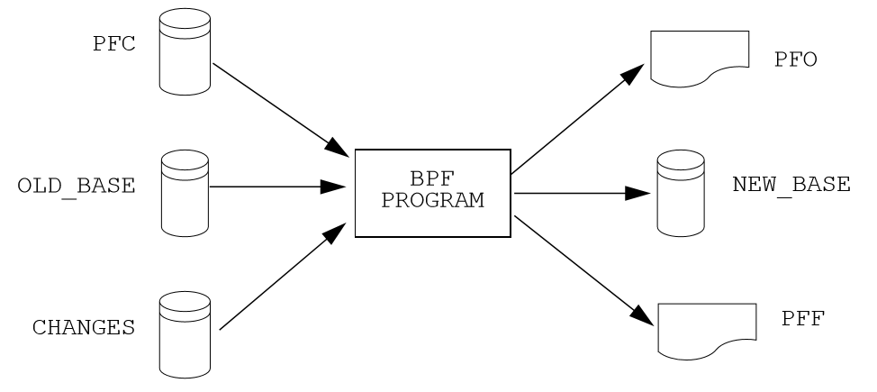
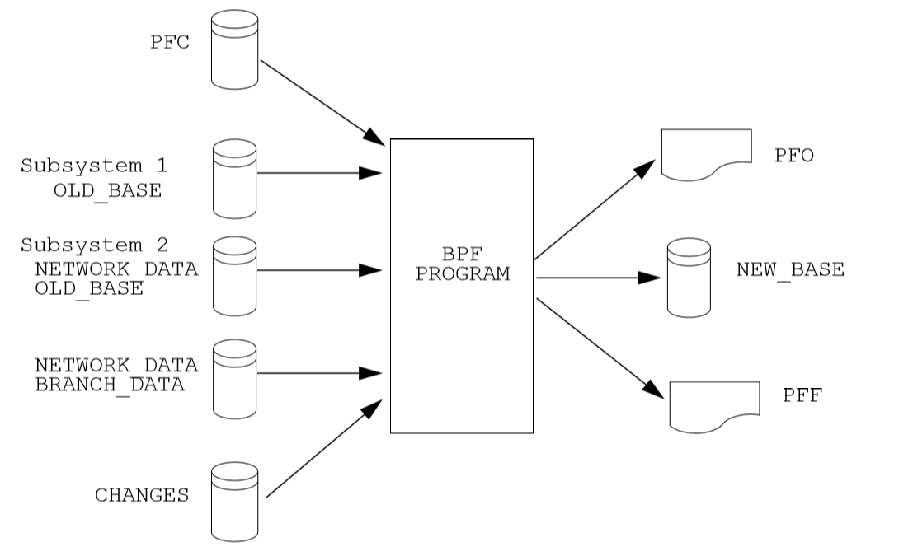
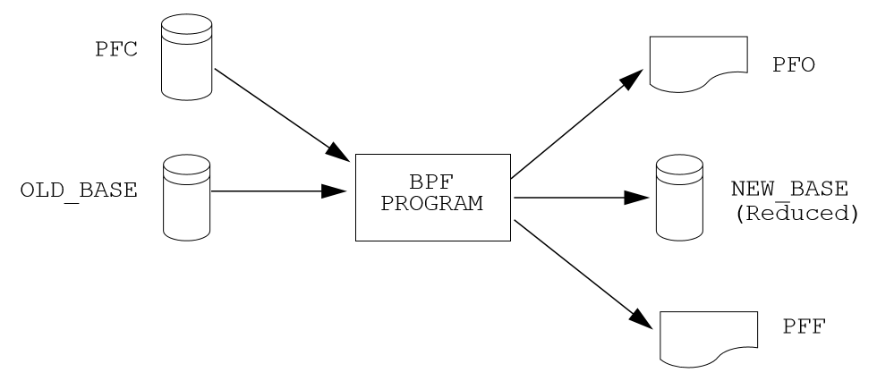
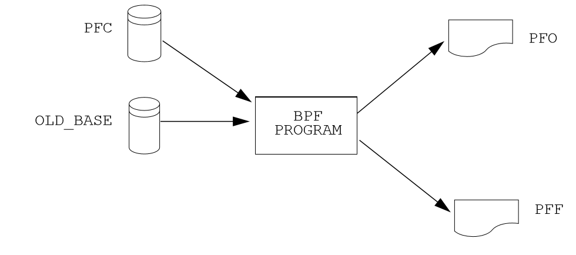

*************************
``bpf`` Process Scenarios
*************************
In order to process a case, ``bpf`` requires a program control file and a valid set of base case data, which may be a composite of ``NETWORK_DATA`` and ``BRANCH_DATA`` formatted ASCII files or an ``OLD_BASE`` file from a previous power flow case, and a ``CHANGE`` file.

The PFC file either contains data used for the solution, or names files containing such data. The solution data is optionally saved on the file named in the ``NEW_BASE`` command.

Types of Processing
===================
Input files used vary with the type of IPF processing, so it is important that you have a good understanding of the purpose of each type of file. Different program functions use the files to perform specific processes. Some major processes are:
 
 * Basic Processing ``(POWER FLOW)``
 * Merge Base ``/MERGE_BASE\``
 * Network Reduction ``/REDUCTION\``
 * Outage Simulation ``/OUTAGE_SIM\``
 
Sample PFC file setups for each of the following solution processes are given in ??.

Creating a New Base Case
========================
The figure below depicts the initial way an IPF case is processed and how the output is saved on a NEW_BASE file, which may then become an OLD_BASE file for subsequent change studies. The contents of the print file (PFO) are defined by the ``P_INPUT``, ``P_OUTPUT``, and ``P_ANALYSIS`` commands. Likewise, the contents of the fiche file (PFF) are defined by the ``F_INPUT``, ``F_OUTPUT``, and
``F_ANALYSIS`` commands.

.. figure:: ../img/New_Base_Creation_Process.png

   New Base Creation Process

Changing an Old Base Case
=========================
The figure below shows the most commonly used ``bpf`` process. A change case is created from an ``OLD_BASE`` file using a ``CHANGE`` file. The modified case data is saved on the ``NEW_BASE`` file. The output files PFO and PFF can be printed to paper or fiche or both.

   Old Base Case With Changes

Merging Subsystems
==================
The figure below shows a ``NEW_BASE`` file being created by merging a subsystem from a case on an ``OLD_BASE`` file with another subsystem from either a second ``OLD_BASE`` or from a ``BRANCH_DATA`` and a ``NETWORK_DATA`` file. The output files PFO and PFF can be printed to paper and/or fiche.

   Merging Two or More Subsystems

Reducing a Network
==================
In the figure below, a network reduction is specified in the PFC file. Commands within this file define the retained system. The actual network reduction dynamically changes the base data in memory, and the reduced base case is saved on the ``NEW_BASE`` file. These output files (.PFO and .PFF) can be printed to paper and/or fiche.

   Reducing a Network

For static reduction, you can use the ``ipfcut`` program. It is described in ??.

Simulating Outages
==================
The figure below shows an outage simulation being processed directly from an ``OLD_BASE`` file. Only printed analysis is output; no data files are generated. This printed output can be directed to either fiche or paper. Simulating outages is a special power flow function that subjects a subsystem of interest to a series of single contingency branch outages and tabulates the consequences of each outage or the cause of each overload.

   An Outage Simulation

