.. _record-formats:

**************
Record Formats
**************

Overview
========
This section describes all data record formats recognized by IPF. Most, but not all of them are also available in the GUI interface. The record descriptions are organized alphabetically by record ID as you go through the section (except for the DC bus records which follow the AC bus records). The table below enables you to quickly locate a specific record format entry. The table also gives you a quick description of each record format.

Each entry has a ca.. figure that shows you where to put both identification and data information and where the implicit decimal point (if any) is located. These ca.. figures are artifacts from the old days of punchcards for mainframes, but they do provide good visual represenation of the data for each record format Please note that all information must be in the correct columns; you will experience processing errors otherwise. Each ca.. figure has a legend showing whether data is required, optional, or ignored.

Each entry also has a table of column descriptions and data formats. This supplements the ca.. figure. Additional text accompanies any record formats that need extended discussion.

Some data are real numbers. For these fields, the implicit decimal point is shown as a black dot on the ca.. figure, just above the information entry row. Note that you can enter data with an explicit decimal point in any position within the field. A black dot that appears at the extreme right side of a field represents a decimal point at the right end (least significant digit) of a number. All other black dots appear above a line, indicating that the decimal point will fall between the digits on either side.

All IPF data record types are identified by the characters in columns 1 and 2. To fully specify a particular record, additional fields need to be filled in. These additional ID fields are usually the bus name and base kV. ID fields are called out in the column description tables.

.. table:: Record Types

   ======================== =========== =================================
   Record ID (columns 1-2)  Field Width Description
   ======================== =========== =================================
   Period (``.``)           120         Comment (not printed)
   ``+``                    80          Bus continuation
   ``A``                    80          Area interchange control
   ``AO``                   80          Area output sort
   ``-``                    ``-``       General AC bus description
   ``B``                    80          AC bus - load bus
   ``BC``                   80          AC bus - voltage controlled by ``BG`` bus
   ``BE``                   80          AC bus - constant voltage
   ``BF``                   80          AC bus - special purpose bus for Newton-Raphson solution
   ``BG``                   80          AC bus - generator
   ``BQ``                   80          AC bus - constant voltage within Q limits
   ``BS``                   80          AC bus - system slack bus
   ``BT``                   80          AC bus - LTC transformer controlled AC bus
   ``BV``                   80          AC bus - constant Q within V limits
   ``BX``                   80          AC bus - attempts constant V using switched Q specified on ``X`` record
   ``BD``                   80          Two-terminal DC bus
   ``BM``                   80          Multi-terminal DC bus
   ``DA``                   80          Delete buses by area
   ``DZ``                   80          Delete buses by zones
   ``E``                    88          Equivalent branch (has extended ratings)
   ``I``                    80          Area intertie ``I`` record
   ``L``                    88          Transmission line (has extended ratings)
   ``LD``                   80          Two-terminal DC line
   ``LM``                   80          Multi-terminal DC line
   ``PO PZ PN PA PB PC PD`` 80          Factor changes
   ``QN QP QX``             120         Reactive capability curve
   ``R RV RQ RP RN RM``     80          Regulating transformer
   ``RZ``                   80          VAR compensator model
   ``T``                    92          Transformer (has extended ratings)
   ``TP``                   92          Phase shifter (has extended ratings)
   ``X``                    80          Switched reactance (BX record)
   ``Z``                    80          Zone rename
   ======================== =========== =================================

System Changes
==============
After a base case has been established, it may be changed with the use of change records. The change records are identified as system data records which immediately follow the network-solution qualifier ``/CHANGES`` statement. See :ref:`CHANGES` for details.

The change records are system data records with a change code in column 3. Each of the input data forms describe the permissible types of changes under the caption CHANGE CODES. In all, there are five types of changes.

 * *Additions*: Change code = blank
   
   The data record identification must be unique to the system. The contents of the record must be complete as if it were being submitted to build a base case.

 * *Deletions*: Change code = ``D``

   Only existing data may be deleted, and only the identification fields are needed. Numerical data in any other field is ignored. Special conditions are given:

   * Deleting a bus automatically deletes all continuation bus data, switched reactance data and all branch data associated with that bus. Deleting all branches connected to a bus will result in an error. It is better to delete the bus. A bus should not be deleted and added back in the same case with the same name in a single change file.

   * Deleting all transformer banks between two buses will automatically delete any regulating transformer data.

   * A line composed of sections may be deleted in its entirety by deleting section 0 (zero) or blank. The alternative is to delete each section with a separate change record. If a section is deleted the line is reconnected without that section. Transformer sections cannot be deleted.
   
   * A branch composed of parallel lines between two buses may be deleted in its entirety by entering a ``*`` in place of CKT ID. This provides a means of disconnecting two directly connected buses from each other. The branches may also be deleted individually.
   
   * A blank branch ID is legitimate identification.
   
   * Changing a bus from type ``X`` to any other type will delete all switched-reactance data automatically. No separate ``X`` delete record should be included.

 * *Elimination*: Change code = ``E``

   This causes the elimination of all existing A (area interchange) records to make room for possible new A records. The user should note that this change code works for A records only.

 * *Modifications*: Change code = ``M``
 
   All currently existing system data may be modified, which means changing the value of some quantity of system data. Data in the identification field cannot be changed.
 
   Only the data to be changed is entered on the change record. Nonblank fields constitute data modification, while blank fields indicate that the quantity is not to be changed. A blank and a zero quantity on the change record are distinguishable. Often, it is necessary to change a quantity into a blank. Examples are the bus zone name and the bus subtype. To change these into blank quantities, a ``00`` or ``0`` must be entered in the appropriate respective column fields. Special recognition is conferred on these change quantities.

 * *Restorations*: Change code = ``R``

   Previously outaged system data may be reactivated with the use of restore change records. This type change permits data to be restored to the system with change records using the identification fields only. Any data fields on the restore record will be ignored, and the reactivated data assumes the same quantities it had prior to deletion. Restoring data is an option. Data could be re-entered with additional type change records as well. The operations and rules are similar to those for deletions. However, some important differences must be explained.

   * Restore changes are permissible only with data deleted in a previous change case but within the same base case. You cannot restore data outaged in a previous OLD_BASE case.
   * Area interchange records may not be restored.
   * Restoring a bus restores only branches which connect to a viable system base. In some cases, not all of the outaged branches can be restored.
   * Restoring all transformer banks between two buses will not automatically restore any regulating transformer data. If this is intended, the regulating ``R`` transformer data must be restored separately.
   * A restored branch record must match the branch code as well as the identification fields. For example, if the branch is type ``L``, the restore record must match the type.

   The change records are read, interpreted and stored for further processing. As they are read the following are processed immediately:
    
    * Area Interchange (``A``-blank)
    * Zone Renames (``Z``-blank)
    * Area Deletes (``DA``)

   Processing of changes then continues in the following manner:
    
    * Changes Percents (``P``)
    * Deletes
    * Adds/Restores
    * Modifications

.. note:: 
  
  If more than one modification for the same data item occurs, the changes will be made in the order encountered. In IPF, no message will be given the user.

If fatal data errors are encountered in batch mode, switches are set and the processing continues only to discover additional errors, list all changes and exit. For changes to existing data, component identification must be specified exactly as in the base case file.
If fatal errors are encountered in interactive mode, appropriate diagnostics are issued so that the user can remedy the faulty command or data.

Comment
=======
This comment text is used to annotate the program control file, network data file, or change file. Its contents are not added to the output listings nor saved in the binary base case file.

Simply place a ``.`` (period character) in the first column and the comment in the rest of the columns. This is also handy to temporarily deactivate a command or data line.

.. figure:: ../img/Comment_Input_Format.png

   Comment Input Format

.. table:: Column Descriptions for Comment Format

  ====== ======== ====== ==============================
  Column ID Field Format Content
  ====== ======== ====== ==============================
  1      yes      A1     ``.`` (period)
  2-120  no       A119   Text string for record comment
  ====== ======== ====== ==============================

Continuation Bus Data (``+``)
=============================
Continuation bus data is identified with a ``+`` in column 1 and supplements the data on any AC bus record. It specifies additional generation, load and shunt admittance at the bus and permits additional classification and utilization of data. Generally, it permits a more detailed analysis of data. Its most typical application is distinguishing loads represented by several different owners at the same bus. The following fields are for identification:

 * Bus name and base kV
 * Code and code year
 * Ownership

Each bus may have more than one continuation record. However, some means of distinction must be made in the minor identification fields of code year or owner. See figure and tables below for details.

A sample coding sheet and column descriptions for continuation bus data follows.

.. figure:: ../img/Continuation_Bus_Data_Input_Format.png

   Continuation Bus Data Input Format

.. table:: Classification Codes

  ===== ===================================================
  Code  Description
  ===== ===================================================
  A     Equivalent injection data from network reduction. Note that data associated with this code is not subject to the effect of factor change  (``P``) records.
  C     Shunt MW or MVAR
  F     Industrial firm load
  I     Industrial interruptible load
  N     Nonindustrial firm load (bus ownership differs from load ownership)
  P     Industrial potential load
  S     Nonindustrial secondary load
  Blank Nonindustrial firm load (bus ownership = load ownership)
  ===== ===================================================

In addition to the special classifications codes of column (2:2), the code year may convey special meaning or models to the continuation bus records. The table below summarizes the features.

.. table:: Special Constant Current and Constant Impedance Loads

  +------+-----------+---------------------+---------------------+---------------------+---------------------+----------------------------+
  | Code | Code year | P_load              | Q_load              | G_shunt             | B_shunt             | Description                |
  +======+===========+=====================+=====================+=====================+=====================+============================+
  | +A   |           | Constant power MW   | Constant power      | Constant admittance | Constant admittance | Quantity generated by      |
  |      |           | load (generation if | MVAR load           | MW evaluated at     | MVAR evaluated at   | Network Data or Cutting    |
  |      |           | negative)           | (generation if      | nominal voltage     | nominal voltage     | routines                   |
  |      |           |                     | negative)           |                     |                     |                            |
  +------+-----------+---------------------+---------------------+---------------------+---------------------+----------------------------+
  | +A   | 00        | Constant power MW   | Constant power      | Constant admittance | Constant admittance | Quantity generated by      |
  |      |           | load (generation if | MVAR load           | MW evaluated at     | MVAR evaluated at   | Network Data routine       |
  |      |           | negative)           | (generation if      | nominal voltage     | nominal voltage     |                            |
  |      |           |                     | negative)           |                     |                     |                            |
  +------+-----------+---------------------+---------------------+---------------------+---------------------+----------------------------+
  | +A   | 01        | Distributed constant| Distributed constant| Equivalent MW       | Equivalent MVAR     | Quantity generated by      |
  |      |           | current MW load     | current conjugate   | shunt admittance    | shunt admittance    | Network Reduction routines |
  |      |           | (generation if      | MVAR load           |                     |                     |                            |
  |      |           | negative) evaluated | (generation if      |                     |                     |                            |
  |      |           | at nominal voltage  | negative) evaluated |                     |                     |                            |
  |      |           |                     | at nominal voltage  |                     |                     |                            |
  +------+-----------+---------------------+---------------------+---------------------+---------------------+----------------------------+
  | +A   | 02        | Distributed MW load | Distributed MVAR    | Equivalent MW       | Equivalent MVAR     | Quantity generated by      |
  |      |           | (generation if      | load (generation if | shunt admittance    | shunt admittance    | Network Reduction; denote  |
  |      |           | negative)           | negative)           |                     |                     | equivalent shunt           |
  |      |           |                     |                     |                     |                     | admittances                |
  +------+-----------+---------------------+---------------------+---------------------+---------------------+----------------------------+
  |      | \*I       | Constant current MW | Constant current    | Not applicable      | Not applicable      | Quantity generated by      |
  |      |           | load (generation if | conjugate MVAR load |                     |                     | %LOAD_DISTRIBUTION         |
  |      |           | negative) evaluated | (generation if      |                     |                     |                            |
  |      |           | at nominal voltage  | negative) evaluated |                     |                     |                            |
  |      |           |                     | at nominal voltage  |                     |                     |                            |
  +------+-----------+---------------------+---------------------+---------------------+---------------------+----------------------------+
  |      | \*Z       | Constant power MW   | Constant power MVAR | Constant admittance | Constant admittance | Quantity generated by      |
  |      |           | load (generation    | load (generation    | MW load (generation | MVAR load           | %LOAD_DISTRIBUTION         |
  |      |           | if negative)        | if negative)        | if negative)        | (generation if      |                            |
  |      |           |                     |                     | evaluated at        | negative) evaluated |                            |
  |      |           |                     |                     | nominal voltage     | at nominal voltage  |                            |
  +------+-----------+---------------------+---------------------+---------------------+---------------------+----------------------------+
  |      | \*P       | Constant power      | Constant power      | Not applicable      | Not applicable      | Quantity generated by      |
  |      |           | MW load (generation | MVAR load           |                     |                     | %LOAD_DISTRIBUTION         |
  |      |           | if negative)        | (generation if      |                     |                     |                            |
  |      |           |                     | negative)           |                     |                     |                            |
  +------+-----------+---------------------+---------------------+---------------------+---------------------+----------------------------+

.. table:: Column Description for Continuation Bus Data

  ====== ======== ====== =================================
  Column ID Field Format Description
  ====== ======== ====== =================================
  1      yes      A1     Record type; ``+`` for all continuation bus data
  2      yes      A1     Code (See code types above.)
  3      no       A1     Change code
  4-6    yes      A3     Ownership
  7-14   yes      A8     Bus name
  15-18  yes      F4.0   Base kV
  19-20  yes      A2     Code year—alphanumeric subtype of code 
  21-25a no       F5.0   Load MW
  26-30  no       F5.0   Load MVAR
  31-34  no       F4.0   Shunt Admittance Load in MW at base kV
  35-38  no       F4.0   Shunt Admittance in MVAR at base kV (+) = Capacitive (-) = Inductive
  43-47  no       F5.0   ``P GEN`` MW
  48-52  no       F5.0   ``Q GEN`` MVAR (or ``Q MAX``) (+) = Capacitive (-) = Inductive
  53-57  no       F5.0   ``Q MIN`` in MVAR
  75-77  no       A1, A2 Energization date month and year {month = 1,2,3,4,5,6,7,8,9,O,N,D}
  ====== ======== ====== =================================

a.  If the Code (column 2) is ``A`` and the Code year (column 19-20) is ``01``, the load quantities are constant current-constant power factors and are: 
  
  1. Interpreted as MW and MVAR evaluated at base kV (+) = Inductive (-) = Capacitive
  2. Evaluated as: :math:`P + jQ = (I*)|V|`

.. note:: 
  
  ``Q_max`` and ``Q_min`` represent inequality constraints (``Q_max > Q_min``). However special concerns apply for bus subtypes blank, C, T and V, where the Q is constrained. In order to assign appropriate values for scheduled Q, ``Q_min`` is first examined. If ``Q_min < 0`` and ``Q_max > 0``, the limits are recognized as erroneous constraints and both are ignored. If ``Q_min = 0``, then the schedule Q is always ``Q_max``

Area Interchange Control (``A``)
================================
A network may be partitioned geographically by area. Similarly, areas may be partitioned by zones. The net power exported from each area can be specified with an area interchange record. Export power is controlled by varying the area slack bus generation. Interchange export is measured as the sum of the exported power on all area tie lines metered at the area boundaries. The total net export of all areas must add to zero; otherwise, the area interchange control is aborted. See the figure and tables below.

Valid subtypes are blank, 1, ..., 9, with 1, ..., 9 being continuation records. This allows up to 100 zones to be defined in an area.

In order for area interchange control to be activated, A records must be defined and the ``/AI_CONTROL`` option must be set to the default, ``CON`` (Control). Three slack bus restrictions pertain to each area.

 * One area slack bus must be the system swing bus.
 * Each area slack bus must be within the area it controls.
 * For all slack buses the P generation is variable.

.. note::
  
  Area Continuation records (A1, ..., A9) accept only area name and zones 1-10 fields.
  
.. figure:: ../img/Area_Interchange_Control_Input_Format.png

  Area Interchange Control Input Format

.. table:: Column Description for Area Interchange

  ====== ======== ========= ==========================
  Column ID Field Format    Description
  ====== ======== ========= ==========================
  1      yes      A1        Record type — A
  2      yes      A1        Subtype — blank, 1, ..., 9
  3      no       A1        Change code — see System Changes
  4-13   yes      A10       Interchange area name — Name of area consisting of one or more zones. Alphanumeric entries are permitted.
  14-25  no       A8,F4.0   Area slack bus name and base kV. (Does not apply to subtypes A1, ..., A9.)
  27-34  no       F8.0      Scheduled export — MW flow scheduled (+) out of area or (-) into area. If I (interchange) records are present for this area, the net schedule will be overwritten with the netting computed from the I records. (Does not apply to subtypes A1, ..., A9.)
  36-64  no       10(A2,1X) Zones to be included in the interchange area named in columns 4-13. A blank zone terminates the scan unless it is zone 1. All zones must be listed within some area, but no zone may be common to more than one area.
  73-76  no       F4.3      Maximum per unit voltage. (Does not apply to subtypes A1, ..., A9.)
  77-80  no       F4.3      Minimum per unit voltage. (Does not apply to subtypes A1, ..., A9.)
  ====== ======== ========= ==========================

.. _area-output-sort:

Area Output Sort (``AO``)
=========================
The order of buses in the input and output listings may be grouped into areas with arbitrary zone configurations. The areas are sorted alphabetically and the buses within each area are then sorted alphabetically.

These records permit an area to be defined independently of any area interchange. Once introduced, these records become a permanent part of the base case file. A coding sheet and description of the record columns follows:

.. figure:: ../img/Listing_by_Sorted_Areas_Input_Format.png

  Listing by Sorted Areas Input Format

.. table:: Column Description for Area Output Sort
  
  ====== ======== ========== ====================
  Column ID Field Format     Description
  ====== ======== ========== ====================
  1      yes      A1         Record type — A
  2      yes      A1         Subtype — O
  3      no       A1         Change code — see System Changes
  4-13   yes      A10        Area Name — These names are independent of area interchange names but may be identical.
  15-79  no       22(A2,1X)  Zone composition list — a blank zone terminates the zone scan unless it is zone 1.
  80     no       blank
  ====== ======== ========== ====================

AC Bus Data
===========
Bus records identify nodes in the network. The following description applies to AC buses only; DC buses are identified by a subtype ``D`` or ``M`` and are described in ?? and ??.

Each AC bus consists of three attributes: generation, load, and shunt admittance. Various subtypes assign unique characteristics to these attributes. Some affect conditions in the solution; others affect only the allocation of quantities in the output listings.

The various subtypes permit different models to represent the operation of the system. Most buses have constant real injection. Exceptions are the system slack bus and any area interchange slack buses.

.. figure:: ../img/Bus_Data_Input_Format.png

  Bus Data Input Format

.. table:: Column Description for AC Bus Data

  ====== ======== ====== ====================
  Column ID Field Format Description
  ====== ======== ====== ====================
  1      yes      A1     AC ``B`` type record
  2      no       A1     Subtype
  3      no       A1     Change code
  4-6    no       A3     Ownership
  7-14   yes      A8     Bus name
  15-18  yes      F4.0   Base kV
  19-20  no       A2     Zone
  21-26  no       F5.0   Load MW
  26-30  no       F5.0   Load MVAR
  31-34  no       F4.0   Shunt Admittance Load in MW at base kV
  35-38  no       F4.0   Shunt Admittance in MVAR at base kV (+) = Capacitive (-) = Inductive
  43-47  no       F5.0   ``P GEN`` MW
  48-52  no       F5.0   ``Q GEN`` MVAR (+) = Capacitive (-) = Inductive
  53-57  no       F5.0   ``Q MIN`` MVAR
  58-61  no       F4.3   ``V HOLD`` - ``V MAX`` (in per unit)
  62-65  no       F4.3   ``V MIN`` (in per unit)
  66-73  no       A8     Controlled bus name
  74-77  no       F4.0   Base kV
  78-80  no       F3.0   Percent of vars supplied for remote bus voltage control.
  ====== ======== ====== ====================

For all subtypes, the following diagram illustrates the reactive allocation scheme. 

.. figure:: ../img/Reactive_Allocation_Scheme.png

  Reactive Allocation Scheme

Allocation of reactive facilities is complex. These may be allocated by equality constraints (:math:`Q_{net}` is constant), inequality constraints (:math:`Q_{net}` varies between a minimum and maximum value), or no constraints.

Let :math:`Net` define the total line export. Then the following equation is always valid:

.. math:: Net = Generation - Load - Y_{shunt} * Voltage^2

The equation is complex; the real and reactive components are balanced separately. The separate equations are:

.. math:: 

   P_{net} &= P_{Gen} - P_{load} - G * V^2 \\
   Q_{net} &= Q_{Gen} - Q_{load} + B * V^2

The shunt admittance is

.. math:: Y = \frac{1}{Z} = G + jB

The equations above define the interrelationship between quantities and are valid for all bus types. The bus type determines which equations are also constraints.

The preceding diagram illustrates the following priority scheme. In applying the equation for :math:`Q`, vars are allocated to generation and variable shunt components on a priority basis. If :math:`Q_{net}` is less than :math:`Q_{load} + Q_{shunt}` fixed, then vars are allocated first to variable shunt reactors and then, if necessary, to reactive generation. If, on the other hand, :math:`Q_{net}` is higher than :math:`Q_{load} + Q_{shunt}` fixed, then vars are allocated first to the variable shunt capacitors and then, if necessary, to reactive generation. If the limits of reactive generation are exceeded, then unscheduled reactive is allocated.

AC Bus Data (``B``-blank)
=========================

Application
-----------
This bus subtype is passive in the sense that it cannot control the voltage of another bus. Its primary use is for modeling load buses.

Bus Characteristics
-------------------
Both real (:math:`P`) and reactive (:math:`Q`) power are held constant throughout the entire solution. This applies to generators, load and shunt devices (capacitors/reactors).

A specific amount of reactive generation can be requested. This can be accomplished by entering a zero (0) in the ``Q MIN`` field and the desired amount of reactive generation in the ``Q SCHED`` field.

Since this bus normally has no voltage control, the voltage limits (``V MAX``, ``V MIN``) serve two purposes.

 * If the bus is remotely controlled by another bus (type ``BG`` or ``BX``) or by an LTC transformer (which is not standard but is accepted), the limits specify the range of acceptable voltage.
 * For accounting purposes, these limits can flag undervoltage or overvoltage situations in the analysis reports.

It must be recognized that every bus has voltage limits, whether they are explicitly specified through the ``V MIN``, ``V MAX`` fields or implicitly specified through default global voltage limits. See Appendix ??.

Reactive limits are not allowed for this type of bus. If reactive limits are entered in the ``Q MAX`` and ``Q MIN`` fields, they will be ignored. However, legitimate ``Q GEN`` can be entered if ``Q MIN`` is zero.

For this subtype, :math:`Q_{net}` is constant; its Q-V characteristic is shown in format drawing below.

If this bus is controlled by an LTC transformer or by a ``BG`` or ``BX`` bus, a warning diagnostic will be issued to the effect that remotely controlled buses are typically type ``BC`` or type ``BT`` and the controlled voltage is a single value, :math:`V_{sched}` and not a range :math:`V_{min} < V_{controlled} < V_{max}`.

.. figure:: ../img/B-blank_Subtype_Format.png

  ``B``-blank Subtype Format

.. table:: Column Description for ``B`` Bus Data

  ====== ======== ======= ====================
  Column ID Field Format  Description
  ====== ======== ======= ====================
  1-2    yes      A2      ``B`` - Generic load bus
  3      no       A1      Change code
  4-6    no       A3      Ownership
  7-14   yes      A8      Bus name
  15-18  yes      F4.0    Base kV
  19-20  no       A2      Zone
  21-25  no       F5.0    Load MW
  26-30  no       F5.0    Load MVAR
  31-34  no       F4.0    Shunt Admittance Load in MW at base kV
  35-38  no       F4.0    Shunt Admittance in MVAR
  39-42  no       F4.0    ``P MAX``
  43-47  no       F5.0    ``P GEN``
  48-52  no       F5.0    ``Q SCHED`` in MVAR
  53-57  no       F5.0    ``Q MIN`` — Must be blank or zero for ``Q SCHED`` to apply
  58-61  no       F4.3    ``VMAX``. If blank, then limits default to global limits as outlined in ??.
  62-65  no       F4.3    ``VMIN``. If blank, then limits default to global limits as outlined in ??.
  66-77  no       A8,F4.0 N/A
  78-80  no       F3.0    N/A
  ====== ======== ======= ====================

.. figure:: ../img/Q-V_Curve_for_B-blank_Subtype.png

  Q-V Curve for ``B``-blank Subtype

AC Bus Data (``BC``)
====================

Application
-----------
This bus type has its voltage maintained by a subtype ``BG`` bus.

Bus Characteristics
-------------------
Both real (:math:`P`) and reactive (:math:`Q`) power are held constant throughout the entire solution. This applies to generators, loads, and shunt devices (capacitors/reactors).

A specific amount of reactive generation can be requested. This can be accomplished by entering a zero (0) in the ``Q MIN`` field and the desired amount of reactive generation in the ``Q SCHED`` field.

Reactive constraints are not allowed for this type of bus. If reactive limits are entered in the ``Q MAX`` and ``Q MIN`` fields, they will be ignored.

Since this bus type has its voltage maintained by a generator bus, a ``V HOLD`` entry is strongly recommended on the bus record. However, if that field is blank, the global default limits apply, in effect, using ``VMAX`` for the ``VHOLD``. See ??

.. figure:: ../img/BC_Subtype_Format.png

  ``BC`` Subtype Format

.. table:: Column Description for ``BC`` Bus Data

  ====== ======== ======= ======================
  Column ID Field Format  Description
  ====== ======== ======= ======================
  1-2    yes      A2      ``BC`` - Voltage controlled by BG bus
  3      no       A1      Change code
  4-6    no       A3      Ownership
  7-18   yes              Bus name and base kV
  15-18  yes      F4.0    Base kV
  19-20  no       A2      Zone
  21-25  no       F5.0    Load MW
  26-30  no       F5.0    Load MVAR
  31-34  no       F4.0    Shunt Admittance Load in MW at base kV
  35-38  no       F4.0    Shunt Admittance in MVAR
  39-42  no       F4.0    ``P MAX``
  43-47  no       F5.0    ``P GEN``
  48-52  no       F5.0    ``Q SCHED`` in MVAR
  53-57  no       F5.0    ``Q MIN`` — Must be blank or zero for ``Q SCHED`` to apply
  58-61  no       F4.3    ``V HOLD`` in per unit
  62-65  no       F4.3    N/A
  66-77  no       A8,F4.0 N/A
  78-80  no       F3.0    N/A
  ====== ======== ======= ======================

.. figure:: ../img/Q-V_Curve_for_BC_Subtype.png

  Q-V Curve for ``BC`` Subtype

AC Bus Data (``BE``)
====================

Application
-----------
This subtype is used to hold the bus voltage to a specified value, regardless of the amount of reactive required.

Bus Characteristics
-------------------
Voltage magnitude (:math:`V`) is held constant. Real (:math:`P`) power is held constant. This applies to generators, load, and shunt devices. Reactive (Q) load is held constant for this bus type.

Reactive (:math:`Q`) shunt is variable. The amount of shunt reactance added by the program can vary from 0 to ``Qshunt``, depending upon the amount needed to maintain desired bus voltage.

Reactive (:math:`Q`) generation is variable.

Reactive constraints are allowed for this bus type. These quantities are entered in the ``Q MAX`` and ``Q MIN`` fields. If reactive constraints are imposed, “unscheduled reactive” may be added by the program to hold the bus voltage.

A specific amount of reactive generation (``Q SCHED``) cannot be requested.

Since this bus type maintains its own voltage, a ``V HOLD`` entry is required on the record. The voltage is held fixed at this value, regardless of the amount of reactive required. Note that ``V HOLD`` is not required for type “M” changes.

.. figure:: ../img/BE_Subtype_Format.png

  ``BE`` Subtype Format

.. table:: Column Description for ``BE`` Bus Data

  ====== ======== ======= =====================
  Column ID Field Format  Description
  ====== ======== ======= =====================
  1-2    yes      A2      ``BE`` - Constant voltage bus
  3      no       A1      Change code
  4-6    no       A3      Ownership
  7-14   yes      A8      Bus name
  15-18  yes      F4.0    Base kV
  19-20  no       A2      Zone
  21-25  no       F5.0    Load MW
  26-30  no       F5.0    Load MVAR
  31-34  no       F4.0    Shunt Admittance Load in MW at base kV
  35-38  no       F4.0    Shunt Admittance in MVAR
  39-42  no       F4.0    ``P MAX``
  43-47  no       F5.0    ``P GEN``
  48-52  no       F5.0    ``Q MAX`` in MVAR
  53-57  no       F5.0    ``Q MIN`` in MVAR
  58-61  no       F4.3    ``V HOLD`` in per unit
  62-65  no       F4.3    N/A
  66-77  no       A8,F4.0 N/A
  78-80  no       F3.0    N/A
  ====== ======== ======= =====================

.. figure:: ../img/Q-V_Curve_for_BE_Subtype.png

  Q-V Curve for ``BE`` Subtype

AC Bus Data (``BF``)
====================
This is a special purpose bus type used to assist the Newton-Raphson solution convergence. The ``BF`` type behaves as a ``BE`` bus until the P_net converges to the Newton-Raphson solution. Then it functions as a ``B-`` type. This feature is useful to bias a solution toward a more feasible voltage.

AC Bus Data (``BG``)
====================

Application
-----------
This bus type is typically used to maintain the voltage at a remote bus (subtype ``BC``).

This subtype may also be used for local control. For this application, the bus would maintain its own voltage. In this case, it would differ from a ``BQ`` bus only by the voltage limit. ``BG`` has :math:`V_{min} ≤ V_{max}`; ``BQ`` has :math:`V_{hold}`.

Bus Characteristics
-------------------
Real (:math:`P`) power is held constant. This applies to generators, load and shunt devices. However, it is not required to have generation (``P GEN``) at this bus.

Reactive (:math:`Q`) load and shunt are held constant for this bus type.

Reactive (:math:`Q`) generation is variable.

This bus type requires reactive limits to be entered in the ``Q MAX``and ``Q MIN`` fields. The reactive limits on the subtype ``BG`` bus are used to maintain a specified voltage at a remote bus. If the remote bus voltage cannot be held with the available ``BG`` bus reactance, voltage control stops at either ``Q MAX`` or ``Q MIN``.

A specific amount of reactive generation (``Q SCHED``) cannot be requested.

This bus type uses ``V MAX`` and ``V MIN`` limits. If these fields are blank, global voltages are used as defaults. The voltage on the ``BG`` bus must be between ``V MIN`` and ``V MAX`` when controlling a remote bus. If not, remote voltage control will be disabled.

If this bus type is being used to control another bus, the ``REMOTE BUS`` and ``% VARS SUPPLIED`` fields should be used.The ``REMOTE BUS`` may not be the system swing bus or another subtype ``BG`` bus. The ``% VARS SUPPLIED`` field is used to allow the voltage control of a remote bus, to be distributed among more than one ``BG`` bus.

If the ``% VARS SUPPLIED`` is left blank, the program computes these values based upon the percent of total VARS supplied by the bus.

If the bus is controlling itself, its own name must appear in the ``REMOTE BUS`` field.

.. figure:: ../img/BG_Subtype_Format.png

  ``BG`` Subtype Format

.. table:: Column Description for ``BG`` Bus Data

  ====== ======== ======= =====================
  Column ID Field Format  Description
  ====== ======== ======= =====================
  1-2    yes      A2      ``BG`` - Maintains the voltage of a remote bus
  3      no       A1      Change code
  4-6    no       A3      Ownership
  7-14   yes      A8      Bus name
  15-18  yes      F4.0    Base kV
  19-20  no       A2      Zone
  21-25  no       F5.0    Load MW
  26-30  no       F5.0    Load MVAR
  31-34  no       F4.0    Shunt Admittance Load in MW at base kV
  35-38  no       F4.0    Shunt Admittance in MVAR
  39-42  no       F4.0    ``P MAX``
  43-47  no       F5.0    ``P GEN``
  48-52  no       F5.0    ``Q MAX`` in MVAR
  53-57  no       F5.0    ``Q MIN`` — Must be blank or zero for ``Q SCHED`` to apply
  58-61  no       F4.3    ``V MAX``
  62-65  no       F4.3    ``V MIN``
  66-77  no       A8,F4.0 Controlled bus name and base kV (self or remote)
  78-80  no       F3.0    Percent of vars supplied for remote bus voltage control.
  ====== ======== ======= =====================

.. figure:: ../img/Q-V_Curve_for_BG_Subtype.png

  Q-V Curve for ``BG`` Subtype

AC Bus Data (``BQ``)
====================

Application
-----------
This subtype is used to hold the bus voltage to a specified value within reactive limits.

Bus Characteristics
-------------------
Real power (``P GEN``) is held constant. This applies to generators, load, and shunt devices.

Reactive load (``Q MVAR``) load is held constant for this bus type.

Reactive (``SHUNT MVAR``) shunt is variable. The amount of shunt reactance added by the program can vary from 0 to Qshunt, depending on the amount needed to maintain desired bus voltage.

Reactive (:math:`Q`) generation is variable.

This bus type requires adjustable reactive generation or shunt to perform as intended. If neither is available, the bus functions as a bus type ``B``-blank.

A specific amount of reactive generation (``Q SCHED``) cannot be requested.

Since this bus type is attempting to maintain its own voltage, a ``V HOLD`` entry is required on the record. If the voltage cannot be held at the desired level, using the reactive capability of the bus, the desired voltage will be violated and reactive will be held at the ``Q MAX`` or ``Q MIN`` limit. Note that ``V HOLD`` is not required for modifications.

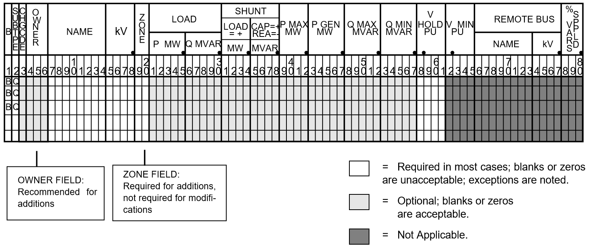

  ``BQ`` Subtype Format

.. note::

   For a type ``BQ`` bus to be viable, it needs a source of adjustable reactive. This may be the B_shunt field or the ``Q MIN`` - ``Q MAX`` fields. The necessary reactive component may be provided on the bus record, or it may be provided on an accompanying continuation (``+``) bus record or both

.. table:: Column Description for ``BQ`` Bus Data

  ====== ======== ======= =====================
  Column ID Field Format  Description
  ====== ======== ======= =====================
  1-2    yes      A2      ``BQ`` - Constant voltage within Q limits
  3      no       A1      Change code
  4-6    no       A3      Ownership
  7-14   yes      A8      Bus name
  15-18  yes      F4.0    Base kV
  19-20  no       A2      Zone
  21-25  no       F5.0    Load MW
  26-30  no       F5.0    Load MVAR
  31-34  no       F4.0    Shunt Admittance Load in MW at base kV
  35-38  no       F4.0    Shunt Admittance in MVAR
  39-42  no       F4.0    ``P MAX``
  43-47  no       F5.0    ``P GEN``
  48-52  no       F5.0    ``Q MAX``
  53-57  no       F5.0    ``Q MIN``
  58-61  no       F4.3    ``V HOLD``
  62-65  no       F4.3    N/A
  66-77  no       A8,F4.0 N/A
  78-80  no       F3.0    N/A
  ====== ======== ======= =====================

.. figure:: ../img/Q-V_Curve_for_BQ_Subtype.png

  Q-V Curve for ``BQ`` Subtype

AC Bus Data (``BS``)
====================

Application
-----------
This subtype designates the system swing or slack bus. The generators at the swing bus supply the difference between the specified power flowing into the system at the other buses and the total system output plus losses. Thus, real and reactive power are determined as part of the solution for this subtype.

Every power flow case must have a minimum of one swing bus. In addition, each isolated AC system must have its own swing bus. The maximum numbers of swing buses allowed for a single power flow case is ten.

Bus Characteristics
--------------------
Real (:math:`P`) load is held constant. Both real (:math:`P`) generation and shunt are variable. The ``P GEN`` field is updated to the base case value. The ``P MAX`` field is used for reporting purposes only.

Reactive (:math:`Q`) load is held constant for this bus type. Reactive (:math:`Q`) shunt is variable. The amount of shunt reactance added by the program can vary from 0 to ``Qshunt``, depending on the amount needed to maintain desired bus voltage.

Reactive (:math:`Q`) generation is variable.

Reactive constraints are allowed for this bus type. These quantities are entered in the ``Q MAX`` and ``Q MIN`` fields. If reactive constraints are imposed, "unscheduled reactive" may be added by the program to maintain the bus voltage.

A specific amount of reactive generation can be requested, in place of reactive constraints. This is implemented by entering a 0 in the ``Q MIN`` field and the desired amount of reactive generation in the ``Q SCHED`` field. Again, "unscheduled reactive" may be added by the program to maintain the bus voltage.

The ``BS`` bus record requires an entry in the ``V HOLD`` field.

The ``V MIN`` field is used to specify the angle of the swing bus for this application. It should be noted that an implied decimal point exists between columns 64 and 65. For example, an angle of 3.7 degrees can be specified with a 3 in column 64 and a 7 in column 65.

.. figure:: ../img/BS_Subtype_Format.png

  BS Subtype Format

.. table:: Column Description for ``BS`` Bus Data

  ====== ======== ======= =====================
  Column ID Field Format  Description
  ====== ======== ======= =====================
  1-2    yes      A2      ``BS`` - System swing or slack bus
  3      no       A1      Change code
  4-6    no       A3      Ownership
  7-14   yes      A8      Bus name
  15-18  yes      F4.0    Base kV
  19-20  no       A2      Zone
  21-25  no       F5.0    Load MW
  26-30  no       F5.0    Load MVAR
  31-34  no       F4.0    Shunt Admittance Load in MW at base kV
  35-38  no       F4.0    Shunt Admittance in MVAR
  39-42  no       F4.0    ``P MAX``
  43-47  no       F5.0    ``P GEN``
  48-52  no       F5.0    ``Q MAX``
  53-57  no       F5.0    ``Q MIN``
  58-61  no       F4.3    ``V HOLD``
  62-65  no       F4.1    Voltage angle (blank implies zero degrees)
  66-77  no       A8,F4.0 N/A
  78-80  no       F3.0    N/A
  ====== ======== ======= =====================

.. figure:: ../img/Q-V_Curve_for_BS_Subtype.png

  Q-V Curve for ``BS`` Subtype

AC Bus Data (``BT``)
====================

Application
-----------
This subtype has its voltage maintained by an Load Tap Change (LTC) transformer.

Bus Characteristics
-------------------
Both real (:math:`P`) and reactive (:math:`Q`) power are held constant throughout the entire solution. This applies to generators, load, and shunt devices (capacitors/reactors).

A specific amount of reactive generation can be requested. This can be accomplished by entering a zero (0) or blank in the ``Q MIN`` field and the desired amount of reactive generation in the ``Q SCHED`` field.

Reactive constraints are not allowed for this type of bus. If reactive limits are entered in the ``Q MAX`` and ``Q MIN`` fields, they will be ignored.

Since this bus type has its voltage maintained by an LTC transformer, a ``V HOLD`` entry is required.
This subtype requires an additional record, the ``R`` (Regulating Transformer) record.

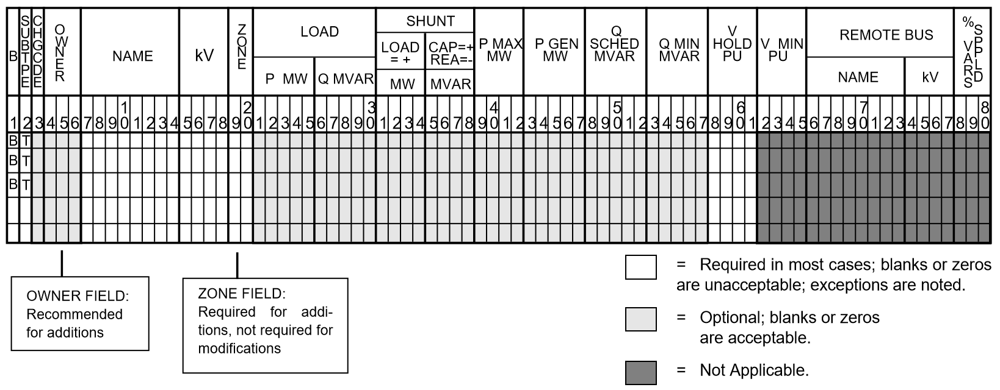

.. table:: Column Description for ``BT`` Bus Data

  ====== ======== ======= =====================
  Column ID Field Format  Description
  ====== ======== ======= =====================
  1-2    yes      A2      ``BT`` - LTC transformer controlled bus
  3      no       A1      Change code
  4-6    no       A3      Ownership
  7-14   yes      A8      Bus name
  15-18  yes      F4.0    Base kV
  19-20  no       A2      Zone
  21-25  no       F5.0    Load MW
  26-30  no       F5.0    Load MVAR
  31-34  no       F4.0    Shunt Admittance Load in MW at base kV
  35-38  no       F4.0    Shunt Admittance in MVAR
  39-42  no       F4.0    ``P MAX``
  43-47  no       F5.0    ``P GEN``
  48-52  no       F5.0    ``Q SCHED``
  53-57  no       F5.0    ``QMIN`` must be blank or zero for ``QSCHED`` to apply
  58-61  no       F4.3    ``V HOLD``
  62-65  no       F4.1    N/A
  66-77  no       A8,F4.0 N/A
  78-80  no       F3.0    N/A
  ====== ======== ======= =====================

AC Bus Data (``BV``)
====================

Application
-----------
This subtype maintains the bus’s net reactive (:math:`Q_{net}`) power flow as long as the bus voltage does not violate the user specified voltage range.

Bus Characteristics
-------------------
Real (:math:`P`) power is held constant throughout the entire solution. This applies to generators, load, and shunt devices.

Reactive (:math:`Q`) load and shunt are also held constant.

Reactive (:math:`Q`) generation is normally constant. Although this bus type actually has infinitely adjustable reactive limits, the program attempts to hold Qnet constant. However, if either of the voltage limits are violated, :math:`Q_{net}` is changed to hold that limit. If any additional reactive generation is added by the program, it will be referred to as "unscheduled reactive" in the program output file.

A specific amount of reactive generation can be requested. This is accomplished by entering a zero (0) in the ``Q MIN`` field and the desired amount of reactive generation in the ``Q SCHED`` field.

Reactive constraints are not allowed for this type of bus. If reactive limits are entered in the ``Q MAX`` and ``Q MIN`` fields, they will be ignored.

The ``BV`` bus record requires entries in the ``V MAX`` and ``V MIN`` fields. The program’s solution voltage will be within the range of ``V MAX`` to ``V MIN``, regardless of how much reactive is required. If voltage attempts to rise above ``V MAX``, additional negative reactive (:math:`-Q_{shunt}`) is added to bring the voltage down to ``V MAX``. Also, if the voltage is below ``V MIN``, additional reactive (:math:`+Q_{shunt}`) is added until the bus voltage has reached ``V MIN``.

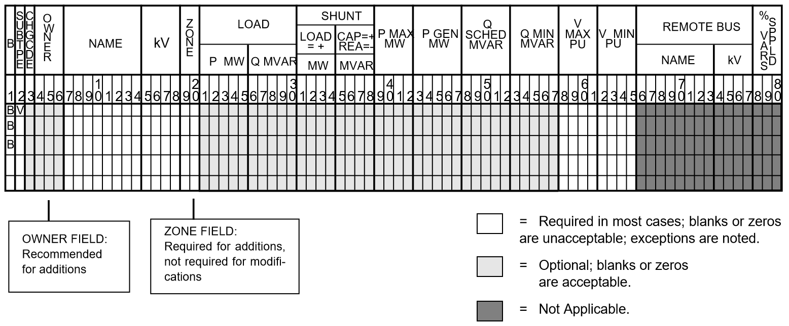

  ``BV`` Subtype Format

.. table:: Column Description for ``BV`` Bus Data

  ====== ======== ======= =====================
  Column ID Field Format  Description
  ====== ======== ======= =====================
  1-2    yes      A2      ``BV`` - Constant :math:`Q` within :math:`V` limits
  3      no       A1      Change code
  4-6    no       A3      Ownership
  7-14   yes      A8      Bus name
  15-18  yes      F4.0    Base kV
  19-20  no       A2      Zone
  21-25  no       F5.0    Load MW
  26-30  no       F5.0    Load MVAR
  31-34  no       F4.0    Shunt Admittance Load in MW at base kV
  35-38  no       F4.0    Shunt Admittance in MVAR
  39-42  no       F4.0    ``P MAX``
  43-47  no       F5.0    ``P GEN``
  48-52  no       F5.0    ``Q SCHED`` or ``QMA``
  53-57  no       F5.0    ``Q MIN``
  58-61  no       F4.3    ``V MAX`` in per unit
  62-65  no       F4.1    ``V MIN`` in per unit
  66-77  no       A8,F4.0 N/A
  78-80  no       F3.0    N/A
  ====== ======== ======= =====================

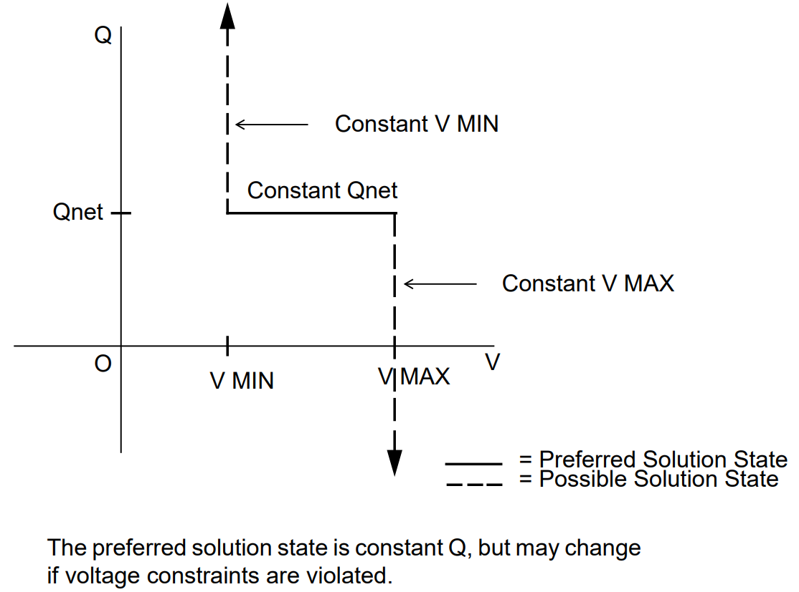

  Q-V Curve for ``BV`` Subtype

AC Bus Data (``BX``)
====================

Application
-----------
This subtype may be used for a truer representation of capacitors/reactors that are switched in discrete blocks to control bus voltages.
The ``BX`` subtype is most often used for local voltage control. Here, the bus would maintain its own voltage within a specified range of voltages. It is recommended, but is not mandatory, that for local control the bus name should be repeated in the ``REMOTE`` field.
This subtype may also be used for remote control, where the ``BX`` bus maintains a specified voltage level at another bus. Provide the remote bus name.

Bus Characteristics
-------------------
The real (:math:`G`) and reactive (:math:`B`) shunt fields hold the base case values of discrete reactance. These values may be updated by the solution.
Real (:math:`P`) power is held constant. This applies to generators and loads.

Reactive (:math:`Q`) load is held constant. Reactive (:math:`Q`) generation is variable.

Reactive constraints are allowed for this bus type. These quantities are entered in the ``Q MAX`` and ``Q MIN`` fields. A specific amount of reactive generation (``Q SCHED``) is available only if ``QMAX`` = ``QMIN``.
This bus type uses ``V MAX`` and ``V MIN`` limits. If these fields are blank, global voltages are used as defaults. The voltage on the ``BG`` bus must be between ``V MIN`` and ``V MAX`` when controlling a remote bus. If not, remote voltage control will be disabled.

Reactive shunt (:math:`+/- Q`) is added in discrete blocks to maintain the desired bus voltage. The capacitive/inductive blocks of reactance are identified on the ``X`` (switched reactance) record. It should be noted that actual convergence is implemented with continuous susceptance control, then discretization occurs automatically. This means that exact voltage control may not be possible.

It should be noted that the program will attempt to select a discrete reactive step, which yields the highest voltage within the specified limits, so that losses can be minimized. This is the default (BPA) value, for the third level ``>MISC_CNTRL`` Program Control Statement, ``X_BUS`` option.

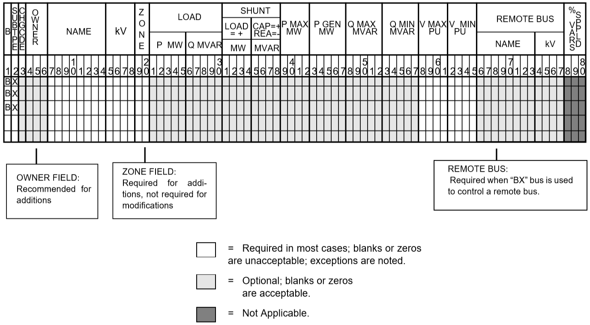

  ``BX`` Subtype Format

.. note::

  The value on the :math:`B_{shunt}` field dictates the initial value

.. table:: Column Description for BX Bus Data

  ====== ======== ======= =====================
  Column ID Field Format  Description
  ====== ======== ======= =====================
  1-2    yes      A2      ``BX`` — Attempts constant V using switched Q
  3      no       A1      Change code
  4-6    no       A3      Ownership
  7-14   yes      A8      Bus name
  15-18  yes      F4.0    Base kV
  19-20  no       A2      Zone
  21-25  no       F5.0    Load MW
  26-30  no       F5.0    Load MVAR
  31-34  no       F4.0    Shunt Admittance Load in MW at base kV
  35-38  no       F4.0    Shunt Admittance in MVAR
  39-42  no       F4.0    ``P MAX``
  43-47  no       F5.0    ``P GEN``
  48-52  no       F5.0    ``Q SCHED`` or ``QMAX``
  53-57  no       F5.0    ``Q MIN``
  58-61  no       F4.3    ``V MAX`` in per unit
  62-65  no       F4.1    ``V MIN`` in per unit
  66-77  no       A8,F4.0 Controlled bus name and kV (self or remote). If blank, self is assumed.
  78-80  no       F3.0    N/A
  ====== ======== ======= =====================

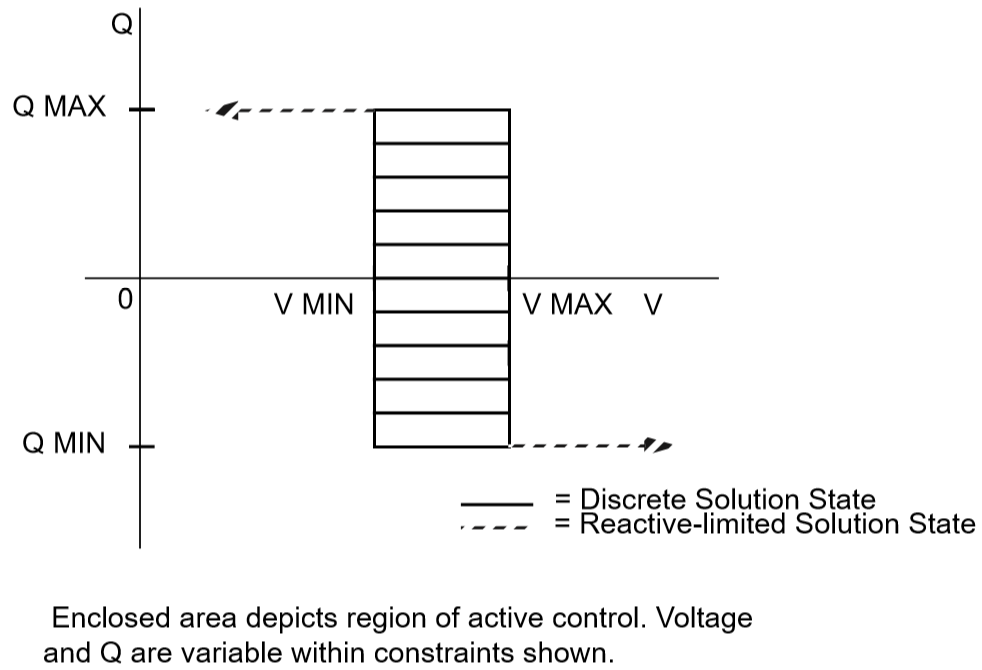

  Q-V Curve for ``BX`` Subtype

Two-Terminal DC Bus (``BD``)
============================
This record defines a DC bus to be used in conjunction with a two-terminal DC line. It is subtype ``D`` and interpreted with a different format from AC bus data records. No injections of any kind are permitted. The data contained on the record defines the rectifier or inverter valve characteristics. During the solution, the injection from the converter into the DC line is replaced with an equivalent but fictitious injection, and the DC line is removed entirely from the AC solution.

The DC model determines the initial AC injections and voltage magnitude on the converter bus. If these conditions can be held in the AC solution, no further DC adjustments occur. If the conditions cannot be held, the firing or extinction angles are readjusted to interface the current voltage magnitude on the converter buses while observing the scheduled DC power in the DC line. These adjustments will change the equivalent AC injections and will require a new AC solution.

The DC bus must be connected to a single AC bus through a commutating transformer. The commutating bus name is required, and the commutating transformer must be an LTC. All reactive sources supplying the harmonic filter must be connected on the commutating bus; it is not restricted in subtype.

Data for the inverter and rectifier buses are identical. Identification of each is by the DC line data record which compares the sign of the DC power flow with the DC terminal buses. The rectifier and inverter buses may be interchanging the sign of the scheduled DC power.

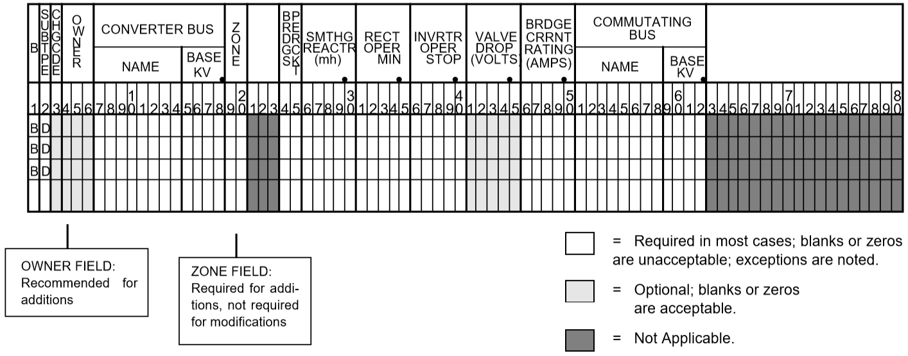

  ``BD`` Subtype Format

.. table:: Column Description for BD Bus Data

  ====== ======== ======= =====================
  Column ID Field Format  Description
  ====== ======== ======= =====================
  1-2    yes      A2      ``BD`` — Code for direct current (DC) bus, terminal of a DC line.
  3      no       A1      Change code — see System Changes
  4-6    no       A3      Ownership code
  7-14   yes      A8      Bus name
  15-18  yes      F4.0    Base kV
  19-20  no       A2      Zone
  24-25  no       I2      Bridges per ckt. — Number of valves in series per circuit.
  26-30  no       F5.1    Smoothing reactor (mh) — Inductance of the smoothing reactor in millihenries.
  31-35  no       F5.1    Rectifier operation (alpha min.) — Minimum firing angle in degrees as a rectifier.
  36-40  no       F5.1    Inverter operation (alpha stop) — Maximum firing angle in degrees. Both inverter and rectifier buses have alpha. However, only the minimum alpha on the rectifier bus is used in the power flow. The remaining valves are required for the transient stability program in event of power reversals in the dc line.
  41-45  no       F5.1    Valve drop (volts) — Valve voltage drop per bridge in volts.
  46-50  no       F5.1    Bridge current rating (amps) — Maximum bridge current in amperes.
  51-62  no       A8,F4.0 Commutating bus — Alphanumeric name in columns 51-58 and base kV in columns 59-62. This is on the AC system side of the commutating transformer bank
  ====== ======== ======= =====================

Multi-Terminal DC Bus (``BM``)
==============================
The multi-terminal DC system introduces flexibility in network configuration which is already present in the AC system. This DC scheme is a general extension of the two-terminal DC scheme. The converter modeling itself is unchanged, but the DC converter control is more flexible.
All N-node DC systems must have N DC constraints. These are either converter DC voltage or DC power. At least one DC voltage constraint must be specified. It is permissible to constrain both DC voltage and power on the same node. The choice of voltage or power constraints on each converter is flexible.

It is possible to define a DC tap node. This node is passive only and is not a converter. Nevertheless, it implicitly constrains zero power on itself.

The distinction between rectifiers and inverters is very simple. Any converter’s mode of operation is based upon the sign of the converter-calculated output power. The converter output power is positive for rectifiers and negative for inverters. Obviously, a DC tap node will have zero power.

The range of converter angle adjustments is determined by the converters’s mode of operation.

.. math::

  \alpha_{min} &\leq \alpha_{stop} \\
    \gamma_{0} &\leq \alpha_{stop}

If an excessive number of DC constraints are specified, some superfluous power constraints will be omitted. If the DC system is unable to maintain the dc voltage constraints, the DC voltages will be changed to values realized by the actual commutator bus voltage and the converter angle limits.

It is permissible to model two-terminal DC networks with the multi-terminal type ``M`` formats. However, it is not permissible to mix two-terminal type ``D`` data with multi-terminal type ``M`` data on the same DC circuit. The two different types of DC data may coexist in the same case, but when both types are present, they must pertain to separate DC circuits.

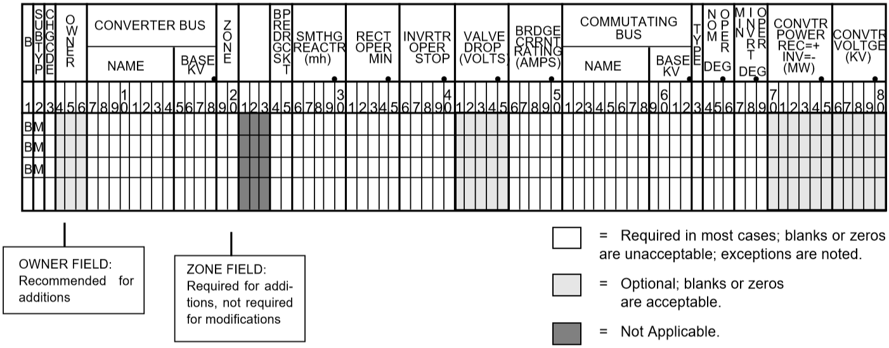

  ``BM`` Subtype Format

.. table:: Column Description for ``BM`` Bus Data

  ====== ======== ======= =====================
  Column ID Field Format  Description
  ====== ======== ======= =====================
  1-2    yes      A2      ``BM`` - Code for multi-terminal dc bus
  3      no       A1      Change code - see System Changes
  4-6    no       A3      Ownership code 
  7-14ac yes      A8      Bus name
  15-18  yes      F4.0    Base kV
  19-20  no       A2      Zone code
  24-25  no       I2      Number of bridges per DC circuit - (Number of converters serially connected)
  26-30  no       F5.1    Smoothing reactor inductance in mh
  31-35  no       F5.1    Minimum ignition delay angle (:math:`\alpha_{min}`) in degrees
  36-40  no       F5.1    Maximum ignition delay angle (:math:`\alpha_{stop}`) in degrees
  41-45  no       F5.1    Converter valve drop per bridge in volts
  46-50  no       F5.1    Maximum converter current in amps
  51-62  no       A8,F4.0 Commutator bus name and base kV of commutator.
  63b    no       A1      Converter code (R1): R — Normal operation as a rectifier I — Normal operation as an Inverter M — Normal operation as an inverter with current margin Blank — A passive DC tap
  64-66  no       F3.1    Normal ignition delay angle (:math:`\alpha_{N}`) if a rectifier, or normal extinction angle (:math:`\gamma_{N}`) if an inverter, in degrees
  67-69  no       F3.1    Minimum ignition angle (:math:`\alpha_{min}`) if a rectifier, or minimum extinction angle (:math:`\gamma_{0}`) in degrees if an inverter 
  70-75c no       F6.1    Scheduled net converter DC output power in MW 
  76-80d no       F5.1    Scheduled converter DC voltage in kV
  ====== ======== ======= =====================

a. A passive DC node has columns 24-80 all blank 
b. If the actual converter operation does not correspond to the converter code, subsequent swing studies will abort. 
c. If the DC power or voltage is not constrained, leave the corresponding field blank or enter a zero value. 
d. If the DC power or voltage is not constrained, leave the corresponding field blank or enter a zero value.

Delete Buses by Area (``DA``)
=============================
This command deletes all buses that reside in the area named in columns 4-13. Place a ``DA`` in the first two columns. Format of the input is shown below. This is a change record and must be preceded with a ``/CHANGES`` command or otherwise reside in a change set.

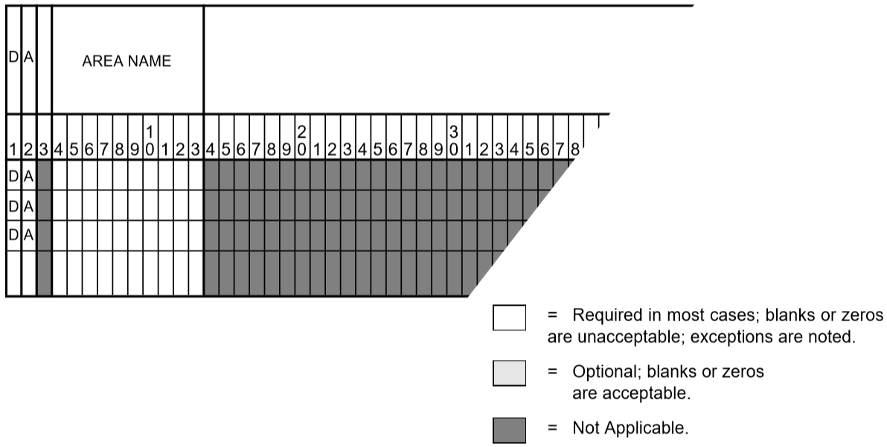

  Area Delete Input Format

.. table:: Column Description for Delete Buses by Area Format

  ====== ======== ====== ====================
  Column ID Field Format Content
  ====== ======== ====== ====================
  1-2    yes      A2     Record type - ``DA``
  4-13   yes      A10    Area Name
  ====== ======== ====== ====================

Delete Buses by Zone (``DZ``)
=============================
This command deletes all buses that reside in the zone named in columns 4-5. Place a ``DZ`` in the first two columns. Format for input is shown below. This is a change record and must be preceded with a ``/CHANGES`` command or otherwise reside in a change set.

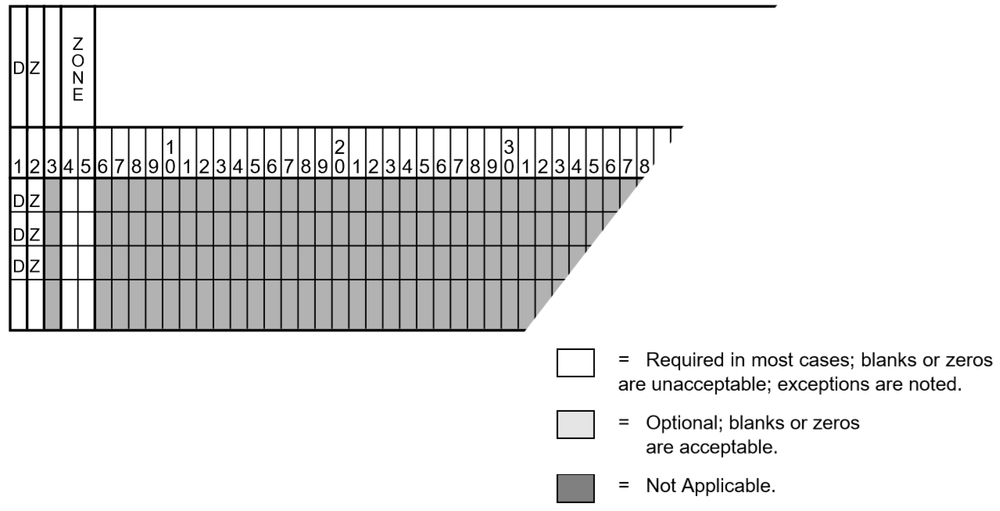

  Zone Delete Input Format

.. table:: Column Description for Delete Buses by Zone Format

  ====== ======== ====== ====================
  Column ID Field Format Content
  ====== ======== ====== ====================
  1-2    yes      A2     Record type - ``DZ``
  4-5    yes      A2     Zone Name
  ====== ======== ====== ====================

Equivalent Transmission Line Branch (``E``)
===========================================
This record differs from the type ``L`` record by allowing for an asymmetrical pi. Two additional fields of data must describe the second leg to ground admittances. The additional fields occupy the columns which are used for line description and mileage on the ``L`` record. In all other aspects, the description of the ``L`` branch pertains also to the type ``E`` branch.

This branch representation is useful for modeling transmission line components that do not have evenly distributed parameters, such as lines with shunt capacitors and line/transformer combinations.

Following is a sample of a coding sheet for equivalent branch data along with descriptions of its various columns.

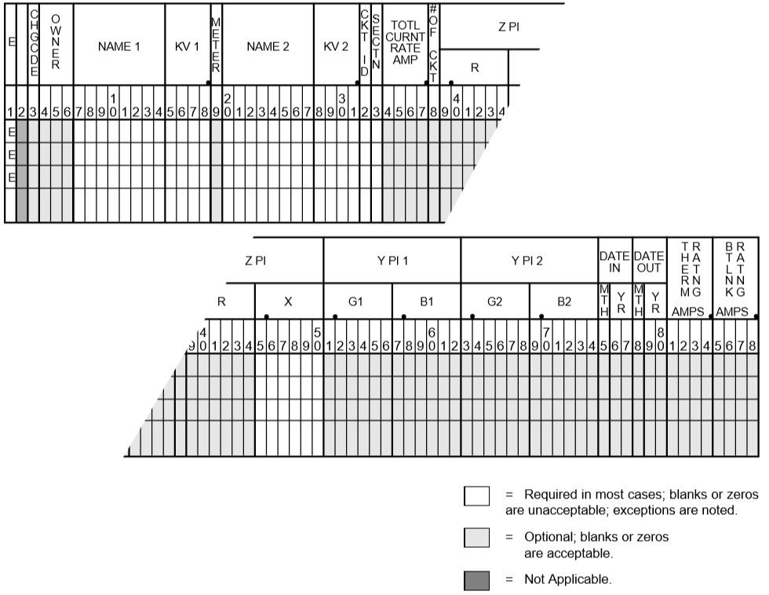

  Equivalent Branch Data Input Format

.. table:: Column Description for Equivalent Branch Data

  +--------+----------+--------+---------------------------------------+
  | Column | ID Field | Format | Description                           |
  +========+==========+========+=======================================+
  | 1      | yes      | A1     | Record type - ``E`` for equivalent    |
  +--------+----------+--------+---------------------------------------+
  | 2      | no       | A1     | Blank                                 |
  +--------+----------+--------+---------------------------------------+
  | 3      | no       | A1     | Change code - see System Changes      |
  +--------+----------+--------+---------------------------------------+
  | 4-6    | no       | A3     | Ownership code - Line and transformer |
  |        |          |        | losses will be summarized by ownership|
  |        |          |        | at end of final area summary.         |
  +--------+----------+--------+---------------------------------------+
  | 7-14   | yes      | A8     | Bus name 1                            |
  +--------+----------+--------+---------------------------------------+
  | 15-18  | yes      | F4.0   | Base kV 1                             |
  +--------+----------+--------+---------------------------------------+
  | 19     | no       | I1     | Tie line metering point flag for area |
  |        |          |        | tie lines. 1 in column 19 provides for|
  |        |          |        | metering at bus name 1 2 in column 19 |
  |        |          |        | provides for metering at bus name 2   |
  |        |          |        | Blank allows for program assumption as|
  |        |          |        | follows:                              |
  |        |          |        |                                       |
  |        |          |        | Metering point will be identified (1) |
  |        |          |        | by location where line ownership      |
  |        |          |        | differs from bus ownership or (2)     |
  |        |          |        | when buses at end of tie line have    |
  |        |          |        | same ownership, then the bus Name 1   |
  |        |          |        | will be the metering point.           |
  +--------+----------+--------+---------------------------------------+
  | 20-27  | yes      | A8     | Bus name 2                            |
  +--------+----------+--------+---------------------------------------+
  | 29-31  | yes      | F4.0   | Base kV 2                             |
  +--------+----------+--------+---------------------------------------+
  | 32     | yes      | A1     | Circuit identification                |
  +--------+----------+--------+---------------------------------------+
  | 33     | yes      | I1     | Section number for making an          |
  |        |          |        | equivalent for series elements.       |
  |        |          |        | (numeric)                             |
  +--------+----------+--------+---------------------------------------+
  | 34-37  | no       | F4.0   | Total ampere rating for all lines     |
  |        |          |        | represented by this record.           |
  +--------+----------+--------+---------------------------------------+
  | 38     | no       | I1     | Number of parallel circuits           |
  |        |          |        | represented by this record, for       |
  |        |          |        | information purposes only. The        |
  |        |          |        | equivalent impedance is entered in    |
  |        |          |        | columns 39-74 for lines with unequal  |
  |        |          |        | legs.                                 |
  +--------+----------+--------+---------------------------------------+
  | 39-50  | no       | 2F6.5  | Per unit R and X on base kV and base  |
  |        |          |        | MVA.                                  |
  +--------+----------+--------+---------------------------------------+
  | 51-62  | no       | 2F6.5  | Per unit G and B at bus name 1 end of |
  |        |          |        | line.                                 |
  +--------+----------+--------+---------------------------------------+
  | 63-74  | no       | 2F6.5  | Per unit G and B at bus name 2 end of | 
  |        |          |        | line.                                 |
  +--------+----------+--------+---------------------------------------+
  | 75-77  | no       | A1,I2  | Energization Date - MYY               |
  |        |          |        |   M = {1,2,3,4,5,6,7,8,9,O,N,D}       |
  |        |          |        |   YY = last two digits of year        |
  +--------+----------+--------+---------------------------------------+
  | 78-80  | no       | A1,I2  | De-energization Data - MYY            |
  |        |          |        |   M = {0,1,2,3,4,5,6,7,8,9,O,N,D}     |
  |        |          |        |   YY = last two digits of year        |
  +--------+----------+--------+---------------------------------------+
  | 81-84  | no       | F4.0   | Thermal ratings in Amps               |
  +--------+----------+--------+---------------------------------------+
  | 85-88  | no       | F4.0   | Bottleneck rating in Amps             |
  +--------+----------+--------+---------------------------------------+

Scheduled Area Intertie (``I``)
===============================
Intertie is the power flowing between two areas. Scheduled Area Intertie are the values scheduled on the area bubble diagrams from which the net area interchange export is derived. The net export is simply the sum of all individual interties emanating from each area. Intertie ``I`` records permit the net area interchange schedules to be defined directly from the scheduled intertie quantities. New net area export is computed from these values; they override any scheduled net interchange on the AC control records.

A coding sheet and column descriptions follow.

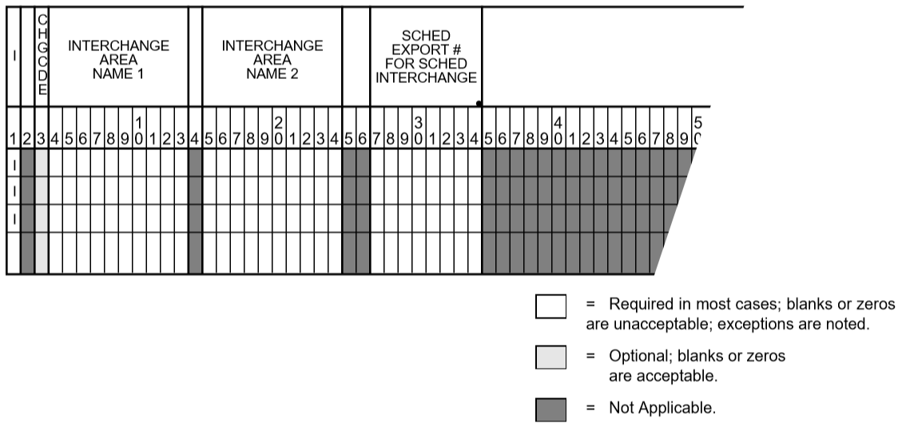

  Area Intertie Input Format

.. table:: Column Description for Scheduled Area Intertie

  ====== ======== ====== =============================================
  Column ID Field Format Description
  ====== ======== ====== =============================================
  1      yes      A1     Record type - ``I``
  3      no       A1     Change code - see System Changes
  4-13   yes      A10    Area 1
  15-24  yes      A10    Area 2
  27-34  no       F8.0   Area 1 - Area 2 export in MW. (Import will be negative.) Blanks are interpreted as 0.0 scheduled export
  ====== ======== ====== =============================================

"Scheduled" is actually misapplied because no direct controls are available to regulate the intertie flow between two areas. Net area export can be controlled using area slack buses, but not interarea export, which requires additional but unavailable intertie slack buses. Therefore, without direct control of intertie, the scheduled flow can never be maintained. The term circulating flow is introduced to reconcile the discrepancy between the scheduled and the actual flow:

  Circulating flow = Scheduled flow - Actual flow

Circulating flow is also a misnomer because it implies wasteful circulating power eddies within a network. If any circulating flow exists, it is introduced deliberately with the application of transformers (MVAR) or phase shifters (MW). Otherwise the flows will always be distributed optimally to minimize losses by simply following Kirchoff’s voltage and current laws. The circulating flows are calculated in the interchange output.

Balanced Transmission Line Branch (``L``)
=========================================
This record defines the identification and the electrical characteristics of a line, section of a line or series capacitor. The model assumes the form of a lumped, symmetric pi. The following identifies a branch item:

  * Line type (``L`` in this case).
  * Bus 1 (name and base kV) and bus 2 (name and base kV).
  * Circuit identification if more than one parallel branch exits.
  * Section number (if appropriate).

Lines can be divided into equivalent series elements identified with unique section numbers. Section numbers need not be consecutive, but must be unique. Sections are presumed to be physically ordered such that the lowest numbered section is connected to bus 1 and the highest is connected to bus 2.

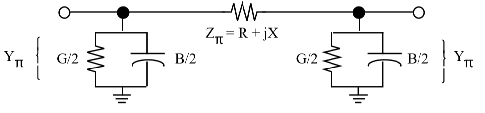

  Balanced Transmission Line Branch

The entries in ``RATING`` and ``MILES`` are used in output to flag overloaded lines and produce a MW-Miles listing by ownership and voltage class if requested.

The metering point (1 or 2) is used when the line spans two areas which are controlled. A simple comparison of the zones for each terminal bus will determine if that branch is a tie line. The metering point field determines which end of a line will represent the area boundary. The line losses are assigned to the other area. The entry in the ``No. of CKTS`` field (column 38) identifies the number of parallel branches represented by the branch item. A blank or zero is interpreted as one. This is for information purposes only.

The ``DATE IN`` and ``DATE OUT`` columns specify the expected energization and de-energization dates. These are used for descriptive purposes

To simulate a bus tie or bus sectionalizing breaker normally closed, a line impedance of :math:`X = 0.00020 p.u.` is used. This allows two sections to be connected or disconnected by adding or deleting this branch.

A sample coding sheet with column explanations follows.

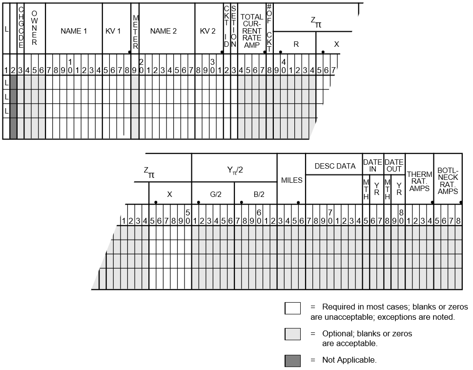

  Transmission Line Data Input Format

.. table:: 

  +--------+----------+--------+---------------------------------------------------------+
  | Column | ID Field | Format | Description                                             |
  +========+==========+========+=========================================================+
  | 1      | yes      | A1     | Record type - ``L`` for branch                          |
  +--------+----------+--------+---------------------------------------------------------+
  | 2      | no       | A1     | Blank                                                   |
  +--------+----------+--------+---------------------------------------------------------+
  | 3      | no       | A1     | Change code - see System Changes                        |
  +--------+----------+--------+---------------------------------------------------------+
  | 4-6    | no       | A3     | Ownership code - Line and transformer losses will be    |
  |        |          |        | summarized by ownership at end of final area summary.   |
  +--------+----------+--------+---------------------------------------------------------+
  | 7-14   | yes      | A8     | Bus name 1                                              |
  +--------+----------+--------+---------------------------------------------------------+
  | 15-18  | yes      | F4.0   | Base kV 1                                               |
  +--------+----------+--------+---------------------------------------------------------+
  | 19     | no       | I1     | The line metering point for area tie lines. 1 in column |
  |        |          |        | 19 provides for metering at bus name 1 end. 2 in column |
  |        |          |        | 19 provides for metering at bus name 2 end. Blank allows|
  |        |          |        | for program assumption as follows:                      |
  |        |          |        |                                                         |
  |        |          |        | Metering point will be identified (1) by location where |
  |        |          |        | line ownership differs from bus ownership or (2) when   |
  |        |          |        | buses at end of tie line have same ownership, then the  |
  |        |          |        | bus name 1 will be the metering point.                  |
  +--------+----------+--------+---------------------------------------------------------+
  | 20-27  | yes      | A8     | Bus name 2                                              |
  +--------+----------+--------+---------------------------------------------------------+
  | 29-31  | yes      | F4.0   | Base kV 2                                               |
  +--------+----------+--------+---------------------------------------------------------+
  | 32     | no       | A1     | Circuit identification if more than one parallel branch |
  |        |          |        | exists.                                                 |
  +--------+----------+--------+---------------------------------------------------------+
  | 33     | no       | I1     | Section number for making an equivalent for series      |
  |        |          |        | elements (numeric). Program assembles series elements in|
  |        |          |        | numerical order of section numbers (need not be         |
  |        |          |        | consecutive).                                           |
  +--------+----------+--------+---------------------------------------------------------+
  | 34-37  | no       | F4.0   | Total ampere rating for all lines.                      |
  +--------+----------+--------+---------------------------------------------------------+
  | 38     | no       | I1     | Number of parallel circuits represented by this record, | 
  |        |          |        | for information purposes only. The equivalent impedance |
  |        |          |        | is entered in columns 39-62 for lines with equal legs.  |
  +--------+----------+--------+---------------------------------------------------------+
  | 39-44  | no       | F6.5   | Per unit R at base kV and base MVA (normally 100).      |
  +--------+----------+--------+---------------------------------------------------------+
  | 45-50  | no       | F6.5   | Per unit X at base kV and base MVA (normally 100).      |
  +--------+----------+--------+---------------------------------------------------------+
  | 51-56  | no       | F6.5   | Per unit G_pi/2 at base kV and MVA (normally 100). This |
  |        |          |        | format is for balanced lines when Y_pi sending equals   |
  |        |          |        | Y_pi receiving and only Y_pi needs to be input.         |
  +--------+----------+--------+---------------------------------------------------------+
  | 57-62  | no       | F6.5   | Per unit B_pi/2 at base kV and MVA (normally 100). This |
  |        |          |        | format is for balanced lines when Y_pi sending equals   |
  |        |          |        | Y_pi receiving and only Y_pi needs to be input.         |
  +--------+----------+--------+---------------------------------------------------------+
  | 63-66  | no       | F4.1   | Circuit miles of line or section.                       |
  +--------+----------+--------+---------------------------------------------------------+
  | 67-74  | no       | A8     | Descriptive data (alphanumeric, for example 6-wire).    |
  +--------+----------+--------+---------------------------------------------------------+
  | 75-77  | no       | A1,I2  | Energization Date - MYY                                 |
  |        |          |        |   M = {1,2,3,4,5,6,7,8,9,O,N,D}                         |
  |        |          |        |   YY = last two digits of year                          |
  +--------+----------+--------+---------------------------------------------------------+
  | 78-80  | no       | A1,I2  | De-energization Data - MYY                              |
  |        |          |        |   M = {0,1,2,3,4,5,6,7,8,9,O,N,D}                       |
  |        |          |        |   YY = last two digits of year                          |
  +--------+----------+--------+---------------------------------------------------------+
  | 81-84  | no       | F4.0   | Thermal rating in Amps                                  |
  +--------+----------+--------+---------------------------------------------------------+
  | 85-88  | no       | F4.0   | Bottleneck rating in Amps                               |
  +--------+----------+--------+---------------------------------------------------------+
 
Two-Terminal DC Line (``LD``)
=============================
This record is used in conjunction with the two dc bus records; collectively they define the dc model. The dc line data contains pertinent information describing the electrical characteristics of the line, the scheduled dc power and voltage, and the initial firing and extinction angles.

Distinction between the inverter and rectifier buses is made with the dc line record using the sign of the scheduled dc power. The direction of power flow is always from rectifier to inverter, and the criteria assumes positive values from bus 1 to bus 2 on the record. Thus, simple modifications in the line data permit power reversals to be modeled with a minimum of data changes.
A sample dc line data coding form and column descriptions follow. See Figure 3-33 and Table 3-25.

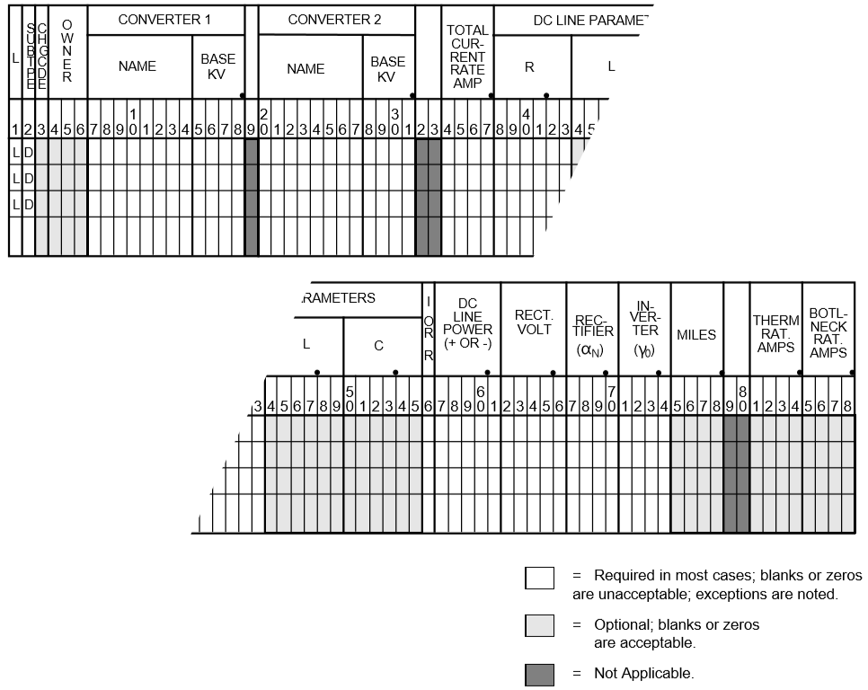

  DC Line Data Input Format

.. table:: Column Description for DC Line Data

  +---------+----------+--------+-----------------------------------------------------------+
  | Columns | ID Field | Format | Descriptions                                              |
  +=========+==========+========+===========================================================+
  | 1-2     | yes      | A2     | Record code - ``LD`` for DC line                          |
  +---------+----------+--------+-----------------------------------------------------------+
  | 3       | no       | A1     | Change code - see System Changes                          |
  +---------+----------+--------+-----------------------------------------------------------+
  | 4-6     | no       | A3     | Ownership code, same as on Bus record                     |
  +---------+----------+--------+-----------------------------------------------------------+
  | 7-14    | yes      | A8     | Converter bus name 1 (conventionally the rectifier)       |
  +---------+----------+--------+-----------------------------------------------------------+
  | 15-18   | yes      | F4.0   | Base kV 1                                                 |
  +---------+----------+--------+-----------------------------------------------------------+
  | 20-27   | yes      | A8     | Converter bus name 2 (conventionally the inverter)        |
  +---------+----------+--------+-----------------------------------------------------------+
  | 29-31   | yes      | F4.0   | Base kV 2                                                 |
  +---------+----------+--------+-----------------------------------------------------------+
  | 34-37   | no       | F4.0   | I rating (amps) - Maximum DC line current in amperes.     |
  +---------+----------+--------+-----------------------------------------------------------+
  | 38-43   | no       | F6.2   | R (ohms) - DC line resistance, ohms.                      |
  +---------+----------+--------+-----------------------------------------------------------+
  | 44-49   | no       | F6.2   | L (mH) - DC line inductance, millihenries                 |
  +---------+----------+--------+-----------------------------------------------------------+
  | 50-55   | no       | F6.2   | C (uF) - DC line capacitance, microfarads.                |
  +---------+----------+--------+-----------------------------------------------------------+
  | 56      | no       | A1     | Inverter or rectifier control - Enter ``R`` for rectifier |
  |         |          |        | control or ``I`` for inverter control (point of DC line   |
  |         |          |        | in which scheduled power is measured).                    |
  +---------+----------+--------+-----------------------------------------------------------+
  | 57-61   | no       | F5.1   | Schedule DC power (MW) - Scheduled DC power in megawatts  |
  |         |          |        | from converter 1 to 2 metered at the end indicated by     |
  |         |          |        | ``I`` or ``R`` in column 56.                              |
  +---------+----------+--------+-----------------------------------------------------------+
  | 62-66   | no       | F5.1   | Schedule DC line volts (kV) - at rectifier end of DC     |
  |         |          |        | line.                                                     |
  +---------+----------+--------+-----------------------------------------------------------+
  | 67-70   | no       | F4.1   | Rectifier (:math:`\alpha_N`) - Initial firing angle in   |
  |         |          |        | degrees at rectifier.                                     |
  +---------+----------+--------+-----------------------------------------------------------+
  | 71-74   | no       | F4.1   | Inverter (:math:`\gamma_0`) - Minimum margin angle in     |
  |         |          |        | degrees at inverter.                                      |
  +---------+----------+--------+-----------------------------------------------------------+
  | 75-78   | no       | F4.0   | Miles - Descriptive information only.                     |
  +---------+----------+--------+-----------------------------------------------------------+
  | 81-84   | no       | F4.0   | Thermal rating in Amps                                    |
  +---------+----------+--------+-----------------------------------------------------------+
  | 85-88   | no       |  F4.0  | Bottleneck rating in Amps                                 |
  +---------+----------+--------+-----------------------------------------------------------+

Multiterminal DC Line (``LM``)
==============================
This data is used in conjunction with multiterminal DC bus data type ``M``. The line data together with the DC bus data define the DC converter terminals and interconnecting DC lines for a multiterminal DC network. This line data contains only the fields for some of the converter quantities which were included on the two-terminal DC format.

Two-terminal (type ``D``) and multiterminal (type ``M``) data may coexist within the same base, but cannot coexist on the same ``DC`` circuit.

The following shows the multiterminal DC line data coding form format. It is followed by explanations of its various columns.

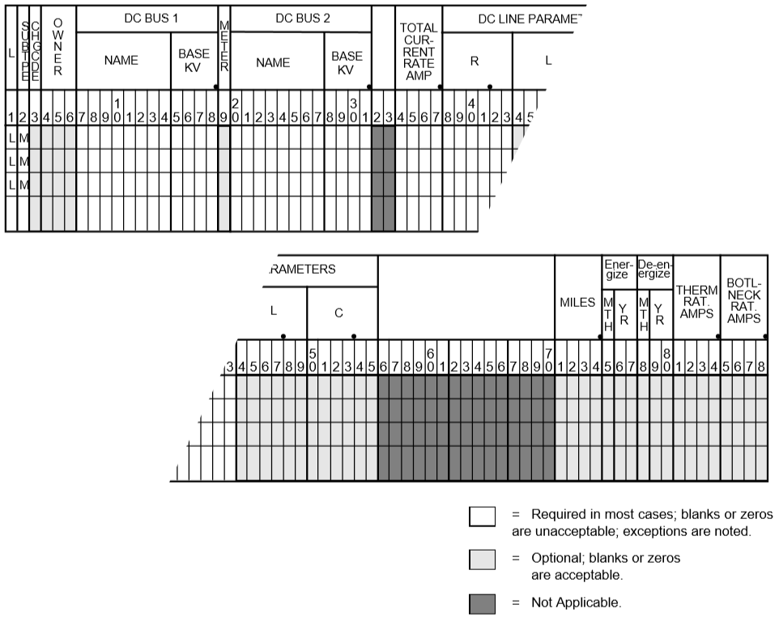

.. table:: Column Description for Multiterminal DC Line Type ``LM``

  +---------+----------+--------+---------------------------------------------------------+
  | Column  | ID Field | Format | Description                                             |
  +=========+==========+========+=========================================================+
  | 1-2     | yes      | A2     | Record Code - ``LM`` for multiterminal DC line          |
  +---------+----------+--------+---------------------------------------------------------+
  | 3       | no       | A1     | Change code - see System Changes                        |
  +---------+----------+--------+---------------------------------------------------------+
  | 4-6     | no       | A3     | Ownership code, same as on bus data record              |
  +---------+----------+--------+---------------------------------------------------------+
  | 7-14    | yes      | A8     | DC bus name 1                                           |
  +---------+----------+--------+---------------------------------------------------------+
  | 15-18   | yes      | F4.0   | Base kV 1                                               |
  +---------+----------+--------+---------------------------------------------------------+
  | 19      | no       | I1     | Tie line metering point for area tie lines. 1 in column |
  |         |          |        | 19 provides for metering at bus name 1 end. 2 in column |
  |         |          |        | 19 provides for metering at bus name 2 end. Blank allows|
  |         |          |        | for program assumption as follows:                      |
  |         |          |        |                                                         |
  |         |          |        | Metering point will be identified (1) by location where | 
  |         |          |        | line ownership differs from bus ownership or (2) when   |
  |         |          |        | buses at end of tie line have same ownership, then the  |
  |         |          |        | bus name 1 will be the metering point                   |
  +---------+----------+--------+---------------------------------------------------------+
  | 20-27   | yes      | A8     | DC bus name 2                                           |
  +---------+----------+--------+---------------------------------------------------------+
  | 29-31   | yes      | F4.0   | Base kV 2                                               |
  +---------+----------+--------+---------------------------------------------------------+
  | 34-37   | no       | F4.0   | I Rating (Amps) - Maximum DC line current in amperes    |
  +---------+----------+--------+---------------------------------------------------------+
  | 38-43   | no       | F6.2   | R (Ohms) - DC line resistance in ohms                   |
  +---------+----------+--------+---------------------------------------------------------+
  | 44-49   | no       | F6.2   | L (mH) - DC line inductance in millihenries             |
  +---------+----------+--------+---------------------------------------------------------+
  | 50-55   | no       | F6.2   | C (uF) - DC line capacitance in microfarads             |
  +---------+----------+--------+---------------------------------------------------------+
  | 71-74   | no       | F4.0   | Miles - Descriptive information only                    |
  +---------+----------+--------+---------------------------------------------------------+
  | 75-77   | no       | A1,I2  | Energization Date - MYY                                 |
  |         |          |        |  M = {1,2,3,4,5,6,7,8,9,O,N,D}                          |
  |         |          |        |  YY = last two digits of year                           |
  +---------+----------+--------+---------------------------------------------------------+
  | 78-80   | no       | A1,I2  | De-energization Data - MYY                              |
  |         |          |        |  M = {0,1,2,3,4,5,6,7,8,9,O,N,D}                        |
  |         |          |        |  YY = last two digits of year                           |
  +---------+----------+--------+---------------------------------------------------------+

Factor Change (``PO``, ``PZ``, ``PN``, ``PA``, ``PB``, ``PC``, ``PD``)
======================================================================
A specialized change record with a ``P`` in column 1 enables the loads and generation for all or part of the network to be changed on a multiplying factor basis. These records follow a ``/CHANGES`` statement and any ``Z`` records.

.. note:: 

  These change record types were formerly called “Percentage Changes.” This is a change record and must be preceded with a ``/CHANGES`` command or otherwise reside in a change set.

Factor changes are performed before any other bus changes are made; therefore, any subsequent bus changes will be unaffected by factor changes. Separate fields permit both active and reactive generation and the active and reactive load to be changed at independent factor. The formula is:

.. math::

  NEW INJECTION = OLD INJECTION  *  (FACTOR)

A blank or 1.0 factor retains the present value of the injection while a factor of 2.0 will double the present value.

There are separate factors for :math:`P` and :math:`Q`. If the :math:`Q` factor is blank, it will default to the :math:`P` factor. For example, if only the :math:`P` is to be changed by 0.95 and the :math:`Q` left alone, set the :math:`P` factor = .95 and :math:`Q` factor = 1.0.

Six different subtypes are permitted. Different subtypes may be submitted together. (Their formats are shown on the following pages.)

  Subtype ``O`` Factor change by ownerships (20 maximum). All AC bus and continuation bus loads and generation with the given ownership will be changed by the specified factors.

  Subtype ``Z`` Factor change by zones (20 maximum). All AC bus and continuation bus loads and generation within the depicted zones will be changed by the specified factors.

  Subtype ``N`` Factor change by zone on all nonindustrial loads and generation (20 maximum). All AC bus and continuation bus data except +A, +F, +I or +P continuation bus data within the designated zones will be changed by the specified factors. All zones may be changed with one record having a key zone 00 (zero-zero).
  
  Subtype ``A`` Factor change on all loads and generation on all AC bus and continuation bus data (1 only).
  
  Subtype ``B`` Factor change by ownerships (20 maximum). All constant impedance and constant current distributed (``+ A01``, ``+ *I``, ``+ *P``) loads with the given ownership will be changed by the specified factor.
  
  Subtype ``C`` Factor change by zones (20 maximum). All constant impedance and constant distributed loads (``+ A01``, ``+ *I``, ``+ *P``) with the given zone will be changed by the specified factor.
  
  Subtype ``D`` Factor change by zones (20 maximum). all non-industrial loads within the given zones and optional ownership will be converted into constant impedance and constant current loads.

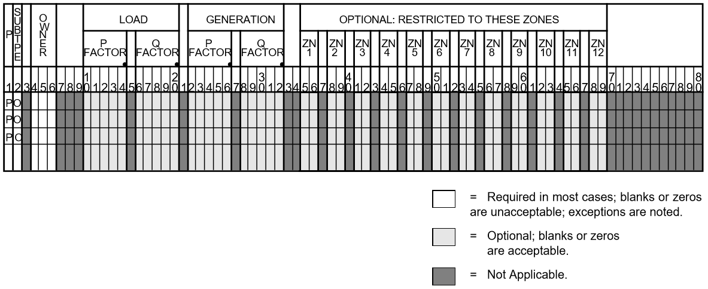

  Factor Changen by Ownerships

  Factor Change by Zones

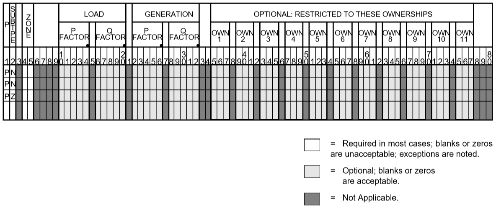

  Factor Change by Nonindustrial Loads

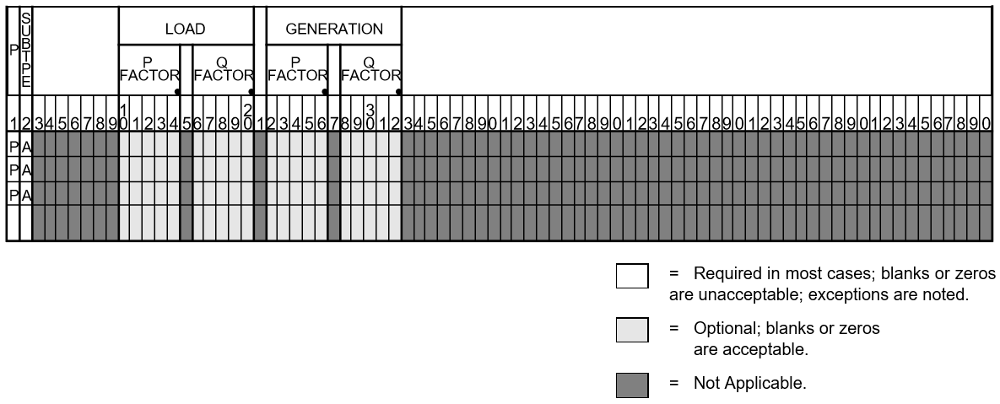

  Factor Change on All Loads and Generation

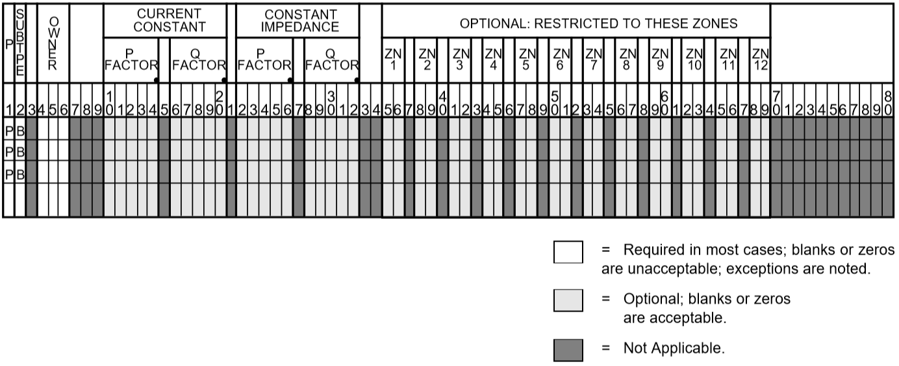

  Factor Change by Ownerships of Constant Current and Impeadance Loads

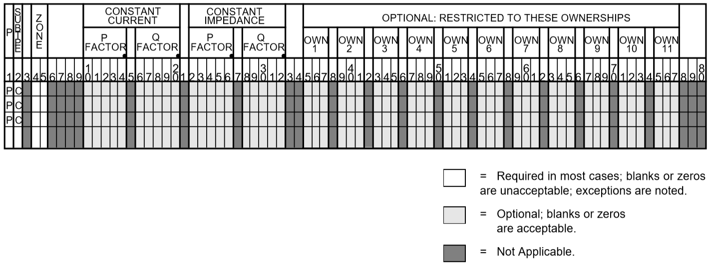

  Factor Change by Zones of Constant Current and Impedance Loads

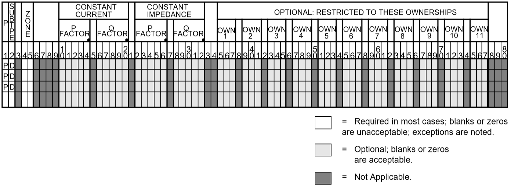

  Factor Change by Nonindustrial Loads of Constant Current and Impedance Loads

.. table:: Column Description of Factor Change Record

  +--------+-------+----------+------------------------------------------------------+
  | Column |       | Format   | Description                                          |
  +========+=======+==========+======================================================+
  | 1      | yes   | A1       | Record type - ``P`` factor change (``P`` represents  |
  |        |       |          | its former name Percentage Changes)                  |
  +--------+-------+----------+------------------------------------------------------+
  | 2      | yes   | A1       | Subtype                                              |
  |        |       |          |   ``O`` for ownerships                               |
  |        |       |          |   ``Z`` for all loads in selected zones              |
  |        |       |          |   ``N`` for nonindustrial loads in selected zones    |
  |        |       |          |   ``A`` for all loads and generatives                |
  |        |       |          |   ``B`` for constant current and constant impedance  |
  |        |       |          |      loads by ownership                              |
  |        |       |          |   ``C`` for constant current and constant impedance  |
  |        |       |          |      loads by zones                                  |
  +--------+-------+----------+------------------------------------------------------+
  | 10-14  | no    | F5.0     | P factor (decimal fraction) for load                 |
  +--------+-------+----------+------------------------------------------------------+
  | 16-20  | no    | F5.0     | Q factor (decimal fraction) for load                 |
  +--------+-------+----------+------------------------------------------------------+
  | 22-26  | no    | F5.0     | P factor (decimal fraction) for generation or        |
  |        |       |          | constant impedance loads                             |
  +--------+-------+----------+------------------------------------------------------+
  | 28-32  | no    | F5.0     | Q factor (decimal fraction) for generation or        |
  |        |       |          | constant impedance loads                             |
  +--------+-------+----------+------------------------------------------------------+
  | Subtypes O and B - record |                                                      |
  +--------+-------+----------+------------------------------------------------------+
  | 4-6    | yes   | A3       | Owner code                                           |
  +--------+-------+----------+------------------------------------------------------+
  | 35-80  | no    | (A2,1X)  | Optional list of zone codes separated by single      |
  |        |       |          | blanks. Change will be restricted to these listed    |
  |        |       |          | zones. If no list, all zones are assumed. Note:      |
  |        |       |          | Subtype C is restricted to the following types of    |
  |        |       |          | continuation buses: +A01, +A02, \*P, \*I.            |
  +--------+-------+----------+------------------------------------------------------+
  | Subtypes Z, C, and N      |                                                      |
  +--------+-------+----------+------------------------------------------------------+
  | 4-5    | yes   | A2       | Zone code                                            |
  +--------+-------+----------+------------------------------------------------------+
  | 35-80  | no    | (A3,1X)  | Optional list of ownership codes separated by single |
  |        |       |          | blanks. Change will be restricted to these listed    |
  |        |       |          | owners, if no list, all owners are assumed. Note:    |
  |        |       |          | Subtype C is restricted to the following types of    |
  |        |       |          | continuation buses: ``+A01``, ``+A02``, ``*P``,    |
  |        |       |          | ``*I.``                                              |
  +--------+-------+----------+------------------------------------------------------+

Reactive Capability Curves (``QP``, ``QX``, ``QN``)
===================================================
Three records are required to define a curve: ``QP``, ``QX``, and ``QN``. They may appear anywhere in the input stream although they normally are put immediately after the bus record to which the curve applies. Each curve applies only to the bus named.

Description
-----------
The generator capability curve model is a composite of two representations of a synchronous machine capability curve. The first model consists of a set of 1-14 points depicting a piece-wise linear representation of the Q-P characteristics; the second model consists of an optional, constant MVA representation.

As shown in the figure below, the generator capability curve model consists of a series of 1-15 points on the P-Q diagram and a constant MVA secant. Each point is defined by specifying a value for :math:`P` followed by values for :math:`Q_{max}` and :math:`Q_{min}`. The constant MVA is specified with :math:`MMVA` (Machine MVA), a leading powerfactor (positive reactive), and a lagging powerfactor (negative reactive). If :math:`MMVA` is zero, the reactive capability curve is specified exclusively with :math:`P`, :math:`Q_{max}`, and :math:`Q_{min}` points

If the optional constant MVA representation is invoked, it takes precedence over any (:math:`P`, :math:`Q_{max}`, :math:`Q_{min}`) point. (Overlap is determined by :math:`P_{gen}`.)

If the minimum absolute value for :math:`P` is less than the first entered value (:math:`P_1`), then the model will set the values for :math:`Q_{max}` and :math:`Q_{min}` equal to :math:`Q_{max1}` and :math:`Q_{min1}`. For any point :math:`ABS (P_{gen})` between :math:`P_1` and :math:`MMVA`, the model will linearly interpolate between the :math:`Q` values for :math:`P_j` just greater than and :math:`P_{j-1}` just less than :math:`ABS(P_{gen})`. :math:`P_{gen}` greater than :math:`MMVA` generates a fatal data error.

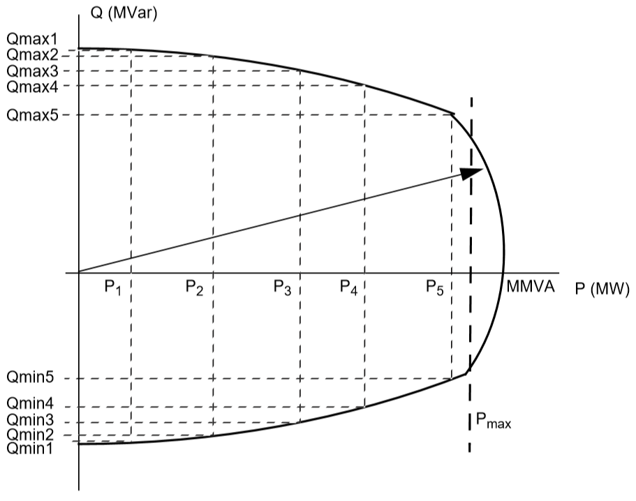

  Generator Capability Curve Model

Processing
----------
Before solution of the case, each ``BE``, ``BG``, ``BQ``, ``BX``, and ``BS`` bus is checked to see if a PQ curve is to be used to set its Q limits. If not, the :math:`Q_{min}` and :math:`Q_{max}` already stored are used, that is, those read from the bus record or calculated from a prior solution. If a curve is active, the values calculated using it replace those formerly stored. Original input values from the bus record are not saved. 

.. table:: Column Description for Reactive Capability Curves

  +--------+----------+--------+-----------------------------------------------+
  | Column | ID Field | Format | Description                                   |
  +--------+----------+--------+-----------------------------------------------+
  | 1-2    | yes      | A2     | Record Code -                                 |
  |        |          |        |   QP for Pgen values (positive values only)   |
  |        |          |        |   QX for Qmax values (positive values)        |
  |        |          |        |   QN for Qmin values (negative values)        |
  +--------+----------+--------+-----------------------------------------------+
  | 3      | no       | A1     | Change code - For QP record only:             |
  |        |          |        |   D = Delete curve for this bus.              |
  |        |          |        |   M = Change p.u. code or activity flag.      |
  |        |          |        |   *This cannot be used to alter curve data.*  |
  |        |          |        |                                               |
  |        |          |        | To change curve data, enter a complete new    |
  |        |          |        | set. It is not necessary to delete the curve  |
  |        |          |        | first; new data will replace the old. Column  |
  |        |          |        | 3 must be blank.                              |
  +--------+----------+--------+-----------------------------------------------+
  | 4-5    | no       | A2     | Unit ID (for informational purposes)          |
  +--------+----------+--------+-----------------------------------------------+
  | 6      | no       | A1     | Activity flag For ``QP`` record only:         |
  |        |          |        |   Blank = Curve active (default when data     |
  |        |          |        |   is entered).                                |
  |        |          |        |   *  = Inactivate curve.                      |
  |        |          |        |   A  = Activate formerly inactive curve.      |
  +--------+----------+--------+-----------------------------------------------+
  | 7-14   | yes      | A8     | Bus name                                      |
  +--------+----------+--------+-----------------------------------------------+
  | 15-18  | yes      | F4.0   | Base kV                                       |
  +--------+----------+--------+-----------------------------------------------+
  | 19-20  | no       | I2     | Number of units. Total used is number of      |
  |        |          |        | units times the values specified (            |
  |        |          |        | :math:`P_{gen}`, :math:`Q_{max}`,             |
  |        |          |        | :math:`Q_{min}` ))                            |
  +--------+----------+--------+-----------------------------------------------+
  | 21-25  | no       | F5.2   | QP - Maximum MVA                              |
  |        |          |        | QX - Positive (leading) power factor for Qmax |
  |        |          |        | QN - Negative (lagging) power factor for Qmin |
  +--------+----------+--------+-----------------------------------------------+
  | 26-30  | no       | F5.2   | Maximum Pgen (MW/unit). This is an optional   |
  |        |          |        | hard limit, designating a maximum operating   |
  |        |          |        | limit.                                        |
  +--------+----------+--------+-----------------------------------------------+
  | 31-120 | no       | 15F6.2 | Up to 15 values for Pgen, Qmax , or Qmin      |
  |        |          |        | depending on the card type. The values for    |
  |        |          |        | Pgen can be in any order, but the related     |
  |        |          |        | Qmin, Qmax values must correspond. Entries    |
  |        |          |        | must be in consecutive fields with no blank   |
  |        |          |        | entries between. Pgen (1) must be 0.0.        |
  +--------+----------+--------+-----------------------------------------------+

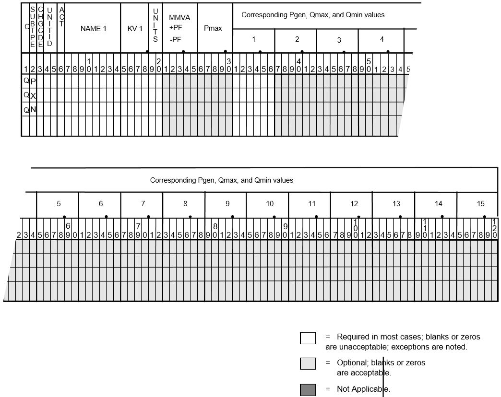

  Reactive Capability Curve ``QP`` Record

.. _regulating-transformer:

Regulating Transformer (``R``, ``RV``, ``RQ``, ``RP``, ``RN``, ``RM``)
======================================================================
This record gives a fixed transformer or phase shifter automatic regulating or control status, provided the proper LTC options on the LTC control record are specified to activate these controls.

This record defines the range of adjustable taps or angles, identifies the adjustable tap side and specifies the desired control and quantity to be held.

The variable tap side of the LTC transformer can be specified in column 19. It can also be determined by comparing the tap range with the base kV at each terminal. If this fails to encompass either base kV, the variable tap side is assigned to the alphabetically highest terminal.

The tap or angle specified on a T record determines the initial parameter setting. If this setting is not encompassed by the LTC tap range, the R record is temporarily deactivated in the solution routine with diagnostic messages. The default LTC control can also be enabled by the command::

  / SOLUTION 
  > MISC_CNTRL, ..., LTC=ON, ... (Full LTC control)
                         ON_NV (RP,RQ,RM,RN only)
                         ON_NPS (R,RQ,RN only)
                         ON_DCONL(commutating LTC transformers on) 
                         OFF

If an LTC transformer reaches a tap limit, the control is temporarily deactivated.

All regulating transformers have provision for either continuous or discrete tap positions. Discretization occurs automatically after a continuous solution is formed.

Several subtypes are available:

  Subtype Blank or Subtype ``V`` This specifies LTC voltage control on either of the terminal buses. The controlled voltage is entered on the appropriate bus record. The terminal being controlled may be an subtype except ``G``, ``X`` or ``S``. If the controlled bus has local reactive control (subtypes ``E`` or ``Q`` within its limits) the LTC feature is temporarily deactivated. However, if both terminal buses of the transformer are simultaneously reactively controlled, the LTC transformer assumes a different control to minimize the var exchange between buses. This assumes most effective utilization of local VAR sources.

  Subtype ``Q`` This specifies an LTC transformer that controls the VAR flow through itself. Positive controlled quantities are from bus 1 to bus 2. However, for simplicity, the control point is taken inside the equivalent pi from the fixed tap side to the variable tap side. The controlled VARs value is :math:`Q_{scheduled} +/- Q_{tolerance}` when :math:`Q_{tolerance}` is the MIN scheduled field and :math:`Q_{scheduled}` is the MAX scheduled field.

  Subtype ``P`` This subtype defines an LTC phase shifter that controls real power flowing through itself. Positive controlled quantities are from bus 1 to bus 2. However, for simplicity, the control point is taken inside the equivalent pi. The controlled power is :math:`P_{scheduled} +/- P_{tolerance}` (:math:`P_{scheduled}` = MAX SCHED; :math:`P_{tolerance}` = MIN SCHED).

  Subtype ``N`` This specifies an LTC transformer that provides constraints on the reactive power flow through itself. Ordinarily, it provides no control, but if its reactive flow limits are exceeded, it becomes a type Q LTC transformer and holds the MVAR flow within the inequality constraints assigned. The controlled flow is within :math:`Q_{min} \leq Q_{max}' (:math:`Q_{min}` = ``MIN SCHED``; :math:`Q_{max}` = ``MAX SCHED``).

  Subtype ``M`` This specifies an LTC phase shifter that provides constraints on the active power flow through itself. Ordinarily, it provides no control, but if its active power limits are exceeded, it becomes a type ``P`` LTC phase shifter and holds the MW flow within the inequality constraints assigned. The controlled real power flow is within limits :math:`P_{min} \leq P_{max}` (:math:`P_{min}` = ``MIN SCHED``; :math:`P_{max}` = ``MAX SCHED``).

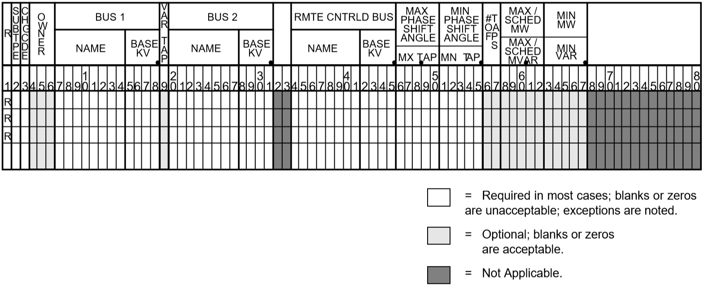

  Regulating Transformer Data Input Input Format

.. table:: Column Description for Regulating Transformer Data

  +--------+----------+--------+------------------------------------------------------+
  | Column | ID Field | Format | Description                                          |
  +========+==========+========+======================================================+
  | 1      | yes      | A1     | Record type - ``R`` for LTC and automatic            |
  |        |          |        | phase-shifter data. A record type ``T`` must be in   |
  |        |          |        | same system to provide full data required.           |
  +--------+----------+--------+------------------------------------------------------+
  | 2      | no       | A1     | Subtype - See regulating transformer and             |
  |        |          |        | phase-shifter subtypes.                              |
  +--------+----------+--------+------------------------------------------------------+
  | 3      | no       | A1     | Change code - see System Changes                     |
  +--------+----------+--------+------------------------------------------------------+
  | 4-6    | no       | A3     | Ownership code                                       |
  +--------+----------+--------+------------------------------------------------------+
  | 7-14   | yes      | A8     | Bus name 1                                           |
  +--------+----------+--------+------------------------------------------------------+
  | 15-18  | yes      | F4.0   | Base kV 1                                            |
  +--------+----------+--------+------------------------------------------------------+
  | 19     | no       | I1     | Variable tap side if T_max and T_min cannot orient   |
  |        |          |        | T_x. 0 - Low alpha is fixed 1 - Bus 1 is variable 2  |
  |        |          |        | - Bus 2 is variable                                  |
  +--------+----------+--------+------------------------------------------------------+
  | 20-27  | yes      | A8     | Bus name 2                                           |
  +--------+----------+--------+------------------------------------------------------+
  | 29-31  | yes      | F4.0   | Base kV 2                                            |
  +--------+----------+--------+------------------------------------------------------+
  | 34-45  | no       | A8,F4.0| Controlled bus name and base kV                      |
  +--------+----------+--------+------------------------------------------------------+
  | Multiple Use of columns 46-67 For subtypes blank, ``V``, ``Q`` and ``N``          |
  +--------+----------+--------+------------------------------------------------------+
  | 46-55  | no       | 2F5.2  | Maximum and minimum kV taps. Data must be entered.   |
  +--------+----------+--------+------------------------------------------------------+
  | 56-57  | no       | I2     | Total number of LTC taps. If blank, program assumes  |
  |        |          |        | continuous action.                                   |
  +--------+----------+--------+------------------------------------------------------+
  | 58-67  | no       | 2F5.0  | Scheduled MVAR flow (subtype ``Q``) or maximum and   |
  |        |          |        | minimum MVAR flow (subtype ``N``) through transformer|
  |        |          |        | Metered at bus name 1 on this record.                |
  +--------+----------+--------+------------------------------------------------------+
  | For subtypes P and M                                                              |
  +--------+----------+--------+------------------------------------------------------+
  | 46-55  | no       | 2F5.2  | Maximum and minimum angle in degrees. Data must be   |
  |        |          |        | entered.                                             |
  +--------+----------+--------+------------------------------------------------------+
  | 56-57  | no       | I2     | Total number of phase shift positions available. If  |
  |        |          |        | blank, program assumes continuous action.            |
  +--------+----------+--------+------------------------------------------------------+
  | 58-67  | no       | 2F5.0  | Scheduled MW flow (subtype ``P``) or maximum and     |
  |        |          |        | minimum MW flow (subtype ``M``) through transformer. |
  |        |          |        | Metered at bus name 1 on this record.                |
  +--------+----------+--------+------------------------------------------------------+
  | For all subtypes                                                                  |
  +--------+----------+--------+------------------------------------------------------+
  | 75-77  | no       | A1,I2  | Energization Date - MYY                              |
  |        |          |        |   M = {1,2,3,4,5,6,7,8,9,O,N,D}                      |
  |        |          |        |   YY = last two digits                               |
  +--------+----------+--------+------------------------------------------------------+
  | 78-80  | no       | A1,I2  | De-energization Date - MYY                           |
  |        |          |        |   M = {1,2,3,4,5,6,7,8,9,O,N,D}                      |
  |        |          |        |   YY = last two digits                               |
  +--------+----------+--------+------------------------------------------------------+

Series Compensated RANI Model (``RZ``)
======================================
RANI stands for Rapid Adjustment of Network Impedance and represents a series connected thyristor which changes its series impedance to control power or voltage. See table below.

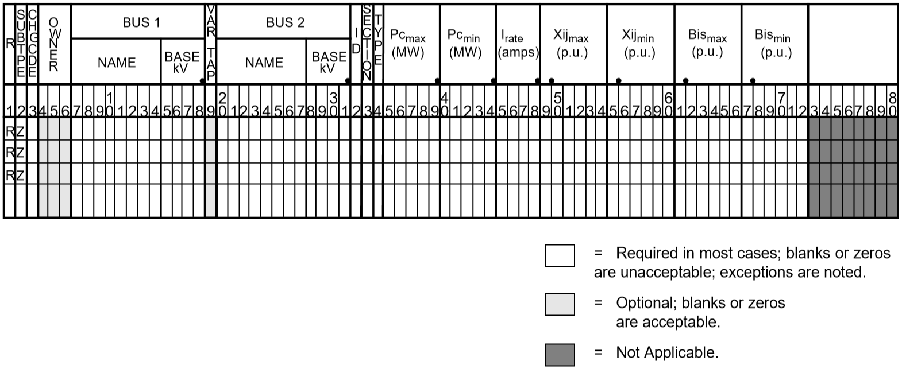

  RANI Thyristor Data Input Format

.. table:: Column Description for Series Compensated RANI Model

  +--------+----------+--------+------------------------------------------------------+
  | Column | ID Field | Format | Description                                          |
  +--------+----------+--------+------------------------------------------------------+
  | 1-2    | yes      | A2     | Record type - ``RZ``                                 |
  +--------+----------+--------+------------------------------------------------------+
  | 3      | no       | A1     | Change Code                                          |
  |        |          |        |  Blank - add                                         |
  |        |          |        |  ``M`` - modify                                      |
  |        |          |        |  ``D`` - delete                                      |
  |        |          |        |  ``R`` - restore                                     |
  +--------+----------+--------+------------------------------------------------------+
  | 7-14   | yes      | A8     | Bus name 1                                           |
  +--------+----------+--------+------------------------------------------------------+
  | 15-18  | yes      | F4.0   | Base kV 1                                            |
  +--------+----------+--------+------------------------------------------------------+
  | 19     | no       | I1     | Variable tap side if T_max and T_min cannot orient   |
  |        |          |        | T_x.                                                 |
  |        |          |        | 0 - Low alpha is fixed                               |
  |        |          |        | 1 - Bus 1 is variable                                |
  |        |          |        | 2 - Bus 2 is variable                                |
  +--------+----------+--------+------------------------------------------------------+
  | 20-27  | yes      | A8     | Bus name 2                                           |
  +--------+----------+--------+------------------------------------------------------+
  | 29-31  | yes      | F4.0   | Base kV 2                                            |
  +--------+----------+--------+------------------------------------------------------+
  | 32     | yes      | A1     | ID                                                   |
  +--------+----------+--------+------------------------------------------------------+
  | 33     | yes      | I1     | SECTION                                              |
  +--------+----------+--------+------------------------------------------------------+
  | 34     | no       | A1     | TYPE 1, 2, or 3                                      |
  |        |          |        |  TYPE 1 - Control Pc using Xij                       |
  |        |          |        |  TYPE 2 - Control V using Xij                        |
  |        |          |        |  TYPE 3 - Control V using Bis                        |
  +--------+----------+--------+------------------------------------------------------+
  | 35-39  | no       | F5.0   | Pcmax(MW)                                            |
  +--------+----------+--------+------------------------------------------------------+
  | 40-44  | no       | F5.0   | Pcmin(MW)                                            |
  +--------+----------+--------+------------------------------------------------------+
  | 45-48  | no       | F4.0   | Irate(amps)                                          |
  +--------+----------+--------+------------------------------------------------------+
  | 49-54  | no       | F6.5   | Xijmax(p.u.)                                         |
  +--------+----------+--------+------------------------------------------------------+
  | 55-60  | no       | F6.5   | Xijmin(p.u.)                                         |
  +--------+----------+--------+------------------------------------------------------+
  | 61-66  | no       | F6.5   | Bismax (p.u.)                                        |
  +--------+----------+--------+------------------------------------------------------+
  | 67-72  | no       | F6.5   | Bismin (p.u.)                                        |
  +--------+----------+--------+------------------------------------------------------+

Transformer Data (``T``, ``TP``)
================================
This record is applied to two-winding transformers and phase shifters. An equivalent pi representation depicts the transformer admittance in series with an ideal transformer. The electrical data is specified in terms of the transformer data which is defined as follows:

  :math:`R` Equivalent resistance due to copper loss.

  :math:`X` Leakage reactance.

  :math:`G` Equivalent core loss conductance.

  :math:`B` Magnetizing susceptance (always assumed negative; any sign is overridden).

Transformer taps are specified as fixed values for each voltage level or variable (LTC) taps with control over voltage, real power or reactive power. Variable tap transformers are defined with the addition of a regulating transformer data record (``R``) described in :ref:`regulating-transformer`.

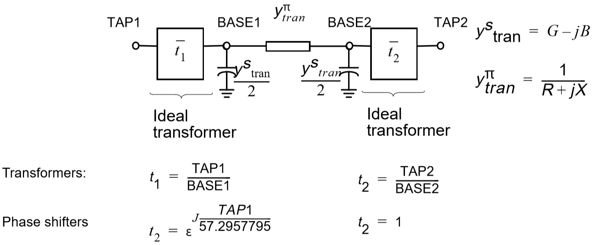

  Transformer Data

The following three assumptions are made:

  * Nominal base kV of transformer is identical to that of the bus.
  * Nominal base MVA of transformer is the same as the system base MVA.
  * :math:`R`, :math:`X`, :math:`G` and :math:`B` are evaluated on the nominal base and not on the tap setting.

The base kV is used to calculate the equivalent pi. Complications arise when step-up/step-down transformers are represented as sections in passive node sequence; there is no means to identify the base of the intermittent terminals. This combination is therefore illegal and will abort with fatal diagnostics.

A transformer is identified by subtype blank and a viable entry for ``TAP 2.`` A phase shifter is identified either by a subtype ``P or by a blank field for ``TAP 2``. However, the program always adds the subtype P for distinction and convenience in data changes. The ANGLE is TAP 1 interpreted in degrees. If ``TAP 2`` is blank, a nominal tap is presumed. A phase shifter assumes a pure voltage rotation and an optional transformation. Increasing the ANGLE will decrease the power flowing from bus 1 and bus 2.

Four MVA ratings are used to flag overloaded transformers: nominal, thermal, emergency, and bottleneck. The latter three are “extended ratings”, which supersede nominal ratings. Other entries are similar to the type L record. A sample of the format and explanations follow.

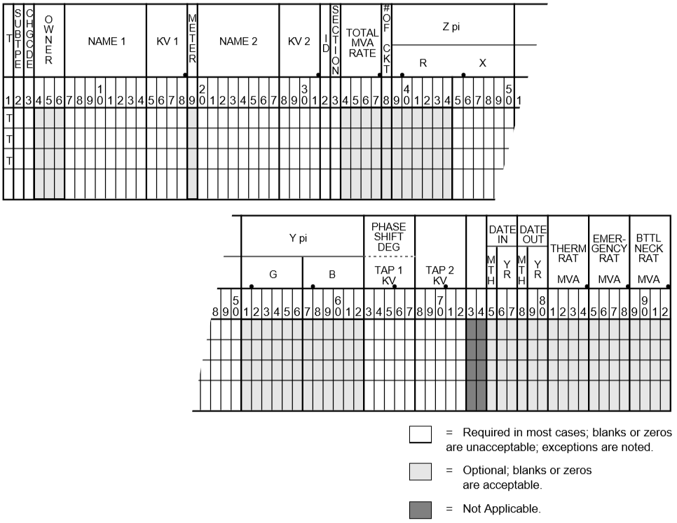

  Transformer Data Input Format

.. table:: Column Description for Transformer Data

  +--------+----------+--------+------------------------------------------------------+
  | Column | ID Field | Format | Description                                          |
  +--------+----------+--------+------------------------------------------------------+
  | 1      | yes      | A1     | Record type - ``T`` for transformer or phase shifter |
  +--------+----------+--------+------------------------------------------------------+
  | 2      | no       | A1     | Blank or ``P``                                       |
  +--------+----------+--------+------------------------------------------------------+
  | 3      | no       | A1     | Change code - see System Changes                     |
  +--------+----------+--------+------------------------------------------------------+
  | 4-6    | no       | A3     | Ownership code - Line and transformer losses will be |
  |        |          |        | summarized by ownership at end of final Area Summary.|
  +--------+----------+--------+------------------------------------------------------+
  | 7-14   | yes      | A8     | Bus name 1                                           |
  +--------+----------+--------+------------------------------------------------------+
  | 15-18  | yes      | F4.0   | Base kV 1                                            |
  +--------+----------+--------+------------------------------------------------------+
  | 19     | no       | I1     | Tie line metering point flag for area tie lines. 1 in|
  |        |          |        | column 19 provides for metering at bus 1 end. 2 in   |
  |        |          |        | column 19 provides for metering at bus 2 end.        |
  |        |          |        |                                                      |
  |        |          |        | Blank allows for program assumption as follows:      |
  |        |          |        | Metering point will be identified (1) by location    |
  |        |          |        | where line ownership differs from bus ownership or   |
  |        |          |        | (2) when buses at end of tie line have same          |
  |        |          |        | ownership, then bus 1 will be the metering point.    |
  +--------+----------+--------+------------------------------------------------------+
  | 20-27  | yes      | A8     | Bus name 2                                           |
  +--------+----------+--------+------------------------------------------------------+
  | 29-31  | yes      | F4.0   | Base kV 2                                            |
  +--------+----------+--------+------------------------------------------------------+
  | 32     | yes      | A1     |  Circuit identification                              |
  +--------+----------+--------+------------------------------------------------------+
  | 33     | yes      | I1     | Section number for making an equivalent for series   |
  |        |          |        | elements (numeric)                                   |
  +--------+----------+--------+------------------------------------------------------+
  | 34-37  | no       | F4.0   | Total MVA rating for all transformers represented by |
  |        |          |        | this record.                                         |
  +--------+----------+--------+------------------------------------------------------+
  | 38     | no       | I1     | Number of parallel transformer banks represented by  |
  |        |          |        | this record, for information purposes only. The      |
  |        |          |        | equivalent impedance is entered in columns 39-62.    |
  +--------+----------+--------+------------------------------------------------------+
  | 39-44  | no       | F6.5   | Per unit impedance R through transformer from bus 1  |
  |        |          |        | to bus 2 on the system base MVA for both windings.   |
  +--------+----------+--------+------------------------------------------------------+
  | 45-50  | no       | F6.5   | Per unit impedance X through transformer from bus 1  |
  |        |          |        | to bus 2 on the system base MVA for both windings.   |
  +--------+----------+--------+------------------------------------------------------+
  | 51-56  | no       | F6.5   | Per unit G of iron losses on the system base MVA.    |
  +--------+----------+--------+------------------------------------------------------+
  | 57-62  | no       | F6.5   | Per unit B magnetizing current on the system base    |
  |        |          |        | MVA. Note that any sign is ignored. This quantity    |
  |        |          |        | will always be processed as a negative value.        |
  +--------+----------+--------+------------------------------------------------------+
  | 63-67  | no       | F5.2   | Fixed bus 1 TAP or fixed phase shift in degrees which|
  |        |          |        | describe bus 1 relative to bus 2.                    |
  +--------+----------+--------+------------------------------------------------------+
  | 68-72  | no       | F5.2   | Fixed bus 2 TAP or blank for fixed phase shifter.    |
  +--------+----------+--------+------------------------------------------------------+
  | 75-77  | no       | A1,I2  | Energization Date - MYY                              |
  |        |          |        |  M = {1,2,3,4,5,6,7,8,9,O,N,D}                       |
  |        |          |        |  YY = last two digits                                |
  +--------+----------+--------+------------------------------------------------------+
  | 78-80  | no       | A1,I2  | De-energization Date - MYY                           |
  |        |          |        |  M = {1,2,3,4,5,6,7,8,9,O,N,D}                       |
  |        |          |        |  YY = last two digits                                |
  +--------+----------+--------+------------------------------------------------------+
  | 81-84  | no       | F4.0   | Thermal rating in MVA                                |
  +--------+----------+--------+------------------------------------------------------+
  | 85-88  | no       | F4.0   | Emergency rating in MVA                              |
  +--------+----------+--------+------------------------------------------------------+
  | 89-92  | no       | F4.0   | Bottleneck rating in MVA                             |
  +--------+----------+--------+------------------------------------------------------+

Switched Reactance (``X``)
==========================
Normally shunt capacitor or shunt reactor installations are represented in power flow programs as fixed MVAR values. However, there frequently is a need to represent voltage controlled capacitor schemes. This program allows for voltage controlled shunt device installations through use of a switched reactance record type ``X``.

This data record must be used with a type ``BX`` bus record. The data on the ``X`` record identifies blocks of discrete shunt susceptance available for reactive control. The blocks may be either inductive (negative) or capacitive (positive). If both types exist, negative blocks must be given first. Values are given in MVAR at the rated base kV; the actual MVAR is dependent on the voltage. Discrete reactance units are also referred to as statics.

The discrete segments are specified in steps and increments. Steps defines the number of switchable susceptance units. The MVAR value of each unit is given in increments. Normally, each unit has a unique MVAR value. In general, when both reactive and capacitive blocks coexist, two switching lists are given. The reactors are switched first in the following order: unit 1, unit 2,..., unit k, where k is the unit number of last reactor. Similarly, the capacitors are switched next in the following order: unit k+1, unit k+2,..., unit (last). When reactors are switched in, all capacitors are removed and vice versa. Units are sequentially disconnected in the reverse order. For example, the following one line diagram depicts a capacitor installation requiring discrete switching.

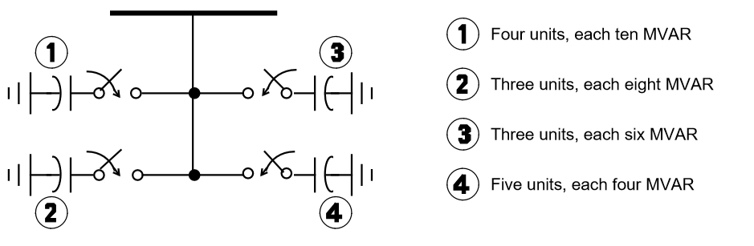

  Capacitor Installation Requiring Discrete Switching

For this example the sequential operation would be as follows. Increment 1, 10 MVAR, would be added up to the number of steps specified (4). If the bus voltage is below the scheduled value after a total of 40 MVARS have been added to the bus, increment 2 would be added to the number of steps specified, and so on until the scheduled voltage is achieved. These statics would be disconnected in a similar fashion, but in the reverse order, to reduce the bus voltage.

Shunt susceptance on ``BX`` records is ignored when ``X`` records are present. Any shunt susceptance listed on any following ``+`` records is considered fixed and is therefore exempt from the above switching.

The format for inputting switched reactance data follows; and then descriptions of the various columns are given.

.. note::

  Negative MVARs must be listed first

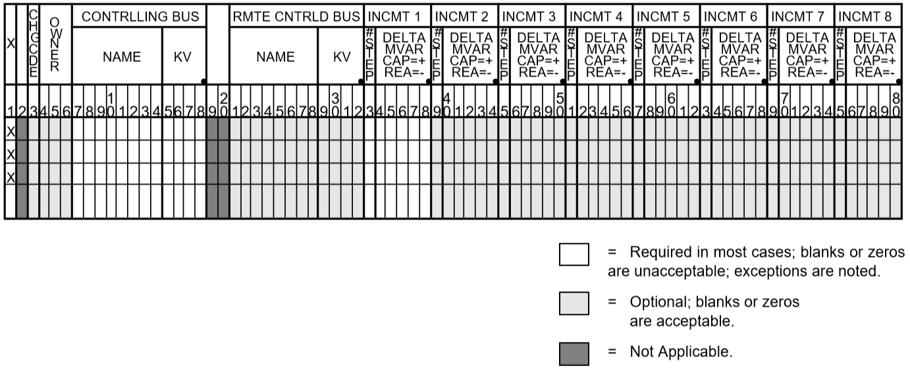

  Switched Reactance Data Input Format

.. table:: Column Description for Switched Reactance Data

  +--------+----------+--------+------------------------------------------------------+
  | Column | ID Field | Format | Description                                          |
  +--------+----------+--------+------------------------------------------------------+
  | 1      | yes      | A1     | Record code - ``X`` for switched reactance           |
  +--------+----------+--------+------------------------------------------------------+
  | 2      | no       |        | Blank                                                |
  +--------+----------+--------+------------------------------------------------------+
  | 3      | no       | A1     | Change code - see System Changes                     |
  +--------+----------+--------+------------------------------------------------------+
  | 4-6    | no       | A3     | Ownership code                                       |
  +--------+----------+--------+------------------------------------------------------+
  | 7-14   | yes      | A8     | Bus name 1. This is the bus to which the switched    |
  |        |          |        | reactances are connected. Must be a type BX bus.     |
  +--------+----------+--------+------------------------------------------------------+
  | 15-18  | yes      | F4.0   | Base kV 1                                            |
  +--------+----------+--------+------------------------------------------------------+
  | 21-28  | yes      | A8     | Bus name 2. Controlled bus name - This bus may be    |
  |        |          |        | local or remote.                                     |
  +--------+----------+--------+------------------------------------------------------+
  | 30-32  | yes      | F4.0   | Base kV 2                                            |
  +--------+----------+--------+------------------------------------------------------+
  | Increment 1:                                                                      |
  +--------+----------+--------+------------------------------------------------------+
  | 33     | no       | I1     | Number of steps - Number of repetitions (from 1      |
  |        |          |        | to 9) to be performed using the value given in       |
  |        |          |        | columns 34-38.                                       |
  +--------+----------+--------+------------------------------------------------------+
  | 34-38  | no       | F5.0   | MVAR - Value at base kV of each step of Increment 1. |
  +--------+----------+--------+------------------------------------------------------+
  | Increment 2:                                                                      |
  +--------+----------+--------+------------------------------------------------------+
  | 39     | no       | I1     | Number of steps - Number of times the value given in |
  |        |          |        | columns 40-44 will be connected. (Will not begin     |
  |        |          |        | until Increment 1 is completed.)                     |
  +--------+----------+--------+------------------------------------------------------+
  | 40-44  | no       | F5.0   | MVAR - Value at base kV of each step of Increment 2. |
  +--------+----------+--------+------------------------------------------------------+
  | Increment 3:                                                                      |
  +--------+----------+--------+------------------------------------------------------+
  | 45     | no       | I1     | Number of steps - Number of times the value given in |
  |        |          |        | columns 46-50 will be connected. (Will not begin     |
  |        |          |        | until Increment 2 is completed.)                     |
  +--------+----------+--------+------------------------------------------------------+
  | 46-50  | no       | F5.0   | MVAR - Value at base kV of each step of Increment 3. |
  +--------+----------+--------+------------------------------------------------------+
  | Increment 4:                                                                      |
  +--------+----------+--------+------------------------------------------------------+
  | 51     | no       | I1     | Number of steps - Number of times the value given in |
  |        |          |        | columns 52-56 will be connected. (Will not begin     |
  |        |          |        | until Increment 3 is completed.)                     |
  +--------+----------+--------+------------------------------------------------------+
  | 52-56  | no       | F5.0   | MVAR - Value at base kV of each step of Increment 4. |
  +--------+----------+--------+------------------------------------------------------+
  | 57-80  | no       | Add data for Increments 5 through 8 in a similar fashion.     |
  +--------+----------+--------+------------------------------------------------------+

Zone Rename (``Z``)
===================
This is a specialized change record which permits the bus zones to be permanently renamed. This record has a ``Z`` in column 1, followed by a maximum of 15 pairs of old zone names/new zone names. Additional ``Z`` records may follow to change a maximum of 150 zones. See table below.

Several old zones may be consolidated into a single new zone name. However, an old zone may not be segregated into two more new zones.

Any ``Z`` record must be the first change record encountered. The zones are immediately renamed. Following these records, additional system changes may be entered in the normal way, and all data are assumed to conform with the new zone names.

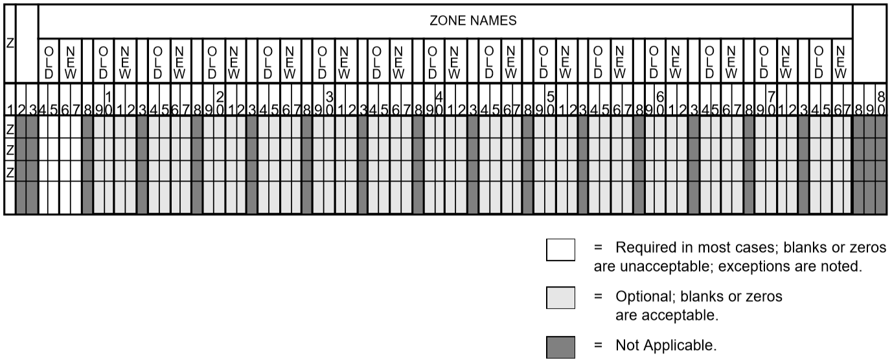

  Zone Rename Data Input Format

.. table:: Column Description for Zone Rename

  ====== ======== ====== ===========================
  Column ID Field Format Description
  ====== ======== ====== ===========================
  1      yes      A1     Record type - ``Z``
  2-3    no       A2     Blank
  4-5    no       A2     Old zone name - any blank zone to be changed must appear in this column. Otherwise, blank "old zones," terminate the scan.
  6-7    no       A2     New zone name
  8      no       A2     Blank
  9-10   no       A2     Old zone name
  11-12  no       A2     New zone name
  13     no       A1     Blank
  14-15  no       A2     Old zone name
  16-17  no       A2     New zone name
  18-77  no       -      Repeat of the above format sequence: one blank followed by two columns for old zone name and two more columns for new zone name.
  ====== ======== ====== ===========================

Area Rename (``ZA``)
====================
This is a specialized change record that permits area names to be changed. Each ``ZA`` record renames one area.

The new name must be unique. If the new name exists, the rename is ignored. Thus, Area Rename cannot be used to consolidate areas.

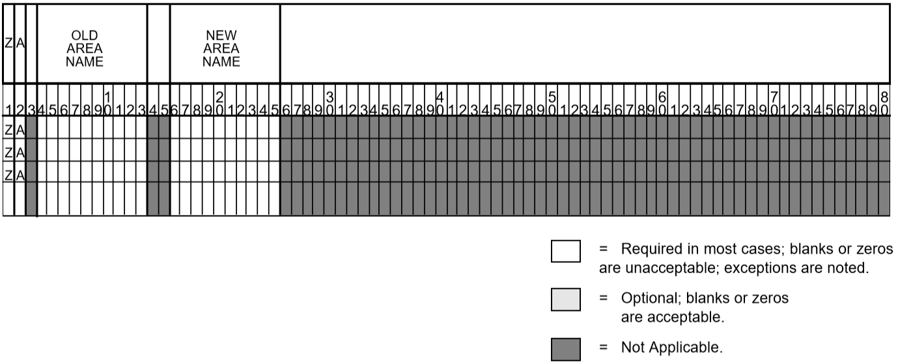

  Area Rename Data Input Format

.. table:: Column Description for Area Rename

  ====== ======== ====== ====================
  Column ID Field Format Description
  ====== ======== ====== ====================
  1-2    yes      A2     Record type - ``ZA``
  3                      NA
  4-13   no              A10 Old area name
  14-15                  NA
  16-25  no       A10    New area name
  26-80                  NA
  ====== ======== ====== ====================

Bus Rename (``ZB``)
===================
This is a specialized change record that permits bus names and base kV’s as well to be altered. Each ``ZB`` record renames one bus.

The new name must be unique. If the new name exists, the rename is ignored. Thus, Bus Rename cannot be used to consolidate buses.

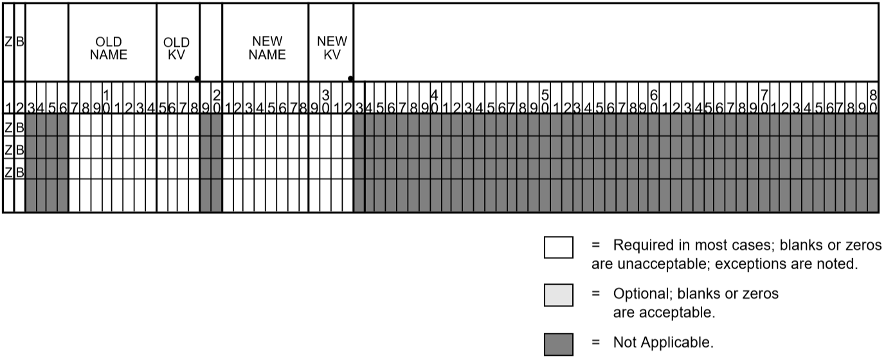

  Bus Rename Data Input Format

.. table:: Column Description for Bus Rename

  ====== ======== ====== =====================
  Column ID Field Format Description
  ====== ======== ====== =====================
  1-2    yes      A2     Record type - ``ZB``
  3-6                    NA
  7-14   no       A8     Old bus name
  15-18  no       F4.0   Old base kV
  19-20                  NA
  21-28  no       A8     New bus name
  29-32  no       F4.0   New base kV
  33-80                  NA
  ====== ======== ====== =====================
