**************
Record Formats
**************

Overview
========
This chapter describes all data record formats recognized by BPF. Most, but not all of them are also available in the GUI interface. The record descriptions are organized alphabetically by record ID as you go through the chapter (except for the DC bus records which follow the AC bus records). The table below enables you to quickly locate a specific record format entry. The table also gives you a quick description of each record format.

Each entry has a card image that shows you where to put both identification and data information and where the implicit decimal point (if any) is located. Please note that all information must be in the correct columns; you will experience processing errors otherwise. Each card image has a legend showing whether data is required, optional, or ignored.

Each entry also has a table of column descriptions and data formats. This supplements the card image. Additional text accompanies any record formats that need extended discussion.

Some data are Fortran real numbers. For these fields, the implicit decimal point is shown as a black dot on the card image, just above the information entry row. Note that you can enter data with an explicit decimal point in any position within the field. A black dot that appears at the extreme right side of a field represents a decimal point at the right end (least significant digit) of a number. All other black dots appear above a line, indicating that the decimal point will fall between the digits on either side.

All IPF data record types are identified by the characters in columns 1 and 2. To fully specify a particular record, additional fields need to be filled in. These additional ID fields are usually the bus name and base kV. ID fields are called out in the column description tables.

==== ======================== =========== =================================
Link Record ID (columns 1-2)  Field Width Description
==== ======================== =========== =================================
3-7  Period (``.``)           120         Comment (not printed)
3-8  ``+``                    80          Bus continuation
3-14 ``A``                    80          Area interchange control
3-16 ``AO``                   80          Area output sort
3-18 ``-``                    ``-``       General ac bus description
3-22 ``B``                    80          AC bus — load bus
3-25 ``BC``                   80          AC bus — voltage controlled by BG bus
3-28 ``BE``                   80          AC bus — constant voltage
3-31 ``BF``                   80          AC bus — special purpose bus for Newton-Raphson solution
3-32 ``BG``                   80          AC bus — generator
3-35 ``BQ``                   80          AC bus — constant voltage within Q limits
3-38 ``BS``                   80          AC bus — system slack bus
3-41 ``BT``                   80          AC bus — LTC transformer controlled ac bus
3-44 ``BV``                   80          AC bus — constant Q within V limits
3-47 ``BX``                   80          AC bus — attempts constant V using switched Q specified on X record
3-50 ``BD``                   80          Two-terminal dc bus
3-52 ``BM``                   80          Multi-terminal dc bus
3-55 ``DA``                   80          Delete buses by area
3-56 ``DZ``                   80          Delete buses by zones
3-57 ``E``                    88          Equivalent branch (has extended ratings)
3-60 ``I``                    80          Area intertie I record
3-62 ``L``                    88          Transmission line (has extended ratings)
3-66 ``LD``                   80          Two-terminal dc line
3-69 ``LM``                   80          Multi-terminal dc line
3-72 ``PO PZ PN PA PB PC PD`` 80          Factor changes
3-78 ``QN QP QX``             120         Reactive capability curve
3-82 ``R RV RQ RP RN RM``     80          Regulating transformer
3-86 ``RZ``                   80          VAR compensator model
3-88 ``T``                    92          Transformer (has extended ratings)
3-88 ``TP``                   92          Phase shifter (has extended ratings)
3-93 ``X``                    80          Switched reactance (BX record)
3-96 ``Z``                    80          Zone rename
==== ======================== =========== =================================

System Changes
==============
After a base case has been established, it may be changed with the use of change records. The change records are identified as system data records which immediately follow the network-solution qualifier ``/CHANGES`` statement. See ?? for details.

The change records are system data records with a change code in column 3. Each of the input data forms describe the permissible types of changes under the caption CHANGE CODES. In all, there are five types of changes.

 * *Additions*: Change code = blank
   The data record identification must be unique to the system. The contents of the record must be complete as if it were being submitted to build a base case.
 * *Deletions*: Change code = ``D``
   Only existing data may be deleted, and only the identification fields are needed. Numerical data in any other field is ignored. Special conditions are given:

   * Deleting a bus automatically deletes all continuation bus data, switched reactance data and all branch data associated with that bus. Deleting all branches connected to a bus will result in an error. It is better to delete the bus. A bus should not be deleted and added back in the same case with the same name in a single change file.

   * Deleting all transformer banks between two buses will automatically delete any regulating transformer data.

   * A line composed of sections may be deleted in its entirety by deleting section 0 (zero) or blank. The alternative is to delete each section with a separate change record. If a section is deleted the line is reconnected without that section. Transformer sections cannot be deleted.
   
   * A branch composed of parallel lines between two buses may be deleted in its entirety by entering a * in place of CKT ID. This provides a means of disconnecting two directly connected buses from each other. The branches may also be deleted individually.
   
   * A blank branch ID is legitimate identification.
   
   * Changing a bus from type X to any other type will delete all switched-reactance data automatically. No separate X delete record should be included.

 * *Elimination*: Change code = ``E``

   This causes the elimination of all existing A (area interchange) records to make room for possible new A records. The user should note that this change code works for A records only.

 * *Modifications*: Change code = ``M``
 
   All currently existing system data may be modified, which means changing the value of some quantity of system data. Data in the identification field cannot be changed.
 
   Only the data to be changed is entered on the change record. Nonblank fields constitute data modification, while blank fields indicate that the quantity is not to be changed. A blank and a zero quantity on the change record are distinguishable. Often, it is necessary to change a quantity into a blank. Examples are the bus zone name and the bus subtype. To change these into blank quantities, a 00 or 0 must be entered in the appropriate respective column fields. Special recognition is conferred on these change quantities.

 * *Restorations*: Change code = ``R``

   Previously outaged system data may be reactivated with the use of restore change records. This type change permits data to be restored to the system with change records using the identification fields only. Any data fields on the restore record will be ignored, and the reactivated data assumes the same quantities it had prior to deletion. Restoring data is an option. Data could be re-entered with additional type change records as well. The operations and rules are similar to those for deletions. However, some important differences must be explained.

   * Restore changes are permissible only with data deleted in a previous change case but within the same base case. You cannot restore data outaged in a previous OLD_BASE case.
   * Area interchange records may not be restored.
   * Restoring a bus restores only branches which connect to a viable system base. In some cases, not all of the outaged branches can be restored.
   * Restoring all transformer banks between two buses will not automatically restore any regulating transformer data. If this is intended, the regulating ``R`` transformer data must be restored separately.
   * A restored branch record must match the branch code as well as the identification fields. For example, if the branch is type ``L``, the restore record must match the type.

   The change records are read, interpreted and stored for further processing. As they are read the following are processed immediately:
    
    * Area Interchange (``A``-blank)
    * Zone Renames (``Z``-blank)
    * Area Deletes (``DA``)

   Processing of changes then continues in the following manner:
    
    * Changes Percents (``P``)
    * Deletes
    * Adds/Restores
    * Modifications

.. note:: 
  
  If more than one modification for the same data item occurs, the changes will be made in the order encountered. In IPF, no message will be given the user.

If fatal data errors are encountered in batch mode, switches are set and the processing continues only to discover additional errors, list all changes and exit. For changes to existing data, component identification must be specified exactly as in the base case file.
If fatal errors are encountered in interactive mode, appropriate diagnostics are issued so that the user can remedy the faulty command or data.

Comment
=======
This comment text is used to annotate the program control file, network data file, or change file. Its contents are not added to the output listings nor saved in the binary base case file.

Simply place a “.” (period character) in the first column and the comment in the rest of the columns. This is also handy to temporarily deactivate a command or data line.

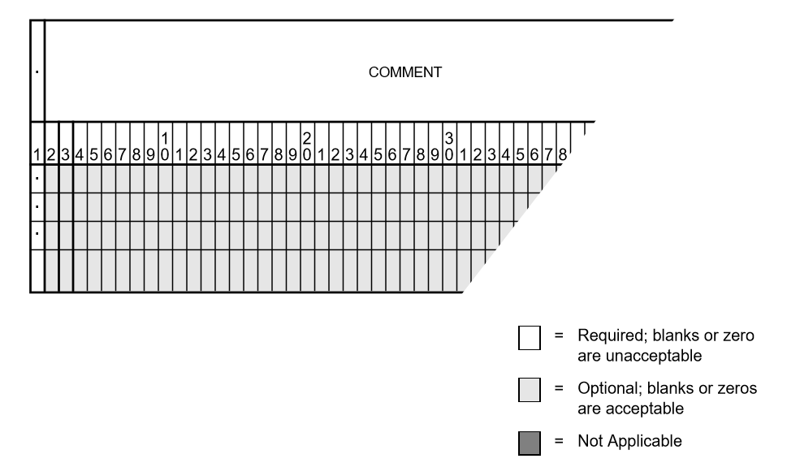

====== ======== ====== ==============================
Column ID Field Format Content
====== ======== ====== ==============================
1      yes      A1     .(period)
2-120  no       A119   Text string for record comment
====== ======== ====== ==============================

Continuation Bus Data (``+``)
=============================
Continuation bus data is identified with a ``+`` in column 1 and supplements the data on any AC bus record. It specifies additional generation, load and shunt admittance at the bus and permits additional classification and utilization of data. Generally, it permits a more detailed analysis of data. Its most typical application is distinguishing loads represented by several different owners at the same bus. The following fields are for identification:

 * Bus name and base kV
 * Code and code year
 * Ownership

Each bus may have more than one continuation record. However, some means of distinction must be made in the minor identification fields of ``code year`` or ``owner``. See figure and tables below for details.

A sample coding sheet and column descriptions for continuation bus data follows.

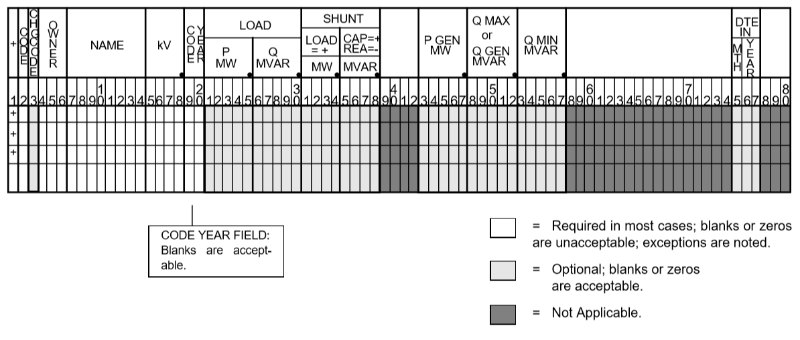

===== ===================================================
Code  Description
===== ===================================================
A     Equivalent injection data from network reduction. Note that data associated with this code is not subject to the effect of factor change (P) records.
C     Shunt MW or MVAR
F     Industrial firm load
I     Industrial interruptible load
N     Nonindustrial firm load (bus ownership differs from load ownership)
P     Industrial potential load
S     Nonindustrial secondary load
Blank Nonindustrial firm load (bus ownership = load ownership)
===== ===================================================

In addition to the special classifications codes of column (2:2), the ``code year`` may convey special meaning or models to the continuation bus records. The table below summarizes the features.

+------+-----------+---------------------+---------------------+---------------------+---------------------+----------------------------+
| Code | Code year | P_load              | Q_load              | G_shunt             | B_shunt             | Description                |
+======+===========+=====================+=====================+=====================+=====================+============================+
| +A   |           | Constant power MW   | Constant power      | Constant admittance | Constant admittance | Quantity generated by      |
|      |           | load (generation if | MVAR load           | MW evaluated at     | MVAR evaluated at   | Network Data or Cutting    |
|      |           | negative)           | (generation if      | nominal voltage     | nominal voltage     | routines                   |
|      |           |                     | negative)           |                     |                     |                            |
+------+-----------+---------------------+---------------------+---------------------+---------------------+----------------------------+
| +A   | 00        | Constant power MW   | Constant power      | Constant admittance | Constant admittance | Quantity generated by      |
|      |           | load (generation if | MVAR load           | MW evaluated at     | MVAR evaluated at   | Network Data routine       |
|      |           | negative)           | (generation if      | nominal voltage     | nominal voltage     |                            |
|      |           |                     | negative)           |                     |                     |                            |
+------+-----------+---------------------+---------------------+---------------------+---------------------+----------------------------+
| +A   | 01        | Distributed constant| Distributed constant| Equivalent MW       | Equivalent MVAR     | Quantity generated by      |
|      |           | current MW load     | current conjugate   | shunt admittance    | shunt admittance    | Network Reduction routines |
|      |           | (generation if      | MVAR load           |                     |                     |                            |
|      |           | negative) evaluated | (generation if      |                     |                     |                            |
|      |           | at nominal voltage  | negative) evaluated |                     |                     |                            |
|      |           |                     | at nominal voltage  |                     |                     |                            |
+------+-----------+---------------------+---------------------+---------------------+---------------------+----------------------------+
| +A   | 02        | Distributed MW load | Distributed MVAR    | Equivalent MW       | Equivalent MVAR     | Quantity generated by      |
|      |           | (generation if      | load (generation if | shunt admittance    | shunt admittance    | Network Reduction; denote  |
|      |           | negative)           | negative)           |                     |                     | equivalent shunt           |
|      |           |                     |                     |                     |                     | admittances                |
+------+-----------+---------------------+---------------------+---------------------+---------------------+----------------------------+
|      | *I        | Constant current MW | Constant current    | Not applicable      | Not applicable      | Quantity generated by      |
|      |           | load (generation if | conjugate MVAR load |                     |                     | %LOAD_DISTRIBUTION         |
|      |           | negative) evaluated | (generation if      |                     |                     |                            |
|      |           | at nominal voltage  | negative) evaluated |                     |                     |                            |
|      |           |                     | at nominal voltage  |                     |                     |                            |
+------+-----------+---------------------+---------------------+---------------------+---------------------+----------------------------+
|      | *Z        | Constant power MW   | Constant power MVAR | Constant admittance | Constant admittance | Quantity generated by      |
|      |           | load (generation    | load (generation    | MW load (generation | MVAR load           | %LOAD_DISTRIBUTION         |
|      |           | if negative)        | if negative)        | if negative)        | (generation if      |                            |
|      |           |                     |                     | evaluated at        | negative) evaluated |                            |
|      |           |                     |                     | nominal voltage     | at nominal voltage  |                            |
+------+-----------+---------------------+---------------------+---------------------+---------------------+----------------------------+
|      | *P        | Constant power      | Constant power      | Not applicable      | Not applicable      | Quantity generated by      |
|      |           | MW load (generation | MVAR load           |                     |                     | %LOAD_DISTRIBUTION         |
|      |           | if negative)        | (generation if      |                     |                     |                            |
|      |           |                     | negative)           |                     |                     |                            |
+------+-----------+---------------------+---------------------+---------------------+---------------------+----------------------------+

====== ======== ====== =================================
Column ID Field Format Description
====== ======== ====== =================================
1      yes      A1     Record type; + for all continuation bus data
2      yes      A1     Code (See code types above.)
3      no       A1     Change code
4-6    yes      A3     Ownership
7-14   yes      A8     Bus name
15-18  yes      F4.0   Base kV
19-20  yes      A2     Code year—alphanumeric subtype of code 
21-25a no       F5.0   Load MW
26-30  no       F5.0   Load MVAR
31-34  no       F4.0   Shunt Admittance Load in MW at base kV
35-38  no       F4.0   Shunt Admittance in MVAR at base kV (+) = Capacitive (-) = Inductive
43-47  no       F5.0   P GEN MW
48-52  no       F5.0   Q GEN MVAR (or Q MAX) (+) = Capacitive (-) = Inductive
53-57  no       F5.0   Q MIN in MVAR
75-77  no       A1, A2 Energization date month and year {month = 1,2,3,4,5,6,7,8,9,O,N,D}
====== ======== ====== =================================

a.  If the Code (column 2) is A and the Code year (column 19-20) is 01, the load quantities are constant current-constant power factors and are: 
  
  1. Interpreted as MW and MVAR evaluated at base kV (+) = Inductive (-) = Capacitive
  2. Evaluated as: :math:`P + jQ = (I*)|V|`

.. note:: 
  
  ``Q_max`` and ``Q_min`` represent inequality constraints (``Q_max > Q_min``). However special concerns apply for bus subtypes blank, C, T and V, where the Q is constrained. In order to assign appropriate values for scheduled Q, ``Q_min`` is first examined. If ``Q_min < 0`` and ``Q_max > 0``, the limits are recognized as erroneous constraints and both are ignored. If ``Q_min = 0``, then the schedule Q is always ``Q_max``

Area Interchange Control (``A``)
================================
A network may be partitioned geographically by area. Similarly, areas may be partitioned by zones. The net power exported from each area can be specified with an area interchange record. Export power is controlled by varying the area slack bus generation. Interchange export is measured as the sum of the exported power on all area tie lines metered at the area boundaries. The total net export of all areas must add to zero; otherwise, the area interchange control is aborted. See the figure and tables below.

Valid subtypes are blank, 1, ..., 9, with 1, ..., 9 being continuation records. This allows up to 100 zones to be defined in an area.

In order for area interchange control to be activated, A records must be defined and the ``/AI_CONTROL`` option must be set to the default, ``CON`` (Control). Three slack bus restrictions pertain to each area.

 * One area slack bus must be the system swing bus.
 * Each area slack bus must be within the area it controls.
 * For all slack buses the P generation is variable.

.. note::
  
  Area Continuation records (A1, ..., A9) accept only area name and zones 1-10 fields.
  
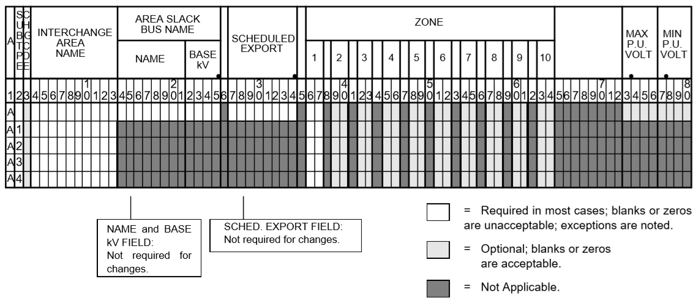

====== ======== ========= ==========================
Column ID Field Format    Description
====== ======== ========= ==========================
1      yes      A1        Record type — A
2      yes      A1        Subtype — blank, 1, ..., 9
3      no       A1        Change code — see System Changes
4-13   yes      A10       Interchange area name — Name of area consisting of one or more zones. Alphanumeric entries are permitted.
14-25  no       A8,F4.0   Area slack bus name and base kV. (Does not apply to subtypes A1, ..., A9.)
27-34  no       F8.0      Scheduled export — MW flow scheduled (+) out of area or (-) into area. If I (interchange) records are present for this area, the net schedule will be overwritten with the netting computed from the I records. (Does not apply to subtypes A1, ..., A9.)
36-64  no       10(A2,1X) Zones to be included in the interchange area named in columns 4-13. A blank zone terminates the scan unless it is zone 1. All zones must be listed within some area, but no zone may be common to more than one area.
73-76  no       F4.3      Maximum per unit voltage. (Does not apply to subtypes A1, ..., A9.)
77-80  no       F4.3      Minimum per unit voltage. (Does not apply to subtypes A1, ..., A9.)
====== ======== ========= ==========================

Area Output Sort (``AO``)
=========================
The order of buses in the input and output listings may be grouped into areas with arbitrary zone configurations. The areas are sorted alphabetically and the buses within each area are then sorted alphabetically.

These records permit an area to be defined independently of any area interchange. Once introduced, these records become a permanent part of the base case file. A coding sheet and description of the record columns follows:

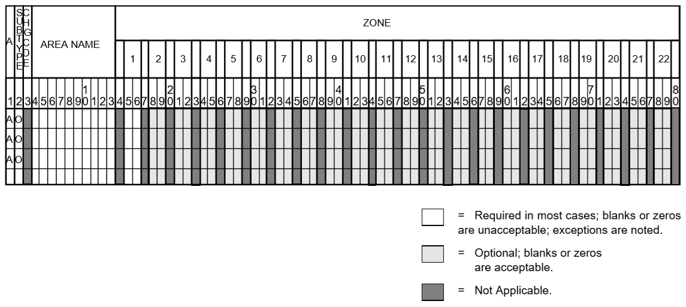

====== ======== ========== ====================
Column ID Field Format     Description
====== ======== ========== ====================
1      yes      A1         Record type — A
2      yes      A1         Subtype — O
3      no       A1         Change code — see System Changes
4-13   yes      A10        Area Name — These names are independent of area interchange names but may be identical.
15-79  no       22(A2,1X)  Zone composition list — a blank zone terminates the zone scan unless it is zone 1.
80     no       blank
====== ======== ========== ====================

AC Bus Data
===========
Bus records identify nodes in the network. The following description applies to AC buses only; DC buses are identified by a subtype D or M and are described in ?? and ??.

Each AC bus consists of three attributes: generation, load, and shunt admittance. Various subtypes assign unique characteristics to these attributes. Some affect conditions in the solution; others affect only the allocation of quantities in the output listings.

The various subtypes permit different models to represent the operation of the system. Most buses have constant real injection. Exceptions are the system slack bus and any area interchange slack buses.

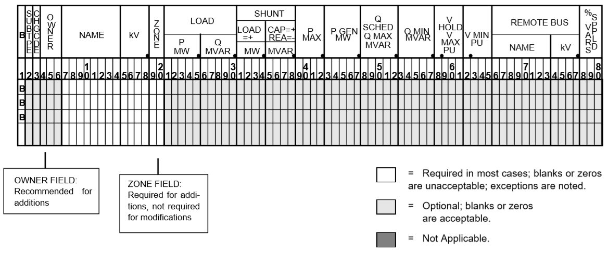

====== ======== ====== ====================
Column ID Field Format Description
====== ======== ====== ====================
1      yes      A1     AC ``B`` type record
2      no       A1     Subtype
3      no       A1     Change code
4-6    no       A3     Ownership
7-14   yes      A8     Bus name
15-18  yes      F4.0   Base kV
19-20  no       A2     Zone
21-26  no       F5.0   Load MW
26-30  no       F5.0   Load MVAR
31-34  no       F4.0   Shunt Admittance Load in MW at base kV
35-38  no       F4.0   Shunt Admittance in MVAR at base kV (+) = Capacitive (-) = Inductive
43-47  no       F5.0   ``P GEN`` MW
48-52  no       F5.0   ``Q GEN`` MVAR (+) = Capacitive (-) = Inductive
53-57  no       F5.0   ``Q MIN`` MVAR
58-61  no       F4.3   ``V HOLD`` — V MAX (in per unit)
62-65  no       F4.3   ``V MIN`` (in per unit)
66-73  no       A8     Controlled bus name
74-77  no       F4.0   Base kV
78-80  no       F3.0   Percent of vars supplied for remote bus voltage control.
====== ======== ====== ====================

For all subtypes, the following diagram illustrates the reactive allocation scheme. 

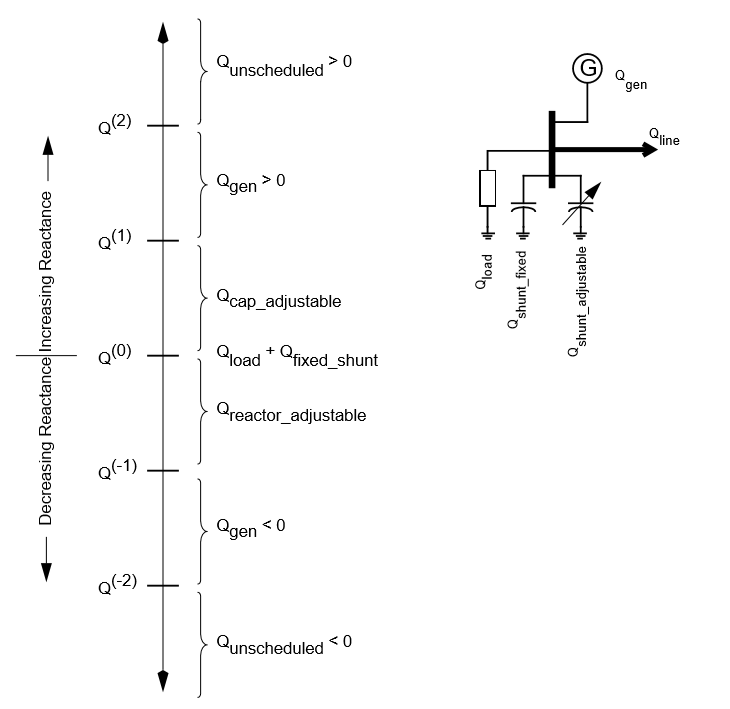

Allocation of reactive facilities is complex. These may be allocated by equality constraints (``Q_net`` is constant), inequality constraints (``Q_net`` varies between a minimum and maximum value), or no constraints.

Let “NET” define the total line export. Then the following equation is always valid:

.. math:: NET = GENERATION - LOAD - Y_{shunt} * VOLTAGE^2

The equation is complex; the real and reactive components are balanced separately. The separate equations are:

.. math:: 

   P_{net} &= P_{Gen} - P_{load} - G * V^2 \\
   Q_{net} &= Q_{Gen} - Q_{load} + B * V^2

The shunt admittance is

.. math:: Y = \frac{1}{Z} = G + jB

The equations above define the interrelationship between quantities and are valid for all bus types. The bus type determines which equations are also constraints.

The preceding diagram illustrates the following priority scheme. In applying the equation for Q, vars are allocated to generation and variable shunt components on a priority basis. If ``Q_net`` is less than ``Q_load + Q_shunt`` fixed, then vars are allocated first to variable shunt reactors and then, if necessary, to reactive generation. If, on the other hand, ``Q_net`` is higher than ``Q_load + Q_shunt`` fixed, then vars are allocated first to the variable shunt capacitors and then, if necessary, to reactive generation. If the limits of reactive generation are exceeded, then unscheduled reactive is allocated.

AC Bus Data (B-blank)
=====================

Application
-----------
This bus subtype is passive in the sense that it cannot control the voltage of another bus. Its primary use is for modeling load buses.

Bus characteristics
-------------------
Both real (P) and reactive (Q) power are held constant throughout the entire solution. This applies to generators, load and shunt devices (capacitors/reactors).

A specific amount of reactive generation can be requested. This can be accomplished by entering a zero (0) in the ``Q MIN`` field and the desired amount of reactive generation in the ``Q SCHED`` field.

Since this bus normally has no voltage control, the voltage limits (``V MAX``, ``V MIN``) serve two purposes.

 * If the bus is remotely controlled by another bus (type ``BG`` or ``BX``) or by an LTC transformer (which is not standard but is accepted), the limits specify the range of acceptable voltage.
 * For accounting purposes, these limits can flag undervoltage or overvoltage situations in the analysis reports.

It must be recognized that every bus has voltage limits, whether they are explicitly specified through the V MIN, V MAX fields or implicitly specified through default global voltage limits. See Appendix E.

Reactive limits are not allowed for this type of bus. If reactive limits are entered in the Q MAX and Q MIN fields, they will be ignored. However, legitimate Q GEN can be entered if Q MIN is zero.

For this subtype, :math:`Q_{net}` is constant; its Q-V characteristic is shown in format drawing below.

If this bus is controlled by an LTC transformer or by a BG or BX bus, a warning diagnostic will be issued to the effect that remotely controlled buses are typically type BC or type BT and the controlled voltage is a single value, :math:`V_{sched}` and not a range :math:`V_{min} < V_{controlled} < V_{max}`.

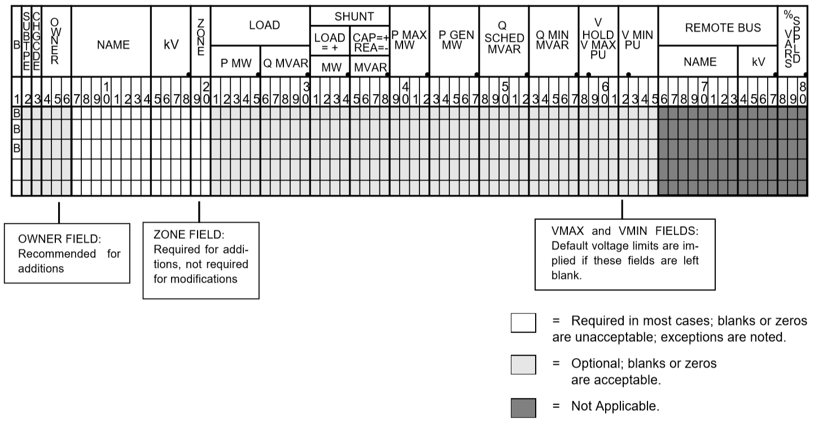

====== ======== ======= ====================
Column ID Field Format  Description
====== ======== ======= ====================
1-2    yes      A2      ``B`` — Generic load bus
3      no       A1      Change code
4-6    no       A3      Ownership
7-14   yes      A8      Bus name
15-18  yes      F4.0    Base kV
19-20  no       A2      Zone
21-25  no       F5.0    Load MW
26-30  no       F5.0    Load MVAR
31-34  no       F4.0    Shunt Admittance Load in MW at base kV
35-38  no       F4.0    Shunt Admittance in MVAR
39-42  no       F4.0    ``P MAX``
43-47  no       F5.0    ``P GEN``
48-52  no       F5.0    ``Q SCHED`` in MVAR
53-57  no       F5.0    ``Q MIN`` — Must be blank or zero for ``Q SCHED`` to apply
58-61  no       F4.3    ``VMAX``. If blank, then limits default to global limits as outlined in ??.
62-65  no       F4.3    ``VMIN``. If blank, then limits default to global limits as outlined in ??.
66-77  no       A8,F4.0 N/A
78-80  no       F3.0    N/A
====== ======== ======= ====================

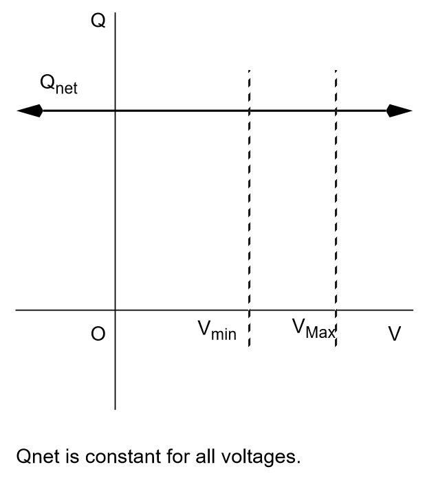

AC Bus Data (``BC``)
====================

Application
-----------
This bus type has its voltage maintained by a subtype ``BG`` bus.

Bus Characteristics
-------------------
Both real (P) and reactive (Q) power are held constant throughout the entire solution. This applies to generators, loads, and shunt devices (capacitors/reactors).

A specific amount of reactive generation can be requested. This can be accomplished by entering a zero (0) in the ``Q MIN`` field and the desired amount of reactive generation in the ``Q SCHED`` field.

Reactive constraints are not allowed for this type of bus. If reactive limits are entered in the ``Q MAX`` and ``Q MIN`` fields, they will be ignored.

Since this bus type has its voltage maintained by a generator bus, a ``V HOLD`` entry is strongly recommended on the bus record. However, if that field is blank, the global default limits apply, in effect, using ``VMAX`` for the ``VHOLD``. See ??

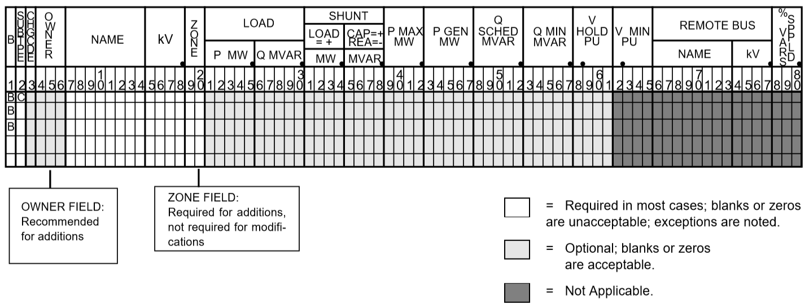

====== ======== ======= ======================
Column ID Field Format  Description
====== ======== ======= ======================
1-2    yes      A2      ``BC`` — Voltage controlled by BG bus
3      no       A1      Change code
4-6    no       A3      Ownership
7-18   yes              Bus name and base kV
15-18  yes      F4.0    Base kV
19-20  no       A2      Zone
21-25  no       F5.0    Load MW
26-30  no       F5.0    Load MVAR
31-34  no       F4.0    Shunt Admittance Load in MW at base kV
35-38  no       F4.0    Shunt Admittance in MVAR
39-42  no       F4.0    ``P MAX``
43-47  no       F5.0    ``P GEN``
48-52  no       F5.0    ``Q SCHED`` in MVAR
53-57  no       F5.0    ``Q MIN`` — Must be blank or zero for ``Q SCHED`` to apply
58-61  no       F4.3    ``V HOLD`` in per unit
62-65  no       F4.3    N/A
66-77  no       A8,F4.0 N/A
78-80  no       F3.0    N/A
====== ======== ======= ======================

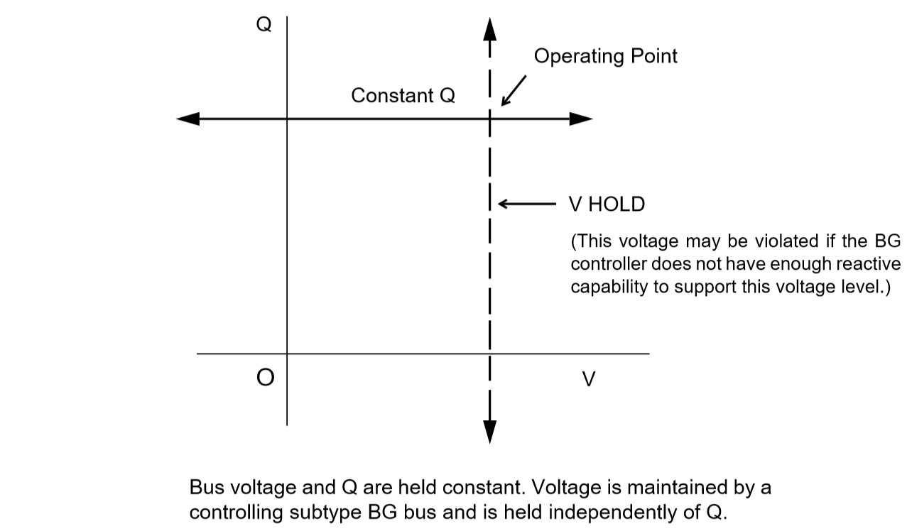

AC Bus Data (``BE``)
====================

Application
-----------
This subtype is used to hold the bus voltage to a specified value, regardless of the amount of reactive required.

Bus Characteristics
-------------------
Voltage magnitude (V) is held constant. Real (P) power is held constant. This applies to generators, load, and shunt devices. Reactive (Q) load is held constant for this bus type.

Reactive (Q) shunt is variable. The amount of shunt reactance added by the program can vary from 0 to ``Qshunt``, depending upon the amount needed to maintain desired bus voltage.

Reactive (Q) generation is variable.

Reactive constraints are allowed for this bus type. These quantities are entered in the ``Q MAX`` and ``Q MIN`` fields. If reactive constraints are imposed, “unscheduled reactive” may be added by the program to hold the bus voltage.

A specific amount of reactive generation (``Q SCHED``) cannot be requested.

Since this bus type maintains its own voltage, a ``V HOLD`` entry is required on the record. The voltage is held fixed at this value, regardless of the amount of reactive required. Note that ``V HOLD`` is not required for type “M” changes.

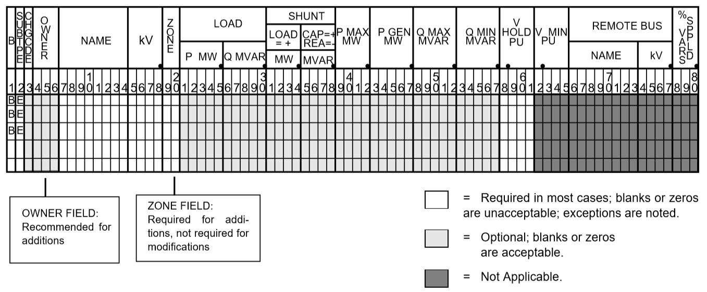

====== ======== ======= =====================
Column ID Field Format  Description
====== ======== ======= =====================
1-2    yes      A2      ``BE`` — Constant voltage bus
3      no       A1      Change code
4-6    no       A3      Ownership
7-14   yes      A8      Bus name
15-18  yes      F4.0    Base kV
19-20  no       A2      Zone
21-25  no       F5.0    Load MW
26-30  no       F5.0    Load MVAR
31-34  no       F4.0    Shunt Admittance Load in MW at base kV
35-38  no       F4.0    Shunt Admittance in MVAR
39-42  no       F4.0    ``P MAX``
43-47  no       F5.0    ``P GEN``
48-52  no       F5.0    ``Q MAX`` in MVAR
53-57  no       F5.0    ``Q MIN`` in MVAR
58-61  no       F4.3    ``V HOLD`` in per unit
62-65  no       F4.3    N/A
66-77  no       A8,F4.0 N/A
78-80  no       F3.0    N/A
====== ======== ======= =====================

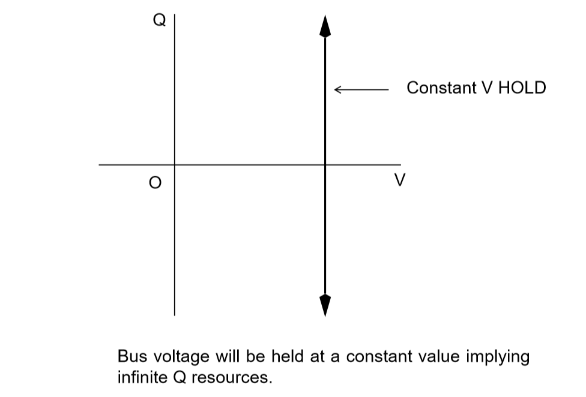

AC Bus Data (``BF``)
====================
This is a special purpose bus type used to assist the Newton-Raphson solution convergence. The ``BF`` type behaves as a ``BE`` bus until the P_net converges to the Newton-Raphson solution. Then it functions as a ``B-`` type. This feature is useful to bias a solution toward a more feasible voltage.

AC Bus Data (``BG``)
====================

Application
-----------
This bus type is typically used to maintain the voltage at a remote bus (subtype ``BC``).

This subtype may also be used for local control. For this application, the bus would maintain its own voltage. In this case, it would differ from a ``BQ`` bus only by the voltage limit. ``BG`` has :math:`V_{min} ≤ V_{max}`; ``BQ`` has :math:`V_{hold}`.

Bus Characteristics
-------------------
Real (P) power is held constant. This applies to generators, load and shunt devices. However, it is not required to have generation (``P GEN``) at this bus.

Reactive (Q) load and shunt are held constant for this bus type.

Reactive (Q) generation is variable.

This bus type requires reactive limits to be entered in the ``Q MAX``and ``Q MIN`` fields. The reactive limits on the subtype ``BG`` bus are used to maintain a specified voltage at a remote bus. If the remote bus voltage cannot be held with the available ``BG`` bus reactance, voltage control stops at either ``Q MAX`` or ``Q MIN``.

A specific amount of reactive generation (``Q SCHED``) cannot be requested.

This bus type uses ``V MAX`` and ``V MIN`` limits. If these fields are blank, global voltages are used as defaults. The voltage on the ``BG`` bus must be between ``V MIN`` and ``V MAX`` when controlling a remote bus. If not, remote voltage control will be disabled.

If this bus type is being used to control another bus, the ``REMOTE BUS`` and ``% VARS SUPPLIED`` fields should be used.The ``REMOTE BUS`` may not be the system swing bus or another subtype ``BG`` bus. The ``% VARS SUPPLIED`` field is used to allow the voltage control of a remote bus, to be distributed among more than one ``BG`` bus.

If the ``% VARS SUPPLIED`` is left blank, the program computes these values based upon the percent of total VARS supplied by the bus.

If the bus is controlling itself, its own name must appear in the ``REMOTE BUS`` field.

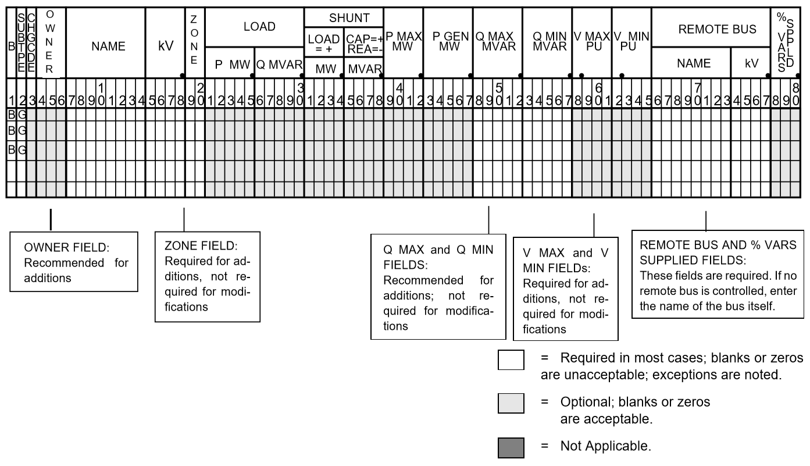

====== ======== ======= =====================
Column ID Field Format  Description
====== ======== ======= =====================
1-2    yes      A2      ``BG`` — Maintains the voltage of a remote bus
3      no       A1      Change code
4-6    no       A3      Ownership
7-14   yes      A8      Bus name
15-18  yes      F4.0    Base kV
19-20  no       A2      Zone
21-25  no       F5.0    Load MW
26-30  no       F5.0    Load MVAR
31-34  no       F4.0    Shunt Admittance Load in MW at base kV
35-38  no       F4.0    Shunt Admittance in MVAR
39-42  no       F4.0    ``P MAX``
43-47  no       F5.0    ``P GEN``
48-52  no       F5.0    ``Q MAX`` in MVAR
53-57  no       F5.0    ``Q MIN`` — Must be blank or zero for ``Q SCHED`` to apply
58-61  no       F4.3    ``V MAX``
62-65  no       F4.3    ``V MIN``
66-77  no       A8,F4.0 Controlled bus name and base kV (self or remote)
78-80  no       F3.0    Percent of vars supplied for remote bus voltage control.
====== ======== ======= =====================

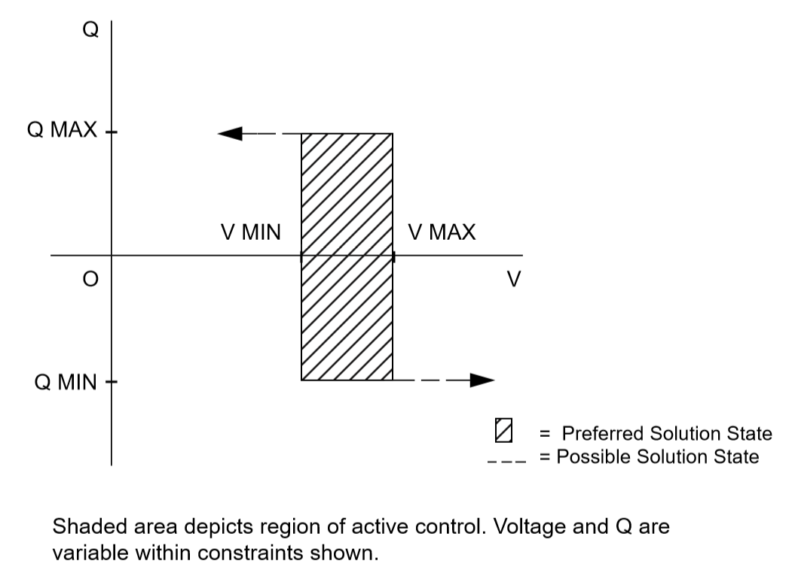

AC Bus Data (``BQ``)
====================

Application
-----------
This subtype is used to hold the bus voltage to a specified value within reactive limits.

Bus Characteristics
-------------------
Real power (``P GEN``) is held constant. This applies to generators, load, and shunt devices.

Reactive load (``Q MVAR``) load is held constant for this bus type.

Reactive (``SHUNT MVAR``) shunt is variable. The amount of shunt reactance added by the program can vary from 0 to Qshunt, depending on the amount needed to maintain desired bus voltage.

Reactive (Q) generation is variable.

This bus type requires adjustable reactive generation or shunt to perform as intended. If neither is available, the bus functions as a bus type ``B``-blank.

A specific amount of reactive generation (``Q SCHED``) cannot be requested.

Since this bus type is attempting to maintain its own voltage, a ``V HOLD`` entry is required on the record. If the voltage cannot be held at the desired level, using the reactive capability of the bus, the desired voltage will be violated and reactive will be held at the ``Q MAX`` or ``Q MIN`` limit. Note that ``V`` HOLD is not required for modifications.

.. note::

   For a type ``BQ`` bus to be viable, it needs a source of adjustable reactive. This may be the B_shunt field or the ``Q MIN`` - ``Q MAX`` fields. The necessary reactive component may be provided on the bus record, or it may be provided on an accompanying continuation (``+``) bus record or both

====== ======== ======= =====================
Column ID Field Format  Description
====== ======== ======= =====================
1-2    yes      A2      ``BQ`` — Constant voltage within Q limits
3      no       A1      Change code
4-6    no       A3      Ownership
7-14   yes      A8      Bus name
15-18  yes      F4.0    Base kV
19-20  no       A2      Zone
21-25  no       F5.0    Load MW
26-30  no       F5.0    Load MVAR
31-34  no       F4.0    Shunt Admittance Load in MW at base kV
35-38  no       F4.0    Shunt Admittance in MVAR
39-42  no       F4.0    ``P MAX``
43-47  no       F5.0    ``P GEN``
48-52  no       F5.0    ``Q MAX``
53-57  no       F5.0    ``Q MIN``
58-61  no       F4.3    ``V HOLD``
62-65  no       F4.3    N/A
66-77  no       A8,F4.0 N/A
78-80  no       F3.0    N/A
====== ======== ======= =====================

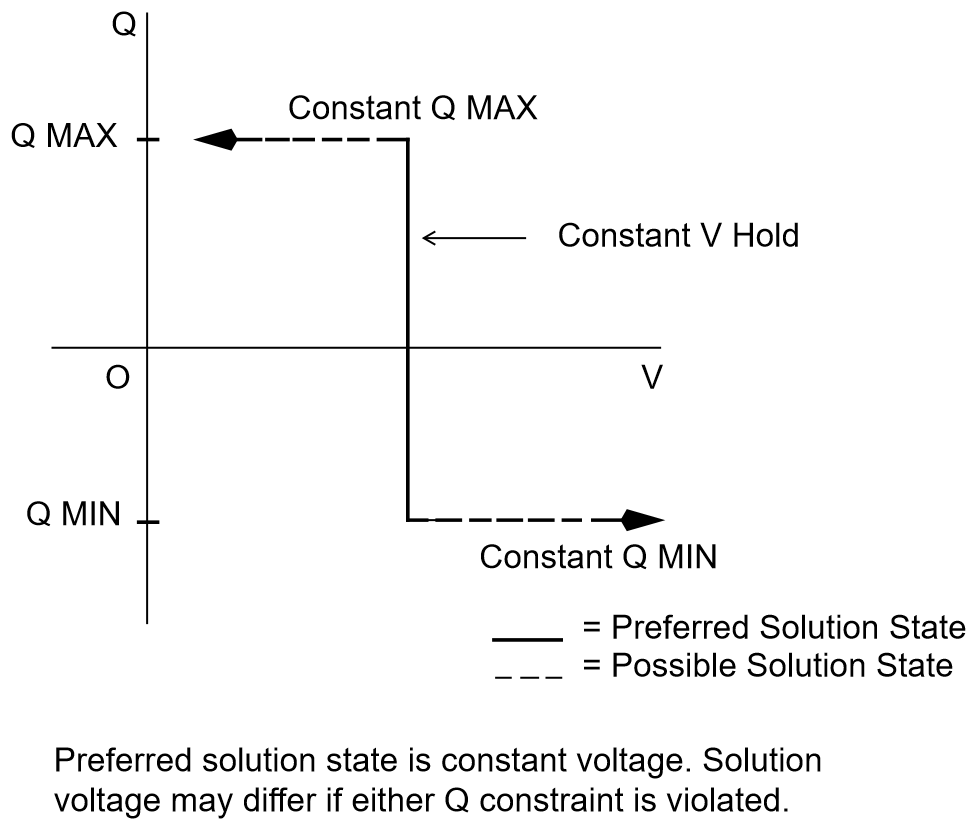

AC Bus Data (``BS``)
====================

Application
-----------
This subtype designates the system swing or slack bus. The generators at the swing bus supply the difference between the specified power flowing into the system at the other buses and the total system output plus losses. Thus, real and reactive power are determined as part of the solution for this subtype.

Every power flow case must have a minimum of one swing bus. In addition, each isolated ac system must have its own swing bus. The maximum numbers of swing buses allowed for a single power flow case is ten.

Bus Characteristics
--------------------
Real (P) load is held constant. Both real (P) generation and shunt are variable. The ``P GEN`` field is updated to the base case value. The ``P MAX` field is used for reporting purposes only.

Reactive (Q) load is held constant for this bus type. Reactive (Q) shunt is variable. The amount of shunt reactance added by the program can vary from 0 to ``Qshunt``, depending on the amount needed to maintain desired bus voltage.

Reactive (Q) generation is variable.

Reactive constraints are allowed for this bus type. These quantities are entered in the ``Q MAX`` and ``Q MIN`` fields. If reactive constraints are imposed, "unscheduled reactive" may be added by the program to maintain the bus voltage.

A specific amount of reactive generation can be requested, in place of reactive constraints. This is implemented by entering a 0 in the ``Q MIN`` field and the desired amount of reactive generation in the ``Q SCHED`` field. Again, "unscheduled reactive" may be added by the program to maintain the bus voltage.

The ``BS`` bus record requires an entry in the ``V HOLD`` field.

The ``V MIN`` field is used to specify the angle of the swing bus for this application. It should be noted that an implied decimal point exists between columns 64 and 65. For example, an angle of 3.7 degrees can be specified with a 3 in column 64 and a 7 in column 65.

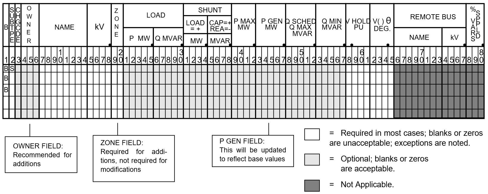

====== ======== ======= =====================
Column ID Field Format Description
====== ======== ======= =====================
1-2    yes      A2      ``BS`` — System swing or slack bus
3      no       A1      Change code
4-6    no       A3      Ownership
7-14   yes      A8      Bus name
15-18  yes      F4.0    Base kV
19-20  no       A2      Zone
21-25  no       F5.0    Load MW
26-30  no       F5.0    Load MVAR
31-34  no       F4.0    Shunt Admittance Load in MW at base kV
35-38  no       F4.0    Shunt Admittance in MVAR
39-42  no       F4.0    ``P MAX``
43-47  no       F5.0    ``P GEN``
48-52  no       F5.0    ``Q MAX``
53-57  no       F5.0    ``Q MIN``
58-61  no       F4.3    ``V HOLD``
62-65  no       F4.1    Voltage angle (blank implies zero degrees)
66-77  no       A8,F4.0 N/A
78-80  no       F3.0    N/A
====== ======== ======= =====================

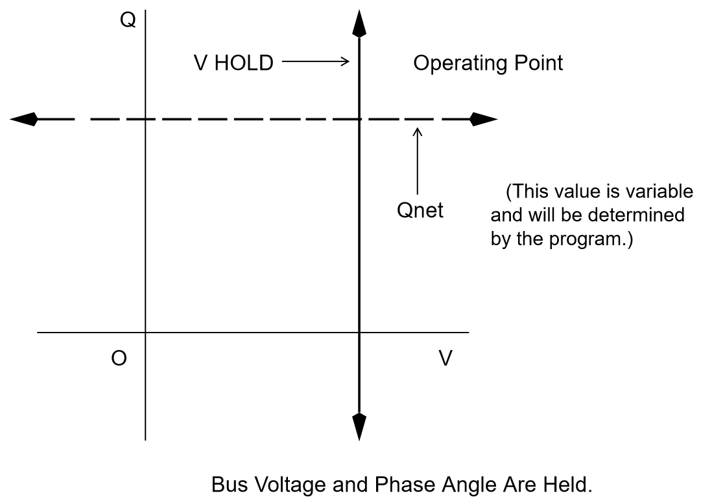