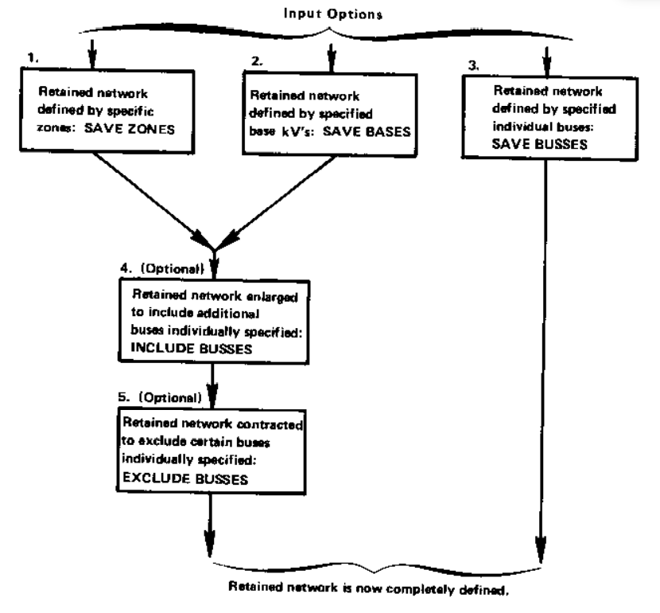

***************************
Retained Network Definition
***************************
The network to be reduced is obtained from a solved base case. The retained system is defined by
the user in the INPUT file. Five options are available to the user as shown in the figure below.

  Retained Network Input Options

Each of the options 1 through 5 are affected by the unique control cards described in upper case
characters in the blocks in the figure above. Their formats are described in the following paragraphs.

Reduction Cards
===============
The reduction cards specify the retained systems. There are several options available.
1. Zone Selection. The zones which normally define geographical areas may be used to define
the retained system. All buses within these zones are then retained.
The format is essentially “free-field”. Commas separate the different zones and a period
terminates the list. Any blanks are ignored unless immediately preceded by a comma or a
period.
The command >SAVE_ZONES must begin in column 1. If the zone list is too long to be
contained on a single card, continuation cards must be used, in which a blank appears in
column 1 and the zone list continued.
2. Base kV Selection. The retained system may be selected as the set of all buses with base
kV's matching the specified set.
As with the previous card, the format is essentially free-field. However, decimal points may
be part of the base kV, necessitating a double period to terminate the list.
The command >SAVE_BASES must begin in column 1. Continuation cards are permitted.
If they are used, a blank must appear in column 1 as the base kV list continues.
3. Zone Selection Subjected to Base kV's. This is a combination of steps 1 and 2 described
previously. Each of the zones selected is further stipulated to certain base kV's. 
Recognition is acknowledged that different zone/base kV combinations may be desirable, and 
several zone-base KV cards are permitted.
The format is similar to steps 1 and 2 above. The difference is that the last zone (there may
be only one) is followed by a comma and the words >SAVE_BASES. Continuation cards
are permitted.
4. Inclusion and Exclusion of Buses to Retained System. The general criteria of saved zones,
saved bases, or both is recognized as too general to adequately define all retained systems.
Provisions permit the system thus defined to be enlarged or contracted by specifying 
individual buses which are to be included into or excluded from the retained system.
The retained system is expanded with the control card.
``>INCLUDE_BUSES``
beginning in column 1 and followed with separate bus cards. The bus card need only
contain the B in column 1, and the bus name and base kV in columns 7-18. All other fields
are ignored. The list of included buses is terminated when a card without a B in column1 is
encountered.
The retained system is contracted with the control card
>EXCLUDE_BUSES
beginning in column 1 and followed with separate bus cards as described previously.
5. Individual Bus Selection. In lieu of options 1. through 4.described previously, the retained
system could be identified by individually specified bus cards. This request is initiated with
the control card
>SAVE_BUSES
beginning in column 1. Each retained bus is then individually specified with a bus card.
Only the bus identification fields need be specified, that is, the B in column 1 and the bus
name and base kV in columns 7-18. All other fields will be ignored. The list continues until
a card without a B in column1 is encountered.

Input listings
==============

