.. _x-window-graphical-interface:

**************************************
``gui`` - X Window Graphical Interface
**************************************
This section presents information about the X Window graphical user interface (``gui``) for IPF.

IPF's X Window GUI interface makes data entry and modification easy. It also simplifies the running of base case solutions and the printing of network diagrams. This guide shows how to use the major features of IPF. Users who need details about data input record formats or system models should consult the :ref:`record-formats` section.

IPF's GUI uses the X Window System and the OSF/Motif window manager interface. The graphical user interface features an interface that will be familiar to people who use an X Window System before, but it will feel a bit cumbersome compared to modern day applications.

Audience
========
You will be expected to already know the basics of power flow programs in general. You will find that small changes in bus and branch values are easier to make in the GUI than trying to manage through ASCII text files and running ``bpf`` commands on the terminal. For example, users will get a feel for how changes to the input data affect the solution voltages in a network much more quickly with the GUI than by using a terminal style interaction.

User Interface
==============
The X Window System and the OSF/Motif window manager use certain descriptive terms for actions performed with the mouse. These terms are defined here. In addition, some keyboard actions are also defined. See the table below.

.. table:: User Interface Terms

  ============ ==================================
  Term         Meaning
  ============ ==================================
  Select       Perform a mouse (or keyboard) action that singles out a user interface object. Usually the object is highlighted in some fashion, such as reverse video for menu selections. Subsequent commands or operations are performed on the selected object
  Select Text  Click the left mouse button inside a text box. If the text is modifiable, the cursor will change to the text cursor (I-beam) cursor, which can be moved to edit or enter text in the box
  Press        Hold down without releasing a mouse button or key.
  Click        Press and release a mouse button in one quick action.
  Double-click Click the same mouse button (left, middle, or right) two times rapidly without moving the mouse between clicks.
  Drag         Press and hold a mouse button, move to a new location and release the button.
  Type         Type all the keys called for without pressing Return at the end.
  Enter        Type all the keys called for and press Return at the end.
  Scroll       Drag the bar at the right of the window up or down to move through a display. Some windows also have a bar at the bottom with which you can scroll right and left.
  =========== ==================================

Keyboard Conventions
--------------------
The following conventions are used for key strokes. Generally, a hyphen (-) connects key names that should be pressed and held, starting from left to right. For example, the key sequence Control-c Shift-E means to press and hold the Control key and then press c. Release this combination and press and hold the Shift key and then the E key. Then release these keys. A different example: Esc f means to press and release the Esc key followed by the f key.

In general, the mouse operation and keyboard operation follow the conventions of the Motif interaction style guidelines. These are found in the OSF/Motif Style Guide. Many aftermarket books about Motif cover these conventions also.

X Window System
---------------
This chapter provides a quick introduction to the X Window System and X window managers with emphasis on the OSF/Motif window manager. The treatment here is certainly not exhaustive or even complete. But it is intended to give you enough background to successfully use the Interactive Powerflow (IPF) program.

If you have not used an X Window based GUI before, be sure to go through this chapter for some pointers so that you’ll be headed in the right direction. If you would like more information, refer to the following books about the X Window System and OSF/Motif.

  * Open Software Foundation. *OSF/Motif Style Guide Revision 1.1*. Prentice Hall, 1991. This provides the official description of OSF/Motif look, feel, and behavior for OSF/Motif software developers. Though not oriented toward OSF/Motif users, this book does give precise descriptions of all OSF/Motif components and behavior.
  * Quercia, Valerie and Tim O’Reilly. *X Window System User’s Guide OSF/Motif Edition*. O’Reilly & Associates, Inc., 1991. This is a good, general introduction to X and OSF/Motif.

Broadly speaking, the X Window System is designed to deliver mouse-driven menu/window user interface applications over a local area network.

The X Window System specifies that the "look and feel" of its user interface be "policy free."" Because of this, programmers are free to create their own look and feel within broad limits. Over the past few years, Sun Microsystems, AT&T, and the Open Software Foundation have all created GUIs for the X Window System with a distinct look and feel. The Open Software Foundation offers OSF/Motif.

Like most large software systems, X and its environment have a jargon of their own. Here are a few terms you should know:

Server

  The part of X resident in your local computer (or X terminal) memory. The server has three main tasks. First, the server takes care of communicating with the mouse and keyboard. Second, it takes care of managing X resources, such as fonts and colors. Third, it communicates with X applications.

Client 

  A stand-alone X program. Clients are the X programs that you use to accomplish your work, such as drawing graphs, preparing text, making power flow calculations, etc. Clients usually reside in a computer across the local area network, but they can also reside in the same memory as the server itself. Clients and servers communicate through a special language ("protocol") that is especially efficient for communication over a Local Area Network (LAN).

Resources 

  X components that are held and managed in common for X clients by the server. X resources reside in your local computer (or X terminal) memory just like the server. X resources are things like fonts, color "pixmaps," font information, etc.

Window manager 

  A special X client that handles the window services of other X clients. There are a number of different X window managers, not just one, but you only use one window manager at a time.

X terminal 

  A special purpose computer having a built-in X server, and connection hardware and software for a LAN.

LAN 

  A Local Area Network usually based on the hardware and low-level software standard of Ethernet. For Unix computers, the software communication protocols are usually based on the TCP/IP standard. PC networks may use different hardware and software network communication standards.

The GUI portion of IPF is a server; the powerflow portion is a client. These two programs may reside on different computers, in which case the GUI will be running on the machine you are sitting in front of, and the powerflow will be running on a workstation somewhere else, perhaps a network server. Note that the X Window terminology for "client" and "server" is reversed from the network communication terminology. It is also possible for both client and server applications to be running on the same computer.

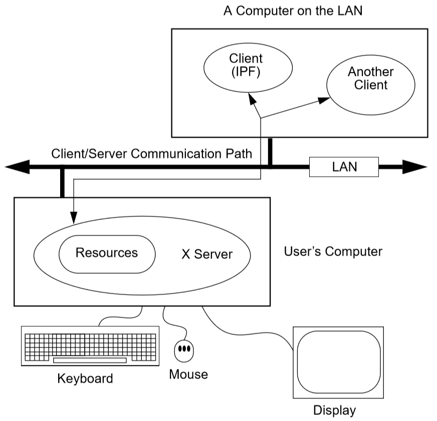

  A Server, Some Clients, and a LAN

The figure above shows you the basic architecture and communication model of the X Window System. Something you should note is that the client (application) program may be physically residing on a completely different computer from the one that your keyboard, mouse, and display are attached to. To access the remote application, you only have to know the name of the computer your client is on. (You also must have permission to use the other computer, of course, and it must be connected properly to the LAN.) The X Window System was designed from the ground up to run in a distributed computing environment.

When you are running a client, such as IPF, over the network, in contrast to running it in your own computer's local memory, you will ordinarily notice very little performance degradation due to network traffic, though there may be some depending on how busy the network is. X is designed to minimize network communication.

The server side of X resides in your own computer's (or X terminal's) memory. There is one X server for each user's keyboard, mouse, and display. The server is dedicated to you. However, your server may communicate simultaneously with many different X clients, not just IPF. And again, these other clients may be anywhere out on the LAN. Thus, in any one X session (between "login" and "logout"), you may run many X clients on many different computers. The server manages all this.

When your client requests a certain font, the server delivers it. When your client requests different colors for graphical objects, the server consults the color map for that client and delivers the correct colors. Fonts, colors, and certain other server-managed software components are termedresources. Some resources such as colors and fonts you can change in your own account’s IPF resources file, XGUI. See ?? if you would like to learn more about this.

A Summary of Motif Basics
=========================
IPF is designed to run and look best with the Motif window manager. This section introduces you to some Motif window manager basics. However, for detailed information, turn to the books cited at the beginning of this section.

Motif Windows
-------------
Motif windows are rectangular areas of the display. Various Motif components surround a central area where text and/or pictures appear. See example below. These components are controlled by the Motif window manager. However, the central area is controlled by an X client, which is a completely separate program from the Motif window manager. IPF ``gui`` is an X client, so it controls only the interior of Motif-managed windows. Because of this separation, you may notice that IPF’s windows can still be moved, iconized, etc., even though the IPF client may not be responding.

In the figure below, the Terminal Emulator client controls the central display (where the text is), the Menu Bar, and the Scroll Bar. The Motif window manager (client) controls all the rest of the window.

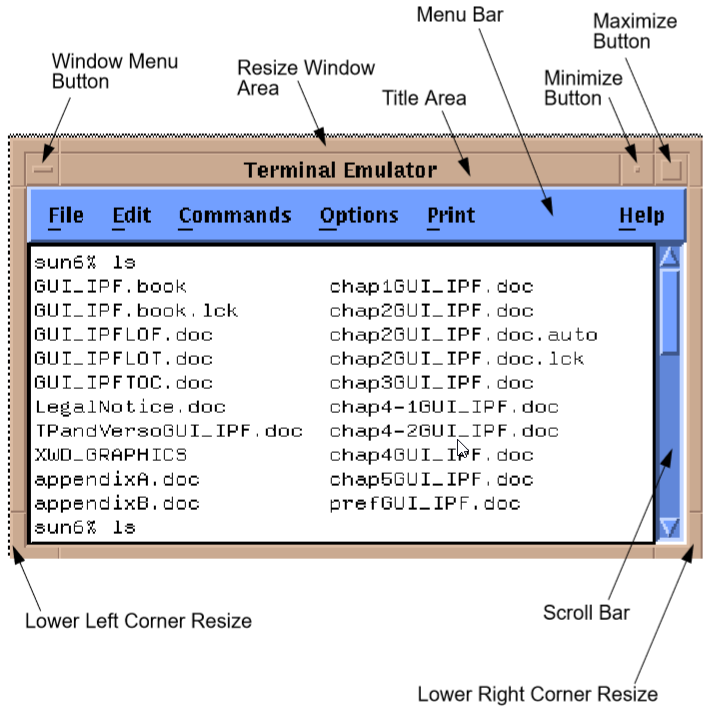

  Motif Window Components

Motif Resources
---------------
Like the X Window System, Motif has resources that you can change. Resources are system controlled components such as fonts, colors, initial size and position of windows, etc. Many X clients (application programs) have customizable resources. Since the Motif window manager is just another client, it has customizable resources, too.

Resources can be changed in two ways:

  * Change the dedicated client resource file with an ASCII text editor. On Unix systems, the Motif resource file is named ``.mwmrc`` and the X resources file is ``.Xdefaults``
  * Use a dedicated X application that provides a regular GUI interface for changing the resource file.

Since interpreting the meaning of the resource specifications is not always easy or straightforward, it is recommended that you look for a dedicated X client for changing resources. Your Motif system probably has this X client already available, so that all you have to do is choose the Motif resource editor as a command on a system menu. Possible names to look for are System Setup, Configuration, User Preferences, or something similar. The editing of the many resources may be broken out on your system menus as separate commands, such as Colors, Fonts, Sizes, etc.

As a second choice, use a Motif book to help you interpret the meaning of the resource specifiers in the ``.mwmrc`` file and edit them with an ASCII editor such as the vi ASCII editor. Nearly all Unix systems have vi.

Common Windows Tasks
--------------------
This section goes through a few common window and menu tasks to give you a feel for the Motif interface. Some tasks can be done through a menu command and through direct manipulation of a graphic component. And, in addition, many tasks can be accomplished through a sequence of keys without recourse to mouse movement or button clicks. The following brief descriptions concentrate on direct graphic component manipulation since this is usually the quickest way to get something done in Motif.

To move a window
^^^^^^^^^^^^^^^^
Motif windows have a title area at the top. The window shown above has "Terminal Emulator" in the title area. You move Motif windows by "grasping" the window in this area and dragging it to a new location.

  1. Move the mouse cursor to any point within the title area.
  2. Press and hold the left mouse button.
  3. Move the window to another location of the display. You will note that an outline box of the window shows you the dimensions of the window as you are moving.
  4. Release the button. The window appears at the new location.

To reduce a window to an icon
^^^^^^^^^^^^^^^^^^^^^^^^^^^^^
Icons are small, rectangular graphic objects that represent the main windows of Motif applications. Icons have many, but not all of the same attributes as windows - for example, they can be moved like windows. Icons are used to organize the display and reduce clutter. You are free to put icons wherever you like on the display. Some Motif systems organize icons in a special window, which looks like a desktop.

  1. Click the Minimize button at the top right of a window. This shrinks the window to an icon and automatically places the icon at a predetermined place on the display. (Note that this place may be obscured by other windows!)
  2. Move the icon as you would a window by placing the cursor over the icon, pressing the left mouse button, moving, and releasing the button.

To change an icon into its window
^^^^^^^^^^^^^^^^^^^^^^^^^^^^^^^^^
An icon can be changed back into its windows by double clicking on it. The window will "remember" where its previous position was. Sometimes the timing between clicks is important, so make sure you do it fast enough.

  1. Find an icon (or create one) and move the mouse cursor over the icon. Double-click the left mouse button. Be sure to keep the mouse cursor stationary between clicks; otherwise, Motif may interpret your actions as a “move icon” operation.
  2. If you find that a menu pops up, select the Restore command by moving the cursor over the word and clicking once.

To resize a window
^^^^^^^^^^^^^^^^^^
Motif windows have a narrow border that acts as a “handle” for resizing operations. There are eight parts to the border — four corners and four sides. The corners are used to resize simultaneously both adjacent sides, and the sides are used to resize just one side at a time. The following procedure describes a common resizing operation.

  1. Move the mouse cursor over the lower right corner. Note that this corner is demarcated by two cross cuts on the border a short distance away from the corner. The cursor may change its appearance when it is in this area, indicating that it is in the right position.
  2. Press and hold the left mouse button on the lower right corner.
  3. Move the mouse to the inside or outside of the current window.
  4. Release the mouse button when you are satisfied with the size.

The opposite (upper left corner) remains stationary while you move the mouse around. A border line for two sides shows up to give you an idea of the size of the window as you move. Also, a pixel counter of the vertical and horizontal dimensions shows up to give you feedback if you need it.

If the corner or side the you want to grab is not visible on the screen, move the window until it is.

To enlarge a window quickly
^^^^^^^^^^^^^^^^^^^^^^^^^^^
The Maximize button in the upper right corner is a quick way to enlarge a window to the maximum size of your display. 

  1. Move the mouse cursor over the Maximize button in the upper right corner of a window.
  2. Click the button. Note that the window now covers the maximum area of the display. (All other windows should be covered.) You can resize the window using the directions above.

To pop up a window’s menu
^^^^^^^^^^^^^^^^^^^^^^^^^
All Motif windows have a minimum set of window management functions available in the upper left corner via the Window Menu button. Many of the functions described above are available through this menu. Some additional ones are there too, such as Close, Restore, and Lower.

  1. Move the mouse cursor over the Window Menu button in the upper left corner.
  2. Press and hold the left mouse button. Note that a menu pops up. Select one of the commands on the menu by moving the mouse cursor over the command and releasing. Only commands that are clearly visible are selectable. Those which are “grayed out” are not accessible or appropriate in the current context.

Closing a window causes the window to disappear from the display, so be careful because it can also quit the application. In the beginning, you may not know how to restart an application! (Look for a Motif window called the Session Manager. Your system operator has probably set up your account with a Session Manager. See if you can find the closed application on a menu in your Session Manager, so that you can re-open the application if you accidentally close it.)

Lowering a window means to cause it to go to the bottom of the windows “stack.” Think of Motif windows as pieces of rectangular paper on a desk. The ones that overlap have an order from top to bottom. The Lower command causes movement of windows in the stack from top to bottom. Experiment with the command to see how it works. You bring “buried” windows to the top by pushing visible ones down with the Lower command. Note, however, that if you see any piece of a Motif window, you can just click on or inside the border to bring it immediately to the top.

IPF as an X Client
==================
IPF is built on top of the X Window System and uses the facilities of an X window manager of your choice. (However, the recommended window manager is Motif.) In the figure below, you can see that both the X server and the GUI part of IPF reside on the user’s computer. Another client that is always present on the user’s computer is the user’s window manager. This is not shown in the figure below, however. In most configurations, the "engine" (``ipfsrv``) part of IPF resides on the user’s computer, but may, as shown below, reside on some other computer across the LAN.

When you start up IPF, the GUI initializes itself, initializes ``ipfsrv``, and then brings up IPF’s window interface.

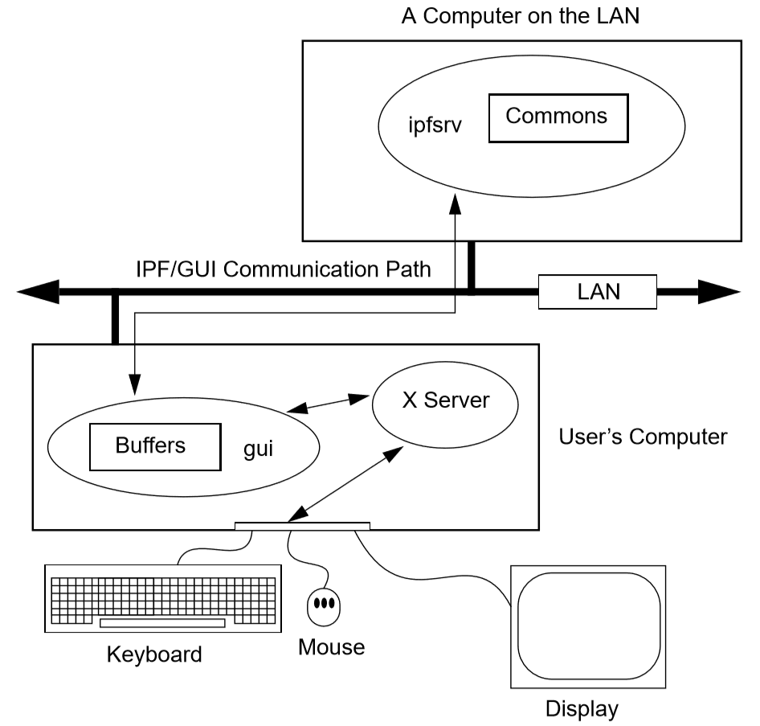

  PowerFlow/GUI Communication

IPF X Window GUI Architecture
=============================
The figure below shows a high-level view of the IPF X Window GUI and its environment. IPF is divided into the GUI code, which is written in C, and the powerflow code, which is written in Fortran. When you run the X Window System and Motif, you are using the Motif and X libraries in addition to Unix operating system calls and IPC (Interprocess Communication) calls. The GUI part of IPF (``gui``) uses the Motif library and IPC calls. The powerflow part of IPF (``ipfsrv``) uses IPC calls.

Because the Motif library is used for IPF, the Motif window manager is recommended for running with IPF. You can use another window manager with IPF, but the program will not have a consistent look and feel. The functionality remains the same, but you will notice a visual style within the IPF client that is different from the window manager, which controls the display outside the IPF windows and dialog boxes.

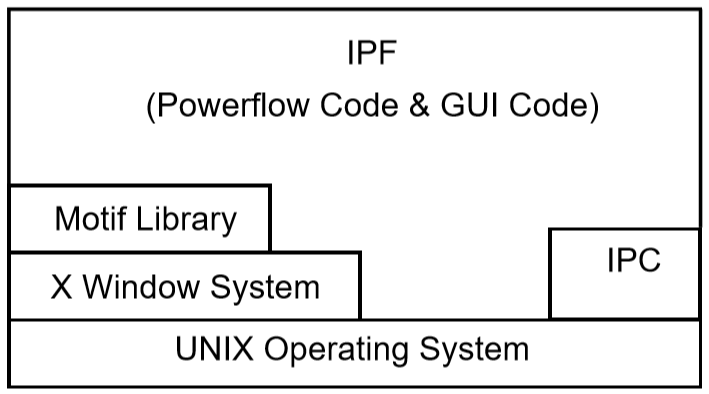

  Powerflow/GUI and System Software

History
=======
Some key developments took place in the late 1970s and 1980s that made possible the X Window System and the X window managers.

  * The idea of the graphical user interface (GUI) was created, implemented, and became popular.
  * Personal computers became powerful enough to handle the data and processing intensive GUI.
  * Efficient, fast, inter-computer communication - the local area network (LAN) — became widespread.
  * A general purpose, non-proprietary operating system - the UNIX operating system — achieved wide acceptance.

All of these developments contributed materially to the possibility and, indeed, the eventual widespread acceptance of the X Window System and X window managers.

In the late 1970s, medium-sized computers began to get powerful enough to handle information organized graphically rather than in a character-based (textual) way. They also began to get cheap enough to be dedicated to one person. It was on one of these computers that the Xerox Corporation installed the very first GUI using a mouse, menus, and windows. This GUI borrowed heavily from the Smalltalk-80 user interface, which was also invented at Xerox. (Smalltalk-80 is an object-oriented programming environment and system.)

GUI - graphical user interface - simply means using the graphics capability of a computer as the primary mode of interacting with users. A few GUIs do not, in fact, use a mouse, menus, and windows. However, GUIs using this combination of elements became common early because of their inherent ease of use.

Meanwhile, truly affordable personal computing was taking off in the late 1970s and early 1980s with the Apple and then IBM PC computers. These computer architectures were essentially graphical in nature, especially the Apple, though their interfaces were still character-based.

In 1984, Apple introduced the first personal computer with a thorough-going GUI. This was the Macintosh. This computer introduced wide numbers of people to a very easy to use graphical interface. It showed many computer manufacturers that they needed to design with GUIs in mind. A few years later, Microsoft Corporation retrofitted a windowing system onto MS DOS IBM PC-compatible computers.

Also in the late 1970s and 1980s, Sun Microsystems, Hewlett-Packard, DEC, and other companies saw the need for powerful computing "workstations" that business, research laboratories, and government could use. These workstations became common where personal computers didn’t have enough power. However, they generally lacked GUIs, which made them harder to use and less versatile than they might have been.

Another element in the computing picture was also developing in the 1970s and 1980s. This was widespread inter-computer communication. The idea of the local area networks (LAN), which was a room-to-room and building-to-building communication network, was created and implemented. A particularly popular LAN was, and is today, the Xerox-created Ethernet. This LAN is simply a cable connecting computers, whereby the computers can request and send just about any kind of data, often organized as files.

Another computing environment element was the development and distribution of a general purpose operating system that was platform independent, the UNIX system developed in the 1970s and 1980s at AT&T's Bell Labs. This operating system was distributed freely to many college campuses, and the University of California at Berkeley developed many extensions to UNIX, among them sockets which provide efficient communication over LANs. Today, the UNIX operating system is offered commercially by AT&T as UNIX System V.

To complete the computer environment picture of the 1980s and 1990s, engineers at the Massachusetts Institute of Technology created the X Window System, often called just "X." This GUI and underlying software was designed for powerful workstations with graphics-oriented hardware architecture. These capabilities are now available on high-end PCs as well. It is also designed for computers that make heavy use of a LAN. Though not limited to the UNIX operating system, the X Window System was first developed on UNIX computers.

Working with the GUI
====================
This section describes how to accomplish basic tasks in the GUI version of IPF. After reading through this chapter, you should be able to use the Concepts and Commands section to figure out and work with the rest of IPF's features.

The material in this section is not written as a complete, start-to-finish tutorial. Rather, the material is organized by individual task. However, the various topics are organized so that they reflect the common order of tasks in a typical session. So, you can either read the topics and do the steps within the topics in the order presented, or you can skip around and try out specific topics as they interest you.

.. note::

  Most of the task procedures in this chapter involve using the mouse and its buttons. When you are asked to use a mouse button, the left-hand button is meant unless you are explicitly directed otherwise.

The main menus and toolbox are the keys to IPF's main functions. The main menus contain commands that allow you to open files, save files, print network diagrams, solve cases, get help, edit bus and branch data, and so forth. The toolbox contains icon buttons that move you into and out of various display modes. They allow you to create new buses, move buses, bend branches, reduce or enlarge the display, modify bus or branch data, and so forth.

The Display Mode buttons determine whether the map shows the intersection of the currently loaded base case file and the currently loaded coordinate file, or everything in the coordinated file. The current files area tells you which files you currently have loaded. The branch color key indicates the base kV rating of branches shown on the display, or their overload status.

In a prototypical session, you would generally follow this scenario:

  1. Load a solved system and/or a network data file, and a coordinate file via the main menu Files - Open command.
  2. Make changes to the system and/or coordinate file data using the various toolbox icon buttons, which allow direct on-screen manipulation of bus icons and branches, or bring up dialog boxes for adding data to bus and branch records.
  3. Solve the new case with the main menu  Process - Solve command.
  4. Save your new case including its solution data with the main menu  Files - Save command.
  5. Print out a network diagram with the main menu  Files - Print Plot command.

You might also do the following:

  * Run a CFLOW program with the main menu Process - Auto CFLOW command.
  * Get some help along the way with the main menu Help command.

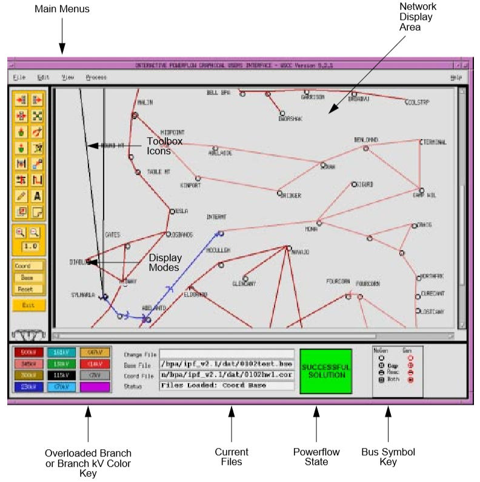

  Main Window

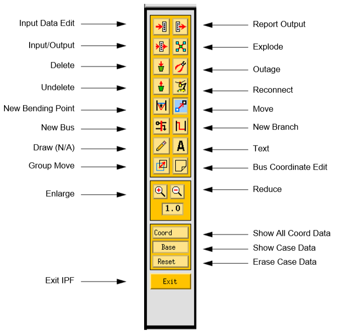

  Toolbox Icons

Starting IPF
============
IPF is an X Window System application and is started like any other X application. However, your underlying operating system and the window manager you are running offer some ways to simplify how you start up IPF. Essentially, there are three ways you can start up IPF:

  * You type the IPF command name ``gui`` in a terminal emulation window.
  * You select IPF on your window manager's "run applications" menu. Generally, this involves clicking a mouse button on the background to bring up the "run applications" menu.
  * You find that IPF is started automatically when you log in to your account. This means the system administrator has already set up your account to do this. You should see IPF as an icon or open window after the login process is complete.

To start IPF from an X terminal emulator window:

  1. Make sure the X Window System and your window manager are running. Consult with your system administrator if you don’t have X running.
  2. Find a terminal emulator window or open one from a window manager menu.
  3. In the terminal emulator window, enter gui. Within a minute or less, depending on the performance of your computer system, you should see the IPF main window appear.

Exiting IPF
===========
When you are through editing the currently loaded base case or coordinate files, running a solution, etc., and have saved your work, choose the Exit command from the File menu.

  1. Click the File menu and select the Exit command. You will see the Exit dialog box come up. Do not use the window menu button (upper left) to close the IPF window.
  2. Click OK if you are sure you want to exit IPF. Click Cancel if you have changed your mind and want to keep IPF running. If you select OK, IPF closes all its windows and removes them from the screen. You will still be in the X Window System, and you can proceed to any icon or open window to continue working with other X clients. If, after exiting IPF, you decide to run IPF again, see Starting IPF, above.

.. _opening-files:

Opening Files
=============
The Open dialog box shows you the five kinds of files you can open in IPF: the command, change, base case, network data, and coordinate files. See the figure below. For detailed information about these files, see :ref:`powerflow-command-language` and :ref:`record-formats`.

For most power flow studies, the base case (binary) coordinate files are used. However, network data files must be used to initially create a binary base case file. Change files are used to make changes to a base case file; this case is called a change case, and the results are typically saved as a new base case file. Command files are :ref:`powerflow-command-language`.

Unlike the command, change, network data, and coordinate files, which are ASCII text files, the base case file is a binary memory image file. The base case file contains only power system data, which is edited within IPF, whereas the command, change, and network data files may be editedoutside IPF using any ASCII text editor.

The coordinate file is a combination of bus position and branch bending point data in addition to plotting data. The coordinate file bus position and branch bending point locations can be altered by moving them in the GUI display, and a new coordinate file saved if desired. The plotting data can also be edited outside of IPF with an ASCII text editor.

Displaying a Network File
-------------------------
Normally, you will want to load a coordinate file in addition to the network data or base case file you intend to work on. If you do not, you will not be able to display the system graphically in the IPF main window. A system data file needs coordinate position information to display itself in IPF. It must get this information from a coordinate file since it does not have this information within itself. However, if all you want to do is edit a coordinate file, you can load just that file, and it will display properly in the main window.

If you load only a system data file, you can use only the textual editing and report capabilities of IPF to see your data, but you can still solve, make changes, save cases, etc. Also, you can generate a network diagram on the fly from which you can graphically navigate or display results. See :ref:`exploring-base-case-connectivity`.

To open a network file:

  1. Choose Open from the file menu in the IPF main window. You will see the Open dialog box as shown in Figure 3-3.
  2. Find Network Data File at the left of the dialog box. The button, information box, and file text boxes under the heading allow you to select a network data file. The file text box under the Select button holds a file selection string. The string displayed when you first open the Open dialog box comes from a default that you can set in your XGUI file. See Appendix A, Customizing IPF.
  3. Click the Select button. Notice that the file selection string is transferred to the Filter file text box at the right. Also, the Files list changed to reflect the Filter criteria.
  4. Scroll the Files list to find the file you want to load.
  5. Select the file by clicking it. This action puts the selected file in the Selection file text box below the Files list.
  6. Click the Apply button to put the file name you have selected in the Network Data File file text box at the left side of the Open dialog box.
  7. Click the Load Selections button at the bottom of the left side of the Open box. This final action actually loads the selected file into IPF’s memory.

Since step 7 causes the open files dialog to close, it is best to perform steps 1 to 6 for each of the different kinds of files you want to load, and then click Load Selections at the end to load all files at one time. Note that you cannot open a network and a base file. Only the last one you picked will be loaded.

To open a command, change, base case, or coordinate file:

To open these files, perform the steps above. All of the essentials are similar; only the file type is different.

Saving Files
============
You can save five kinds of files in the X Window GUI: change files, base case files, network files, coordinate, and stability interface files. Ordinarily, you save files after you are done with a work session, but you can save a file at any time. Change, network, and coordinate files are saved in ASCII text format. Base case files are saved in binary format. Stability interface files can be saved in either binary or ASCII format. In a binary file, a memory image of base case data is written out to a file. See :ref:`overview` for more information about these files.

To save a file:

  1. Choose Save from the File menu in the main IPF window. You will see the Save dialog box as shown in the figure below.
  2. Change the name of the file you are saving if you do not want to overwrite an existing file.
  3. Click the appropriate Save button to save the desired file.
  4. If the file you are trying to save has the same name as an existing file, you are presented with the Overwrite warning dialog box. You can choose Overwrite to complete the save or Cancel to cancel the save. Note only one base per file is allowed.

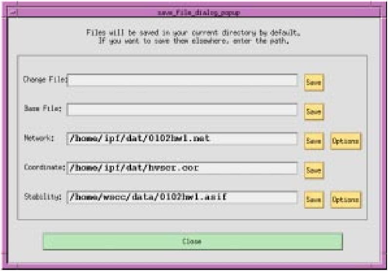

  Saving a File

Changing the Displayed Network Size
===================================
You can use the X Window scroll bars on the right and bottom edges of the network display window to see a different chunk of the network diagram. The X Window GUI also includes an enlarge (and reduce) displayed network feature. Two buttons in the toolbox control this. X Window GUI has three displayed network size options. When you first load a base case or coordinate file, the middle size is chosen by IPF. If you find you would like to see more detail in a network diagram, you choose the Enlarge button. If, on the other hand, you would like to see the overall picture, you choose the Reduce button. The Enlarge button doubles the displayed network size, and the Reduce button halves the image size.

All other toolbox operations work no matter what the network size is, so you are free to work with the size that best suits the task at hand.

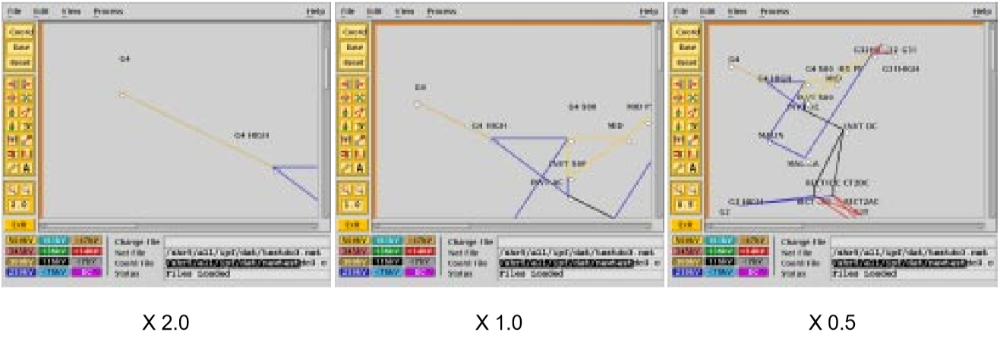

  Displayed Network Sizes

To alter the displayed network size:
  
  1. Make sure you have a coordinate file loaded. See Opening Files to find out how to do this.
  2. Click the Enlarge button in the toolbox in the main window. This magnifies the displayed network by two times. Note that you are now at the top magnification, 2.0.
  3. Click the Reduce button. The displayed network returns to its original size (1.0), which is the size created by an Open operation. Click the Reduce button again. The displayed network size decreases by half. This is the smallest size, 0.5.

Editing Base Case Data
======================
Editing a base case file is one of the primary activities in the X Window GUI. This involves a number of tasks: adding new buses or branches, modifying existing bus or branch values, and deleting existing buses or branches. These tasks are all accomplished in the main window toolbox and display area. 

.. _adding-a-bus-and-related-components:

Adding a Bus and Related Components
-----------------------------------
You can add a bus to a resident base case or to IPF itself with no base case loaded. The procedure is the same for both. Adding a bus means in effect to create a new bus record within IPF’s memory. You can add as many as you want up to IPF’s maximum limit. Bus-related components are such items as continuation, transformer, line, and Q records. The method of adding these components is very similar to adding a bus record.

To add a bus:
 
  1. Make sure you have a base case loaded if you want to add a bus to an existing base case file. See :ref:`opening-files` to find out how to do this.
  2. Click the New Bus icon in the toolbox in the main window. This puts you in the Add Bus mode and brings up the Bus Input Data dialog with a dummy bus name. Change this to whatever you want, and add data.
  3. Move into the display area where you will note that the cursor changes to a box to remind you that you are in New Bus mode. Click anywhere in the display area. Note that a bus icon with an the new name appears at the point where you clicked.

Modifying a Bus
---------------
Modifying a bus means to alter any of its associated values as they exist in the currently loaded base case data. This is done through the Input Data Edit Box. Refer to :ref:`bus-and-branch-editing` to find out more about the Input Data Edit Box.

To modify a bus:

  1. Make sure you have system data loaded. See :ref:`opening-files` to find out how to do this.
  2. Click the Input Data Edit button in the toolbox. You are now in Input Data Edit mode.
  3. Find a bus you want to modify, move the cursor over the bus, and click the left mouse button. The Input Data Edit Box appears with data text boxes filled with the values associated with the bus you clicked.
  4. Change any of the values to new ones or type new values in blank text boxes. See the :ref:`record-formats` for information on models and values. When you have values correctly typed (there is some data entry checking), click the Apply button at the bottom of the box to modify the bus data in the resident base case data.

Adding a Branch
---------------
You can add a branch to a resident base case. Adding a branch means to create a new connection between existing buses, which adds a new branch record within IPF’s data structure. You can add as many as you want up to IPF’s maximum limit. Branches are always associated with their terminating buses, so you access branches through buses.

To add a branch:

  1. Make sure you have system data loaded. See Opening Files to find out how to do this.
  2. Click the New Branch icon in the toolbox in the main window. This puts you in the Add Branch mode.
  3. Move into the display area where you will note that the cursor changes to a right pointing arrow. Click the first bus that you want to connect the branch to. Move to the second bus that you want the branch to connect to and click on it. A line appears on the display connecting the two bus icons. Also, the Input Data Edit Box appears.
  4. Fill in the values for the new branch as appropriate. See :ref:`record-formats` for more information.
  5. Click the Add button to add the new branch record to the currently resident base case data.

Modifying a Branch
------------------
Modifying a branch means to alter any of its associated values as they exist in the currently loaded base case data. This is done through the Input Data Edit Box. Refer to :ref:`bus-and-branch-editing` to find out more about the Input Data Edit Box.

To modify a branch:

  1. Make sure you have system data loaded. See :ref:`opening-files` to find out how to do this.
  2. Click the Input Data Edit button in the toolbox. You are now in Input Data Edit mode.
  3. Find a bus that is connected to the branch you want to modify, move the cursor over the bus, and click the left mouse button. The Input Data Edit Box appears with data text boxes filled with the values associated with the bus you clicked. But you want a branch.
  4. Find the option menu button (labeled "Bus") at the upper right of the dialog box. This menu contains records associated with the currently selected bus. You will find continuation, transformer, branch, and other records on this menu.
  5. Press this option button to show the associated items. Drag down to the branch record of your choice and release the mouse button. Note that the Input Data Edit Box now reflects data associated with the branch you chose.
  6. Change any of the text box data to new values. When you have values correctly typed (there is some data entry checking), click the Apply button at the bottom of the box to modify the branch data in the resident base case data.

Adding, Modifying, or Deleting an Area or Intertie
--------------------------------------------------
For area or intertie studies, you can add, modify, or delete areas or interties, by using the main window Edit - Area/Interchange command. You can do this at any time. See figures below.

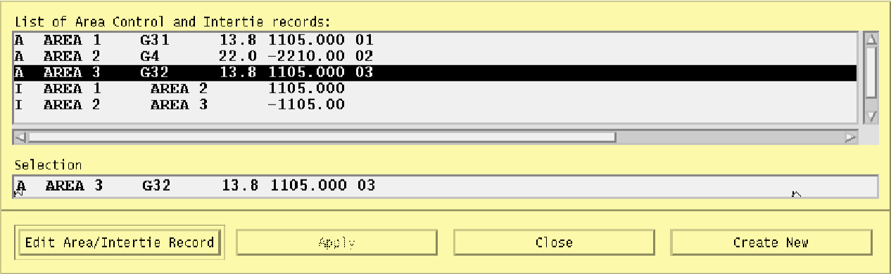

  Area Intertie Selection Dialog Box

To add an area:
  
  1. Click Area/Interchange on the Edit menu in main window. The Area/Intertie Selection dialog box appears.
  2. Click the Create New button. A small box appears, asking whether you want to create an Area Control (``A``) record or an Intertie (``I``) record. Click Area Control.
  3. The Area/Interchange dialog box appears. Fill in the required text boxes.
  4. Click the Add button at the bottom. The Area/Interchange dialog box closes and the new data you typed into the Area/Intertie dialog box now appears in the Area/Intertie Selection dialog box.

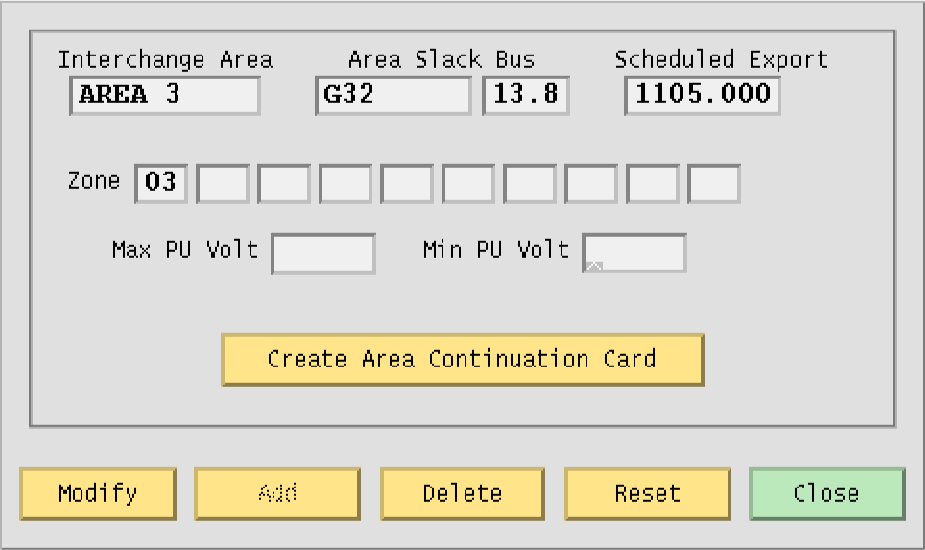

  Area Interchange Dialog Box

To modify an area intertie:

  1. Click Area/Interchange on the Edit menu in the main window. The Area/Intertie Selection dialog box appears.
  2. Select an item in the list window by clicking it. This action puts the selected item in the Selection text box.
  3. Click the Edit Area/Intertie button. The Area/Interchange dialog box appears.
  4. Change the data in the text boxes.
  5. Click the Modify button. The Area/Interchange dialog box closes and the new data you typed into the Area/Intertie dialog box now appears in the Area/Intertie Selection dialog box.

To delete an area:

  1. Click Area/Interchange on the Edit menu in main window. The Area/Intertie Selection dialog box appears.
  2. Select an item in the list window by clicking it. This action puts the selected item in the Selection text box.
  3. Click the Edit Area/Intertie button. The Area/Interchange dialog box appears.
  4. Click the Delete button.

To create an area continuation record:

  1. Click Area/Interchange on the Edit menu in the main window. The Area/Intertie Selection dialog box appears.
  2. Select an item in the list window by clicking it. This action puts the selected item in the Selection text box.
  3. Click the Edit Area/Intertie button. The Area/Interchange dialog box appears.
  4. Change the data in the text boxes if you need to.
  5. Click the Create Area Continuation Card button. The dialog box appears.
  6. Add zone data to the Zone text boxes.
  7. Click the Add button. The Area/Interchange dialog box closes and the new data you typed into the Area/Intertie dialog box now appears in the Area/Intertie Selection dialog box.

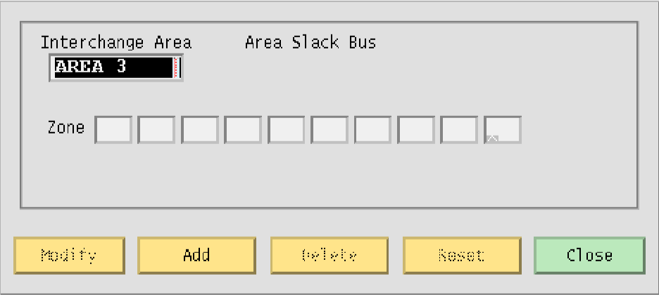

  Area Continuation Card Dialog Box

.. _exploring-base-case-connectivity:

Exploring Base Case Connectivity
--------------------------------
Sometimes you may want to explode a portion of a large network to see how buses are locally interconnected. The idea is that you start with one bus on the display and find out what other buses are connected to it. Then, with each of these buses, you find out what buses are connected to these, and so on.

The Explode icon in the toolbox allows you to explore base case connectivity.

To explore a base case:

  1. Load just a base case file to demonstrate this function. See :ref:`opening-files` to find out how to do this.
  2. Click the New Bus icon in the toolbox to enter Add Bus mode. The Input Data Edit box will come up; just close it without entering any data.
  3. Select Alpha Search on the View menu. In the Alpha Search dialog box, type the first few letters of a bus name. The alphabetical list automatically scrolls to find the bus of interest in the list. See the Alpha Search command entry in Chapter 4 for more information.
  4. Click the bus name of interest. It may already be highlighted, but you must click on it to make it the currently selected bus.
  5. Move to the blank display area. (You should still be in Add Bus mode.) Click once to make the bus icon and name appear.
  6. Move back to the toolbox and click the Explode icon. You previously established a bus that you can now explore bus connectivity with.
  7. Click the bus. You will note that any buses that are connected to your bus of interest are now shown on the display with connecting lines representing branches. You can continue exploring the network by clicking any new buses that show up. You can reveal the entire network in this way if you like (although it will probably look like a mess!)

The buses and branches are positioned by an internal algorithm since you have not loaded any underlying coordinate data. You can click the Move icon and then move the buses around the screen if you want to clean things up.

Sectionalizing a Bus
--------------------
Sectionalizing a bus separates a bus into two buses and rearranges its branches between the two buses. You can also optionally create a tie line between the two buses. See figure below.

To sectionalize a bus:

  1. Make sure you have system data loaded. See :ref:`opening-files` to find out how to do this.
  2. Click the Input Data Edit mode button in the toolbox. You are now in Input Data Edit mode.
  3. Select a bus by clicking it. This brings up the Input Data Edit Box. At the center bottom of the dialog box is the Sectionalize button. Click it to cause the Bus Sectionalize dialog box to appear. Note that the bus name of the currently selected bus appears in two places.
  4. Type a new bus name over the existing Bus 2 name to create a new bus.
  5. Click any branch, transformer, etc., record in the left-hand scrolling text box to transfer it to the right-hand scrolling text box. Note that you can go back and forth by clicking the appropriate records till branches, transformers, etc., are all associated with the bus you want.
  6. Click the OK button to send the sectionalized bus data to the resident base case data. If IPF detects any errors or inconsistencies, it puts up the Error dialog box. Examination of the message helps you figure out the problem.

.. note::

  If the name you type is not accepted, IPF has found it to be a duplicate name and rejects it. If, at any point, you would like to start from the beginning, just press Reset at any time. This returns all values to the state they were at the time the dialog box first opened.
  
  7. Sometimes you may want to connect the old and new buses making up the sectionalized bus. Click on the Bus Tie button to create a line with impedance of 0.0 + j0.00001. You may modify this line later, if you wish

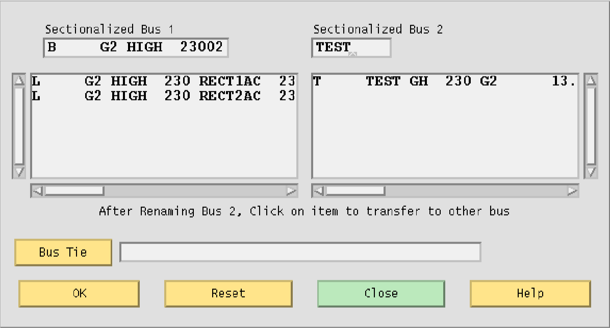

  Sectionalize Operation Completed

Tapping a Line
--------------
Tapping a line means to service a new load by creating a new tap point bus on an existing line. The tapped line is effectively segmented into two lines, separated with a newly created bus. If the load is remote from the tapped point, an additional line and bus will be necessary. The new load and the new bus are connected by a new line. As with many line operations, you access line tapping through a bus that the line is connected to.

To tap a line:

  1. Make sure you have system data loaded. See :ref:`opening-files` to find out how to do this.
  2. Click the Input Data Edit mode button in the toolbox.
  3. Click a bus icon that is connected to the line you want to tap. This brings up the Input Data Edit Box which is loaded with input data pertaining to the selected bus. Click and hold the option button opposite the bus name at the top of the Input Data Edit Box. The cascading menu lists all branches connected to the current bus. Drag down to the line you are interested in tapping. Be sure that this is a line and not a transformer. Selecting this item brings up the Input Data Edit Box for your line of interest. Near the center bottom of this dialog box is the Tap Line button. Click it to cause the Tap Line dialog box to appear.
  4. Initially the dialog box displays data from a previous invocation. If this is the first time it is displayed, all fields are blank. Enter the name of the bus you want to create in the dialog field Tapped Bus Name and press the Apply button. The selected line is tapped at the point depicting 50% of the total line’s reactance. You can horizontally scroll the line data within the Bus 1 side and the Bus 2 side to verify that the line resistance and reactance is split according to the sliding scale selected. Pressing the Apply button recomputes the line impedance on each side of the tapped bus without affecting any data in the Powerflow base case.
  5. Change the units (Percentage, Miles, Kilometers, or Section) to reflect your tapping criteria. Adjust the horizontal slider as necessary. Move the slider by moving the mouse cursor over it, pressing the left mouse button, and moving left or right till you find the point of the line you want to tap. Release the mouse button.The line tapping slider just above the Reverse Scale button shows the tap point according to the tapping criteria (length of the line in kilometers or miles, or percent of reactance). The line tapping slider also shows any sections the line may be divided into. Again press Apply to update the line’s impedance to reflect the slider’s current value.
  6. If the values are acceptable, click OK to export these changes to Powerflow.
  7. Click Close to cause the dialog box to disappear.

Solving a Network Case
======================
Solving a network case (or base case) causes IPF to calculate bus voltages that satisfy the network constraints as they exist within the currently resident base case data. This is usually done after you have loaded a base case and made some modifications to reflect the conditions of the system you want to study. However, you may solve as soon as you have loaded any system data. You do not need to load a coordinate or change file to solve a case. See figure below for a typical display after a case solution.

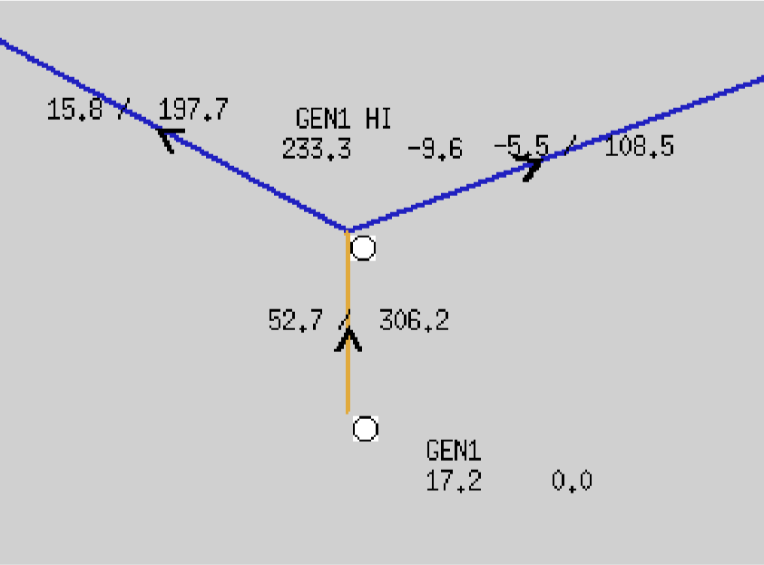

  Network Display After Solution

To solve a base case:

  1. Make sure that you have previously loaded a base case or netdata file. See :ref:`opening-files` if you have not.
  2. Choose Solve Case from the Process menu in the IPF main window. The Solve dialog box opens and you are presented with a number of options. See the figure below. Note that default values are set for you. If these suit your case, click the Solve button. If the defaults are not appropriate for your case, change them. Then solve the case. See Chapter 4 for a discussion of the options.
The solution may take anywhere from a few seconds to minutes depending on the number of buses in the base case. After the solution is complete, the display shows some of the calculated data.

.. _bus-and-branch-editing:

Bus and Branch Editing
======================
Bus and branch data editing are most often accomplished through the Input Data Edit Box.  This dialog box is brought up on the display whenever you click a bus displayed in the main window. The specific data associated with the bus you click fills the text boxes of the Input Data Edit Box. You can change any of the values to new values. You can then store the changed data in the memory-resident bus and branch database, solve the case with the new data values, and optionally save the changes permanently in a file.

.. note::

  See the Network Data Edit menu item entry in this chapter for another way to edit bus and branch data.

Each of the text box fields in a given instance of the Input Data Edit Box corresponds to a record field for a bus, line, or transformer type as documented in the :ref:`record-formats` section.  If you are unsure of the meaning of the fields for a particular bus, line, or transformer type, look it up in that section.

In the :ref:`record-formats` section, field width, decimal point placement, and sign are specified for each field. Real number fields have a position where a decimal point is implied, i.e. as long as you correctly position your digits, you need not enter a decimal point a a .pfc file or NETWORK_DATA file. However, in the Input Data Edit Box you should always enter a decimal point.  Sufficient room has been allowed for this in each field. The GUI will format your data correctly so it fits the field on a standard input record.

When you enter data into the Input Data Edit Box text boxes, the GUI checks to see whether you have entered values correctly. Specifically, it checks for all characters being numeric, having a minus sign (in the proper place), or having a decimal point (period). All other characters are rejected and a warning bell sounds. Other basic checks for valid data are also operating in during data entry. However, it may still be possible to enter invalid data that only shows up when a power flow solution is attempted.

Bus Editing
-----------
Bus input data dialogs are accessed directly by clicking on a bus icon in the display, or by selecting a bus name on the Alpha List.  Their appearance varies according to the type of the bus. To change the bus type of a bus, click the button labeled Type, near the Owner and Zone fields. This option button pops up a menu showing all the bus types accepted by IPF. If you click on a different type than was originally displayed, the dialog will change into one appropriate to that bus type.  If you click the Modify button, the bus will be changed to a different type. You may have to supply more (or different) data in other fields in order for the change to be legal.

Branch and Other Component Editing
----------------------------------
You cannot select a branch directly. Branch data is accessed by selecting a bus that is connected to the line or transformer you want to edit. Then, once the Input Data Edit Box shows a bus connected to your line of interest, you pick the line by using the option button labeled Bus, in the upper right corner of the box. Press and drag down to select the one you want. The dialog box changes to reflect the fields and parameters characteristic of lines.

The Bus option menu also contains other bus-related components, or records, such as switched reactance (``X``) data, bus continuation data, PQ curves, etc. Drag down and release to select any of these you want to edit.

Adding New Components
---------------------
New buses are added by using the New Bus tool in the main menu toolbox. See :ref:`adding-a-bus-and-related-components` for details on this process. New branches can be added only if both terminal buses exist. You can add branches graphically by using the New Branch tool, or by going through the Input Data Edit Box for one of the terminal buses. Other bus-related components can only be added through the dialog box. To add components to a bus, press the option button labeled New Component and drag down to the desired item.  Items which are grayed out are not appropriate for this type of bus.  For example, switched reactance (``X``) data can only be added to a ``BX`` type bus.

When you release the mouse button, the data dialog for the selected item will appear. You fill in the desired data fields, and click the Add button at the bottom to add it to the currently resident base case data. Notice that the Modify button is grayed out on this dialog.

Input Data Edit Dialog Boxes
============================
The following dialog boxes are all accessed from the Input Data Edit Dialog Box. The dialog boxes are arranged with buses first and branch components last.

.. table:: Input Data Edit Dialog Boxes

  ====================== ====================================================================
  Dialog                 Box Description
  ====================== ====================================================================
  B-BLANK BUS            Adds bus data for modeling load bus.
  BC BUS                 Adds bus data for a bus controlled by a BG bus.
  BD BUS                 Supplies data for a two terminal dc bus.
  BE BUS                 Adds bus data for a bus that holds its voltage to a specified value.
  BF BUS                 Supplies data for a special-purpose bus for the NewtonRaphson solution method.
  BG BUS                 Adds bus data for a bus that controls the voltage of a remote BC bus.
  BM BUS                 Supplies data for a multi-terminal dc bus.
  BQ BUS                 Adds bus data for a bus that holds its voltage to a specified value within reactive limits.
  BS BUS                 Adds bus data for the slack (or swing) bus.
  BT BUS                 Adds bus data for a bus that maintains its voltage with an LTC transformer.
  BV BUS                 Adds bus data for a bus that holds its net reactive power within a user-specified voltage range.
  BX BUS                 Adds bus data for a bus that controls its local voltage by switching capacitors/reactors in and out.
  CONTINUATION BUS       Adds additional data to an existing bus record.
  SWITCHED REACTANCE     Adds data for voltage controlled shunt device installations.
  PQ CURVE               Adds PQ curve data for calculation of Q limits.
  SECTIONALIZATION       Provides for the sectionalization of a bus.
  LINE TAPPING           (Not yet available) Provides for tapping of lines.
  TRANSMISSION LINE      Adds data for a balanced transmission line.
  PHASE SHIFTER          Adds data for phase shifting transformers.
  TRANSFORMER            Adds data for two-winding transformers.
  REGULATING TRANSFORMER Adds data to give fixed transformers or phase shifters automatic regulating or control status.
  EQUIVALENT NETWORK     Adds data for an asymmetrical pi type line.
  ====================== ====================================================================

AC Bus Input Data Boxes
=======================
This box will look slightly different, depending on the bus type. All of the AC bus data fields are described below; specific differences are covered under the various bus types. You must click separately in each field that you want to alter. Text entry is always in Insert mode, meaning that you cannot type over a character or number; you must delete it first. Note that when a field is described as a "real number," you should *always* enter a decimal point. See below for an example of a typical bus input data dialog box.

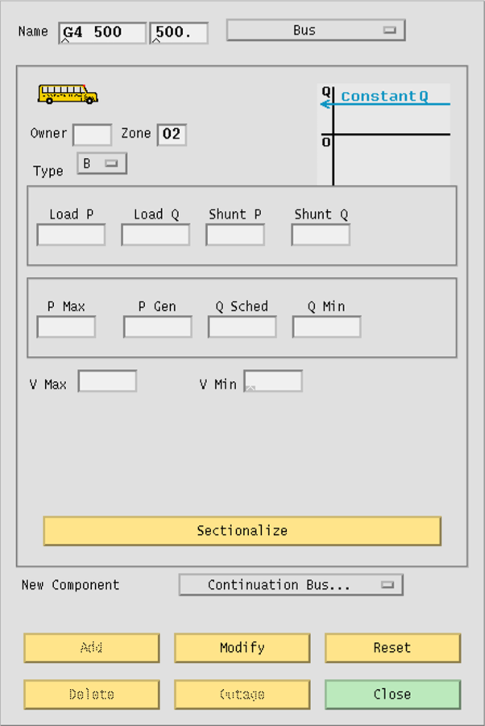

  Input Data Edit Box Showing B-Blank Bus Data.png

**Name**. An eight character maximum, alphanumeric string designating a bus name. The string must start with an alpha character. The name should be unique. This name is placed in the first text box from the left. The right text box should have a five character maximum numeric string representing the bus's base kV rating.

**Bus**. An option button that allows you access to other records that are associated with the currently displayed bus. Press on this button and drag down to select an existing branch or other component. The dialog box transforms into the dialog for the selected component.

**Owner**. Three character maximum, alphanumeric string designating a bus owner.

**Zone**. Two character maximum, alphanumeric string designating the zone the bus is in.

**Type**. An option button that changes the dialog box to reflect different bus types. The types are: ``B `` (B-blank), ``BC``, ``BE``, ``BF``, ``BG``, ``BQ``, ``BS``, ``BT``, ``BV``, and ``BX``. You cannot change an AC bus into a DC bus using this button.

**Load P**. Five character maximum, real number designating real load in megawatts (MW).

**Load Q**. Five character maximum, real number designating reactive load in megavoltamperes reactive (MVAR).

**Shunt P**. Four character maximum, real number designating the shunt admittance load in megawatts (MW) at the base kV of the bus.

**Shunt Q**. Four character maximum, real number designating shunt admittance in megavoltamperes reactive (MVAR). A positive value is capacitive; a negative value is inductive.  The minus sign goes in front of the number.

**P Max**. Four character maximum, real number designating the maximum real power generation in megawatts (MW).

**P Gen**. Five character maximum, real number designating scheduled real power generation in megawatts (MW).

**Q Sched**. Five character maximum, real number designating scheduled reactive power in megavoltamperes reactive (MVAR). May be positive or negative.

**Q Max**. Five character maximum, real number designating maximum reactive power in megavoltamperes reactive (MVAR). Generally positive.

**Q Min**. Five character maximum, real number designating minimum reactive power in megavoltamperes reactive (MVAR). Generally negative. The minus sign goes in front of the number.

**V Hold**. Four character maximum, real number designating a voltage to hold for the bus, in per unit.

**V Max**. Four character maximum, real number designating a maximum voltage limit in per unit.

**V Min**. Four character maximum, real number designating a minimum voltage limit in per unit.

**Sectionalize**. A button that brings up the Sectionalize dialog box. See Sectionalize Dialog Box in this section.

**New Component**. A tag for the option button that allows you to add a new bus-related component such as a branch, X data, etc.
Add. A button that adds a new record to the database.

**Modify**. A button that modifies the record.

**Reset**. A button that restores text box displays to their original values (before any changes were made).

**Delete**. A button that deletes (removes) a record from the database.

**Outage**. (Not yet implemented.)

**Close**. A button that causes the dialog box to close and disappear from the display without making any modifications to the record.

``B``-Blank Bus
---------------
The ``B``-blank dialog box supplies data for modeling the typical load bus. See the ``B``-blank record in :ref:`ac-bus-data-b-blank`.

**V Max**. Four character maximum, real number designating a maximum voltage limit in per unit.

**V Min**. Four character maximum, real number designating a minimum voltage limit in per unit.

The voltage limit fields take effect only if the voltage of the ``B``-blank bus is being controlled by a remote device.

``BC`` Bus
----------
The ``BC`` dialog box supplies data for a bus controlled by one or more ``BG`` type buses. See the ``BC`` record in :ref:`ac-bus-data-bc`.

**V Hold**. Four character maximum, real number designating a voltage to hold for the bus, in per unit.

``BE`` Bus
----------
The ``BE`` dialog box supplies data for a bus that holds its voltage to a specified value. See the ``BE`` record in :ref:`ac-bus-data-be`.

**Q Max**. Five character maximum, real number designating maximum reactive power in megavoltamperes reactive (MVAR). Generally positive.

**Q Min**. Five character maximum, real number designating minimum reactive power in megavoltamperes reactive (MVAR). Generally negative. The minus sign goes in front of the number.

**V Hold**. Four character maximum, real number designating a voltage to hold for the bus, in per unit.

``BF`` Bus
----------
The ``BF`` dialog box supplies data for a special-purpose bus for the Newton-Raphson solution method. It holds the specified voltage until the P-solution has converged, then acts like an ordinary load bus (``B``-blank). See the ``BF`` record in :ref:`ac-bus-data-bf`.

**Q Max**. Five character maximum, real number designating maximum reactive power in megavoltamperes reactive (Mvar). Generally positive.

**Q Min**. Five character maximum, real number designating minimum reactive power in megavoltamperes reactive (Mvar).  Generally negative. The minus sign goes in front of the number.

**V Hold**. Four character maximum, real number designating a voltage to hold for the bus, in per unit.

``BG`` Bus
----------
The ``BG`` dialog box supplies data for a bus that controls the voltage of a remote ``BC`` bus. See the ``BG`` record in :ref:`ac-bus-data-bg`.

**Q Max**. Five character maximum, real number designating maximum reactive power in megavoltamperes reactive (MVAR). Generally positive.

**Q Min**. Five character maximum, real number designating minimum reactive power in megavoltamperes reactive (MVAR). Generally negative. The minus sign goes in front of the number.

**V Max**. Four character maximum, real number designating a maximum voltage limit in per unit.

**V Min**. Four character maximum, real number designating a minimum voltage limit in per unit

**Remote Bus**. An eight character maximum, alphanumeric string designating the remote bus to be voltage controlled (a ``BC`` type bus).

**PCS**. A three character maximum, numeric string designating the percentage of VARS supplied by this bus to control the remote bus voltage.

``BQ`` Bus
----------
The ``BQ`` dialog box supplies data for a bus that holds its voltage to a specified value within reactive limits. See the ``BQ`` record in :ref:`ac-bus-data-bq`.

**Q Max**. Five character maximum, real number designating maximum reactive power in megavoltamperes reactive (MVAR). Generally positive.

**Q Min**. Five character maximum, real number designating minimum reactive power in megavoltamperes reactive (MVAR). Generally negative. The minus sign goes in front of the number.

**V Hold**. Four character maximum, real number designating a voltage to hold for the bus, in per unit.

``BS`` Bus
----------
The ``BS`` dialog box supplies data for the system slack (or swing) bus. See the ``BS`` record in :ref:`ac-bus-data-bs`.

**Q Sched**. Five character maximum, real number designating scheduled reactive power in megavoltamperes reactive (MVAR). May be positive or negative.

**V Hold**. Four character maximum, real number designating a voltage to hold for the bus, in per unit.

**Angle**. Four character maximum, real number designating a voltage phase angle in degrees. Blank is translated to an angle of zero.

``BT`` Bus
----------
The ``BT`` dialog box supplies data for a bus that maintains its voltage with an LTC transformer. See the ``BT`` record in :ref:`ac-bus-data-bt`.

**Q Sched**. Five character maximum, real number designating scheduled reactive power in megavoltamperes reactive (MVAR). May be positive or negative.

**V Hold**. Four character maximum, real number designating a voltage to hold for the bus, in per unit.

``BV`` Bus
----------
The ``BV`` dialog box supplies data for a bus that holds its net reactive power within a user-specified voltage range. See the ``BV`` record in :ref:`ac-bus-data-bv`.

**Q Sched**. Five character maximum, real number designating scheduled reactive power in megavoltamperes reactive (MVAR).  May be positive or negative.

**V Max**. Four character maximum, real number designating a maximum voltage limit in per unit.

**V Min**. Four character maximum, real number designating a minimum voltage limit in per unit.

``BX`` Bus
----------
The ``BX`` dialog box supplies data for a bus that controls its own or a remote bus's voltage by switching capacitors or reactors in and out. See the BX record in :ref:`ac-bus-data-bx`.

**Q Max**. Five character maximum, real number designating maximum reactive power in megavoltamperes reactive (MVAR). Generally positive.

**Q Min**. Five character maximum, real number designating minimum reactive power in megavoltamperes reactive (MVAR). Generally negative.  The minus sign goes in front of the number.

**V Max**. Four character maximum, real number designating a maximum voltage limit in per unit.

**V Min**. Four character maximum, real number designating a minimum voltage limit in per unit.

**Remote Bus**. An eight character maximum, alphanumeric string designating the remote bus to be voltage controlled.

``BD`` Bus
==========
The ``BD`` dialog box supplies data for a two-terminal DC bus. See the ``BD`` record :ref:`ac-bus-data-bd`.

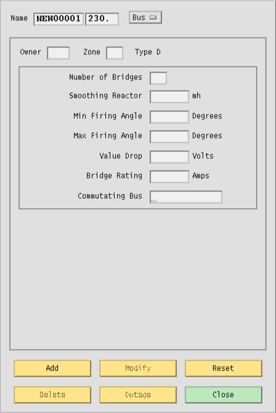

  Input Data Edit Box Showing BD Bus

**Number of Bridges**. Two digit integer designating the number of bridges per dc circuit (number
of valves serially connected).

**Smoothing Reactor**. Five character maximum, real number designating smoothing inductance
in millihenries.

**Min Firing Angle**. Five character maximum, real number designating minimum firing angle
(:math:`alpha_min`) in degrees, for rectifier operation.

**Max Firing Angle**. Five character maximum, real number designating maximum firing angle
(:math:`alpha_stop`) in degrees, for inverter operation.

**Valve Drop**. Five character maximum, real number designating valve voltage drop per bridge, in
volts.

**Bridge Rating**. Five character maximum, real number designating maximum bridge current
rating in amps.

**Commutating Bus**. Eight character maximum, alphanumeric string designating the
commutating bus name. This is the bus on the ac system side of the commutating transformer bank.

``BM`` Bus
==========
The BM dialog box supplies data for a multi-terminal dc bus.  See the ``BM`` record :ref:`ac-bus-data-bm`.

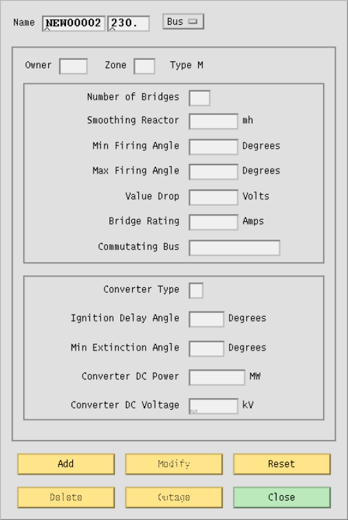

  Input Data Edit Box Showing BM Bus

**Number of Bridges**. Two digit integer designating the number of bridges per dc circuit (number
of converters serially connected).

**Smoothing Reactor**. Five character maximum, real number designating smoothing inductance in millihenries.

**Min Firing Angle**. Five character maximum, real number designating minimum ignition delay
angle (:math:`alpha_min`) in degrees.

Max Firing Angle. Five character maximum, real number designating maximum ignition delay
angle (:math:`alpha_stop`) in degrees.

Valve Drop. Five character maximum, real number designating converter valve drop per bridge,
in volts.

Bridge Rating. Five character maximum, real number designating bridge current rating
(maximum converter current) in amps.

**Commutating Bus**. Eight character maximum, alphanumeric string designating the
commutating bus name.

**Converter Type**. Single character alpha string designating the converter code. R indicates
normal operation as a rectifier; I is normal operation as an inverter. M indicates an inverter with
current margin, and blank indicates a passive dc tap.

**Ignition Delay Angle**. Three character maximum, real number designating the normal ignition
delay angle (:math:`alpha_N`) for a rectifier, or normal extinction angle (:math:`gamma_N`) for an inverter, in
degrees.

**Min Extinction Angle**. Three character maximum, real number designating the minimum
ignition angle (:math:`alpha_min`) for a rectifier, or minimum extinction angle (:math:`gamma_0`) for an inverter, in
degrees.

**Converter DC Power**. Six character maximum, real number designating the scheduled dc bus
load (net converter dc output power) in megawatts (MW) at the base kV of the bus.

**Converter DC Voltage**. Five character maximum, real number designating the scheduled dc bus
kV (converter dc voltage).

Continuation Bus
================
The continuation bus dialog box is used for extending the data for a given bus record. You can
specify additional generation, load, and shunt admittance. A typical use is the case where several
owners have load at the same bus. Also, shunt specified on this record is considered to be fixed,
rather than variable. See the `+`` (plus) record :ref:`continuation-bus-data`.

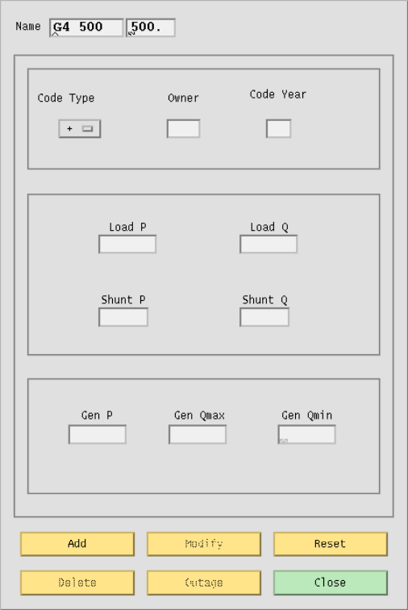

  Continuation Bus Dialog Box

**Name**. An eight character maximum, alphanumeric string, plus a five character maximum real
number, designating the name of the bus that this continuation data is associated with.
Code Type. An option button that specifies the type of continuation record: +blank, +A, +C, +F
+I, +N, +P, or +S. See the IPF Batch User's Guide for an explanation of these codes.

**Owner**. Three character maximum, alphanumeric string designating the owner of this particular
load, shunt, etc. This will usually be different from the owner of the bus itself.

**Code Year**. Two character maximum, alphanumeric string. See :ref:`continuation-bus-data`.
for details.

**Load P**. Five character maximum, real number designating real load in megawatts (MW).

**Load Q**. Five character maximum, real number designating reactive load in megavoltamperes
reactive (Mvar).

**Shunt P**. Four character maximum, real number designating the shunt admittance load in
megawatts (MW) at the base kV of the bus.

**Shunt Q**. Four character maximum, real number designating the shunt reactance load in
megavoltamperes reactive (MVar) at the base kV of the bus.

**Gen P**. Five character maximum, real number designating scheduled real power in megawatts
(MW) as a real number.

**Gen Qmax**. Five character maximum, real number designating maximum reactive power in
megawatts (MW).

**Gen Qmin**. Five character maximum, real number designating minimum reactive power in
megawatts (MW).

Switched Reactance
==================
The switched reactance bus dialog box is used for specifying steps in a switched reactance ``BX`` bus. 
See the ``X`` record :ref:`switched-reactance` for detailed information.

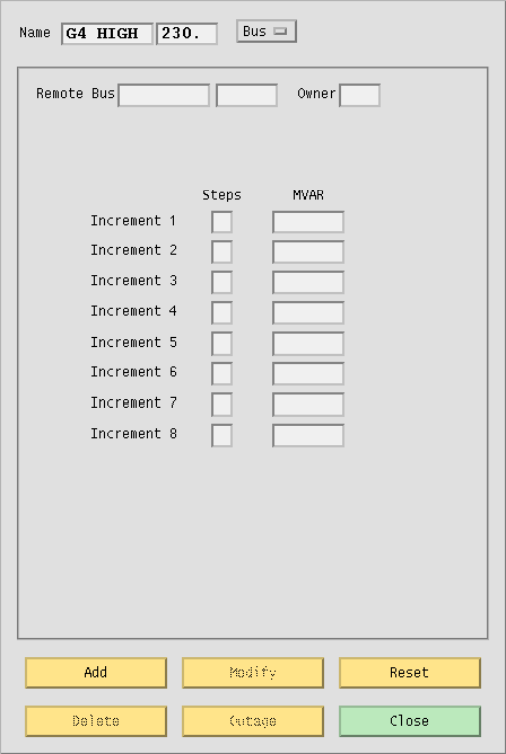

  Switched Reactance Dialog Box

**Name**. An eight character maximum, alphanumeric string, plus a five character maximum real
number, designating the name of the BX bus that this data is associated with.

**Remote Bus**. An eight character maximum, alphanumeric string, plus a five character maximum
real number, designating the name of the remote bus to be voltage controlled.

**Owner**. A three character maximum, alphanumeric string designating the bus owner.

**Steps**. An integer from 1 to 9, designating the number of increments of shunt of this magnitude.

**MVAR**. A five character maximum, real number designating a block of switchable reactive shunt
in megavoltamperes reactive (Mvar).

PQ Curve
========
The PQ Curve dialog box allows you to specify points for a generator reactive capability curve for
a type ``BE``, ``BG``, ``BQ``, ``BX``, or ``BS`` bus. See the `QP`` record 
:ref:`reactive-capability-curves` for detailed information.

To specify P Gen, Q Max, and Q Min values, type the values in the bottom text entry boxes. Click
the Insert button to transfer the values from the text entry boxes to the list boxes above. Rows of
values are associated across. Six rows of values are sufficient for most curves. Once you have
values typed in and entered, you can replace or delete them, a row at a time.

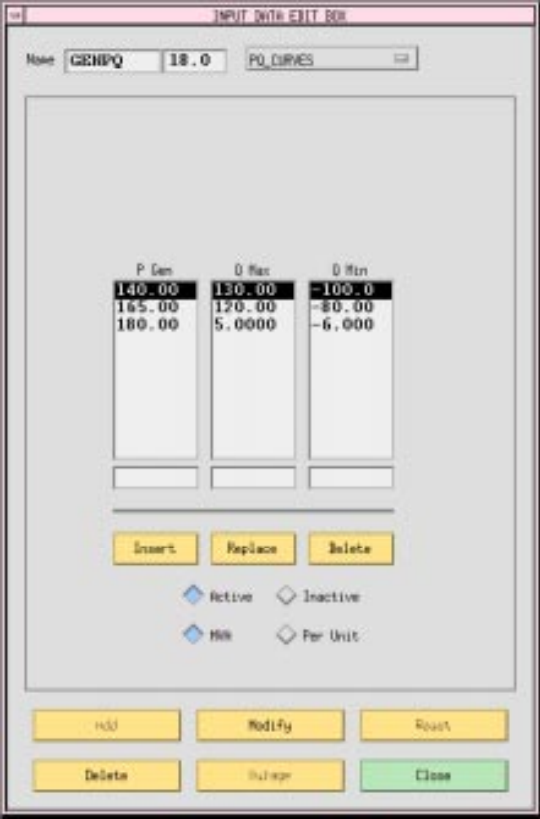

  P-Q Generation Dialog Box

**P Gen**. Five character maximum, real number designating a particular level of real power
generation in megawatts (MW) which is to be associated with certain Q limits. Values may be
specified in per unit on Pmax, or in MVA. All values for a curve must be specified the same way.

**Q Max**. Five character maximum, real number designating maximum reactive power (positive) in
megavoltamperes reactive (Mvar) that can be produced by the generator when operating at this
level of real power output. Values may be specified in per unit on Pmax, or in MVA. All values
for a curve must be specified the same way.

**Q Min**. Five character maximum, real number designating minimum reactive power (negative) in
megavoltamperes reactive (Mvar) that can be absorbed by the generator when operating at this
level of real power output. Values may be specified in per unit on Pmax, or in MVA. All values
for a curve must be specified the same way.

**Insert**. A button that inserts the values in the bottom text entry boxes into the text lists above.
Replace. A button that replaces the selected row of values in the list above with the current values
in the bottom text entry boxes.

**Delete**. A button that deletes the selected text list row of values.

**Active**. A radio button that makes the curve defined by the values in the text list rows active, that
is, IPF uses the curve to determine what the Q limits will be, based on the current level of Pgen
specified in the bus record.

**Inactive**. A radio button that makes the curve inactive, that is, IPF does not calculate new Q limits
whenever Pgen is changed, but uses whatever it currently has stored.

**MVA**. The values for the PQ curves may be specified in MVA or per unit. Clicking the MVA radio
button tells the program to expect values in MVA.

**Per Unit**. The values for the PQ curves may be specified in MVA or per unit. Clicking the Per
Unit radio button tells the program to expect values in per unit on Pmax.

**Add**. A button that adds a new three-record point set to the current curve data for this bus.

**Modify**. A button that modifies the curve data. (Not available.)

**Reset**. A button that restores text box values to their original values (before any changes were
made).

**Delete**. A button that deletes (removes) the curve data from the database.

**Outage**. (Not applicable.)

**Close**. A button that causes the dialog box to close and disappear from the display without making
any modifications.

Sectionalization
================
The Sectionalize Bus dialog box allows you to split a bus to create two buses, with existing
branches divided between them. You can sectionalize a bus at any time. You get
to this dialog box from the Sectionalize button in the Input Data Edit dialog box for the bus you
want to split.

When the Sectionalize Bus dialog box first comes up, it assumes the current bus name and
information from the Input Data Edit dialog box. Note that the name of the current bus appears in
both text boxes found at the top of the dialog box. You change the name in the right-hand box to
create a new bus record, which will inherit the bus type and voltage of the old bus.

Once you have changed the bus name to a new one, you can arrange the branch information in the
list boxes to define the new connections. The list box under the left-hand text box applies to the
bus name on the left side, and the list on the right to the right-hand bus name. If you click on a
record in either box, it will be transferred to the other. Use the horizontal and vertical scroll bars to
see information that is hidden.

After the two buses and their associated branches are satisfactory, you can optionally press the Bus
Tie button to create a "bus tie" record, which is a line with impedance :math:`0.0 + j0.00001`` between the
new bus and the old one. The bus tie record will appear in the text box.

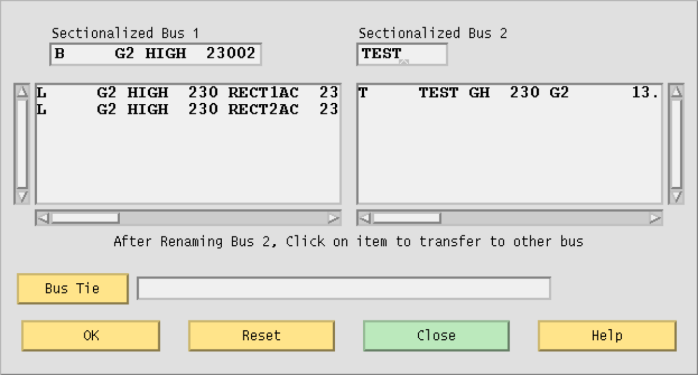

  Sectionalize Bus Dialog Box

**Sectionalize Bus 1**. This text box contains the bus type, name, and base kV of the current bus
you are working with in the Input Data Edit Box.

**Sectionalize Bus 2**. This text box initially contains the name of the current bus. You can change
this to be any new bus name. The new bus inherits the base kV, ownership, and bus type of Bus 1.

**Bus Tie**. Click this button if you want to tie the two buses with a low impedance tie line. This
creates a bus tie record. The branch record shows up in the text box.
OK. Click this button to cause the new data to be saved in the memory-resident bus and branch
database. No changing action occurs until you click OK. The dialog box closes and returns you to
the Input Data Edit Box.

**Reset**. Click this button if you want to return to the initial state of a just opened dialog box. All
changes that you have made are erased and returned to initial conditions.

**Close**. Click this button if you have decided that no save action is necessary, that is, you do not
want to make any sectionalization changes to the memory-resident bus and branch database.
Clicking this button closes the dialog box and returns you to the Input Data Edit Box.

Line Tapping (may not be available)
===================================
Tapping a line means to service a new load by creating a new tap point bus on an existing line. The
tapped line is effectively segmented into two lines, separated with a newly created bus. If the load
is remote from the tapped point, an additional line and bus will be necessary. The new load and the
new bus are connected by a new line. As with many line operations, you access line tapping
through a bus that the line is connected to.

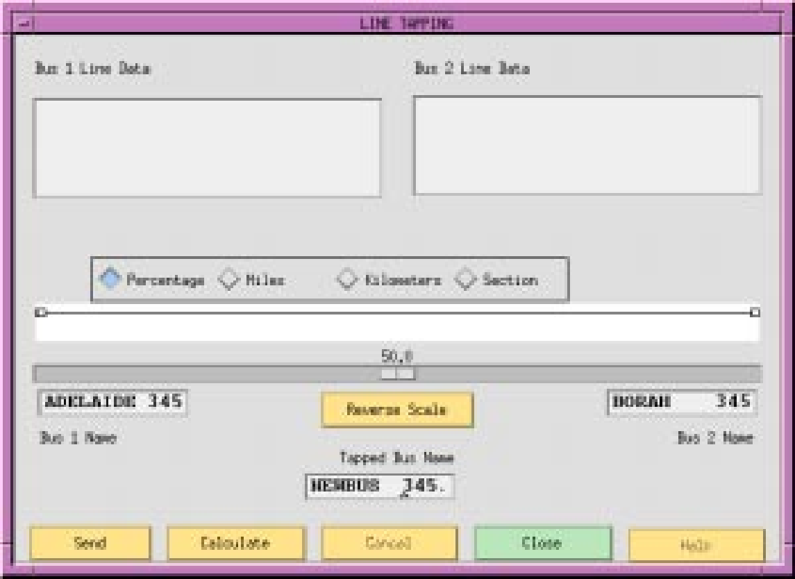

  Line Tapping Dialog Box

**Bus 1 Line Data**. This text box displays the lines between bus 1 and the tapped bus. Initially, it
contains all the lines between Bus 1 and Bus 2.

**Bus 2 Line Data**. This text box displays the lines between bus 1 and the tapped bus. Initially, it
is empty.

**Scale Value Radio Buttons**. These ratio buttons identify the line tap point in terms of three
different criteria: (1) percent of reactance from bus 1, (2) the distance from bus 1, (3) the section
number. Note that transformers and series capacitors (X < 0) have zero (0) length and cannot be
tapped.

**Scale Slide**. A dynamic, moveable slider that shows the proportion of the selected scale on the
line between Bus 1 and Bus 2. The slider value changes according to what scale value radio button 
is currently active.

**Base 1 Name**. A bus name and base kV bus identifier specifying the terminal 1 bus of the line to
be tapped.

**Base 2 Name**. A bus name and base kV bus identifier specifying the terminal 2 bus of the line to
be tapped.

**Reverse Scale**. A button that flips the scale values from one end to the other.

**Tapped Bus Name**. The name and base kV of the new bus created at the tap point.

**Send**. Click this button to cause the line tapping operation data to be saved in the memory-resident
bus and branch database. The dialog box closes and returns you to the Input Data Edit Box.

**Calculate**. Click this button to see the effects of the slider operation. This action does not send
any data to Powerflow.

**Cancel**. A button that closes the dialog box and causes no further action.

**Close**. Click this button if you have decided that no save action is necessary, that is, you do not
want to make any sectionalization changes to the memory-resident bus and branch database.
Clicking this button closes the dialog box and returns you to the Input Data Edit Box.

**Help**. (Not yet implemented)

Transmission Line
=================
The transmission line dialog box specifies the identification and electrical characteristics of a
balanced pi line, section of a line, or series capacitor. See the ``L`` record :ref:`balanced-transmission-line`.

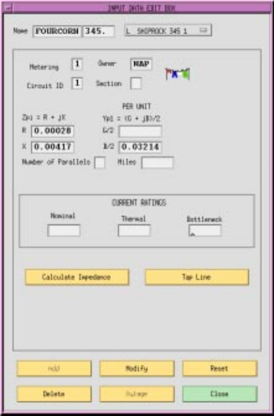

  Transmission Line Dialog Box

**Name**. Two eight character maximum, alphanumeric strings designating the buses. The strings
must start with an alpha character. The first name is placed in the first text box from the left. The
next text box should have a four character maximum numeric string representing the bus's base kV
rating. The second bus name and its base kV are to the right of the first.

**Metering**. An integer (or blank) flag having three possible values: 1 means to meter at the bus 1
end; 2 means to meter at the bus 2 end; and blank means to let the program decide on the following
criteria — (1) when bus ownership differs from bus ownership, meter at the point where line
ownership differs from bus ownership, or (2) when both buses have the same ownership, meter at
bus 1 location.

**Owner**. A three character alphanumeric code representing ownership of the branch.
Circuit ID. A single alphanumeric character representing the circuit identification.
Section. An integer (1-9) representing the section number for making an equivalent for series
elements. The elements are assembled in ascending numeric order. This may be blank or zero if
the line has only one section.

**Resistance (R)**. A six digit real number representing the per unit resistance R.

**Reactance (X)**. A six digit real number representing the per unit reactance X.

**Admittance (G/2)**. A six digit real number representing the per unit admittance G.

**Susceptance (B/2)**. A six digit real number representing the per unit susceptance B.

**Number of Parallels**. An integer representing the number of parallel circuits represented by this
record.

**Miles**. A real number indicating the line length. Note: if a branch is composed of individual
sections, then the total line length is the sum of mileage of each section. Also, note that series
capacitors (X < 0) have no mileage.

**Current Ratings**. Real numbers that are conductor current ratings in amps. Nominal is the
normal rating based on the line construction and conductor size. Thermal takes into account the
effect of ambient temperature and other environmental factors upon the maximum permissible
temperature of the conductor, usually for short time periods. Bottleneck is the minimum rating of
the line including other series connected components, such as circuit breakers, fuses, or disconnect
switches.

**Calculate Impedance**. A button that allows you to compute the electrical parameters given the
conductor size and type, and tower geometry and length.

**Tap Line**. A button that allows you to tap a line with a newly added bus.

**Add**. A button that adds a new record to the database.

**Modify**. A button that modifies the record.

**Reset**. A button that restores text box values to their original values (before any changes were
made).

**Delete**. A button that deletes (removes) a record from the database.

**Outage**. (Not yet implemented.)

**Close**. A button that causes the dialog box to close and disappear from the display without making
any modifications to the record.

Phase Shifter
=============
The Phase Shifter dialog box allows you to add data for phase shifting transformers. See the ``T`` :ref:`transformer-data` and
``R`` records :ref:`regulating-transformer` for more details.

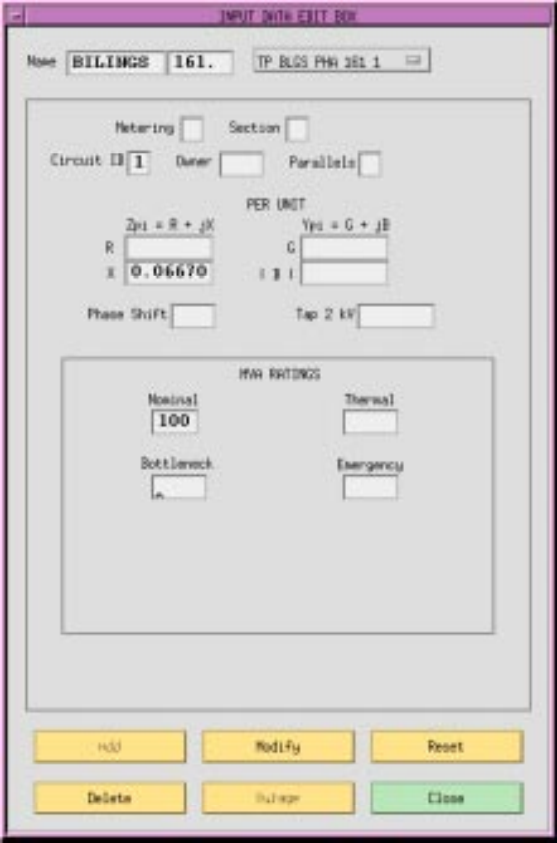

  Phase Shifter Dialog Box

**Name**. Two eight character maximum, alphanumeric strings designating the buses. The strings
must start with an alpha character. The first name is placed in the first text box from the left. The
next text box should have a four character maximum numeric string representing the bus’s base kV
rating. The second bus name and its base kV are to the right of the first.

**Metering**. An integer (or blank) flag having three possible values: 1 means to meter at the bus 1
end; 2 means to meter at the bus 2 end; and blank means to let the program decide on the following
criteria — (1) when bus ownership differs from bus ownership, meter at the point where line
ownership differs from bus ownership, or (2) when both buses have the same ownership, meter at
bus 1 location.

**Section**. An integer (1-9) representing the section number for making an equivalent for series
elements. The elements are assembled in ascending numeric order.

**Circuit ID**. A single alphanumeric character representing the circuit identification.

**Owner**. A three character alphanumeric code representing ownership.

**Parallels**. An integer representing the number of parallel transformers in this record.

**Resistance (R)**. A six digit real number representing per unit equivalent resistance R due to
copper loss.

**Reactance (X)**. A six digit real number representing per unit leakage reactance X.

**Admittance (G)**. A six digit real number representing per unit shunt equivalent core loss
conductance G (iron losses).

**Susceptance (B)**. A six digit real number representing per unit shunt magnetizing susceptance
B. This is always converted to a negative number by the program.

**Phase Shift**. A five digit real number representing the fixed phase shift in degrees that describes
bus 1 relative to bus 2.

**Tap 2 kV**. A five digit real number representing the fixed bus 2 tap. It is possible for a transformer
to have both a phase shift and a tap.

**MVA Ratings**. All MVA ratings (Nominal, Thermal, Bottleneck, and Emergency) are represented 
by four digit real numbers. Nominal is the normal rating based on the construction. Thermal takes
into account the effect of ambient temperature and other environmental factors upon the maximum 
permissible temperature of the conductor, usually for short time periods. Bottleneck is the minimum
rating of the transformer including other series connected components, such as circuit breakers, fuses, or 
disconnect switches.

**Add**. A button that adds a new record to the database.

**Modify**. A button that modifies the record.

**Reset**. A button that restores text box values to their original values.

**Delete**. A button that deletes (removes) a record from the database.

**Outage**. (Not yet implemented.)

**Close**. A button that causes the dialog box to close and disappear from the display without making
any modifications to the record.

Transformer
===========
The transformer dialog box allows you to add data for fixed tap transformers. See the ``T`` record :ref:`transformer-data`.

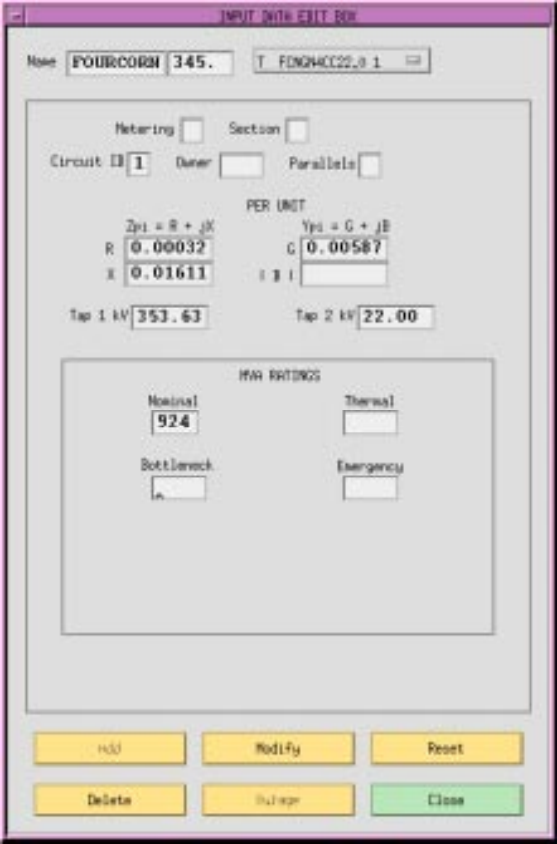

  Transformer Dialog box

**Name**. Two eight character maximum, alphanumeric strings designating connected buses. The
strings must start with an alpha character. The first name is placed in the first text box from the left.
The next text box should have a four character maximum numeric string representing the bus's
base kV rating. The second bus name and its base kV are to the right of the first.

**Metering**. An integer (or blank) flag having three possible values: 1 means to meter at the bus 1
end; 2 means to meter at the bus 2 end; and blank means to let the program decide on the following
criteria — (1) when bus ownership differs from bus ownership, meter at the point where line
ownership differs from bus ownership, or (2) when both buses have the same ownership, meter at
bus 1 location.

**Section**. An integer (1-9) representing the section number for making an equivalent for series
elements. This may be zero or blank if the branch has only one section.

**Circuit ID**. An alphanumeric character representing the circuit identification.

**Owner**. A three character alphanumeric code representing ownership.

**Parallels**. An integer representing the number of parallel transformer banks in this record.

**Resistance (R)**. A six digit real number representing per unit equivalent resistance R due to
copper loss.

**Reactance (X)**. A six digit real number representing per unit leakage reactance X.

**Admittance (G)**. A six digit real number representing per unit shunt equivalent core loss
conductance G (iron losses).

**Susceptance (B)**. A six digit real number representing per unit shunt magnetizing susceptance
B\. This is always converted to a negative number by the program.

**Tap 1 kV**. A five digit real number representing the fixed bus 1 tap.

**Tap 2 kV.** A five digit real number representing the fixed bus 2 tap.

**MVA Ratings**. All MVA ratings (Nominal, Thermal, Bottleneck, and Emergency) are
represented by four digit real numbers.  Nominal is the normal rating based on the construction. Thermal takes
into account the effect of ambient temperature and other environmental factors upon the maximum 
permissible temperature of the conductor, usually for short time periods. Bottleneck is the minimum
rating of the transformer including other series connected components, such as circuit breakers, fuses, or 
disconnect switches.

**Add**. A button that adds a new record to the database.

**Modify**. A button that modifies the record.

**Reset**. A button that restores text box values to their original values (before any changes were
made).

**Delete**. A button that deletes (removes) a record from the database.

**Outage**. (Not yet implemented.)

**Close**. A button that causes the dialog box to close and disappear from the display without making
any modifications to the record.

Regulating Transformer
======================
The regulating transformer dialog box allows you to add data for regulating transformers. See the
``R`` record :ref:`regulating-transformer`.

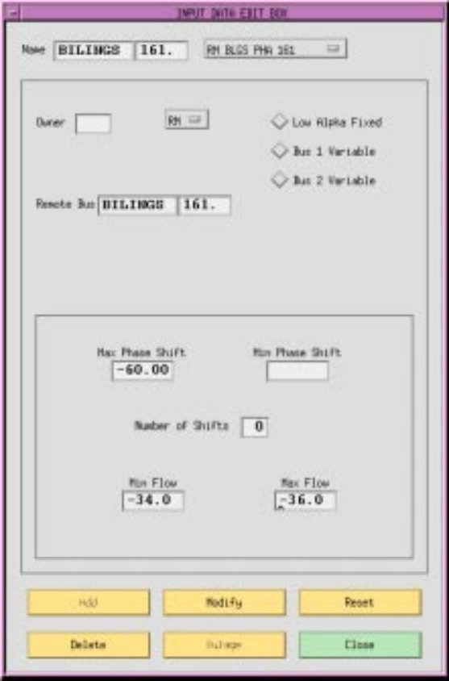

  Regulating Transformer Dialog Box

**Name**. Two eight character maximum, alphanumeric strings designating connected buses. The
strings must start with an alpha character. The first name is placed in the first text box from the left.
The next text box should have a four character maximum numeric string representing the bus's
base kV rating. The second bus name and its base kV are to the right of the first.

**Owner**. A three character alphanumeric code representing ownership.

**R (subtypes)**. An option button allowing you to choose types R-blank, RV, RQ,RP, RN, or RM.
See the R record in the IPF Batch User’s Guide for a description of these types.

**Low Alpha Fixed**. A radio button that identifies the fixed tap side as at the low alpha order bus
name terminal. Note that this field is necessary only to resolve ambiguity if Min Tap and Max Tap
cannot establish the variable tap side. Low Alpha Fixed is the default.

**Bus 1 Variable**. A radio button that identifies the variable tap side as at the bus 1 terminal. Note
that this field is necessary only to resolve ambiguity if Min Tap and Max Tap cannot establish the
variable tap side.

**Bus 2 Variable**. A radio button that identifies the variable tap side as at the bus 2 terminal. Note
that this field is necessary only to resolve ambiguity if Min Tap and Max Tap cannot establish the
variable tap side.

**Remote Bus**. An eight character maximum, alphanumeric string designating the remote bus to
be voltage-controlled.

**Min Tap**. A real number in kV that specifies the minimum tap on the variable tap side.

**Max Tap**. A real number in kV that specifies the maximum tap on the variable tap side.

**Number of Taps**. An integer specifying the number of taps on the variable tap side. This must
be greater than one for discrete taps; zero (0) indicates continuous taps. Zero is the default.

**Add**. A button that adds a new record to the database.

**Modify**. A button that modifies the record.

**Reset**. A button that restores text box values to their original values (before any changes were
made).

**Delete**. A button that deletes (removes) a record from the database.

**Outage**. (Not yet implemented.)

**Close**. A button that causes the dialog box to close and disappear from the display without making
any modifications to the record.

Equivalent Network
==================
The equivalent network dialog box allows you to add data for an equivalent, unbalanced pi
transmission line branch. See the ``E`` record :ref:`equivalent-transmission-line-branch`.

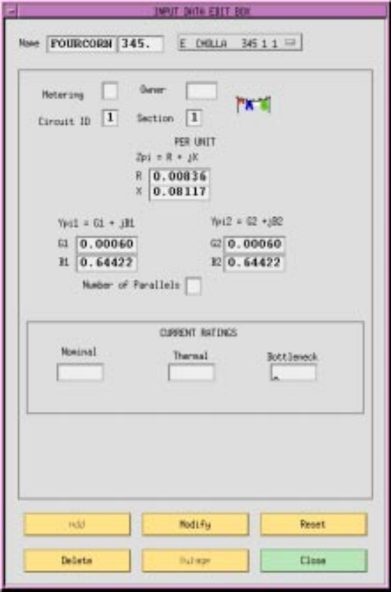

  Equivalent Network Dialog Box

**Name**. Two eight character maximum, alphanumeric strings designating connecting buses. The
strings must start with an alpha character. The first name is placed in the first text box from the left.
The next text box should have a four character maximum numeric string representing the bus's
base kV rating. The second bus name and its base kV are to the right of the first.

**Metering**. An integer (or blank) flag having three possible values: 1 means to meter at the bus 1
end; 2 means to meter at the bus 2 end; and blank means to let the program decide on the following
criteria — (1) when bus ownership differs from bus ownership, meter at the point where line
ownership differs from bus ownership, or (2) when both buses have the same ownership, meter at
bus 1 location.

**Owner**. A three character alphanumeric code representing ownership.

**Circuit ID**. An alphanumeric character representing the circuit identification.

**Section**. An integer (1-9) representing the section number for making an equivalent for series
elements. The elements are assembled in ascending numeric order. This may be blank or zero if
the line has only one section.

**Resistance (R)**. A six digit real number representing the per unit resistance R through the
branch from bus 1 to bus2.

**Reactance (X)**. A six digit real number representing the per unit reactance X through the branch
from bus 1 to bus 2.

**Admittance (G1)**. A six digit real number representing the line's per unit shunt conductance G
at the bus 1 terminal.

**Susceptance (B1)**. A six digit real number representing the line's per unit shunt susceptance B
at the bus 1 terminal.

**Admittance (G2)**. A six digit real number representing the line's per unit shunt conductance G
at the bus 2 terminal.

**Susceptance (B2)**. A six digit real number representing the line's per unit shunt susceptance B
at the bus 2 terminal.

**Number of Parallels**. An integer representing the number of parallel transformer banks in this
record.

**Current Ratings**. Real numbers that are conductor current ratings in amps. Nominal is the
normal rating based on the line construction and conductor size. Thermal takes into account the
ambient temperature and other environmental factors upon the maximum permissible temperature
of the conductor, usually for short time periods. Bottleneck is the minimum rating of the line
including other series connected components, such as circuit breakers, fuses, or disconnect
switches.

**Add**. A button that adds a new record to the database.

**Modify**. A button that modifies the record.

**Reset**. A button that restores text box values to their original values (before any changes were
made).

**Delete**. A button that deletes (removes) a record from the database.

**Outage**. (Not yet implemented.)

**Close**. A button that causes the dialog box to close and disappear from the display without making
any modifications to the record.

Menu Commands
=============
The commands descibed in this section are all accessible from the menu bar in the main
window. The commands are arranged alphabetically. Each command entry is found at the top of a
page and shows you which menu it is on by including the menu name in parentheses. For example,
the entry Alpha Search (View) means that the Alpha Search command is found on the View menu.

See the table below for a quick look at the main window menu commands.

==== ======================== =====================================================================
Page Command                  Description
==== ======================== =====================================================================
4-50 ALPHA SEARCH (View)      Finds a specific bus by name.
4-51 AREA/INTERCHANGE (Edit)  Allows editing of area/interchange records.
4-54 AUTO CFLOW (Process)     Allows execution of CFLOW programs by users.
4-57 BENDING POINTS (View)    Turns on (and off) display of the capital B denoting a bending point.
4-58 COLOR SCHEME (View)      Switches between line display by overload or by nominal kV.
4-59 COMMAND DIALOG (View)    Allows typing of PCL commands for PF.
4-61 ERROR MESSAGES (Help)    Displays IPF error messages.
4-62 EXIT (File)              Exits IPF. Same as Exit button.
4-63 GENERAL (Help)           Displays on-line help text.
4-65 NETWORK DATA EDIT (Edit) Allows editing of network data.
4-70 OPEN (File)              Allows loading of IPF files.
4-74 PF ID/DESCRIPTION (Edit) Allows creating and saving of user case description.
4-76 PLOT OPTIONS (File)      Allows changing of printer and diagram attributes and the printer device itself.
4-83 PRINT PLOT (File)        Prints a case diagram to the currently set printer
4-84 REPORTS (View)           Creates some standard PF reports and allows display viewing, hard copy printing, and writing to files.
4-91 RUN CFLOW (Process)      Allows the running of CFLOW C programs from IPF. (Intended for CFLOW programmers.)
4-92 SAVE (File)              Saves change, base case, and coordinate files.
4-96 SOLUTION DATA OFF (View) Rewrites the display without rewriting the current solution data.
4-97 SOLUTION DATA ON (View)  Rewrites the display with the current solution data.
4-98 SOLVE CASE (Process)     Initiates the solution of a resident base case
==== ======================== =====================================================================

Alpha Search (View)
===================
The Alpha Search dialog box allows you to find any bus within the currently loaded base case data.
Any bus selected when you close this dialog box becomes the currently selected bus until some
other selection process changes it.

When you open the dialog box from the View menu, you see a text box below Search Bus Name
kV. Type in this box any character or string of characters matching the first part of the name of the
bus you are looking for. Thus, if you are looking for CASCADTP, you type in C, CA, or CAS to take
you to the part of the bus list starting with C, CA, or CAS. Note that the search function is case
sensitive; that is, c and C are not the same. The search function immediately begins searching as
soon as you enter a character in the text box.

You can also use the scroll bar to go up or down the list to visually identify the bus you are looking
for, and then select the desired bus by clicking it

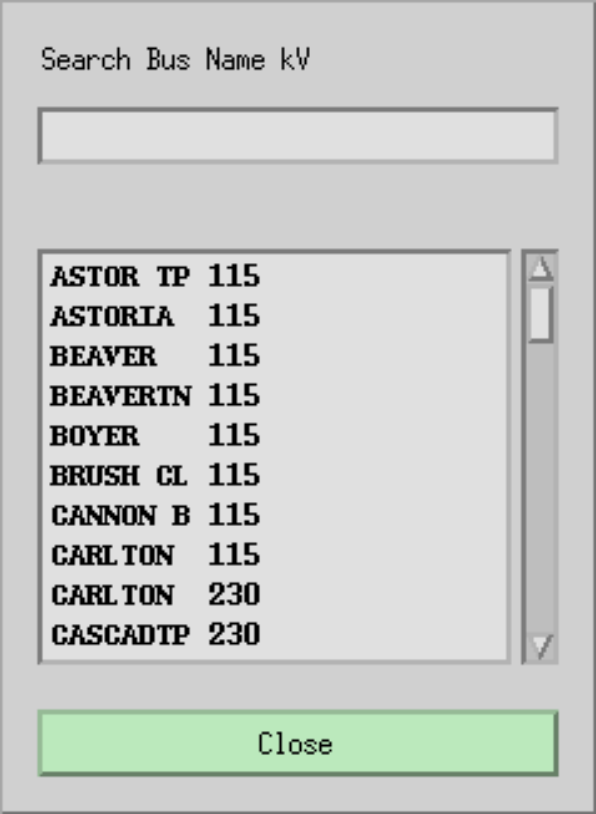

  Alpha Search Dialog box

**Search Bus Name kV**. Use this text box to type a string of letters at the beginning of the bus
name you are looking for.

**Close**. Clicking this button makes the last selected bus name into the currently selected bus. The
dialog box then closes.

Area/Interchange (Edit)
=======================
For area or intertie studies, you can add, modify, or delete areas or interties. You do this through
the main window Area/Interchange command.

The Area/Interchange dialog box includes all the area and intertie records from the currently
resident base case - one record per line in a list box. Selecting a line puts the line in the Selection
text box. Then press the Edit Area/Intertie Record button to bring up a dialog box with the data in
it.

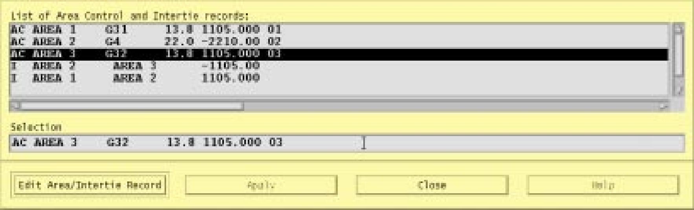

  Area/Interchange Edit Dialog Box

**List of Area Control and Intertie records**. This scrolling list contains all the area and intertie
records from the currently resident base case. Area records are listed first followed by intertie
records. Scroll through the list to find the one you want. Select it by clicking on it.

**Selection**. This text box contains the currently selected record from the list of records above. This
text will not change when you edit a record, so you can compare the new record with the old.

**Edit Area/Intertie Record**. Clicking this button opens a dialog box where you can edit the
currently selected area or intertie record (line).

**Apply**. Not available.

**Close**. Clicking this button causes the Area/Interchange dialog box to close and disappear from
the display.

**Create New**. Clicking this button brings up the a blank dialog box so you can create a new area
or intertie record.

.. figure:: ../img/Area_Interchange_Record_Dialog_Box

  Area/Interchange Record Dialog Box

**Interchange Area**. A ten character maximum name designating an interchange area of a
network.

**Area Slack Bus. An eight character maximum name designating the area slack bus plus a four
character maximum real number representing the base kV rating of the slack bus.

**Scheduled Export**. An eight character maximum real number designating the scheduled export
in MW. Negative denotes inflow.

**Zone**. A two character alphanumeric designating zone. The zone at the extreme left must be filled
in; others may be blank or filled.

**Max PU Volt**. A four character maximum real number designating maximum per unit voltage for
this area.

**Min PU Volt**. A four character maximum real number designating minimum per unit voltage for
this area.

**Modify**. A button that modifies and updates in place a record (line) in the Area/Interchange dialog
box. The data in the selection box is not changed.

**Add**. A button that adds a new record (line) to the list in the Area/Interchange dialog box.

**Delete**. A button that deletes (removes) a record (line) from the list in the Area/Interchange dialog
box.

**Reset**. A button that restores text box values to their original values (before any changes were
made).

**Close**. Clicking this button causes the Area/Interchange dialog box to close and disappear from
the display without making any changes to the Area/Interchange records.

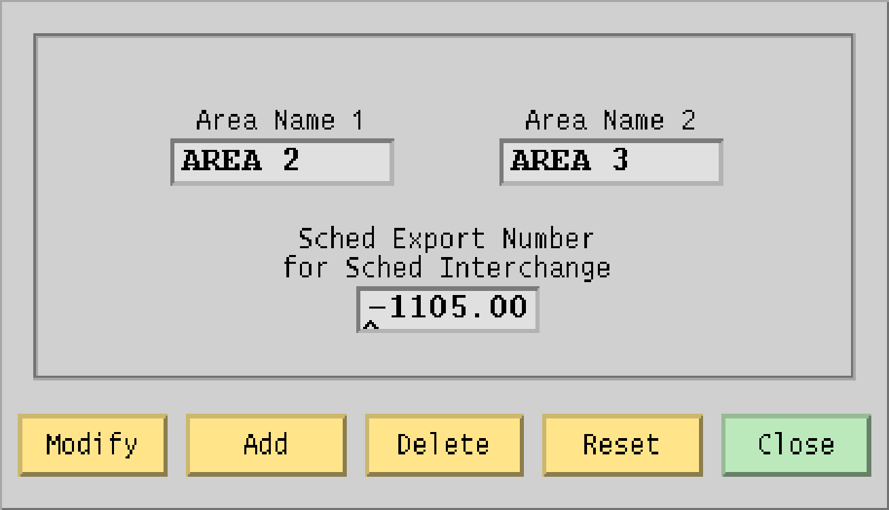

  Intertie Record Dialog Box

**Area Name 1**. A ten character name designating an area of a network.

**Area Name 2**. A ten character name designating an area of a network.

**Sched Export Number for Sched Interchange**. An eight character maximum real number
representing scheduled power transfer from Area Name 1 to Area Name 2.

**Modify**. A button that modifies and updates in place a record (line) in the Area/Intertie Selection
dialog box.

**Add**. A button that adds a new record (line) to the list in the Area/Intertie Selection dialog box.

**Delete**. A button that deletes (removes) a record (line) from the list in the Area/Intertie Selection
dialog box.

**Reset**. A button that returns text box values to their original values (before any changes were
made).

**Close**. Clicking this button causes the Intertie Record dialog box to close without making any
changes to the Area/Interchange dialog box records.

Auto CFLOW (Process)
====================
CFLOW files are C programs using the IPF CFLOW library of routines. These routines enable you
to access the base case memory-resident data in IPF. Many CFLOW programs are designed to
collect information for specialized reports that are not built into IPF in the Reports command. See
:ref:`libcflow-c-library` for more information.

There are two ways to execute a CFLOW program: Auto CFLOW is one; Run CFLOW is the other.
Refer also to Run CFLOW later in this section so that you choose the appropriate CFLOW
execution command.

The Auto CFLOW command is used primarily by CFLOW program users (rather than
programmers) for CFLOW programs that are fully debugged and "production-grade." These
CFLOW programs create windows for I/O themselves or are embedded in script or command file
utilities that do. Thus, any I/O to or from the screen is program I/O only and not potentially
confusing for a user. Alternatively, the CFLOW program may have no screen I/O and simply
produce file output for a report. See Figure 4-21.

Programs that read/write to ``stdin`` or ``stdout`` would have their I/O intermixed in the same terminal
window as the ``gui`` and ``ipfsrv`` server. Such programs should be run with the Run CFLOW command
not with the Auto CFLOW command.

**To use the Auto CFLOW command**:

  1. Start up IPF and load a base case file.
  2. Select the Auto CFLOW command and (if necessary) specify a socket id number (any integer between 1024 and 4096). Generally the default socket number will be OK.
  3. Use the file selection dialog box to find and select a CFLOW program. Double click the program name or click Launch CFLOW to run the program.

.. note:: 
  
  When you have launched a CFLOW program, you cannot do anything else in the GUI until the program is finished running. Also if the CFLOW program fails, control is returned to IPF. However, if the CFLOW program hangs (as in an infinite loop), you need to kill the CFLOW process through operating system resources. (For example, in Unix, this can be done with the kill command.) See your computer system documentation or your system administrator for help.

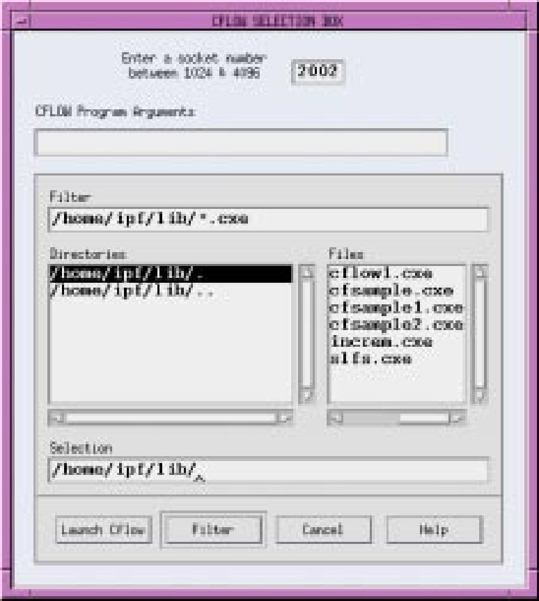

  Auto CFLOW File Dialog box

**Socket Number**. This is the number of the TCP/IP socket which CFLOW will use to connect to
``ipfsrv``. Normally, you should not have to change it.

**CLFOW Program Arguments**. If the particular program you want to run requires input
arguments, enter them here. You cannot, however, use this to redirect input or output.

**Filter**. The file name text box contains a "filter" that selects categories of file names. You can
directly modify the file name text by clicking in the Filter box and then typing in new text. Then
click the Filter button below to apply the new filter.

**Directories**. This list component contains directory names. You cannot modify these directory
names by selecting them and typing. Use the scroll bars at the side and bottom to move the list up
and down or back and forth. The UNIX operating system arranges directories in a “hierarchical”
way. You move up this hierarchical tree structure by double clicking the directory name ending
with a period-period (..). You move down by selecting the name of the directory you want to move
into.

**Files**. This list component contains file names that are within the directory named at the left that
ends with a period (.) and that satisfy the filter criterion specified above in Filter. You cannot
modify these file names by selecting them and typing. Use the scroll bars at the side and bottom to
move the file names up and down or back and forth.

You select a file name by clicking once on the file name. This puts the selected file name in the
Selection file name text box below.

**Selection**. This file name text box contains the file name selected by clicking a file name in the
Files file list. Or, since it is a text box, you can directly modify the file name by selecting text and
typing replacement text. Be sure to type an exact file name and not a wildcard character such as the
asterisk (*) as part of the file name.

**Launch C Flow**. This button causes whatever file name is in the Selection text box to be passed
to the operating system as an executable file. The file is then run.

**Filter**. Clicking this button causes all file names satisfying the filter file name text in Filter to
appear in the Files file list. It also puts the currently selected directory name without the file name
in the Selection text box. You must select a file name from the Files file list to select a specific file
name.

**Cancel**. Clicking this button causes the Auto CFLOW File dialog box to close and disappear from
the display. No directories or file names are changed with a Cancel action. Thus, if you
immediately open the dialog box after a Cancel action, you return to the state you just left. The
directories and files names are not returned to some default state.

**Help**. (Not yet implemented).

Bending Points (View)
=====================
This command toggles on or off the display of a capital B at line bending points. The display of the
capital B is simply to make line bending points completely apparent at a quick glance.

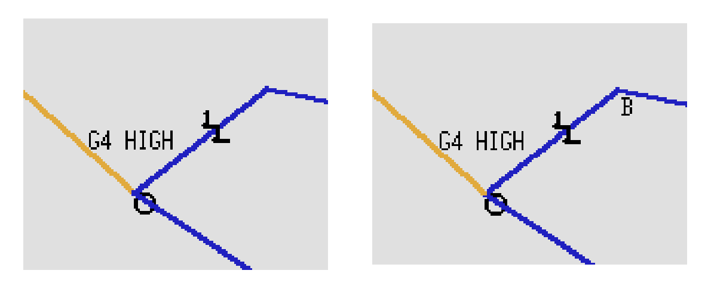

  Bending Points On and Off

Color Scheme (View)
===================
This command causes the display of lines to switch between two modes: Color by kV or Color by
Overload. Color by kV causes the display of lines to match the ranges that are keyed in the lower
left-hand corner Branch Color Key. Color by Overload causes the display of lines to match the
ranges that are keyed in the Overloaded Branch Key. These two keys are found in the same location
in the main window and change when you change the command.

In the Color by Overload mode, you can type in percentages of overload. The figure below shows 90%
for Mild Overload, 100% for Moderate Overload, and 110% for Extreme Overload.

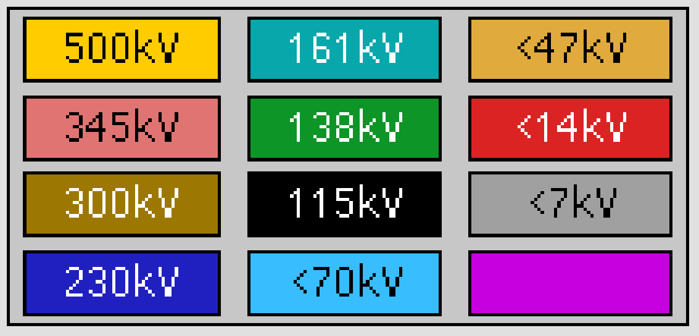

  Branch Color Key

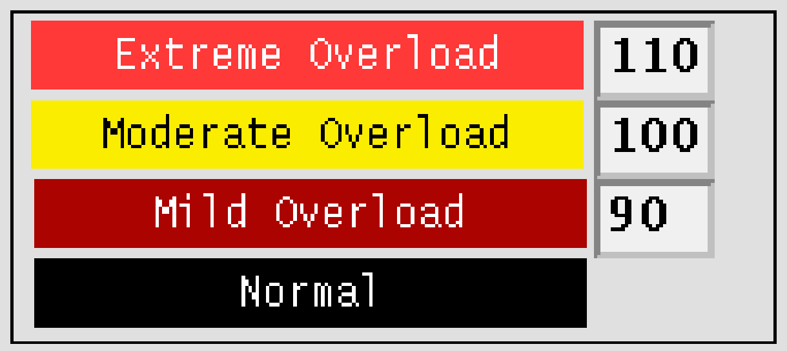

  Overloaded Branch Key

After you change the overload percentages, you will have to go back to the kV color scheme and
then back again to the overload color scheme in order to redisplay the map with the new
percentages implemented.

Command Dialog (View)
=====================
The Command Dialog box allows you to type Powerflow Command Language commands and
send them to ``ipfsrv``. It also allows you to see the communication that passes between the GUI and PF
components of IPF as IPF runs. 

.. note:: 
  
  Tis command is intended for advanced users. It was created for program development and may be useful for users wanting to observe the
  interprocess communication channel traffic.

The top box is a scrolling text box that stores PCL commands you type in the text box labeled
Command Entry. The PCL commands list can be double-clicked to put the command into the
Command Entry box. The third box down shows you what IPF's GUI component sends across the
IPC channel to the PF component. The fourth box down shows what PF sends back to the GUI in
response to the previously passed command. The third and fourth boxes are output only and are not
responsive to any mouse clicks. Note that you can vary the vertical size of both output-only boxes
by pressing on the sash controls and moving them up or down.

.. note::

  Be sure to terminate the command set with ``*[EOM]`` or ``^[EOM]``. The former issues a synchronous command; the latter, an asynchronous
  command.

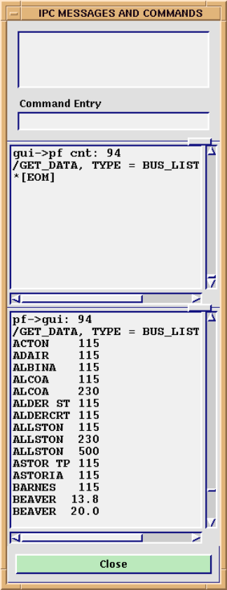

  Command Dialog Box

**Command Entry**. This text entry box is intended for valid PCL commands that you want to send
to the PF component of IPF. There is no syntax checking at data entry time. PF does all the
checking once a command is sent. The command is sent to PF when you press the Return key. See
the :ref:`powerflow-command-language` section for information on valid commands.

**Close**. Clicking this button causes the dialog box to disappear from the screen. No other action is
performed.

Error Messages (Help)
=====================
When an error condition occurs, such as when IPF detects bad data, the Error Messages dialog box
contains messages to help you determine what caused the error. See below.

These messages, along with many others, also appear in the terminal window where you started
IPF. The other messages are usually not of any interest to a user. However, if you want to view the
interation report, you will have to look at the terminal window. This information is not displayed
anywhere in the GUI.

.. note::

  This dialog box pops up on its own only when the error message is a fatal one.

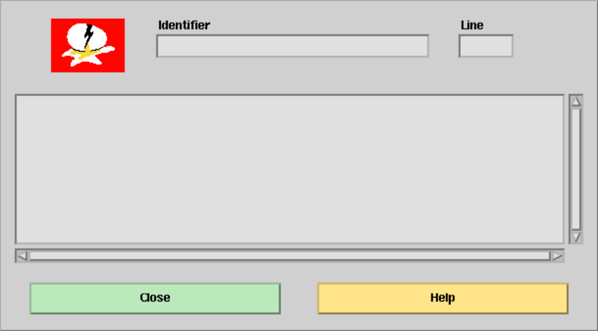

  Error Box Dialog Box

**Identifier**. This text box specifies the identifier (source code file) where an error condition
occurred. This message assists the programming staff to locate the source message.

**Line**. This text box gives the source code line number associated with the identifier where an error
condition occurred.

**Close**. This button closes the Error Messages dialog box.

**Help**. This button brings up the IPF help system window.

Exit (File)
===========
This command exits you from IPF. You can exit at any time. The exit command is also available
on a button below the toolbox in the main window. Although you can also click on the X Windows
menu button at the upper right of the window to close, this is not the recommended method of
exiting from IPF. It should be used only as a last resort.

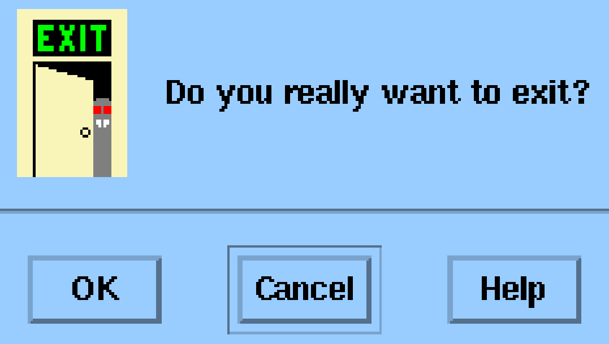

  Exit Dialog Box

**OK**. Clicking this button exits you to the operating system.

**Cancel**. This closes the Exit dialog box without any action.

General (Help)
==============
The IPF help system provides a condensation of this documentation. See below.

In addition to the Page Up and Page Down window buttons and scroll bar, the Help system text
itself has a feature to help you navigate. The text incorporates hyperlinks. These allow you
to jump immediately to a desired spot in the help text.

At the top of the Help text is a list of topics. You can click on a topic to go to the text explaining
that topic. To read the topic text on a page, use the scroll bar. Use the Page Up and Page Down
buttons at any time to go to different pages, one page at a time.

The Annotate button allows you to attach your own notes to a particular page. See below. A
red paper clip shows up in the left margin after you save a note, indicating that a note exists. To
read an existing note, just click the Annotate button when you see a red paper clip.

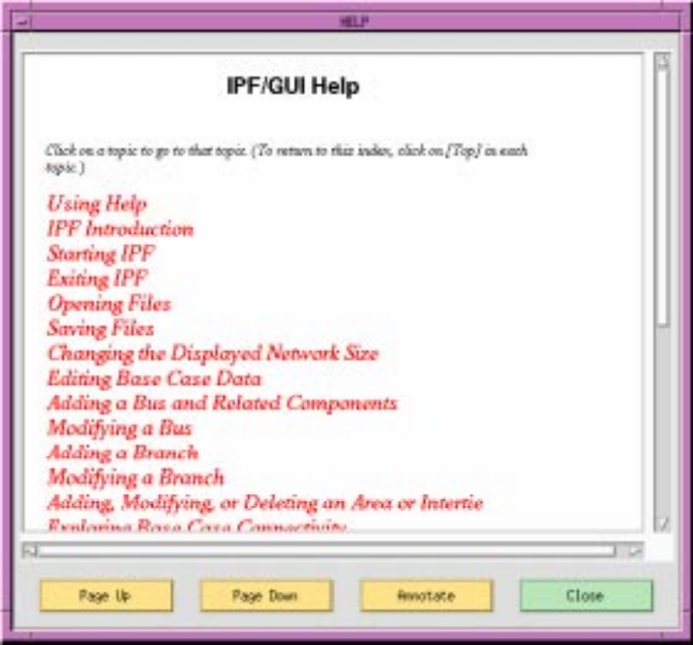

  General Help Dialog Box

**Page Up**. The Page Up button finds the next page marker toward the beginning of the IPF Help
file. Page Up does not go to the top of the next page up. Use the scroll bar to scroll to the top of the
page if necessary.

**Page Down**. The Page Down button finds the next page marker toward the end of the IPF Help
file. Page Down does not go to the top of the next page down. Use the scroll bar to scroll to the top
of the page if necessary.

**Annotate**. The Annotate button opens a text window that you can type text into. If you want to
save the text, click the Save button; if you want to clear or remove the text, click the Remove
button; Close closes the Annotation dialog box without making further changes.

**Close**. The Close button closes the Help system window.

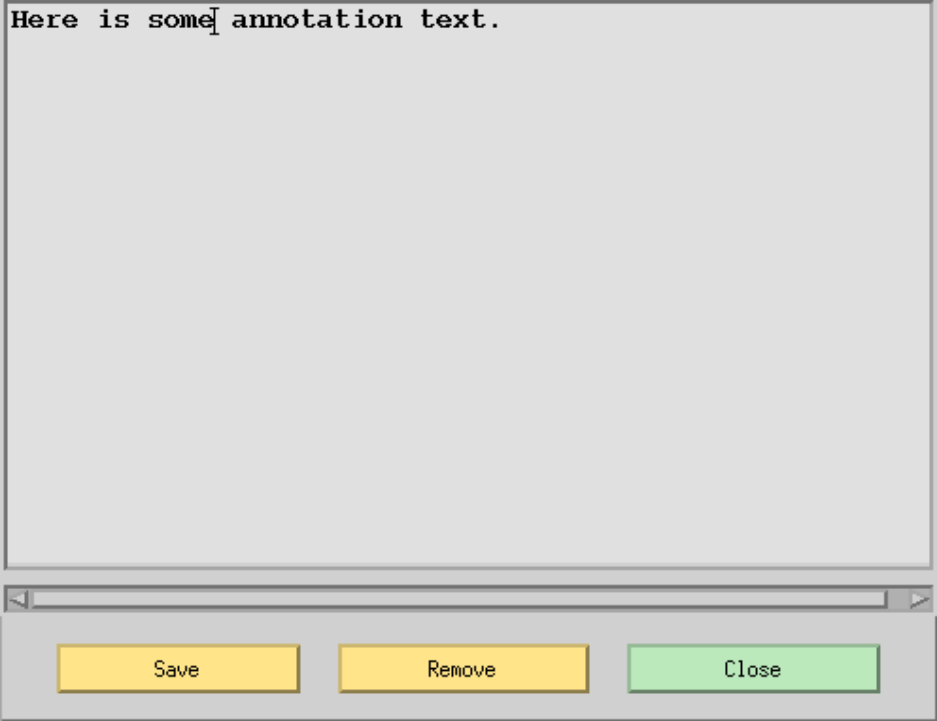

  Annotate Dialog Box

Network Data Edit (Edit)
========================
There are two ways to edit bus and branch data in IPF. Editing via the Network Data Edit dialog
box is just one. See below. The other one is the Input Data Edit Box. Each of the ways offers
its own benefits. See the Input Data Edit Box for more information.

The advantage of Network Data Edit over the other two methods of editing is that you can access
the entire network data base using filters. The other editing methods require accessing the network
data through the displayed network diagram or through the Bus List dialog box.

.. note::

  Network Data Editing is designed for the expert user. Editing a network data record directly is intended for advanced users who already know
  the exact columns for specific data fields in each network record. See :ref:`powerflow-command-language` for network record format information.

When you use the Network Data Edit dialog box, editing is performed indirectly on the resident
network data using either an internal editor or an external editor. The internal editor is very basic;
it permits cutting, pasting, and overtyping. The external editor can be any editor selected by the
GUI setup script file. For UNIX systems, ``vi`` is usually the editor specified. There is no formatting
or data validation support other than that provided by the user's external editor. No matter which
you choose, the work is actually done on an intermediate file from which network changes may
later be assimilated.

Editing of the network data is done with a screen editor. Four steps are required to successfully
accomplish data editing. See below.

  1. Select individual items within a filter. The filter list is scrollable so that you can see items
  outside the visible listing. When you click the left mouse button anywhere on a non-highlighted item, 
  the line highlights by reverse video, indicating selection. You can unselect by clicking again on the
  same item using the left mouse button. You can continue to select as many additional items as you like.
  If none are selected, the default is that all the items for the filter are selected.
  2. Apply the selected filter(s) by pressing the Apply button(s).
  3. Click either the Internal or External Editor button to display the data.
  4. Edit the data in the display box. You can use the cursor "arrow" keys to move around in the
  data and to cause it to scroll up and down.
  5. Process the edited file using the Send To PF button.
  
The last step concludes the editing session. If it is skipped, no changes are performed upon the
system. If it is applied, the edited file is automatically processed into network data changes and sent
to Powerflow.

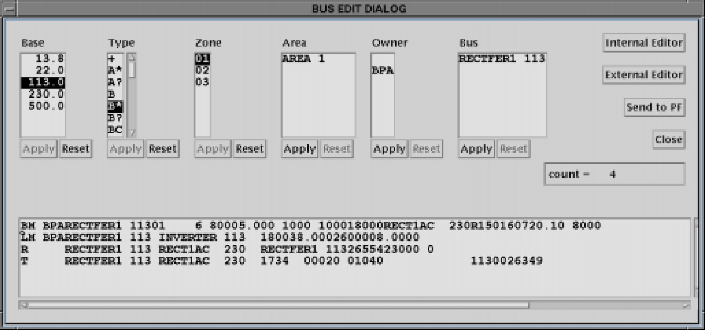

  Network Data Edit Dialog Box

Dynamic Filters
---------------
The power of the Network Data Edit dialog box is realized in applying the dynamic filters. Six
filters allow you to restrict the amount of network data displayed. The filters are Area, Base, Zone,
Owner, Bus, and Type. The filters are dynamic because they propagate "downstream" (from left
to right) the effects of previously defined filters upon the remaining filters.

Initially, all of the filters are primary and each filter displays the full attributes of its type. However,
suppose you select one of the filters, say Owner, and highlight individual owners of interest. Then
press the Apply button. Three things happen.

  1. The Owner filter becomes the solitary primary filter; it is automatically repositioned to the
  leftmost position in the dialog box. The Apply button on this filter is ghosted, indicating
  that it has been applied.
  2. The remaining filters are now collectively called secondary filters. They are repositioned
  on the dialog in an arbitrary order on the right of the primary filter. The effects of the primary filter are applied to the secondary filters through the network (downstreaming). There is a one exception, Type, whose display is always static.
  3. Only the network items that collectively meet the combined filter criteria are displayed.

