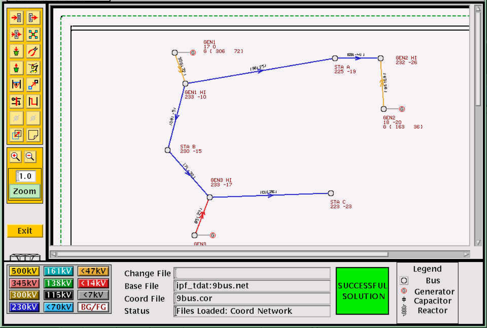

Welcome to Interactive Power Flow!
==================================
Interactive Power Flow (IPF) is a software package for doing power flow studies. IPF models the balanced steady-state operation of an electric power network. It can be used to:
 
  * Investigate electric power networks
  * Determine bus voltage distribution
  * Study real and reactive power flows in lines
  * Evaluate line overloads
  * Plan area interchange control
  * Determine transformer tap settings
  * Determine remote-bus voltage controls
  * Plan for system reactive power requirements
  * Determine effect of load shedding, generator dropping, and line outages
  * Run transient stability studies on generator rotor dynamics

   Interactive Power Flow X Window GUI

Electric power system network design encompasses the following tasks:

  * Determination of load centers and generation patterns as well as sizes of loads and generation.
  * Determination of available transmission corridors (rights-of-way) and assessment of the capacity of these corridors to accommodate transmission lines.
  * Evaluation of existing or planned networks with regard to adequate power-carrying capability, voltage regulation, reliability of service, and operating economics. 
  * Determination of size and routing of new transmission lines, and size and location of terminal equipment for achieving efficient and economical reinforcements when needed.
  * Evaluation of proposed reinforcements in light of power flow capability, ability to withstand transient disturbances, reliability of overall service, economics, impact on regional economy, environment, energy conservation and operational constraints such as construction lead times, coordination of various facility ownership interests, flexibility for future growth and compatibility with other long-range plans.

The dynamic nature of load growth, load distribution, and generation patterns make the problem of network design one of planning. To plan for the future, power system planners and design engineers must look at the past and present. This makes Interactive Power Flow a key tool for the network design engineer, but it can also be used by students for academic studies. IPF permits a complex network structure to be modeled and evaluated at various points in time.

Features
========
Interactive Power Flow has the following high level feature set:

  * Set of command line tools for running studies
  * Set of C API functions for running studies
  * `Motif X Window`_ based graphical user interface allowing easy-to-edit graphical display of the network diagram
  * Basic power flow and advanced capabilities like REI reduction and transient stability
  * Domain specific languages for "batch" command line runs in which multiple scenarios can be studied
  * Output reports
  * Extensive log messages for aiding the user in troubleshooting

Contents
========

.. toctree::
   :maxdepth: 3

   basic/installation
   basic/overview
   basic/history
   basic/record_formats
   basic/pfc
   basic/pfc_examples
   basic/pcl
   basic/bpf
   basic/tsp
   basic/ipf_reports
   basic/ipfplot
   basic/netdat
   basic/ipfcut
   basic/ipfnet
   basic/ipf_test
   basic/ipfsrv
   basic/ipfbat
   basic/x_window_gui
   basic/custom_XGUI
   basic/cflow
   basic/pvcurve
   basic/qvcurve
   basic/findout
   basic/lineflow
   basic/puf
   basic/mimic
   basic/post_pvcurve
   basic/ips2ipf
   basic/network_diagrams
   basic/line_impedance
   basic/dc_line_modeling
   basic/application_examples
   basic/network_reduction
   basic/retained_network
   basic/voltage_limits_starts
   basic/ownership_codes
   basic/ips_ipf_differences
   basic/wscc_specifications
   basic/developer

.. _Motif X Window: https://motif.ics.com/motif/downloads
